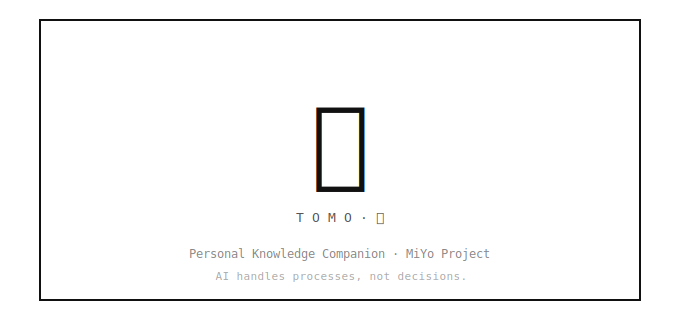

<p align="center">
  
</p>

# MiYo Tomo (友)

> ⚠️ **Alpha** — Tomo is under active development. Expect breaking changes, rough edges, and evolving commands. Feedback and issues welcome.

AI-assisted PKM workflows for Obsidian via [MiYo Kado](https://github.com/MMoMM-org/miyo-kado) MCP server.

Tomo runs inside an isolated Docker container. All vault access goes through Kado — no direct filesystem access to your Obsidian vault.

## What Tomo Does

- **`/inbox`** — 2-pass inbox processing: analyses files, proposes actions, generates detailed instructions
- **`/explore-vault`** — Discovers vault structure, MOC hierarchy, frontmatter patterns, tag taxonomy
- Framework-agnostic — supports LYT, PARA, and custom PKM frameworks via profiles

## How It Works

Tomo uses a **2-pass proposal model**. You always stay in control.

### Pass 1 — Suggestions

1. You trigger `/inbox` — Tomo reads inbox via Kado, classifies each file, matches to MOCs
2. Tomo writes a **suggestions document** with alternatives and confidence scores
3. You review in Obsidian — edit fields, pick alternatives, tick `[x] Accept` / `[ ] Skip` / `[ ] Delete source` per item
4. You tick the top-level `[x] Approved` checkbox when the whole document looks right

### Pass 2 — Instructions

5. You trigger `/inbox` again — Tomo detects the `[x] Approved` suggestions doc
6. Tomo deterministically produces three artifacts in the inbox:
   - **Rendered note files** — new markdown files with tokens resolved from your templates
   - **`instructions.md`** — human-readable instruction set with per-action `[ ] Applied` checkboxes
   - **`instructions.json`** — canonical machine-readable version (schema: `tomo/schemas/instructions.schema.json`, consumer contract: [`docs/instructions-json.md`](docs/instructions-json.md)), consumed by the upcoming Tomo Hashi plugin
7. You apply each action manually in Obsidian (move files, add MOC links, update daily notes) and tick `[x] Applied` per action

### Cleanup

8. You trigger `/inbox` once more — Tomo archives processed documents and transitions source-item lifecycle tags

**Tomo proposes, you decide, you apply.**

## Architecture

### 4-Layer Knowledge Stack

| Layer | What | Format |
|-------|------|--------|
| Universal PKM Concepts | Framework-agnostic vocabulary | Skill logic |
| Framework Profiles | Framework-specific defaults (LYT, PARA, custom) | YAML |
| User Config | Your vault-specific ground truth | YAML |
| Discovery Cache | Auto-discovered vault semantics | YAML (advisory) |

User config always wins over profile defaults. Discovery cache informs but never overrides.

### Security Model

- All vault access via Kado MCP (5-gate permission chain)
- Docker container isolation — no vault filesystem mount
- MVP execution boundary: Tomo writes only to the inbox folder
- Every change is a proposal — user approval required before application

## Quick Start

```bash
git clone https://github.com/MMoMM-org/miyo-tomo.git
cd miyo-tomo
bash scripts/install-tomo.sh
bash begin-tomo.sh   # generated by the installer, builds image on first run
```

The install script walks you through vault path, framework profile selection, concept folder mapping, git user, and Kado connection. It then generates a `begin-tomo.sh` launcher at your chosen instance location with all paths baked in. See [docs/setup.md](docs/setup.md) for details.

**Launcher flags** (`bash begin-tomo.sh --help`):
- `--rebuild-image` — force Docker image rebuild
- `--login` — force OAuth re-authentication (exposes port 10000)
- `--bash` — launch a bash shell instead of Claude Code (debugging)

## Prerequisites

- Docker
- Git, jq
- [MiYo Kado](https://github.com/MMoMM-org/miyo-kado) v0.5.0+ running and accessible (default: `127.0.0.1:23026`)
- Python 3 (for host-side scripts)

### Kado API Key Configuration

Tomo's API key in Kado must have:
- **Read access** to all concept folders configured in `vault-config.yaml`
- **Write access** to the inbox folder (for writing suggestions and instruction sets)
- **Tag read access (all tags)** — Tomo's `/explore-vault` uses `listTags` to discover your full tag taxonomy (prefixes, types, states). If the API key restricts tag access to specific prefixes, Tomo will only see those and miss the rest. For best results, allow unrestricted tag read access.
- **Lifecycle tag access** for the tag prefix (default: `#MiYo-Tomo`). Kado will return `FORBIDDEN` on tag searches if this prefix is not whitelisted. Add `MiYo-Tomo` (or your custom prefix) to the key's allowed tag prefixes in Kado's settings.

## Repository Structure

```
miyo-tomo/
├── tomo/                  # Source of truth — deployed to instance
│   ├── .claude/           # Agents, commands, skills, rules
│   ├── config/            # Example configs and reference templates
│   └── profiles/          # Framework profiles (miyo.yaml, lyt.yaml)
├── scripts/               # Install, update, and utility scripts
│   ├── lib/               # Shared Python library (Kado client)
│   ├── install-tomo.sh    # Setup wizard
│   ├── update-tomo.sh     # Update managed files in existing instance
│   ├── cleanup-tomo.sh    # Remove install artifacts (for re-install / testing)
│   ├── backup-tomo.sh     # Archive instance config + cache to a tarball
│   ├── restore-tomo.sh    # Re-hydrate an instance from a backup tarball
│   ├── begin-tomo.sh.template # Launcher template rendered into each instance
│   ├── vault-scan.py      # Vault structure scanner (/explore-vault step 1)
│   ├── topic-extract.py   # Topic keyword extraction
│   ├── moc-tree-builder.py # MOC discovery + hierarchy
│   ├── cache-builder.py   # Discovery cache assembly
│   ├── token-render.py    # Template token resolution
│   ├── suggestions-reducer.py # Pass-1 fan-out reducer
│   ├── suggestions-render.py  # Pass-1 suggestions-doc rendering
│   ├── suggestion-parser.py   # Parse approved suggestions
│   ├── instruction-render.py  # Pass-2 deterministic rendering (notes + instructions.{json,md})
│   ├── instructions-dryrun.py # Validate instructions.json is machine-consumable
│   ├── state-scanner.py / state-init.py / state-update.py  # Lifecycle state
│   ├── read-config-field.py   # Batch read vault-config values
│   ├── vault-reset.sh         # Reset the test vault inbox between pipeline stages
│   └── yaml-fixer.py          # YAML error recovery
├── tests/                 # Python unit tests (host-only; not synced to instance)
│   ├── test-008-phase1.py        # instruction-render: actions, schema, MD
│   ├── test-instructions-diff.py # diff coverage audit
│   ├── test-vault-config-writer.py # tags section writer
│   └── test-shared-ctx-tags.py   # shared-ctx prefix filtering
├── tomo/schemas/          # JSON schemas (suggestions, item-result, instructions)
├── docs/                  # Setup, troubleshooting, specs
├── docker/                # Dockerfile and entrypoint (source of truth)
├── tomo-instance/         # (gitignored) Docker workspace — created by installer
├── tomo-home/             # (gitignored) Docker /home/coder mount
└── begin-tomo.sh          # (gitignored) launcher — generated by installer
```

## Agents

| Agent | Role |
|-------|------|
| `vault-explorer` | Scans vault structure, builds MOC tree, generates discovery cache |
| `inbox-orchestrator` | Pass 1 coordinator — fan-out pipeline over the inbox |
| `inbox-analyst` | Pass 1 subagent — classifies ONE item per invocation |
| `instruction-builder` | Pass 2 orchestrator — runs `instruction-render.py`, writes rendered notes + `instructions.{json,md}` to the vault |
| `vault-executor` | Cleanup — archives processed documents, transitions lifecycle states |

## Commands

| Command | Description |
|---------|-------------|
| `/inbox` | Process inbox (auto-detects: cleanup → Pass 2 → Pass 1) |
| `/explore-vault` | Scan vault and build discovery cache |

## `@` File Picker

Tomo replaces Claude Code's built-in filesystem `@` picker with a vault-aware
one (`tomo/dot_claude/scripts/file-suggestion.sh`). When you type `@` in a
Tomo session:

- **Empty `@`** — shows your currently-open Obsidian notes first, then inbox,
  then other vault files (total: 15 results).
- **`@<query>`** — fuzzy-matches across open notes + inbox + vault in one pass
  (via `fzf --filter`), head 15.

No scope prefixes — one unified candidate stream. Results are cached (inbox:
30 s TTL, vault: 1 h TTL, invalidated by `/explore-vault`). Open-note
awareness requires Kado v0.7.0+ (`kado-open-notes`); older Kado versions
silently fall back to inbox + vault only.

Picked notes insert as `@Calendar/301 Daily/2026-03-26.md` into your prompt.
Claude Code tries to `Read` them locally, hits `ENOENT` (paths are
vault-relative), and the session falls back to `kado-read` — so expect one
extra tool call per pick.

## Platform Support

| Platform | Status |
|----------|--------|
| macOS    | Supported |
| Linux    | Supported |
| Windows  | PRs welcome — not maintained by us |

## Part of MiYo

- **Kokoro** (心) — Architecture and decisions (private)
- **Kouzou** (構造) — Claude Code infrastructure (private)
- **[Kado](https://github.com/MMoMM-org/miyo-kado)** (門) — MCP server for Obsidian vault access
- **Tomo** (友) — AI workflows (this repo)
- **Tomo Hashi** (友橋) — Obsidian plugin that reads `instructions.json` and executes actions in the vault (post-MVP; replaces the "Seigyo" placeholder in earlier specs). Consumer contract: [`docs/instructions-json.md`](docs/instructions-json.md).

## License

MIT
