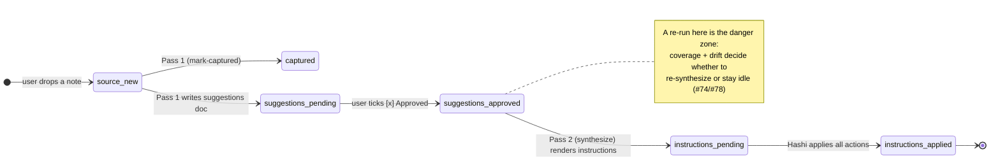
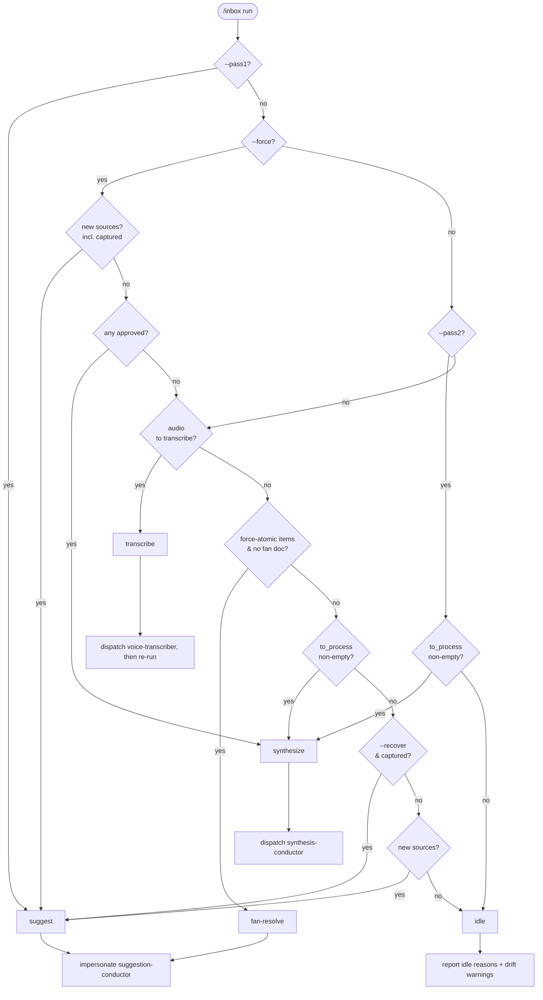

# Tier 2: Inbox Change Detection & Pass Routing

> How `/inbox` decides **what changed** in the inbox and **which action** to run.
> Companion to [`inbox-processing.md`](inbox-processing.md) (the broad 2-pass model);
> this doc is the decision layer that sits in front of it.
> Source of truth: `tomo/scripts/inbox-triage.py`. Lifecycle states:
> `tomo/scripts/lib/tomo_lifecycle.py`.

## 1. The idea

Every `/inbox` run is **stateless from the user's side** — they just type `/inbox`.
`inbox-triage.py` reconstructs "what state is the inbox in?" from the vault each
time, by reading the `tomo:` frontmatter on every doc, comparing it against what's
already been produced, and emitting a single `routing-plan.json` with one `action`.
The conductors then execute that action. No action is ever taken twice for the same
work unless the user explicitly forces it.

There is **no local run history** that can drift from reality — the vault *is* the
state. Triage's job is to classify each doc and pick the next action.

## 2. The lifecycle states (the vocabulary of "changed")

Each doc-type carries a `tomo.state` in its frontmatter. "Change" is always a
transition between these states, or new content arriving with no state at all.

| doc-type | states | terminal |
|----------|--------|----------|
| `source` (inbox note) | `captured` | `captured` |
| `suggestions` / `suggestions-fan` | `pending-approval` → `approved` | `approved` |
| `moc-proposal` | `pending-accept` → `accepted` | `accepted` |
| `instructions` | `pending-apply` → `applied` | `applied` |

## 3. The triage pipeline (one run)

`inbox-triage.py::discover()` then `main()` run these steps in order. The ORDER
matters — drift is computed before coverage so a drifted source is not counted as
covered.

1. **Discover files** — list the inbox (`.md` + audio).
2. **Query frontmatter** — six `byFrontmatter` calls, one per known `tomo.state`,
   bucketing every doc (pending-approval, pending-accept, captured, instructions,
   approved, accepted). *Kado returns empty `frontmatter:{}` on these hits.*
3. **Enrich instructions** — `read_frontmatter` each instructions doc to recover its
   real `tomo.sources` (byFrontmatter can't supply it) — without this, coverage is
   blind (#74).
4. **Compute new sources** — `.md` files in the inbox that appear in **no**
   frontmatter bucket → genuinely new content.
5. **Check audio** — uncached audio (no sibling transcript) present?
6. **Read approval state** — read each pending doc's body, detect `[x] Approved`,
   cache the body + record a body checksum in the manifest. Under `--pass2`/`--force`,
   also pull terminal `approved` docs into the work-list (and cache them).
7. **Detect drift** — compare each instructions source's recorded checksum against
   the cached current checksum; emit `checksum_mismatch`. Also `orphaned_state`.
8. **Compute coverage (drift-aware)** — a suggestions doc is *covered* iff an
   instructions doc lists it in `tomo.sources` **and it has not drifted**.
   `to_process = approved − covered`.
9. **Trim the work-list** — drop covered+undrifted docs from the approved buckets so
   the conductor never re-processes a done set (skipped under `--force`).
10. **Determine action** — priority tree (§5) → `routing-plan.json`.

## 4. The change classes (what triage catches, and how)

| Change in the inbox | Detected by | Routes to |
|---------------------|-------------|-----------|
| Brand-new note (no `tomo` state) | `compute_new_sources` | **suggest** (Pass 1) |
| Audio with no transcript | `check_audio` | **transcribe** (stop-gate) |
| Suggestion approved, never synthesized | `to_process` (uncovered) | **synthesize** (Pass 2) |
| Approved suggestion **edited** after instructions exist | drift (`checksum_mismatch`) → uncovered | **synthesize** (re-render) |
| Approved suggestion already covered, unchanged | covered ∧ ¬drift → empty `to_process` | **idle** |
| `[x] Force Atomic Note` ticked on an item | `force_atomic_items` | **fan-resolve** |
| Captured source, but every downstream doc vanished | `orphaned_state` drift | **idle** + recommend `--recover` |

### Drift = real content edits only (#78-B)

The drift checksum hashes the doc **body only** (frontmatter stripped via
`lib.doc_frontmatter.body_after_frontmatter`), on both the record side
(`instruction-render._compute_sha256`) and the check side
(`inbox-triage._compute_checksum`). This is essential: `state-promoter` rewrites a
doc's `tomo:` frontmatter (`state` → `approved`, `updated_at`) **after** rendering,
so a frontmatter-inclusive hash would flag every covered doc as "changed" on the
next run and re-synthesize forever. Body-only means drift fires only for genuine
edits (approval ticks, placement changes, item edits — all in the body).

### Coverage = "an instructions doc already covers this source" (#74)

Coverage reads `instructions.tomo.sources[].path`. Because byFrontmatter returns no
frontmatter, triage `read_frontmatter`s each instructions doc to recover it. A
drifted source is explicitly **excluded** from `covered`, so it lands back in
`to_process` and gets re-synthesized.

## 5. The routing decision (priority tree)

`determine_action` — first match wins:

## 6. The flags — the two predictable re-run cases (#78)

A user who hits a problem should get the right behavior without Tomo asking
"should I update X / delete temp?". Two explicit knobs cover the predictable cases:

| Flag | Meaning | Coverage/drift |
|------|---------|----------------|
| *(none)* | Auto-route: new content → suggest; fresh approvals → synthesize | respected |
| `--pass1` | Force the suggest phase | n/a |
| `--pass2` | Run Pass 2, **only** for uncovered or drifted docs; idle if all done | **respected** |
| `--force` | Sledgehammer: ignore coverage/drift, re-synthesize **all** approved, and re-suggest already-`captured` items (Pass 1) | **ignored** |
| `--recover` | Treat `captured` items as fresh (re-suggest) — recover an orphaned state | n/a |

`--pass2` is the everyday "redo what I changed" button; `--force` is the rare "rebuild
everything" button. The split is why a second `/inbox --pass2` after an applied run is
**idle**, not a duplicate instruction set.

## 7. What the conductor sees

`routing-plan.json` carries the `action`, the trimmed work-list
(`approved_suggestions` / `approved_fan` / `approved_moc_proposals`), `fresh_sources`,
`drift_indicators`, and `idle_reasons`. The conductor executes exactly the action and
exactly the work-list — all change-detection intelligence is upstream in triage, so the
conductor stays a thin executor.

## Cross-references

- [`inbox-processing.md`](inbox-processing.md) — the broad 2-pass proposal model.
- `docs/tomo/dot_claude/commands/inbox.md` — WHY behind `--pass2`/`--force` and the drift baseline.
- `docs/tomo/scripts/inbox-triage.md` — WHY behind the triage script's design.
