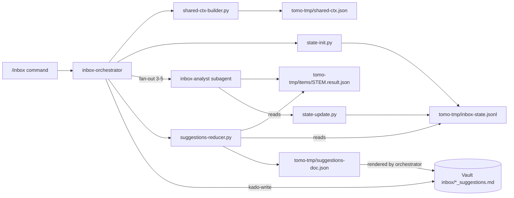
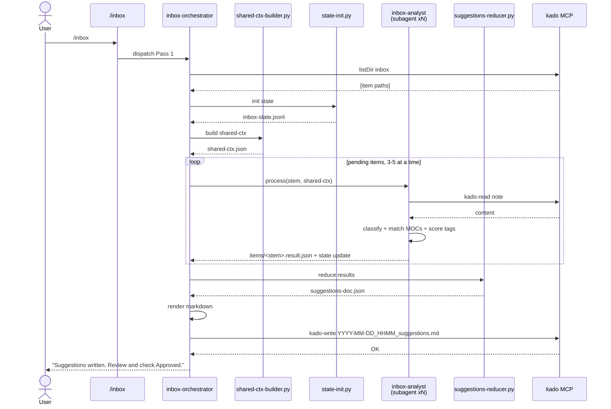

# Solution Design Document

## Constraints

- **CON-1 Runtime:** Must run inside the Tomo Docker container. Python 3.11,
  Kado MCP, no new library dependencies.
- **CON-2 Tool boundaries:** Vault writes only via `mcp__kado__kado-write`.
  Scratch writes only to `tomo-tmp/`. No Bash heredoc file writes.
- **CON-3 Context budget:** Per-subagent peak context < 80K tokens. Orchestrator
  never holds more than `shared-ctx` + state-file + per-item metadata in context
  simultaneously.
- **CON-4 Output compatibility:** Final Suggestions document shape must match
  the current format (per `tomo/.claude/agents/suggestion-builder.md`) so the
  user reviews the same artifact.
- **CON-5 Concurrency:** 3-5 parallel subagents; bound enforced by orchestrator.
- **CON-6 Resumability:** Partial runs recoverable via state-file markers.

## Implementation Context

### Required Context Sources

#### Documentation Context

```yaml
- doc: docs/XDD/specs/004-inbox-fanout-refactor/requirements.md
  relevance: CRITICAL
  why: "WHAT/WHY — this SDD implements it"

- doc: docs/XDD/reference/tier-1/pkm-intelligence-architecture.md
  relevance: HIGH
  why: "4-layer Knowledge Stack + 2-pass model context"

- doc: tomo/.claude/rules/project-context.md
  relevance: HIGH
  why: "Script Contract rules; TMP dir policy; heredoc ban"
```

#### Code Context

```yaml
- file: tomo/.claude/agents/inbox-analyst.md
  relevance: CRITICAL
  why: "Current per-item classifier — target for reuse as Phase-B subagent"

- file: tomo/.claude/agents/suggestion-builder.md
  relevance: CRITICAL
  why: "Current monolithic writer — will be replaced by orchestrator + reducer"

- file: tomo/.claude/commands/inbox.md
  relevance: HIGH
  why: "Entry command — will dispatch to new orchestrator agent"

- file: scripts/lib/kado_client.py
  relevance: HIGH
  why: "Kado read/search/write wrapper; reused by all new scripts"

- file: scripts/state-scanner.py
  relevance: MEDIUM
  why: "Reference for how inbox items are currently enumerated"

- file: scripts/topic-extract.py
  relevance: MEDIUM
  why: "Used by Phase A shared-ctx builder for MOC topics fallback"

- file: scripts/suggestion-parser.py
  relevance: MEDIUM
  why: "Phase-C output feeds this unchanged (Pass 2 still reads parsed suggestions)"
```

### Implementation Boundaries

- **Must Preserve:**
  - Suggestions document output format (per-item sections, tri-state checkboxes,
    Approved checkbox, Proposed MOC clusters, Needs Attention section)
  - Existing `suggestion-parser.py` contract — parser output schema unchanged
  - `/inbox` command surface — users still type `/inbox`
- **Can Modify:**
  - `tomo/.claude/agents/inbox-analyst.md` (if tool-scope tightening needed)
  - `tomo/.claude/commands/inbox.md` dispatch logic (Pass-1 path)
  - New agents, new scripts under `scripts/`
- **Must Not Touch:**
  - `mcp__kado__*` tools (provided by Kado)
  - Pass 2 flow (`instruction-builder.md`) — Pass 1 output shape is the
    contract boundary
  - `config/discovery-cache.yaml` schema (consumed by Phase A)

### External Interfaces

#### System Context

```mermaid
graph TB
    User[Tomo user]
    Cmd[/inbox command]
    Orch[inbox-orchestrator agent]
    Sub[inbox-analyst subagent<br/>xN parallel]
    KadoRW[Kado MCP]
    Vault[(Vault inbox)]
    TmpDir[(tomo-tmp/)]
    Cache[config/discovery-cache.yaml]

    User --> Cmd
    Cmd --> Orch
    Orch --> Cache
    Orch --> TmpDir
    Orch -->|spawn per item| Sub
    Sub --> KadoRW
    KadoRW --> Vault
    Sub --> TmpDir
    Orch --> KadoRW
```

#### Internal Interfaces

**Between orchestrator and Phase-B subagents:** via filesystem (`tomo-tmp/`).
No direct message passing — subagents read the item JSONL they are handed and
write a result JSON. Orchestrator polls the state file.

**Between orchestrator and Kado:** `mcp__kado__kado-search` (listDir, byTag
for inbox enumeration) and `mcp__kado__kado-write` (final Suggestions doc).

**Between subagents and Kado:** `mcp__kado__kado-read` only (note content).

### Project Commands

```bash
# Inside Docker / Tomo instance
/inbox                      # Entry — dispatches to orchestrator
/tomo-setup                 # Ensures discovery-cache.yaml exists (prerequisite)

# Dev / test (host, outside Docker)
bash scripts/test-kado.py   # Verify Kado connectivity
```

## Solution Strategy

**Architecture Pattern:** Map-reduce with coordinator.

- **Map (Phase B):** independent subagents process one item each, write a
  structured JSON result to `tomo-tmp/items/<stem>.result.json`.
- **Coordinate (Phase A + C):** orchestrator does setup (distil shared-ctx,
  enumerate items, write state-file) and reduce (gather results, cluster
  cross-item patterns, render Suggestions document).
- **Communication substrate:** filesystem under `tomo-tmp/`. Chosen over in-
  process message passing because subagents are spawned via the Agent tool and
  do not share a Python process.

**Integration Approach:** Replace the Pass-1 portion of `/inbox` (currently
`inbox-analyst → suggestion-builder`). Pass-2 and cleanup flows stay untouched.

**Why this approach:**
- Addresses root cause (context accumulation in single agent)
- Decouples classification logic from rendering logic — testable and iteratable
- Filesystem handoff gives free resumability and debuggability
- Matches the existing Tomo convention: `scripts/*.py` produce JSON,
  agents orchestrate

## Building Block View

### Components



### Directory Map

```
Tomo/
├── tomo/
│   └── .claude/
│       ├── agents/
│       │   ├── inbox-orchestrator.md          # NEW — Phase A+C coordinator
│       │   ├── inbox-analyst.md               # MODIFY — tighter contract: input JSONL, output result.json
│       │   ├── suggestion-builder.md          # MODIFY — role reduced to reducer helper; may be merged into orchestrator
│       │   └── instruction-builder.md         # UNCHANGED
│       └── commands/
│           └── inbox.md                       # MODIFY — Pass 1 dispatches to orchestrator
├── scripts/
│   ├── shared-ctx-builder.py                  # NEW — Phase A step
│   ├── state-init.py                          # NEW — Phase A step
│   ├── state-update.py                        # NEW — used by subagents
│   ├── suggestions-reducer.py                 # NEW — Phase C reducer
│   ├── topic-extract.py                       # UNCHANGED — reused
│   └── lib/
│       └── kado_client.py                     # UNCHANGED — reused
└── tomo-tmp/                                  # Runtime scratch
    ├── inbox-state.jsonl                      # Run state
    ├── shared-ctx.json                        # Distilled context
    ├── items/
    │   ├── <stem>.jsonl                       # Input packet per item (if used)
    │   └── <stem>.result.json                 # Per-item output
    └── suggestions-doc.json                   # Assembled doc before final write
```

### Interface Specifications

#### File: `tomo-tmp/shared-ctx.json`

```json
{
  "schema_version": "1",
  "run_id": "2026-04-15T14:30:00Z-abc123",
  "mocs": [
    {
      "path": "Atlas/200 Maps/Shell & Terminal (MOC)",
      "title": "Shell & Terminal",
      "topics": ["shell", "zsh", "terminal", "dotfiles"],
      "is_classification": false
    },
    {
      "path": "Atlas/200 Maps/2600 - Applied Sciences",
      "title": "2600 - Applied Sciences",
      "topics": ["2600 - Applied Sciences"],
      "is_classification": true
    }
  ],
  "tag_prefixes": [
    {"name": "topic", "wildcard": true, "known_values": ["applied/shell", "knowledge/lyt", "..."]},
    {"name": "status", "wildcard": false, "known_values": ["inwork", "active", "archived"]}
  ],
  "classification_keywords": {
    "coding_insight": ["code", "function", "debug", "..."],
    "quote": [],
    "...": []
  },
  "daily_notes": {
    "enabled": true,
    "path_pattern": "Calendar/301 Daily/YYYY-MM-DD",
    "date_formats": ["YYYY-MM-DD", "YYYYMMDD", "DD-MM-YYYY"],
    "tracker_fields": [
      {"name": "Sport", "type": "bool", "section": "Habits", "syntax": "inline_field",
       "keywords": ["run","workout","gym","yoga","sport","exercise","bike","swim"]},
      {"name": "WakeUpEnergy", "type": "rating_1_5", "section": "Habits", "syntax": "inline_field",
       "keywords": ["energy","tired","rested","alert"]},
      {"name": "Highlights", "type": "text", "section": "End of Day", "syntax": "callout_body",
       "keywords": []}
    ]
  }
}
```

`daily_notes` section is present only if `vault-config.yaml`
`calendar.granularities.daily` is set. Otherwise, the subagent emits no
`update_daily` actions.
Budget: ≤ 15 KB. If `mocs[].topics` would blow the budget, shorten per-MOC
topic arrays before dropping any MOC.

**Which tag prefixes go into `shared-ctx` is user-configurable** via
`vault-config.yaml`:

```yaml
tomo:
  suggestions:
    # Tag prefixes the classifier may propose to add. Others are ignored.
    proposable_tag_prefixes: ["topic"]   # default
    # Prefixes NEVER proposed (structural/lifecycle). Hard-excluded regardless
    # of `proposable_tag_prefixes`.
    excluded_tag_prefixes: ["type", "status", "projects", "content", "mcp"]
```

- Default `proposable_tag_prefixes` is `["topic"]` — narrowest useful default.
- `excluded_tag_prefixes` is the safety fence: always filtered out even if
  the user accidentally lists them in `proposable_tag_prefixes`.
- The shared-ctx `tag_prefixes[]` array contains ONLY entries from
  `proposable_tag_prefixes`. Everything else is invisible to the classifier.
- `/tomo-setup rules` (template-tagging wizard) surfaces this setting with
  defaults suggested from the vault's discovered prefixes, so the user does
  not have to hand-edit YAML.

#### File: `tomo-tmp/inbox-state.jsonl`

One JSON object per line, one line per item:

```jsonl
{"run_id":"2026-04-15T14:30:00Z-abc123","stem":"202301031251","path":"100 Inbox/202301031251.md","status":"pending","attempts":0,"started_at":null,"completed_at":null,"error":null}
{"run_id":"2026-04-15T14:30:00Z-abc123","stem":"20260412-1432_zsh-plugin","path":"100 Inbox/20260412-1432_zsh-plugin.md","status":"done","attempts":1,"started_at":"...","completed_at":"...","error":null}
{"run_id":"2026-04-15T14:30:00Z-abc123","stem":"broken","path":"100 Inbox/broken.md","status":"failed","attempts":2,"started_at":"...","completed_at":"...","error":{"kind":"parser_error","message":"YAML frontmatter malformed at line 3"}}
```

`status` transitions: `pending → running → done | failed`.
Updates are append-only (`state-update.py` appends a new line with updated
status; readers take the last occurrence per stem).

#### File: `tomo-tmp/items/<stem>.result.json`

Per-item classifier output. An item produces ONE or MORE actions. Item-level
fields describe the source; `actions[]` describe proposed vault changes.

```json
{
  "schema_version": "1",
  "stem": "20260410-0830_run",
  "path": "100 Inbox/20260410-0830_run.md",
  "type": "system_action",
  "type_confidence": 0.9,
  "date_relevance": {"date": "2026-04-10", "source": "filename"},
  "issues": [],
  "duration_ms": 4321,
  "actions": [
    {
      "kind": "create_atomic_note",
      "suggested_title": "Morning Run Route — Riverside Park",
      "destination_concept": "atomic_note",
      "candidate_mocs": [
        {"path": "Atlas/200 Maps/Health (MOC)", "score": 0.72, "pre_check": true}
      ],
      "classification": {"category": "2200 - Mind-Body Connection", "confidence": 0.65},
      "needs_new_moc": false,
      "proposed_moc_topic": null,
      "tags_to_add": ["topic/personal/habits"],
      "atomic_note_worthiness": 0.7,
      "alternatives": [
        {"kind": "file_as_fleeting", "reason": "short content"}
      ]
    },
    {
      "kind": "update_daily",
      "date": "2026-04-10",
      "daily_note_path": "Calendar/301 Daily/2026-04-10",
      "updates": [
        {"field": "Sport", "value": "true", "syntax": "inline_field", "confidence": 0.9},
        {"field": "Highlights", "value": "Morning run, 5k riverside", "syntax": "callout_body", "confidence": 0.6}
      ]
    }
  ]
}
```

**Action kinds (MVP):**

| kind | Produced when | Mandatory fields |
|---|---|---|
| `create_atomic_note` | Content warrants a standalone note | `suggested_title`, `destination_concept`, `candidate_mocs`, `tags_to_add` |
| `update_daily` | Tracker fields or date-relevant content detected AND daily notes enabled | `date`, `daily_note_path`, `updates[]` |
| `link_to_moc` | Item already a note elsewhere, only missing a MOC link | `target_moc`, `section_name` |
| `create_moc` | Item proposes a new MOC directly | `moc_title`, `parent_moc` |
| `modify_note` | Item suggests changes to an existing note | `target_path`, `diff_description` |

Single-action items use a one-element `actions[]`. A pure daily tracker item
(e.g. "slept 7h") produces ONLY `update_daily`, no `create_atomic_note`.

**Action-kind scope for MVP:** `create_atomic_note` and `update_daily` only.
The other kinds already have Pass-2 handlers (`instruction-builder`) but
surface them only when a later implementation phase adds the subagent logic
to detect them.

#### File: `tomo-tmp/suggestions-doc.json` (internal, reducer output)

```json
{
  "schema_version": "1",
  "generated": "2026-04-15T14:45:00Z",
  "run_id": "...",
  "profile": "miyo",
  "source_items": 37,
  "sections": [
    {
      "id": "S01",
      "stem": "20260410-0830_run",
      "actions": [
        {"kind": "create_atomic_note", "rendered_md": "<markdown block for note proposal>"},
        {"kind": "update_daily", "rendered_md": "<markdown block for daily update>"}
      ]
    }
  ],
  "proposed_mocs": [
    {"topic": "Shell & Terminal", "items": ["S04", "S07", "S12"], "parent": "Atlas/200 Maps/2600 - Applied Sciences"}
  ],
  "needs_attention": [
    {"stem": "broken", "error": "YAML frontmatter malformed at line 3"}
  ]
}
```

Each section's `actions[]` maps 1:1 to the subagent's `result.json` actions.
The orchestrator concatenates rendered-markdown blocks under a single
`### SNN —` heading when rendering the final document, with per-action
tri-state checkboxes so the user can approve/skip each action independently.

The orchestrator transforms this JSON into the final markdown matching the
current Suggestions document format, then calls `kado-write`.

### Data Models

No database changes. All persistence is filesystem (JSON/JSONL in
`tomo-tmp/`). Files are ephemeral per run; cleaned up on new runs unless
resumability is in effect.

## Runtime View

### Primary Flow: `/inbox` (Pass 1) happy path



### Error Handling

| Error | Handler | Outcome |
|---|---|---|
| Kado `listDir` fails at start | orchestrator | Abort run, surface error, no state written |
| Subagent Kado-read timeout | subagent | Write `result.json` with `issues: ["read_timeout"]`, state → `failed` |
| Subagent returns malformed JSON | orchestrator | Mark state `failed` with `kind: "invalid_json"`; continue |
| Subagent throws unhandled exception | orchestrator | Mark state `failed`; retry once if `attempts < 2`, else final-fail |
| `shared-ctx.json` exceeds 15 KB after topic shortening | shared-ctx-builder | Emit warning log, continue with oversized file (degrades but works) |
| Reducer sees 0 `done` items | orchestrator | Skip document write, report to user "no items processed successfully" |
| `kado-write` final doc fails | orchestrator | Retain all `tomo-tmp/` artifacts, surface error, user can re-run |

### Resume Flow

On `/inbox` re-entry:

1. Check `tomo-tmp/inbox-state.jsonl`. If absent → fresh run.
2. If present, tally `pending` + `failed` vs `done`.
3. **AskUserQuestion** with options:
   - `Resume` — process only `pending`/`failed` items, reuse existing
     `shared-ctx.json`
   - `Fresh run` — archive `tomo-tmp/` to `tomo-tmp/archive/<run_id>/`, start over
   - `Inspect` — print state summary, do nothing else

### Complex Logic: Cross-item MOC-proposal clustering

```
ALGORITHM: cluster_proposed_mocs
INPUT: [result.json files]
OUTPUT: [{topic, items[], parent_classification}]

1. Collect results where needs_new_moc == true
2. Normalise each proposed_moc_topic: lowercase, strip trailing punctuation,
   apply simple pluralisation fold (e.g., "shells" → "shell")
3. Group by normalised topic
4. Filter groups with |items| >= 3
5. For each group, determine parent_classification:
   - Gather each item's classification.category; take the mode
6. Emit group with original-case display title (first item's proposed_moc_topic)
```

Groups below the threshold of 3 items remain as single-item suggestions
(each item already lists its proposal in its own S-section; they just don't
get a dedicated `Proposed MOC` block).

## Deployment View

- **Environment:** Inside Tomo Docker container. No changes to container
  image needed — Python stdlib is sufficient.
- **Configuration:** No new env vars. Parallelism constant defined in
  orchestrator (default 5). Can be overridden via `/inbox --parallel N`.
- **Dependencies:** Kado MCP v0.2.0+ (for `kado-write` and concurrent reads).
- **Performance target:** 100 items complete in < 10 minutes wall clock with
  Kado at typical desktop vault. Measured via state-file timestamps.

## Cross-Cutting Concepts

### Logging

Every phase writes structured log lines to stderr (picked up by Claude Code
and shown to the user via tool output):

```
[phase_a] items_found=37 shared_ctx_bytes=11432
[phase_b] stem=202301031251 status=done duration_ms=4321
[phase_b] stem=broken status=failed error=invalid_frontmatter
[phase_c] done=35 failed=2 proposed_mocs=1 doc_bytes=24567
```

### Idempotence

All scripts (`shared-ctx-builder.py`, `state-init.py`, `state-update.py`,
`suggestions-reducer.py`) are idempotent when given the same inputs. State
updates are append-only; last line wins.

### Security

No new trust boundary. Subagents already have the same tool permissions as
today's `inbox-analyst`. The new `inbox-orchestrator` agent inherits the same
`mcp__kado__*` scope plus `mcp__kado__kado-write` for the final document.

## Architecture Decisions

- [ ] **ADR-1 New `inbox-orchestrator` agent** — separate from
  `suggestion-builder`.
  - Rationale: Current monolith conflates classification, reducing, and
    rendering. Split lets us iterate on each independently and keeps contexts
    small per agent.
  - Trade-offs: One more agent definition to maintain.
  - User confirmed: ✓ (PRD Resolved Decisions, 2026-04-15)

- [ ] **ADR-2 Reuse `inbox-analyst` as Phase-B subagent** (first choice)
  - Rationale: Existing classifier logic is correct; only the IO contract
    changes (input from JSONL file, output to result.json). Reuse avoids code
    duplication.
  - Fallback: If tightening `inbox-analyst` to JSON-only output fights the
    current narrative style, introduce a new `item-processor` agent.
  - Trade-offs: Retrofitting structured output may clash with the agent's
    current descriptive tone; watch during implementation.
  - User confirmed: ✓ (PRD Resolved Decisions, 2026-04-15)

- [x] **ADR-3 Filesystem-based coordination** — orchestrator and subagents
  communicate via `tomo-tmp/` files, not direct message passing.
  - Rationale: Subagents are Agent-tool spawns, not in-process threads.
    Filesystem gives free resumability, debuggability, and independent IO.
  - Trade-offs: Extra disk IO (negligible at 100-item scale).
  - User confirmed: ✓ (2026-04-15)

- [x] **ADR-4 Concurrency via orchestrator-driven batching** — orchestrator
  manages a sliding window of 3-5 subagent spawns.
  - Rationale: The Agent tool allows multiple concurrent invocations in a
    single message; orchestrator emits them in groups.
  - Trade-offs: Orchestrator must track completion; simpler than introducing
    an external queue.
  - User confirmed: ✓ (2026-04-15)

- [x] **ADR-5 Inline errors in state + result** — no separate error-log files.
  - Rationale: Error data is small; putting it in the same files keeps
    investigation to one artefact per item.
  - Trade-offs: Large stack traces could bloat state file; we truncate error
    messages at 1 KB and keep only `kind` + `message` in state, full details
    in the item's `result.json` (`issues[]`).
  - User confirmed: ✓ (PRD Resolved Decisions, 2026-04-15)

- [x] **ADR-6 JSONL schema version** — every scratch artifact has
  `schema_version: "1"`.
  - Rationale: Makes future changes forward-compatible; reducer can reject
    mismatched versions cleanly.
  - Trade-offs: Trivial overhead.
  - User confirmed: ✓ (2026-04-15)

- [x] **ADR-7 Merge `suggestion-builder` into orchestrator** — after refactor,
  the agent has no independent logic. Its format rules (Classification Guard,
  anti-parrot rules, wikilink rules, per-item section format) move into
  `inbox-orchestrator.md`. `suggestion-builder.md` is deleted.
  - Rationale: One fewer agent to maintain; eliminates format-rule drift
    between two agents.
  - Trade-offs: Orchestrator prompt grows; acceptable since format rules are
    bounded and don't require rendering-specific tooling.
  - User confirmed: ✓ (2026-04-15)

- [x] **ADR-8 Polymorphic per-item `actions[]`** — a result may contain
  multiple actions (`create_atomic_note`, `update_daily`, `link_to_moc`,
  `create_moc`, `modify_note`). Single-action items use a one-element list.
  - Rationale: One inbox item legitimately maps to multiple vault changes
    (e.g. run log → daily tracker AND atomic note). Forcing one-action-per-item
    would require duplicate processing.
  - Trade-offs: Reducer must iterate actions per item; slightly more complex
    rendering.
  - User confirmed: ✓ (2026-04-15)

## Quality Requirements

- **Performance:** 100-item inbox completes in < 10 minutes on typical desktop
  vault (measured via state timestamps).
- **Context headroom:** Peak subagent context < 80K tokens (measured via
  logged run metadata); orchestrator peak < 120K.
- **Reliability:** Single-item failure does not abort the batch; run always
  produces either a Suggestions document or a clear error with `tomo-tmp/`
  preserved.
- **Resumability:** A run interrupted at arbitrary point can be resumed
  producing output equivalent to an uninterrupted run (modulo non-determinism
  in the classifier).
- **Observability:** Every item's status and timing visible via
  `inbox-state.jsonl` without opening the agent session.

## Acceptance Criteria

**Phase A (state + shared-ctx)**
- [ ] WHEN `/inbox` is invoked AND `discovery-cache.yaml` exists, THE SYSTEM
  SHALL produce `tomo-tmp/shared-ctx.json` ≤ 15 KB within 5 seconds.
- [ ] WHEN Phase A enumerates the inbox, THE SYSTEM SHALL write one line per
  item to `tomo-tmp/inbox-state.jsonl` with `status: "pending"`.
- [ ] IF a MOC has no extracted topics, THEN THE SYSTEM SHALL use the MOC
  title as the topics fallback (never drop the MOC).

**Phase B (fan-out)**
- [ ] WHILE Phase B is running, THE SYSTEM SHALL maintain between 1 and 5
  concurrent subagents.
- [ ] WHEN a subagent starts processing item `<stem>`, THE SYSTEM SHALL
  transition the state-file entry to `running`.
- [ ] WHEN a subagent completes successfully, THE SYSTEM SHALL produce
  `tomo-tmp/items/<stem>.result.json` and append a `status: "done"` line
  to the state file.
- [ ] IF a subagent fails, THEN THE SYSTEM SHALL mark the item `failed` with
  an error object AND continue processing remaining items.

**Phase C (reduce)**
- [ ] WHEN all Phase-B items have reached a terminal status, THE SYSTEM SHALL
  invoke the reducer to produce `tomo-tmp/suggestions-doc.json`.
- [ ] WHEN the reducer detects 3+ items with the same normalised
  `proposed_moc_topic`, THE SYSTEM SHALL emit a corresponding `Proposed MOC`
  section grouping them.
- [ ] WHEN the final Suggestions document is written to the vault, THE
  SYSTEM SHALL use `mcp__kado__kado-write` (never Bash heredoc, never the
  local `Write` tool).

**Resumability**
- [ ] IF `tomo-tmp/inbox-state.jsonl` exists on `/inbox` entry, THEN THE
  SYSTEM SHALL prompt the user (via AskUserQuestion) with options
  `Resume | Fresh run | Inspect`.
- [ ] WHEN the user chooses `Resume`, THE SYSTEM SHALL process only items
  with `status` of `pending` or `failed`, reusing the existing
  `shared-ctx.json`.

## Risks and Technical Debt

### Known Technical Issues

- `inbox-analyst` today produces narrative output embedded in the prompt
  response, not a structured JSON file. Retrofitting structured output may
  require rewriting the agent's response contract.
- Subagent context budget cannot be measured precisely without instrumentation;
  80K target is aspirational, needs validation.

### Technical Debt Introduced

- A second agent (`inbox-orchestrator`) to maintain alongside
  `suggestion-builder`. If after implementation the `suggestion-builder`
  becomes a thin shim, consider merging it into the orchestrator.
- Scratch directory (`tomo-tmp/`) becomes semantically richer — downstream
  commands must treat it as ephemeral-but-resumable, not transient.

### Implementation Gotchas

- Agent tool spawns are opaque from the orchestrator's perspective: no direct
  cancel, no health check. Orchestrator must time-bound each item (e.g., 60 s
  cap) and treat silence past that as `failed`.
- Normalising `proposed_moc_topic` for clustering is harder than it looks
  (plurals, German umlauts in Marcus's vault). Ship with a simple
  lowercase+stem, accept false-negatives, iterate.

## Glossary

### Domain Terms

| Term | Definition | Context |
|------|------------|---------|
| Inbox item | A note file in the vault inbox folder awaiting processing | Input to Pass 1 |
| Shared context | The distilled subset of discovery cache + classification rules used by all Phase-B subagents | Phase A output |
| Fan-out | Pattern of spawning N parallel subagents to process items independently | Phase B |
| Classification Guard | Rule that prevents linking notes directly to Dewey-layer classification MOCs | Inherited from current suggestion-builder |

### Technical Terms

| Term | Definition | Context |
|------|------------|---------|
| State-file | `tomo-tmp/inbox-state.jsonl`; append-only per-item status log | Phase A+B |
| Result file | `tomo-tmp/items/<stem>.result.json`; structured classifier output | Phase B |
| Reducer | `scripts/suggestions-reducer.py`; aggregates result files into doc JSON | Phase C |
| Normalised topic | Lowercased, punctuation-stripped, plural-folded form of `proposed_moc_topic` | Clustering in Phase C |
