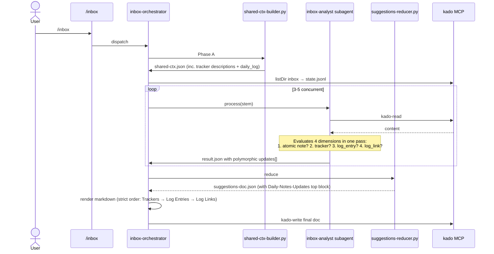

# Solution Design Document

## Constraints

- **CON-1** Builds on Spec 004 fan-out pipeline. No architectural rewrites;
  existing `inbox-orchestrator` + per-item `inbox-analyst` stay in place.
- **CON-2** Single subagent invocation per inbox item. The three
  evaluation dimensions (tracker / log_entry / log_link) are evaluated in
  one classification pass — no extra Kado-reads.
- **CON-3** Tomo never creates daily notes itself. External plugin (or
  user) handles creation; Tomo surfaces a `- [ ] Create daily note first`
  checkbox when missing.
- **CON-4** Backwards-compatible `updates[]`: existing entries without a
  `kind` field default to `kind: "tracker"`.
- **CON-5** Config editable via `/tomo-setup` sub-wizards; no hand-YAML
  expected. Wizard skill names use `tomo-*` prefix.
- **CON-6** MVP cutoff default 30 days; actual create suppressed in MVP
  regardless of `auto_create_if_missing` flags.

## Implementation Context

### Required Context Sources

```yaml
- doc: docs/XDD/specs/005-daily-note-workflow/requirements.md
  relevance: CRITICAL
  why: "WHAT + WHY this SDD implements"

- doc: docs/XDD/specs/004-inbox-fanout-refactor/solution.md
  relevance: CRITICAL
  why: "Architecture this extends; polymorphic actions[] already in place"

- file: tomo/.claude/agents/inbox-analyst.md
  relevance: CRITICAL
  why: "Per-item subagent — Step 8b (date/tracker detection) is the
        extension point for log_entry/log_link"

- file: tomo/.claude/agents/inbox-orchestrator.md
  relevance: HIGH
  why: "Phase-C render rules; Daily-Notes-Updates block needs a new top-
        of-doc slot"

- file: tomo/.claude/commands/tomo-setup.md
  relevance: HIGH
  why: "New Phase 3b sub-wizards (tomo-trackers-wizard, tomo-daily-log-
        wizard) hang off of this"

- file: scripts/shared-ctx-builder.py
  relevance: HIGH
  why: "Adds tracker descriptions + daily_log config to shared-ctx"

- file: scripts/suggestions-reducer.py
  relevance: HIGH
  why: "Top-of-doc Daily-Notes-Updates block; per-item `Material für`
        mirror"

- file: tomo/schemas/item-result.schema.json
  relevance: CRITICAL
  why: "Polymorphic updates[] entries: tracker / log_entry / log_link"
```

### Implementation Boundaries

- **Must Preserve:**
  - Spec-004 fan-out pipeline (orchestrator, subagent spawn model, state
    file shape, reducer architecture).
  - Pass 2 `instruction-builder` core — handlers expand but stay per-kind.
  - The existing `update_daily` action at the top level — updates[] gets
    polymorphic but the outer action shape is unchanged.
- **Can Modify:**
  - `inbox-analyst.md` Step 8b (date/tracker detection).
  - `inbox-orchestrator.md` render rules (new top-of-doc block).
  - `shared-ctx-builder.py` (new fields in `daily_notes`).
  - `suggestions-reducer.py` (new rendering for polymorphic updates,
    top-of-doc block).
  - `item-result.schema.json` (add `log_entry` and `log_link` variants
    under `updates[]`).
  - `tomo-setup.md` (Phase 3b).
  - `vault-config.yaml` schema (tracker descriptions, daily_log section).
- **Must Not Touch:**
  - Orchestrator Phase-A/B structure.
  - `state-init.py` / `state-update.py`.
  - `kado-write` flow — still only Pass 1 final doc write and Pass 2 doc
    writes; no daily-note creation.

### Project Commands

```bash
# Inside Docker / Tomo instance
/tomo-setup                 # full wizard — now includes Phase 3b
/tomo-setup trackers        # sub-wizard for tracker semantics
/tomo-setup daily-log       # sub-wizard for daily-log config
/inbox                      # unchanged entry; orchestrator internally extended
```

## Solution Strategy

Extend the Spec-004 fan-out pipeline with:

1. **Config layer:** two new concerns in `vault-config.yaml`
   (tracker semantics + daily_log config), edited via wizard sub-flows.
2. **Shared-ctx layer:** `daily_notes` block grows new fields
   (tracker_fields[].description/keywords, daily_log settings).
3. **Subagent layer:** Step 8b classifies three-way (tracker / log_entry /
   log_link) in one LLM pass; emits polymorphic `updates[]`.
4. **Reducer layer:** new top-of-doc `## Daily Notes Updates` section
   groups updates by daily note; per-item section gains a mirrored
   `Material für [[DAILY]]` sub-block for log_links.
5. **Pass 2 layer:** `instruction-builder` handlers for `log_entry` and
   `log_link` (append-to-section logic; no auto-create).
6. **Wizard layer:** two sub-wizards under `/tomo-setup`, each its own
   skill with `tomo-` prefix.

## Building Block View

### Components

```mermaid
graph TB
    User[/inbox user/]
    Orch[inbox-orchestrator]
    Analyst[inbox-analyst subagent]
    SCB[shared-ctx-builder.py]
    Cfg[(vault-config.yaml)]
    Shared[(shared-ctx.json)]
    Reducer[suggestions-reducer.py]
    Doc[(suggestions-doc.json)]
    Vault[(vault via Kado)]
    Setup[/tomo-setup/]
    WT[tomo-trackers-wizard]
    WD[tomo-daily-log-wizard]

    Setup --> WT
    Setup --> WD
    WT --> Cfg
    WD --> Cfg

    User --> Orch
    Orch --> SCB
    SCB --> Cfg
    SCB --> Shared
    Orch --> Analyst
    Analyst --> Shared
    Analyst --> Vault
    Analyst -->|result.json with polymorphic updates[]| Orch
    Orch --> Reducer
    Reducer --> Doc
    Orch -->|kado-write| Vault
```

### Directory Map

```
Tomo/
├── tomo/
│   ├── .claude/
│   │   ├── agents/
│   │   │   ├── inbox-analyst.md               # MODIFY — Step 8b three-way + polymorphic updates[]
│   │   │   ├── inbox-orchestrator.md          # MODIFY — render rules for top-of-doc Daily Notes Updates block
│   │   │   └── instruction-builder.md         # MODIFY — new handlers: log_entry / log_link
│   │   ├── commands/
│   │   │   └── tomo-setup.md                  # MODIFY — Phase 3b dispatches sub-wizards
│   │   └── skills/
│   │       ├── tomo-trackers-wizard.md        # NEW — per-tracker description+keywords interview
│   │       └── tomo-daily-log-wizard.md       # NEW — daily-log config interview
│   ├── config/
│   │   └── vault-example.yaml                 # MODIFY — show daily_log section + tracker descriptions
│   ├── schemas/
│   │   └── item-result.schema.json            # MODIFY — polymorphic updates[] with tracker/log_entry/log_link
│   └── templates/
│       └── item-result.template.json          # REGENERATED from schema
└── scripts/
    ├── shared-ctx-builder.py                  # MODIFY — emit tracker descriptions + daily_log settings
    ├── suggestions-reducer.py                 # MODIFY — top-of-doc Daily Notes Updates block; polymorphic update render
    └── validate-result.py                     # MODIFY — validate polymorphic updates[] shapes
```

### Interface Specifications

#### vault-config.yaml — tracker semantics

```yaml
trackers:
  daily_note_trackers:
    today_fields:
      - name: Sport
        type: boolean
        description: "Physical exercise actually done today (ran, swam, gym, yoga, bike, hike). NOT 'watched a video about exercise'."
        positive_keywords: [ran, running, workout, gym, yoga, cycled, bike, swim, hike, trained]
        negative_keywords: [watched, video about, article on, read about, planning to]
      - name: WakeUpEnergy
        type: integer
        scale: "1-5"
        description: "How rested the user felt on waking (1=exhausted, 5=fully rested)."
        positive_keywords: [rested, tired, exhausted, energetic, sluggish, refreshed]
        negative_keywords: []
  end_of_day_fields:
    ...
```

Wizard collects `description`, `positive_keywords`, `negative_keywords` per
field. Wizard NEVER overwrites existing non-empty values unless user
confirms "replace".

#### vault-config.yaml — daily_log section (new)

```yaml
daily_log:
  enabled: true
  section: "Daily Log"                 # heading text
  heading_level: 1                     # 1 or 2
  time_extraction:
    enabled: true
    sources: [content, filename]       # priority order; subset of [frontmatter, filename, content, mtime]
    fallback: "append_end_of_day"      # append_end_of_day | append_start_of_day | skip_time
  link_format: "bullet"                # "bullet" → - [[stem]]; "plain" → [[stem]]
  cutoff_days: 30                      # items older than this: no update_daily action
  auto_create_if_missing:
    past: false                        # MVP: always false
    today: false                       # MVP: always false
    future: false                      # MVP: always false
```

If the `daily_log` section is absent from vault-config, shared-ctx-builder
emits defaults (Tomo-sane defaults: section="Daily Log", heading_level=1,
cutoff_days=30, extraction sources=[content, filename]).

#### shared-ctx.json additions

```json
{
  "...": "...existing fields...",
  "daily_notes": {
    "enabled": true,
    "path_pattern": "Calendar/301 Daily/YYYY-MM-DD",
    "date_formats": ["YYYY-MM-DD", "YYYYMMDD", "DD-MM-YYYY"],
    "tracker_fields": [
      {
        "name": "Sport",
        "type": "bool",
        "section": "Habit",
        "syntax": "inline_field",
        "description": "Physical exercise actually done today.",
        "positive_keywords": ["ran", "workout", "gym", "yoga"],
        "negative_keywords": ["watched", "video about"]
      }
    ],
    "daily_log": {
      "section": "Daily Log",
      "heading_level": 1,
      "time_extraction": {
        "enabled": true,
        "sources": ["content", "filename"],
        "fallback": "append_end_of_day"
      },
      "link_format": "bullet",
      "cutoff_days": 30,
      "auto_create_if_missing": {"past": false, "today": false, "future": false}
    }
  }
}
```

#### item-result.schema.json — polymorphic `updates[]`

```json
"updates": {
  "type": "array",
  "minItems": 1,
  "items": {
    "oneOf": [
      {"$ref": "#/$defs/update_tracker"},
      {"$ref": "#/$defs/update_log_entry"},
      {"$ref": "#/$defs/update_log_link"}
    ]
  }
}
```

With `$defs`:

- `update_tracker`: `{kind: "tracker", field, value, section, syntax, reason, confidence}`
- `update_log_entry`: `{kind: "log_entry", content, time?, reason, confidence, time_source?}`
- `update_log_link`: `{kind: "log_link", target_stem, time?, reason, confidence, time_source?}`

Legacy entries without `kind` are migrated at read time by the reducer
(treated as `kind: "tracker"`).

#### update_daily — can now appear N times per result

Multi-daily support: a single item can emit multiple `update_daily`
actions, each with its own `daily_note_stem`. Reducer groups by
`daily_note_stem` for top-of-doc rendering.

## Runtime View

### Primary Flow



### Error Handling

| Error | Handler |
|---|---|
| Daily note doesn't exist | Reducer emits `- [ ] Create daily note [[<date>]] first`; kado-write never invoked for create |
| Date older than cutoff | Subagent suppresses `update_daily` action entirely; atomic-note action still evaluated |
| Tracker keywords empty | Validator warns; subagent falls back to field-name whole-word match |
| Time-extraction fails across all sources | `time: null`; reducer places entry at end of log |
| Multi-daily split produces 0 updates (all dates past cutoff) | `update_daily` action omitted from result; atomic-note action may still exist |

### Log-format heuristic (complex logic)

```
ALGORITHM: detect_log_format(content)
INPUT: normalized content (trimmed lines)
OUTPUT: (is_log_format, [(date, line_text) ...])

1. Split content into lines; strip empty lines.
2. Classify each line:
   - Starts with DATE_RE (e.g. `^\d{1,2}\.\d{1,2}\.\d{2,4}\s` or `^\d{4}-\d{2}-\d{2}\s`)?
   - Line length ≤ 200 chars?
3. If ≥ 60% of non-empty lines are classified true AND total lines ≥ 2:
   → is_log_format = true; extract dated entries
4. Else:
   → is_log_format = false; fall back to prose date-mention scan
```

### Multi-daily dispatch (complex logic)

```
ALGORITHM: determine_daily_targets(content, date_relevance)
1. (is_log, entries) = detect_log_format(content)
2. If is_log:
   For each entry: if date ≥ today-cutoff → emit update_daily for that date
3. Else:
   dates = extract_all_dates_mentioned(content)
   if dates is empty: return [] (no daily update)
   most_recent = max(dates, "heute" wins if present)
   return [update_daily(most_recent)]
```

## Deployment View

- **Environment:** Docker container (unchanged).
- **Configuration:** two new vault-config sections (tracker descriptions,
  daily_log), both optional with sane defaults.
- **Dependencies:** none new. Python stdlib + pyyaml as before.
- **Performance:** per-item subagent cost unchanged (still one Kado-read,
  one classification pass). Shared-ctx grows by ~1 KB with tracker
  descriptions — still within the 15 KB budget after topic shortening.

## Architecture Decisions

- [x] **ADR-1 Single subagent invocation per item evaluates all three
  daily-note dimensions** (tracker, log_entry, log_link) alongside the
  existing atomic-note dimension.
  - Rationale: Extra LLM calls would triple per-item cost. The classifier
    already has the full content in context.
  - Trade-offs: Prompt grows slightly; need clear per-dimension guidance.
  - User confirmed: ✓ (2026-04-16)

- [x] **ADR-2 Polymorphic `updates[]` extension** rather than new top-
  level action kinds.
  - Rationale: Keeps the action taxonomy small; Pass-2 still dispatches
    on `kind` at the action level, plus a nested switch on `updates[].kind`.
  - Trade-offs: Schema gets deeper; worth it for action-kind parsimony.
  - User confirmed: ✓ (2026-04-16)

- [x] **ADR-3 Multi-daily split via log-format heuristic; fallback to
  single most-recent-date** when content is prose or uncertain.
  - Rationale: Avoid splitting prose into fabricated per-date updates.
  - Trade-offs: Heuristic can under-split a real multi-date log written in
    unusual format; user can split manually by creating multiple inbox items.
  - User confirmed: ✓ (2026-04-16)

- [x] **ADR-4 Cutoff filter at `date_relevance.date` vs `today -
  cutoff_days`** — suppress `update_daily` only; atomic-note still proceeds.
  - Rationale: Old items may still be knowledge-worthy as atomic notes;
    only daily-note targeting becomes anachronistic beyond the cutoff.
  - Trade-offs: User can always override by editing date_relevance or
    creating a fresh inbox note.
  - User confirmed: ✓ (2026-04-16 default 30 days)

- [x] **ADR-5 Missing-daily-note surfaced as checkbox only** in both
  Pass 1 and Pass 2; actual create by external plugin or user.
  - Rationale: Keeps Tomo's MVP scope — Tomo proposes. External plugin
    (or user) executes create.
  - Trade-offs: User has an extra step; auto_create_if_missing flags
    reserved for future spec.
  - User confirmed: ✓ (2026-04-16)

- [x] **ADR-6 Wizard-managed config via `/tomo-setup` sub-wizards** for
  tracker semantics and daily-log settings.
  - Rationale: Tracker descriptions are a per-user concern; asking via
    UI beats hand-YAML.
  - Trade-offs: Longer wizard; split into sub-wizards when volume grows.
  - User confirmed: ✓ (2026-04-16 — sub-wizards if too long, `tomo-*`
    skill naming)

- [x] **ADR-7 Strict render order in Daily-Notes-Updates block** —
  per daily note: (Create-first?) → Trackers → Log Entries → Log Links.
  - Rationale: User reviews top-down; familiar order reduces cognitive
    load at weekly-review time.
  - Trade-offs: Orchestrator render rules pin the order; minor loss of
    flexibility.
  - User confirmed: ✓ (2026-04-15)

## Quality Requirements

- **False positives on tracker matches:** ≤ 10% user-rejection rate on the
  first real-vault run with wizard-completed tracker descriptions.
- **Log-entry time-placement:** 90%+ placements land within ±15 min of
  extracted time (when time was extractable).
- **Cutoff correctness:** 100% — items older than today-cutoff emit zero
  `update_daily` actions. Asserted via test.
- **Pass-1 context budget:** per-subagent total stays < 80K tokens
  (adding tracker descriptions is a few hundred tokens; still far under).
- **Wizard completeness:** after `/tomo-setup trackers`, every
  `tracker_fields[]` entry has a non-empty `description` (asserted).

## Acceptance Criteria

**Subagent emits polymorphic updates**
- [ ] WHEN an item matches a tracker, THE SYSTEM SHALL emit an
  `update_daily` action with a `tracker` entry in `updates[]`.
- [ ] WHEN an item qualifies for log_entry, THE SYSTEM SHALL emit a
  `log_entry` entry in the same `update_daily` action.
- [ ] IF `atomic_note_worthiness ≥ 0.5`, THEN THE SYSTEM SHALL emit a
  `log_link` entry instead of `log_entry`.

**Cutoff**
- [ ] IF `date_relevance.date` older than `today - cutoff_days`, THEN
  THE SYSTEM SHALL omit any `update_daily` action from the result.
- [ ] THE SYSTEM SHALL keep evaluating atomic-note classification
  regardless of the cutoff.

**Missing daily note**
- [ ] WHEN any update targets a daily note that does not exist, THE
  SYSTEM SHALL prepend `- [ ] Create daily note [[<date>]] first` to
  that daily note's Suggestions-doc block.
- [ ] THE SYSTEM SHALL NOT invoke `kado-write` on the daily-note path
  when `auto_create_if_missing` flags are all `false`.

**Render order**
- [ ] WHEN the reducer renders a daily-note block, THE SYSTEM SHALL
  present sub-sections in this order: Create-first (if applicable),
  Possible Trackers, Possible Log Entries, Possible Log Links.

**Wizard coverage**
- [ ] WHEN `/tomo-setup trackers` completes, EVERY tracker field SHALL
  have a non-empty `description` in vault-config (unless user explicitly
  skipped).
- [ ] WHEN `/tomo-setup daily-log` completes, the `daily_log` section
  SHALL exist in vault-config with all keys populated.

## Risks and Technical Debt

### Known Technical Issues

- Existing `update_daily.updates[]` entries in older test fixtures lack
  `kind` — reducer must migrate at read time.
- `inbox-analyst.md` Step 8b currently treats tracker detection as the
  only daily-note dimension; needs restructuring.

### Implementation Gotchas

- Log-format regex needs both German (`10.03.2026`) and ISO
  (`2026-03-10`) date shapes. Keep the regex conservative; prefer
  false-negative (fall back to prose mode) over false-positive.
- `auto_create_if_missing` flags MUST be forced to `false` throughout
  MVP; future spec changes that.
- Wizard writes to `vault-config.yaml` — YAML round-trip must preserve
  comments and ordering. Consider `ruamel.yaml` vs stdlib `yaml` (stdlib
  loses comments). This repo already uses stdlib; we add comment-
  preserving logic only if user feedback demands it.

## Glossary

### Domain Terms

| Term | Definition | Context |
|------|------------|---------|
| Daily Log | The heading in a daily note where timeline entries accumulate | `# Daily Log` or `## Daily Log` per config |
| Log entry | Short inline text added to the daily log body | produced from short inbox items |
| Log link | Wikilink from the daily log to a substantive atomic note | produced when atomic_note_worthiness ≥ 0.5 |
| Cutoff | Age in days beyond which daily-note actions are suppressed | default 30 days |
| Tracker description | Free-text user-authored scope for a tracker field | managed via `/tomo-setup trackers` |

### Technical Terms

| Term | Definition | Context |
|------|------------|---------|
| Polymorphic updates[] | `update_daily` action's `updates[]` contains mixed-kind entries (tracker / log_entry / log_link) | schema extension |
| Multi-daily split | Heuristic that turns one inbox item into N `update_daily` actions | content with date-prefixed lines |
| Log-format heuristic | Regex + line-length classifier for "is this content a dated log vs prose" | in subagent Step 8b |
