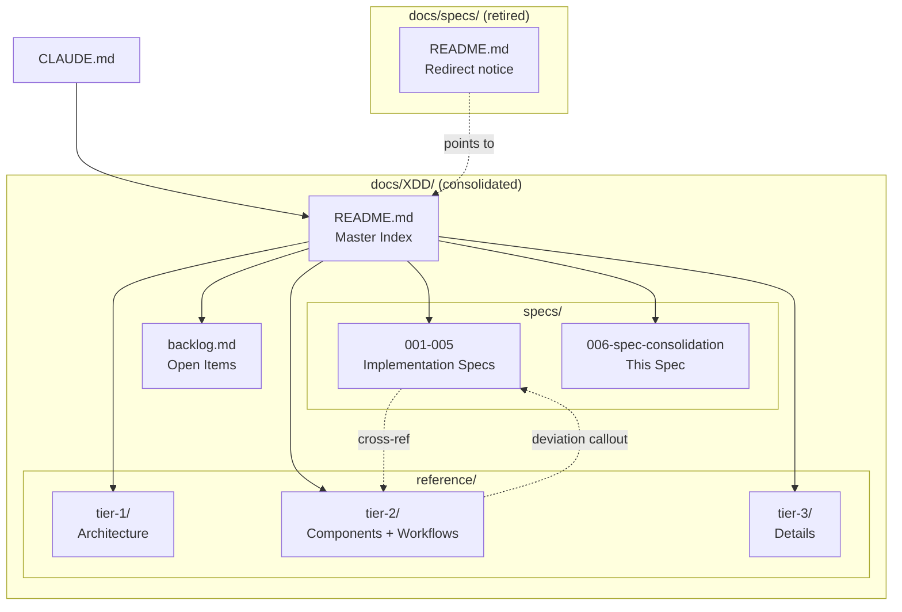

# Solution Design Document

## Validation Checklist

### CRITICAL GATES (Must Pass)

- [x] All required sections are complete
- [x] No [NEEDS CLARIFICATION] markers remain
- [x] Architecture pattern is clearly stated with rationale
- [x] **All architecture decisions confirmed by user**
- [x] Every interface has specification

### QUALITY CHECKS (Should Pass)

- [x] All context sources are listed with relevance ratings
- [x] Project commands are discovered from actual project files
- [x] Constraints → Strategy → Design → Implementation path is logical
- [x] Every component in diagram has directory mapping
- [x] Error handling covers all error types
- [x] Quality requirements are specific and measurable
- [x] Component names consistent across diagrams
- [x] A developer could implement from this design
- [x] No technical implementation details for code (this is a docs-only spec)

---

## Constraints

- CON-1 **Documentation only**: No code, script, agent, or config changes. Only markdown files are created, moved, or edited.
- CON-2 **Kokoro is read-only**: Tomo cannot modify Kokoro's architecture docs. Deviations are documented in Tomo's XDD only.
- CON-3 **Existing XDD specs (001-005) are untouched**: They remain as-is. Consolidation adds new content alongside them.
- CON-4 **CLAUDE.md references must be updated**: After migration, `docs/specs/` references in CLAUDE.md must point to new locations.
- CON-5 **Git branch required**: All changes on a feature branch per project conventions.

## Implementation Context

### Required Context Sources

#### Documentation Context
```yaml
- doc: docs/specs/README.md
  relevance: HIGH
  why: "Index of all tier specs — defines current structure"

- doc: docs/specs/tier-1/pkm-intelligence-architecture.md
  relevance: HIGH
  why: "Authoritative architecture reference — Tier 1"

- doc: docs/XDD/specs/004-inbox-fanout-refactor/solution.md
  relevance: HIGH
  why: "Documents the fan-out deviation from original tier spec design"

- doc: docs/XDD/specs/005-daily-note-workflow/solution.md
  relevance: HIGH
  why: "Documents the daily-note extension deviation"

- doc: CLAUDE.md
  relevance: HIGH
  why: "Must update docs/specs/ references after migration"
```

#### Code Context
```yaml
- file: docs/specs/tier-2/workflows/inbox-processing.md
  relevance: HIGH
  why: "Most heavily deviated spec — fan-out refactor changed agent architecture"

- file: docs/specs/tier-2/workflows/daily-note.md
  relevance: HIGH
  why: "Extended by XDD 005 with tracker semantics"

- file: docs/specs/tier-3/inbox/instruction-set-apply.md
  relevance: MEDIUM
  why: "Skeletal placeholder — needs fleshing out from implementation"

- file: docs/specs/tier-3/inbox/instruction-set-cleanup.md
  relevance: MEDIUM
  why: "Skeletal placeholder — needs fleshing out from implementation"
```

### Implementation Boundaries

- **Must Preserve**: All existing XDD specs (001-005) unchanged. Kokoro references intact.
- **Can Modify**: docs/specs/ contents (migration target), CLAUDE.md references, docs/XDD/ structure.
- **Must Not Touch**: Any file outside docs/ and CLAUDE.md. No code changes.

### External Interfaces

Not applicable — this is a documentation-only consolidation with no external system integration.

### Project Commands

```bash
# No build/test commands for docs-only work
# Validation is manual review + cross-reference checks
```

## Solution Strategy

- **Architecture Pattern**: File migration with in-place annotation. Tier specs are physically moved from `docs/specs/` to `docs/XDD/reference/`, preserving their tier hierarchy. Each spec is annotated with deviation callouts where implementation differs. A redirect README is left at the old location.
- **Integration Approach**: The consolidated docs become the single documentation entry point. CLAUDE.md is updated to reference `docs/XDD/` instead of `docs/specs/`. XDD implementation specs (001-005) cross-reference the migrated architecture specs.
- **Justification**: Moving (not copying) avoids content duplication. Preserving tier hierarchy within `reference/` maintains the Kokoro-originated organization while placing everything under one roof.
- **Key Decisions**: See Architecture Decisions section below.

## Building Block View

### Components



### Directory Map

**After consolidation:**
```
docs/XDD/
├── README.md                              # NEW: Master index of all specs + reference docs
├── backlog.md                             # NEW: Open-items backlog (features, doc-debt, bugs)
├── specs/                                 # EXISTING: Implementation specs
│   ├── 001-phase-1-config-foundation/     # UNCHANGED
│   ├── 002-phase-2-vault-explorer/        # UNCHANGED
│   ├── 003-phase-3-inbox-processing/      # UNCHANGED
│   ├── 004-inbox-fanout-refactor/         # UNCHANGED
│   ├── 005-daily-note-workflow/           # UNCHANGED
│   └── 006-spec-consolidation/            # THIS SPEC
│       ├── README.md
│       ├── requirements.md
│       ├── solution.md
│       └── plan/
└── reference/                             # NEW: Migrated architecture specs
    ├── README.md                          # NEW: Reference docs index + Kokoro authority note
    ├── tier-1/
    │   └── pkm-intelligence-architecture.md   # MOVED + ANNOTATED
    ├── tier-2/
    │   ├── components/
    │   │   ├── universal-pkm-concepts.md       # MOVED
    │   │   ├── framework-profiles.md           # MOVED
    │   │   ├── user-config.md                  # MOVED
    │   │   ├── discovery-cache.md              # MOVED
    │   │   ├── template-system.md              # MOVED
    │   │   └── setup-wizard.md                 # MOVED
    │   └── workflows/
    │       ├── inbox-processing.md             # MOVED + ANNOTATED (fan-out deviation)
    │       ├── daily-note.md                   # MOVED + ANNOTATED (tracker deviation)
    │       ├── lyt-moc-linking.md              # MOVED
    │       └── vault-exploration.md            # MOVED
    └── tier-3/
        ├── config/                            # MOVED (4 files)
        ├── discovery/                         # MOVED (3 files)
        ├── daily-note/                        # MOVED + ANNOTATED (2 files)
        ├── inbox/                             # MOVED + FLESHED OUT (5 files)
        ├── lyt-moc/                           # MOVED (3 files)
        ├── profiles/                          # MOVED (2 files)
        ├── templates/                         # MOVED (2 files)
        ├── vault-exploration/                 # MOVED (3 files)
        └── wizard/                            # MOVED (2 files)

docs/specs/                                # RETIRED
└── README.md                              # MODIFIED: Redirect notice only
```

### Interface Specifications

Not applicable — no APIs, databases, or external integrations.

### File Formats

#### Deviation Callout Format
Used inline within migrated specs where implementation differs from the original design:

```markdown
> **⚠️ Deviation (XDD-NNN)**
> **Original**: [what the spec described]
> **Actual**: [what was implemented]
> **Reason**: [why the deviation occurred]
> **See**: specs/NNN-spec-name/solution.md
```

#### Backlog Item Format
Used in `docs/XDD/backlog.md`:

```markdown
## Features (Post-MVP)

| ID | Item | Source | Priority | Notes |
|----|------|--------|----------|-------|
| F-01 | Description | reference/tier-N/file.md | Must/Should/Could | Brief context |

## Documentation Debt

| ID | Item | Source | Priority | Notes |
|----|------|--------|----------|-------|
| D-01 | Description | reference/tier-N/file.md | Must/Should/Could | Brief context |

## Known Issues

| ID | Item | Source | Priority | Notes |
|----|------|--------|----------|-------|
| B-01 | Description | reference/tier-N/file.md | Must/Should/Could | Brief context |
```

#### Redirect README Format
Left at `docs/specs/README.md` after migration:

```markdown
# docs/specs/ — Retired

These specifications have been migrated to `docs/XDD/reference/`.

See [docs/XDD/README.md](../XDD/README.md) for the consolidated documentation index.

Migration date: 2026-04-18 (XDD-006)
```

#### Master Index Format
`docs/XDD/README.md` structure:

```markdown
# Tomo Documentation Index

## Implementation Specs

| ID | Name | Phase | Status |
|----|------|-------|--------|
| 001 | Config Foundation | Ready | Plan complete |
| ... | ... | ... | ... |

## Architecture Reference

Migrated from docs/specs/. Kokoro (~/Kouzou/projects/miyo/) is the
architectural authority. These docs reflect Tomo's implementation
with inline deviation annotations where applicable.

### Tier 1 — Framework
- [PKM Intelligence Architecture](reference/tier-1/pkm-intelligence-architecture.md)

### Tier 2 — Components
- [Universal PKM Concepts](reference/tier-2/components/universal-pkm-concepts.md)
- ...

### Tier 2 — Workflows
- [Inbox Processing](reference/tier-2/workflows/inbox-processing.md) ⚠️ deviations
- ...

### Tier 3 — Details
- [Config](reference/tier-3/config/) (4 files)
- ...

## Open Items
See [backlog.md](backlog.md)
```

## Runtime View

### Primary Flow: Consolidation Process

The consolidation is a one-time manual/AI-assisted process, not a runtime system. The "flow" is the execution sequence:

1. **Inventory** (done during PRD research): All 32 tier specs catalogued with classification.
2. **Create structure**: `docs/XDD/reference/` with tier subdirectories.
3. **Migrate specs**: Move each file from `docs/specs/` to `docs/XDD/reference/`, preserving paths.
4. **Annotate deviations**: For each spec where implementation differs, add inline deviation callouts.
5. **Flesh out placeholders**: Reverse-engineer skeletal Tier-3 specs from working code.
6. **Build backlog**: Extract post-MVP items, doc debt, and issues into `docs/XDD/backlog.md`.
7. **Create index**: Write `docs/XDD/README.md` with full spec + reference index.
8. **Redirect old location**: Replace `docs/specs/` content with redirect README.
9. **Update CLAUDE.md**: Change `docs/specs/` references to `docs/XDD/reference/`.
10. **Validate**: Cross-reference check — no broken links, no missed specs.

### Error Handling

- **Missing spec during migration**: Inventory already complete (32 files catalogued). Any file not in the inventory is investigated before proceeding.
- **Ambiguous deviation**: When it's unclear if implementation differs from spec, flag it in the backlog as documentation debt rather than guessing.
- **Broken cross-references**: After migration, all internal `docs/specs/` references must be updated to `docs/XDD/reference/` paths. A grep for `docs/specs/` across the repo catches stragglers.

## Deployment View

No deployment changes. This is a documentation-only effort. No Docker, no scripts, no runtime impact.

## Cross-Cutting Concepts

### Pattern Documentation

```yaml
- pattern: Inline deviation callouts
  relevance: CRITICAL
  why: "Core pattern for documenting spec-to-implementation drift without maintaining a separate registry"

- pattern: Kokoro-authority reference model
  relevance: HIGH
  why: "Establishes that Kokoro owns architecture, Tomo documents deviations. Prevents content duplication."
```

### Spec Lifecycle

After consolidation, the documentation lifecycle is:

1. **New feature idea** → Create XDD spec (007+) with PRD/SDD/PLAN in `docs/XDD/specs/`.
2. **Architecture reference needed** → Read `docs/XDD/reference/tier-N/` for original design. Check for deviation callouts.
3. **Implementation deviates from spec** → Add inline deviation callout to the reference spec, linking to the XDD spec that caused the change.
4. **Post-MVP work identified** → Add to `docs/XDD/backlog.md` with source reference and priority.

## Architecture Decisions

- [x] **ADR-1 Reference docs folder**: Migrated tier specs go into `docs/XDD/reference/` with tier hierarchy preserved (`reference/tier-1/`, `reference/tier-2/`, `reference/tier-3/`).
  - Rationale: Keeps architecture reference docs visually separate from implementation specs while consolidating under one roof. Preserves the Kokoro-originated tier organization.
  - Trade-offs: Two subdirectories (`specs/` and `reference/`) instead of one flat list. Acceptable because they serve different purposes.
  - User confirmed: **Yes** (2026-04-18)

- [x] **ADR-2 Standalone backlog file**: Open-items backlog lives at `docs/XDD/backlog.md` as a single categorized file (features, doc-debt, bugs).
  - Rationale: Single file is easy to find, easy to grep, and doesn't require GitHub access. Categories with source references make items traceable.
  - Trade-offs: Not as actionable as GitHub Issues (no assignees, no automation). Acceptable for a solo project.
  - User confirmed: **Yes** (2026-04-18)

- [x] **ADR-3 Inline deviation annotations**: Deviations from Kokoro specs are documented with inline callout blocks within each migrated spec, not in a separate registry.
  - Rationale: Deviation context is most useful right where the original spec text is. A reader doesn't need to cross-reference a separate file to understand that the spec has changed.
  - Trade-offs: No single-page overview of all deviations. Mitigated by the XDD README which marks specs with ⚠️ where deviations exist.
  - User confirmed: **Yes** (2026-04-18)

## Quality Requirements

- **Completeness**: 100% of 32 tier specs classified and processed (migrated, annotated, or fleshed out).
- **Accuracy**: 0 specs contain descriptions that contradict the actual codebase after reconciliation.
- **Reference integrity**: 0 broken cross-references after migration. Validated by grepping for `docs/specs/` paths.
- **Discoverability**: Any spec can be found from the master index (`docs/XDD/README.md`) within 2 clicks.

## Acceptance Criteria

**Migration Criteria (PRD Features 1, 3):**
- [x] WHEN migration is complete, THE SYSTEM SHALL have all 32 tier specs under `docs/XDD/reference/` with tier hierarchy preserved
- [x] WHEN a user visits `docs/specs/`, THE SYSTEM SHALL show a redirect README pointing to `docs/XDD/`
- [x] WHEN a skeletal spec is fleshed out, THE SYSTEM SHALL include content reverse-engineered from the working code with a "reverse-engineered" annotation

**Reconciliation Criteria (PRD Feature 2):**
- [x] WHEN a spec contains outdated agent architecture (pre-fan-out), THE SYSTEM SHALL include a deviation callout linking to XDD-004
- [x] WHEN a spec lacks daily-note tracker semantics, THE SYSTEM SHALL include a deviation callout linking to XDD-005
- [x] WHEN a deviation exists, THE SYSTEM SHALL document both original intent and actual implementation

**Backlog Criteria (PRD Feature 4):**
- [x] WHEN the backlog is produced, THE SYSTEM SHALL categorize items as features/doc-debt/bugs with source references
- [x] WHEN a post-MVP item exists in any tier spec, THE SYSTEM SHALL capture it in the backlog

**Index Criteria (PRD Feature 5):**
- [x] WHEN `docs/XDD/README.md` is created, THE SYSTEM SHALL index all specs (001-006) and all reference docs with navigation links
- [x] WHEN a spec has deviations, THE SYSTEM SHALL mark it with ⚠️ in the index

**CLAUDE.md Criteria:**
- [x] WHEN migration is complete, THE SYSTEM SHALL update CLAUDE.md to reference `docs/XDD/reference/` instead of `docs/specs/`

## Risks and Technical Debt

### Known Technical Issues
- Some tier-3 specs (instruction-set-apply, instruction-set-cleanup) are skeletal — they need substantive content reverse-engineered from the codebase before they can be meaningfully migrated.
- Cross-references within tier specs use relative paths (`../tier-2/components/...`) that need updating after the move to `docs/XDD/reference/`.

### Technical Debt
- XDD 001-003 skip PRD/SDD and reference Kokoro tier specs directly. After migration, these references should be updated to point to `docs/XDD/reference/` paths instead of `docs/specs/` paths. (Included in this consolidation.)
- Tier specs are all marked "Draft" — status should be updated to reflect actual implementation state during migration.

### Implementation Gotchas
- Git tracks file moves as delete + add unless using `git mv`. Use `git mv` to preserve history.
- CLAUDE.md uses `@` imports for some references — verify the import syntax still works after path changes.
- The `docs/specs/README.md` currently serves as an index — its content should inform the new `docs/XDD/README.md` before being replaced with the redirect.

## Glossary

### Domain Terms

| Term | Definition | Context |
|------|------------|---------|
| Tier spec | Architecture specification organized by abstraction level (Tier 1 = framework, Tier 2 = components/workflows, Tier 3 = implementation details) | Originated from Kokoro, migrated to Tomo's docs/XDD/reference/ |
| XDD spec | Implementation specification with PRD → SDD → PLAN workflow, tracked by numeric ID (001-NNN) | Lives in docs/XDD/specs/ |
| Deviation | A documented difference between the original Kokoro architecture spec and what was actually implemented | Annotated inline with callout blocks |
| Backlog | Categorized list of open work items (features, doc-debt, bugs) with source references and priorities | Lives at docs/XDD/backlog.md |

### Technical Terms

| Term | Definition | Context |
|------|------------|---------|
| Kokoro | MiYo's architecture & decisions repo — source of truth for system design | Read-only from Tomo's perspective |
| Fan-out refactor | XDD-004: Changed inbox processing from monolithic agent to orchestrator + per-item subagent model | Primary deviation requiring annotation |
| Discovery cache | Auto-generated semantic index of vault structure (Layer 4 in the knowledge stack) | Referenced in multiple tier specs |
| 2-pass model | Suggestions (Pass 1) → User confirms → Instructions (Pass 2) → User applies | Core inbox workflow pattern |
