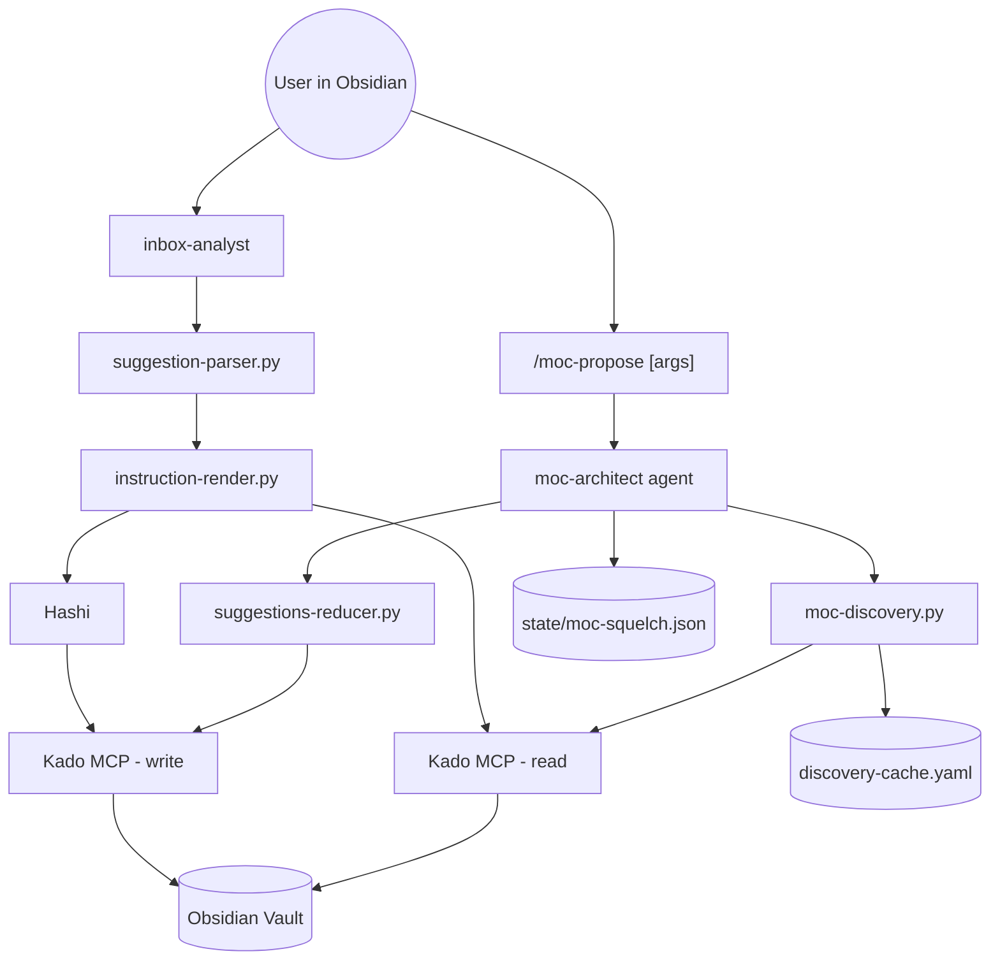
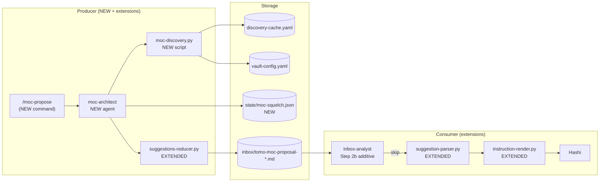
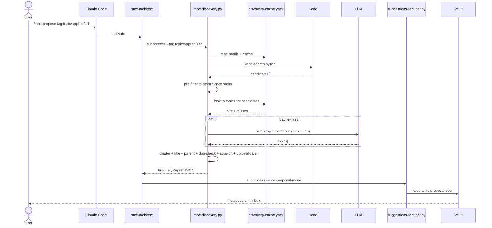
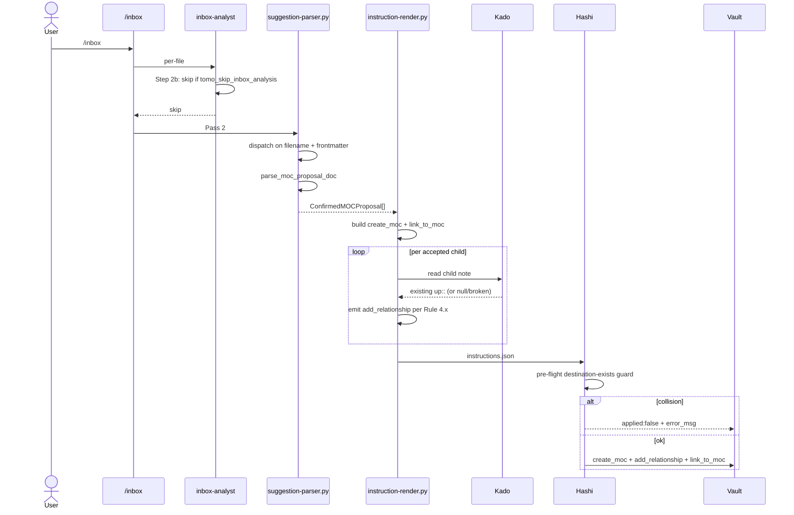
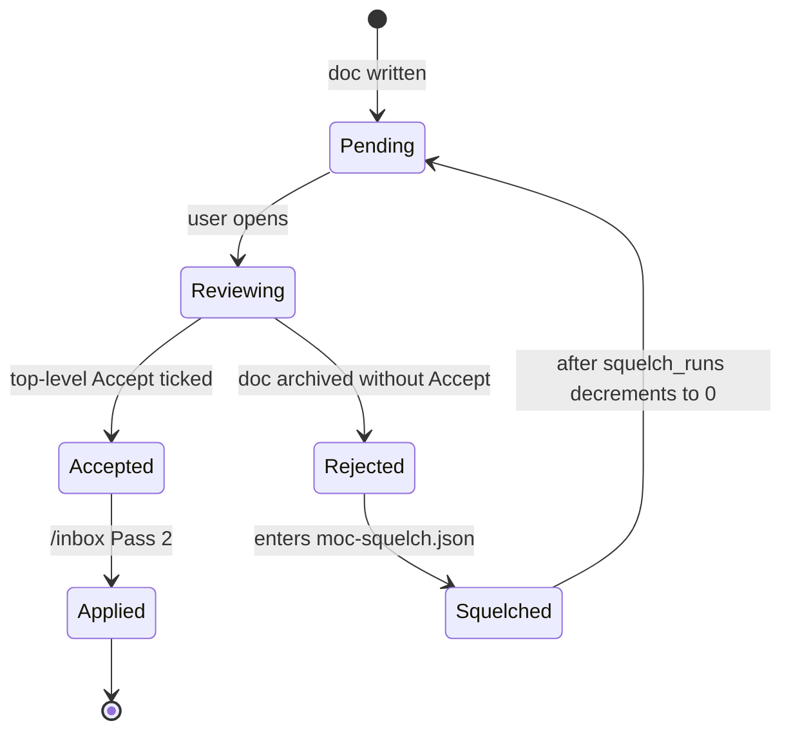

# Solution Design Document

## Validation Checklist

### CRITICAL GATES (Must Pass)

- [x] All required sections are complete
- [x] No [NEEDS CLARIFICATION] markers remain
- [x] Architecture pattern is clearly stated with rationale
- [x] **All architecture decisions confirmed by user**
- [x] Every interface has specification

### QUALITY CHECKS (Should Pass)

- [x] All context sources are listed with relevance ratings
- [x] Project commands are discovered from actual project files
- [x] Constraints → Strategy → Design → Implementation path is logical
- [x] Every component in diagram has directory mapping
- [x] Error handling covers all error types
- [x] Quality requirements are specific and measurable
- [x] Component names consistent across diagrams
- [x] A developer could implement from this design
- [x] Implementation examples use actual schema column names (not pseudocode), verified against migration files
- [x] Complex queries include traced walkthroughs with example data

---

## Output Schema

### SDD Status Report

| Field | Value |
|-------|-------|
| specId | 013-moc-creation-skill |
| pattern | Additive 2-pass pipeline extension |
| keyComponents | `moc-architect` agent · `moc-discovery.py` · `suggestions-reducer.py` (extended) · `suggestion-parser.py` (extended) · `instruction-render.py` (extended) · `inbox-analyst.md` (Step 2b additive) |
| externalIntegrations | Kado MCP (`kado-search byTag`, `kado-read listDir`, `kado-read note`) · Hashi (NEW destination-collision guard requirement) |

---

## Constraints

CON-1 **Hot-path additivity** — `inbox-analyst`, `shared-ctx-builder`, `moc-tree-builder` accept additive changes only (`feedback_near_mvp_no_breakage.md`). New behaviour goes into NEW components or sits behind explicit dispatch flags. No mutation of existing analysis logic.

CON-2 **MVP execution boundary** — Tomo writes only to inbox folder; Hashi applies all vault mutations (CLAUDE.md project rules). `/moc-propose` writes one proposal-doc; `/inbox` Pass 2 hands off `instructions.json` to Hashi.

CON-3 **Schema reuse** — Reuse `create_moc`, `add_relationship`, `link_to_moc` from `tomo/schemas/instructions.schema.json` (no schema change). PRD Won't-Have explicitly forbids schema extension.

CON-4 **MCP-tool reuse** — Use existing Kado tools only. `kado-read listDir` returns mixed file+folder entries; client-side filter to `.md` only. `kado-search byTag` requires glob suffix `*` for prefix-match.

CON-5 **Profile purity** — All profile-specific values (title pattern, MOC location, classification map) live in `tomo/profiles/{miyo,lyt}.yaml`. Scripts and agents read profile via `shared-ctx-builder`; no profile branching in Python logic.

CON-6 **Constitution L1 Performance** (`miyo-constitution.md` lines 194-217) — Chunked Kado responses, no main-thread UI blocking, minimal payloads. Cap candidate scan at 200 (per-mode); cap LLM cache-miss extraction at 5 batches × 10 notes.

CON-7 **Cache prerequisite** — `discovery-cache.yaml` must exist (populated by `/explore-vault`). Missing cache → abort with remediation message; no proposal-doc.

CON-8 **Single-user pre-launch QA** — Tests target Marcus's real vault + MiYo architecture; Privat-Test for integration; synthetic test-vault is parked (`feedback_test_scope_personal_vault.md`).

CON-9 **Cross-repo dependency** — Hashi must add destination-collision guard for `create_moc` action. PRD Feature 6 records the requirement; PLAN includes the `_outbox/for-hashi/` handoff item. F-43 launch is gated on Hashi confirmation.

## Implementation Context

**IMPORTANT**: All listed context sources MUST be read and analysed before implementation begins. They define existing patterns, constraints, and consumer contracts.

### Required Context Sources

#### Documentation Context

```yaml
- doc: docs/XDD/specs/013-moc-creation-skill/requirements.md
  relevance: CRITICAL
  why: "PRD — features, AC, MoSCoW, decisions"

- doc: docs/XDD/ideas/2026-05-06-moc-creation-skill.md
  relevance: HIGH
  why: "Brainstorm spec with 6-phase discovery flow detail and architecture rationale"

- doc: docs/XDD/reference/tier-3/lyt-moc/new-moc-proposal.md
  relevance: HIGH
  why: "Title patterns (§7), Conditions A/B/C (§8 duplicate detection), reused by F-43"

- doc: docs/XDD/reference/tier-3/lyt-moc/moc-matching.md
  relevance: HIGH
  why: "Scoring algorithm — same algorithm reused for parent resolution"

- doc: docs/XDD/reference/tier-3/lyt-moc/section-placement.md
  relevance: MEDIUM
  why: "Section placement rules; touched indirectly via link_to_moc"

- doc: docs/XDD/specs/012-force-atomic-synthesis/solution.md
  relevance: HIGH
  why: "FAN-resolve pattern — proposal-companion-doc + parser-extension precedent for F-43"

- doc: ~/Kouzou/projects/miyo/miyo-constitution.md
  relevance: CRITICAL
  why: "L1 Privacy/Performance/Operations rules"

- doc: docs/ai/memory/memory.md
  relevance: HIGH
  why: "Routing rules; lessons-learned guard rails (no-breakage on hot paths, etc.)"
```

#### Code Context

```yaml
- file: tomo/schemas/instructions.schema.json
  relevance: CRITICAL
  why: "create_moc/add_relationship/link_to_moc shapes; consumer contract"

- file: tomo/scripts/instruction-render.py
  relevance: CRITICAL
  why: "Lines 115-124 slugify(); 374-400 _build_create_moc_actions; 452-532 link_to_moc emission; 969-1005 supporting_items backfill. F-43 EXTENDS this file"

- file: tomo/scripts/suggestions-reducer.py
  relevance: CRITICAL
  why: "Lines 508, 598-651 topic_clusters algorithm — extracted to pure function for F-43; lines 663-693 render block entry — F-43 adds --moc-proposal-mode branch"

- file: tomo/scripts/suggestion-parser.py
  relevance: CRITICAL
  why: "Lines 29-32 RE_SECTION_HEADER, 96-122 action normalisation, 198-202 in_moc_list flag, 642-680 main(). F-43 adds pre-parse dispatch + parse_children_list helper"

- file: tomo/dot_claude/agents/inbox-analyst.md
  relevance: HIGH
  why: "Hot path. F-43 adds Step 2b (post-Kado-read pre-filter) for `tomo_skip_inbox_analysis: true` — additive only"

- file: tomo/dot_claude/agents/inbox-orchestrator.md
  relevance: MEDIUM
  why: "Pass-2 dispatch; verify proposal-doc detection and routing"

- file: tomo/dot_claude/agents/vault-explorer.md
  relevance: MEDIUM
  why: "Existing agent pattern (frontmatter, Step structure) — model for moc-architect"

- file: tomo/scripts/moc-tree-builder.py
  relevance: HIGH
  why: "Sibling script — argparse, KadoClient, JSON I/O, exit-code conventions for moc-discovery.py"

- file: tomo/scripts/lib/kado_client.py
  relevance: CRITICAL
  why: "Lines 298-322 _search_all() pagination; client API for byTag, listDir, read_note"

- file: tomo/scripts/shared-ctx-builder.py
  relevance: HIGH
  why: "discovery-cache.yaml loading; cache-miss detection; profile resolution"

- file: tomo/profiles/miyo.yaml
  relevance: CRITICAL
  why: "concept_defaults.atomic_note paths, classification.categories.keywords, MOC location/title pattern"

- file: tomo/profiles/lyt.yaml
  relevance: CRITICAL
  why: "LYT counterpart — plain titles, thematic location, no Dewey"

- file: tomo/config/templates/t_moc_tomo.md
  relevance: HIGH
  why: "Template body for create_moc action"

- file: tomo-instance/config/discovery-cache.yaml
  relevance: HIGH
  why: "Live cache shape; map_notes[].topics, level, classification, tags"
```

#### External APIs

```yaml
- service: Kado MCP
  doc: tomo/dot_claude/agents/kado-related (in-instance)
  relevance: CRITICAL
  why: "Vault read surface — kado-search byTag (with glob `*` suffix for prefix-match), kado-read listDir (returns mixed types — client-side .md filter), kado-read note. No write from Tomo (Hashi owns writes)"

- service: Hashi (instruction-set executor)
  doc: docs/XDD/reference/tier-2/ (Hashi specs, if present)
  relevance: HIGH
  why: "Applies create_moc + add_relationship + link_to_moc actions. NEW requirement: destination-exists guard on create_moc (cross-repo handoff)"
```

### Implementation Boundaries

- **Must Preserve:**
  - `inbox-analyst.md` Steps 1-12 logic (hot path)
  - `instruction-render.py` existing `_build_create_moc_actions`, `_build_link_to_moc_actions` semantics
  - `suggestion-parser.py` existing dispatch for `S##`/`A1` sections
  - `tomo/schemas/instructions.schema.json` schema (no change)
  - `discovery-cache.yaml` shape and producer (`/explore-vault`)
- **Can Modify:**
  - `suggestions-reducer.py` — add MOC-proposal-mode branch, extract `topic_clusters` to pure function
  - `suggestion-parser.py` — add pre-parse dispatch + new `parse_children_list()` + override-toggle action normaliser
  - `instruction-render.py` — extend `add_relationship` emission to handle existing-up::-preservation per-child (Rule 4.2/4.5)
  - `inbox-analyst.md` — add Step 2b skip-flag pre-filter
  - `vault-config.yaml` — add `tomo.moc_proposal` config block
- **Must Not Touch:**
  - `shared-ctx-builder.py` — read-only consumer
  - `moc-tree-builder.py` — used by other features, should not regress
  - `kado_client.py` — pagination logic is correct, no change needed
  - Hashi internals — F-43 emits a requirement; Hashi owns the implementation

### External Interfaces

#### System Context Diagram



#### Interface Specifications

```yaml
inbound:
  - name: "/moc-propose slash command"
    type: Claude-Code slash command
    format: prefix-routed CLI args (tag:/folder:/class:/title:/free-text/none)
    authentication: in-session (Tomo container)
    doc: tomo/dot_claude/commands/moc-propose.md (NEW)
    data_flow: "User trigger → moc-architect agent invocation"

outbound:
  - name: "Kado MCP — read"
    type: HTTPS local (127.0.0.1:23026)
    format: MCP tools (kado-search, kado-read)
    authentication: bearer token
    doc: docs/XDD/reference/tier-2/kado-mcp.md (or in-instance docs)
    data_flow: "Discovery candidates, child-note frontmatter for up:: extraction"
    criticality: HIGH

  - name: "Kado MCP — write (via Hashi)"
    type: HTTPS local
    format: MCP tools (kado-write)
    authentication: bearer token
    doc: same
    data_flow: "Proposal-doc write (Tomo) and applied-MOC write (Hashi)"
    criticality: HIGH

  - name: "Hashi instruction-set apply"
    type: file-based handoff (instructions.json)
    format: JSON conforming to tomo/schemas/instructions.schema.json
    authentication: filesystem (instance volume)
    doc: docs/XDD/reference/tier-2/hashi-handoff.md (if present)
    data_flow: "create_moc + add_relationship + link_to_moc actions"
    criticality: HIGH

data:
  - name: "discovery-cache.yaml"
    type: YAML file
    connection: filesystem read
    doc: tomo-instance/config/discovery-cache.yaml
    data_flow: "Cached topics + classifications for candidate notes; source for Phase 2 cache-first lookups and Phase 6 duplicate detection"

  - name: "vault-config.yaml"
    type: YAML file
    connection: filesystem read (via shared-ctx-builder)
    doc: tomo-instance/config/vault-config.yaml
    data_flow: "tomo.moc_proposal.* thresholds and caps"

  - name: "moc-squelch.json (NEW)"
    type: JSON file
    connection: filesystem read+write
    doc: tomo-instance/state/moc-squelch.json (NEW)
    data_flow: "Topic-signature → runs-remaining for rejected proposals"
```

### Cross-Component Boundaries

- **API Contracts (must not break):**
  - `tomo/schemas/instructions.schema.json` — F-43 produces actions; Hashi consumes. F-43 does NOT modify the schema.
  - Suggestions-doc parser dispatch — existing `S##`/`A1` sections continue to work; F-43 adds `MOCxx` as a NEW dispatch branch.
- **Team Ownership:**
  - Tomo (this repo) — `moc-architect`, `moc-discovery.py`, suggestions-reducer/parser/render extensions, command + skill registration.
  - Hashi — `create_moc` destination-collision guard (handoff via `_outbox/for-hashi/`).
  - Kado — no change required.
- **Shared Resources:**
  - Vault (single source of truth) — accessed only via Kado MCP, never directly.
  - `discovery-cache.yaml` — shared with `/explore-vault`, `/inbox`, `inbox-analyst`. F-43 is a read-only consumer.
- **Breaking Change Policy:**
  - Action schema is treated as immutable for F-43. Any future schema enrichment (e.g., per-child `existing_up` payload — Option B from PRD) requires a new ADR and a separate spec.

### Project Commands

```bash
# Discovered from /Volumes/Moon/Coding/MiYo/Tomo/
Lint:    ruff check tomo/scripts/
Test:    pytest tests/ -v
Sync:    ./scripts/update-tomo.sh   # syncs tomo/ → tomo-instance/
Begin:   ./tomo-instance/begin-tomo.sh   # launches Docker container

# F-43-specific (run inside container)
Discover (dry-run):  python3 scripts/moc-discovery.py --dry-run --tag topic/applied/zsh
Propose:             /moc-propose tag:topic/applied/zsh   # via Claude Code slash command
```

## Solution Strategy

- **Architecture Pattern:** Additive 2-pass pipeline extension. F-43 adds new producer (NEW agent + NEW script + extensions to existing reducer/parser/render) but reuses the entire 2-pass review/apply flow. Pattern parallels XDD-012 FAN-resolve precedent: companion-doc + parser-extension + render-time logic.
- **Integration Approach:** New components plug into the existing pipeline at three seams:
  1. Producer side — new `moc-architect` agent invokes new `moc-discovery.py`, emits a JSON proposal payload to `suggestions-reducer.py`'s NEW MOC-proposal mode.
  2. User-review side — proposal-doc lands in inbox folder, recognised by parser via filename + frontmatter dispatch.
  3. Consumer side — `instruction-render.py` emits standard `create_moc` + per-child `add_relationship` + `link_to_moc` actions; Hashi applies as for any other proposal.
- **Justification:** Three reasons:
  1. **Hot-path safety** — `inbox-analyst` (the AI-spend hot path) gets only an additive Step-2b filter. No mutation of analysis logic.
  2. **Schema reuse** — All actions already exist in `instructions.schema.json`. PRD constraint honoured.
  3. **Familiar mental model** — User experiences `/moc-propose` exactly like other proposal flows: command → review-doc in inbox → tick boxes → run `/inbox`.
- **Key Decisions:**
  - **Render-time Kado read for existing-up::** (ADR-1) — keeps `supporting_items` payload as a flat string of stems; renderer queries Kado per accepted child to extract existing `up::`. Trade-off: N extra Kado reads at render time vs. zero schema change. Acceptable for vaults of typical size.
  - **Sidecar squelch state** (ADR-9) — `state/moc-squelch.json` is bounded, fast, no archive scanning. Simpler than scanning archived `.md` for tags.
  - **Template-rendered "Why this proposal"** (ADR-10) — deterministic, no LLM cost per cluster, easy to test.
  - **Match existing live-render shape** (ADR-4) — `### MOCxx — <Title>` + `- [ ] Accept` list-item form. Parser regex already covers this; UX parity with inbox-suggestions.

## Building Block View

### Components



### Directory Map

**Component**: Tomo (this repo)
```
tomo/
├── dot_claude/
│   ├── agents/
│   │   ├── inbox-analyst.md          # MODIFY: add Step 2b pre-filter
│   │   └── moc-architect.md          # NEW: orchestrates discovery + reducer call
│   ├── commands/
│   │   └── moc-propose.md            # NEW: slash-command spec
│   └── skills/
│       └── obsidian-markdown/        # NEW: lazy-loaded reference skill (callout/wikilink syntax)
│           └── SKILL.md
├── profiles/
│   ├── miyo.yaml                     # READ-ONLY: title pattern, classification, paths
│   └── lyt.yaml                      # READ-ONLY: thematic counterpart
├── schemas/
│   └── instructions.schema.json      # NO CHANGE
├── scripts/
│   ├── moc-discovery.py              # NEW: Phases 1-3 (candidate selection, topic extraction, clustering)
│   ├── suggestions-reducer.py        # MODIFY: add --moc-proposal-mode branch + extract topic_clusters() pure function
│   ├── suggestion-parser.py          # MODIFY: pre-parse dispatch + parse_children_list() + override-toggle action normaliser
│   ├── instruction-render.py         # MODIFY: extend add_relationship emission for per-child existing-up:: preservation
│   └── lib/
│       └── kado_client.py            # NO CHANGE
└── config/
    └── templates/
        └── t_moc_tomo.md             # READ-ONLY: existing single MOC template

tomo-instance/                         # runtime — populated by update-tomo.sh
├── config/
│   ├── vault-config.yaml             # MODIFY: add `tomo.moc_proposal` block
│   └── discovery-cache.yaml          # READ-ONLY: produced by /explore-vault
└── state/
    └── moc-squelch.json              # NEW: sidecar squelch registry

tests/
├── test_moc_discovery.py             # NEW: Phases 1-3 unit tests
├── test_suggestion_parser_moc_branch.py  # NEW: parser dispatch + parse_children_list
├── test_instruction_render_up_preservation.py  # NEW: Rule 4.x emission tests
└── test_squelch_registry.py          # NEW: sidecar increment/decrement/expiry

_outbox/
└── for-hashi/
    └── 2026-05-07-create-moc-collision-guard.md  # NEW: cross-repo handoff
```

**Component**: Hashi (cross-repo handoff)
```
# Hashi side (separate repo) receives:
_inbox/from-tomo/
└── 2026-05-07-create-moc-collision-guard.md  # NEW: requirement for destination-exists guard
```

### Interface Specifications

#### Interface Documentation References

```yaml
interfaces:
  - name: "Instructions Schema (consumer contract)"
    doc: tomo/schemas/instructions.schema.json
    relevance: CRITICAL
    sections: [create_moc, add_relationship, link_to_moc]
    why: "F-43 emits these actions unchanged; schema is source of truth"

  - name: "Kado MCP API"
    doc: docs/XDD/reference/tier-2/kado-mcp.md (or in-instance kado docs)
    relevance: CRITICAL
    sections: [kado-search byTag, kado-read listDir, kado-read note]
    why: "Discovery + render-time existing-up:: extraction"

  - name: "Suggestions-doc convention"
    doc: tomo/scripts/suggestion-parser.py (RE_SECTION_HEADER + main dispatch)
    relevance: CRITICAL
    sections: [section header regex, MOC-list checkbox parsing, action normalisation]
    why: "Parser must dispatch on filename + frontmatter; new MOCxx section ID convention"
```

#### Data Storage Changes

```yaml
# vault-config.yaml — ADD new block
tomo:
  moc_proposal:                     # NEW
    min_notes: 3
    confidence_threshold: 0.15
    max_results: 5
    candidate_cap: 200
    cache_miss_max_batches: 5
    squelch_runs: 3

# state/moc-squelch.json — NEW file
{
  "schema_version": "1",
  "last_run_id": "<UUID>",
  "rejections": [
    {
      "topic_signature": "<sha1 of normalised topic + sorted candidate stems>",
      "topic_keywords": ["zsh", "shell", "terminal"],
      "rejected_at_run_id": "<UUID>",
      "runs_remaining": 3,
      "first_seen_at": "2026-05-07T14:30:00Z"
    }
  ]
}

# discovery-cache.yaml — NO CHANGE (read-only consumer)
# instructions.schema.json — NO CHANGE
```

#### Internal API Changes

```yaml
# moc-discovery.py CLI — NEW
Endpoint: discover_candidates
  Method: CLI
  Path: python3 scripts/moc-discovery.py
  Args (mutually exclusive):
    --tag <prefix>          # tag-prefix scan via kado-search byTag with glob `*`
    --folder <path>         # recursive listDir, client-side .md filter
    --class <NNNN>          # profile-aware classification subdirectory scan
    --title <text>          # title-seeded discovery, free-text matched
    <free-text positional>  # default if no flag matches
    (none)                  # whole-vault density scan
  Common flags:
    --config <path>         # default tomo-instance/config/vault-config.yaml
    --profile <name>        # default read from shared-ctx
    --cache <path>          # default tomo-instance/config/discovery-cache.yaml
    --dry-run               # emit JSON to stdout without invoking reducer
    --candidate-cap <N>     # override config default
  Stdout: JSON (see "Application Data Models" — DiscoveryReport)
  Stderr: progress logs
  Exit codes: 0 success, 1 partial-failure, 2 fatal (cache missing, profile unresolved)

# suggestions-reducer.py CLI — EXTENDED
Endpoint: reduce
  New flag: --moc-proposal-mode
  Reads: DiscoveryReport JSON via stdin OR --input <path>
  Writes: <inbox_path>/tomo-moc-proposal-<YYYYMMDD>-<HHmm>-<slug>.md

# suggestion-parser.py main() — EXTENDED
  New pre-parse dispatch: filename match `tomo-moc-proposal-*` OR frontmatter `type: tomo-proposal` → parse_moc_proposal_doc()
  parse_moc_proposal_doc() returns ConfirmedMOCProposal[] for instruction-render
```

#### Application Data Models

```pseudocode
# DiscoveryReport — moc-discovery.py output
ENTITY: DiscoveryReport (NEW)
  FIELDS:
    schema_version: "1"
    run_id: string (UUID)
    mode: "tag" | "folder" | "class" | "title" | "free-text" | "scan"
    trigger_arg: string
    profile: "miyo" | "lyt"
    candidates_total: int
    candidates_after_prefilter: int
    candidates_capped: bool
    candidates: list of {stem: string, path: string, topics: list[str], existing_up: string | null, classification: string | null, level: int}
    topic_clusters: list of {cluster_id: "MOC01"|..., topic_keywords: list[str], confidence: float, candidate_stems: list[str]}
    parent_options_per_cluster: dict[cluster_id, list of {moc_stem: string, confidence: float, label: string}]
    duplicates_skipped: list of {cluster_id, reason: "exact-title"|"80-percent-overlap", existing_moc: string}
    squelched: list of {cluster_id, runs_remaining: int}
    abort_reason: null | "zero-candidates" | "cache-empty" | "cache-miss-cap-exceeded" | "candidate-cap-exceeded"
    abort_message: string | null
    extracted_via_llm_count: int    # how many candidates needed cache-miss extraction
    cache_miss_batches_used: int

# ConfirmedMOCProposal — suggestion-parser output
ENTITY: ConfirmedMOCProposal (NEW)
  FIELDS:
    cluster_id: string ("MOC01" etc.)
    title: string                   # editable by user
    location: string                # editable
    template: string                # editable, wikilink form
    parent_moc_stem: string | null  # selected parent option, null = top-level
    children_stems: list[string]    # only ticked children
    override_preserve_existing_up: bool  # group-level toggle
    accepted: bool                  # top-level Accept ticked
    raw_section_text: string        # for debugging

# SquelchEntry — state/moc-squelch.json record
ENTITY: SquelchEntry (NEW)
  FIELDS:
    topic_signature: string   # sha1(normalised_topic + sorted(candidate_stems))
    topic_keywords: list[str]
    rejected_at_run_id: string
    runs_remaining: int
    first_seen_at: ISO-8601 timestamp
  BEHAVIORS:
    decrement_on_run() -> void  # called at start of each /moc-propose run
    is_active() -> bool         # runs_remaining > 0
```

#### Integration Points

```yaml
# Tomo internal
- from: moc-architect (agent)
  to: moc-discovery.py (script)
    protocol: subprocess + JSON stdin/stdout
    data_flow: "CLI args + DiscoveryReport JSON"

- from: moc-architect (agent)
  to: suggestions-reducer.py (script)
    protocol: subprocess + JSON stdin/file
    data_flow: "DiscoveryReport in, proposal-doc filename out"

- from: suggestion-parser.py
  to: instruction-render.py
    protocol: subprocess (existing pipeline)
    data_flow: "ConfirmedMOCProposal[] → instructions.json"

# Cross-repo
Hashi:
  - doc: _outbox/for-hashi/2026-05-07-create-moc-collision-guard.md (NEW)
  - sections: [create_moc.destination_exists_check]
  - integration: "Tomo emits create_moc; Hashi MUST verify destination doesn't exist before write; on collision return applied:false + error_msg"
  - critical_data: "destination path comparison against vault state"
```

### Implementation Examples

#### Example 1: Render-time existing-`up::` extraction (Rule 4.2 / 4.5)

**Why this example:** This is the most subtle algorithm in F-43 — per-child existing-`up::` preservation depends on a render-time Kado read whose result must be matched against the group-level Override toggle. Wrong logic here loses user data.

**Schema reference (instructions.schema.json):**
- `add_relationship.marker` — string ("up::" or "related::")
- `add_relationship.line_to_add` — string (full line, e.g. `"up:: [[Shell & Terminal (MOC)]]"`)
- `add_relationship.target_note_path` — resolved vault path of the child note
- `add_relationship.expectedModified` — last-known mtime for optimistic concurrency

**Traced walkthrough — 3 children:**

| Child | Override | Existing `up::` (read from Kado) | Resolves? | Outcome — emitted actions |
|-------|----------|-----------------------------------|-----------|---------------------------|
| `oh-my-zsh` | unchecked | `up:: [[2600 - Applied Sciences]]` | yes | `up:: [[Shell & Terminal (MOC)]]` AND `related:: [[2600 - Applied Sciences]]` |
| `zsh Aliases` | unchecked | (none) | n/a | `up:: [[Shell & Terminal (MOC)]]` only |
| `tmux Setup` | unchecked | `up:: [[Old MOC No Longer Exists]]` | no (broken) | `up:: [[Shell & Terminal (MOC)]]` only; proposal-doc shows "(existing up:: broken — ignored)" |
| `iTerm Configuration` | **checked** | `up:: [[2600 - Applied Sciences]]` | yes | `up:: [[2600 - Applied Sciences]]` (kept) AND `related:: [[Shell & Terminal (MOC)]]` |
| `Bash vs Zsh` | **checked** | (none) | n/a | `up:: [[Shell & Terminal (MOC)]]` (Override no-op for missing existing-up::) |

**Pseudocode:**

```python
def emit_up_preservation_actions(child_stem, new_moc_stem, override_flag, kado_client, counter):
    """For one child, emit 1 or 2 add_relationship actions per Rule 4.x."""
    child_path = kado_client.resolve_stem_to_path(child_stem)
    note = kado_client.read_note(child_path)
    existing_up_target = extract_first_up_marker(note.content)  # None if absent or malformed

    actions = []
    if existing_up_target is None:
        # Rule 4.1 / 4.4 — no existing up::, new MOC becomes up:: regardless of Override
        actions.append(_make_add_rel(counter, child_path, "up::", new_moc_stem))
    elif kado_client.path_exists(existing_up_target):
        if override_flag:
            # Rule 4.5 — keep existing up::, new MOC becomes related::
            actions.append(_make_add_rel(counter, child_path, "related::", new_moc_stem))
        else:
            # Rule 4.2 — new MOC becomes up::, existing target moves to related::
            actions.append(_make_add_rel(counter, child_path, "up::", new_moc_stem))
            actions.append(_make_add_rel(counter, child_path, "related::", existing_up_target))
    else:
        # Rule 4.3 — broken existing up::, just set new up:: (no related preservation)
        actions.append(_make_add_rel(counter, child_path, "up::", new_moc_stem))
        # Note rendered in proposal-doc by reducer; this function emits actions only
    return actions
```

**Edge cases:**
- Multiple `up::` lines on same child → use the first; warn to run log; same Rule 4.2/4.5 logic on it.
- Child file deleted between proposal write and apply → `kado_client.resolve_stem_to_path` raises `KadoError(NOT_FOUND)`; renderer catches, marks the action as `applied: false` with error `child-missing`. `create_moc` and other children proceed.
- `existing_up_target` is itself the new MOC stem → no-op; do not emit actions (no self-link).

#### Example 2: Topic-signature for squelch keying

**Why this example:** Squelch must match "the same proposal" across runs even when candidate-set composition shifts slightly (one note added/removed). The signature key needs to be stable over plausible noise but distinct across genuinely-different proposals.

```python
import hashlib

def compute_topic_signature(topic_keywords: list[str], candidate_stems: list[str]) -> str:
    """
    Stable signature for squelch keying.
    - topic_keywords sorted, lowercased — same cluster = same keywords (normalisation already done)
    - candidate_stems sorted but only the top-K (K=5 default) by topic-overlap weight
    - Collision-resistance not required; sha1-truncated is fine for ~100s of entries
    """
    norm_topics = sorted(t.lower() for t in topic_keywords)
    norm_stems = sorted(candidate_stems)[:5]
    payload = "|".join(norm_topics) + "::" + "|".join(norm_stems)
    return hashlib.sha1(payload.encode("utf-8")).hexdigest()[:16]
```

**Edge cases:**
- New cluster overlaps old by >80% but has different top-K → produces different signature → not squelched. Acceptable: user sees similar proposal again, can accept this time.
- Same cluster with K=4 candidates one run vs K=5 next → top-K truncation may shift signature. Mitigation: sort and truncate _before_ hashing so order is stable.

#### Example 3: Phase 6 duplicate detection (80% topic overlap)

**Why this example:** Spec §6 Phase 6 says "80%+ topic overlap with existing MOC → skip". The threshold is fuzzy; the algorithm must be deterministic.

```python
def is_duplicate_of_existing_moc(cluster_topics: set[str], cache: DiscoveryCache) -> tuple[bool, str | None]:
    """
    Compare cluster topics against existing MOCs in cache.
    Returns (is_dup, existing_moc_stem_or_none).
    """
    for moc in cache.map_notes_filter(level=1, has_tag_match="type/others/moc"):
        moc_topics = set(t.lower() for t in moc.topics or [])
        if not moc_topics:
            continue
        # Jaccard similarity over normalised topics
        intersection = len(cluster_topics & moc_topics)
        union = len(cluster_topics | moc_topics)
        if union > 0 and (intersection / union) >= 0.80:
            return True, moc.stem
    return False, None
```

**Trace:**
- Cluster topics: `{shell, zsh, terminal, dotfiles, tmux}` (5)
- Existing MOC `2600 - Applied Sciences (MOC)` topics: `{coding, shell, terminal, devops, ...}` — intersection 2, union 8, Jaccard ≈ 0.25 → not duplicate.
- Existing MOC `Shell Tools (MOC)` (hypothetical) topics: `{shell, zsh, terminal, dotfiles}` — intersection 4, union 5, Jaccard 0.80 → DUPLICATE; cluster skipped.

## Runtime View

### Primary Flow

#### Primary Flow: `/moc-propose tag:topic/applied/zsh`

1. User types `/moc-propose tag:topic/applied/zsh` in Claude Code (Tomo container).
2. `moc-architect` agent activates per slash-command spec.
3. Agent invokes `python3 scripts/moc-discovery.py --tag topic/applied/zsh --config tomo-instance/config/vault-config.yaml`.
4. `moc-discovery.py`:
   - Loads profile + config.
   - Verifies `discovery-cache.yaml` present (else returns abort with `cache-empty`).
   - Phase 1 — runs `kado-search byTag` with query `#topic/applied/zsh*` (glob suffix); strict pre-filter to `concept_defaults.atomic_note.{base_path,subdirectories}` paths.
   - Hard cap check (200) — if exceeded, returns abort `candidate-cap-exceeded`.
   - Zero-check — if 0 candidates, returns abort `zero-candidates`.
   - Phase 2 — for each candidate, look up topics in cache; cache-miss queue → batch LLM extraction (≤5 batches × 10 notes); if exceeded, returns abort `cache-miss-cap-exceeded`.
   - Phase 3 — extracted `topic_clusters()` pure function from `suggestions-reducer.py`; threshold default 3.
   - Phase 4 — title generation per profile.
   - Phase 5 — parent resolution against `discovery-cache.yaml::map_notes` filtered to MOC-likes.
   - Phase 6 — duplicate detection (Jaccard ≥ 0.80) + squelch lookup.
   - Phase 6.5 — for each candidate-child, validate existing `up::` link via Kado read.
   - Returns `DiscoveryReport` JSON to stdout.
5. `moc-architect` receives JSON. If `abort_reason` is set, surfaces user-facing message and exits.
6. Otherwise, agent invokes `python3 scripts/suggestions-reducer.py --moc-proposal-mode --input <discovery_report.json>`.
7. Reducer renders Markdown sections (one per cluster up to `max_results`, sorted by confidence) + multi-cluster footer if overflow. Writes proposal-doc to `<inbox_path>/tomo-moc-proposal-<YYYYMMDD>-<HHmm>-<top-confidence-slug>.md` via Kado write.
8. User opens proposal-doc in Obsidian, edits/ticks, saves.



#### Secondary Flow: Pass-2 reconciliation when user runs `/inbox`

1. User saves edited proposal-doc, runs `/inbox`.
2. `inbox-orchestrator` collects inbox files; for each, invokes `inbox-analyst`.
3. `inbox-analyst` Step 2b reads frontmatter; if `tomo_skip_inbox_analysis: true`, returns no-op.
4. Pass 2: `suggestion-parser.py` runs over the proposal-doc.
   - Pre-parse dispatch: filename matches `tomo-moc-proposal-*` OR frontmatter `type: tomo-proposal` → routes to `parse_moc_proposal_doc()`.
   - For each `### MOCxx — <Title>` section with top-level `- [ ] Accept` ticked: extract Title, Location, Template, Parent (single-tick from `### Parent`), Children (all ticks from `### Children`), Override (single tick from `### up::-Handling Override`).
   - Returns `ConfirmedMOCProposal[]`.
5. `instruction-render.py` consumes confirmed proposals:
   - Emits 1× `create_moc` action per accepted cluster (with `parent_moc` from selection or `null`, `supporting_items` = comma-joined child stems).
   - For each accepted child: render-time read via Kado (Example 1 above), emit 1-2 `add_relationship` actions per Rule 4.x.
   - Emits `link_to_moc` actions per existing logic for the new MOC's body.
6. `instructions.json` written; Hashi picks up.
7. Hashi:
   - For each `create_moc`: pre-flight destination-exists check (NEW Hashi requirement). If exists → `applied: false` + `error_msg: "destination collision"`; dependent actions for that MOC also fail.
   - Otherwise creates MOC, applies child `add_relationship` and `link_to_moc` actions.
8. `instruction-set-cleanup` (existing): tags applied proposal-doc with `status/done/✅`, archives.



### Error Handling

| Error type | Detection | Handling |
|------------|-----------|----------|
| `discovery-cache.yaml` missing | `moc-discovery.py` startup check | Abort with message `"MOC proposal requires vault cache. Please run /explore-vault first to populate discovery-cache.yaml."`. No proposal-doc written. |
| Zero candidates after pre-filter | `moc-discovery.py` Phase 1 result count | Abort with `"Keine Notes zum Topic gefunden"`. No proposal-doc. |
| Candidate cap exceeded | `moc-discovery.py` Phase 1 count | Abort with `"Mehr als <cap> Kandidaten gefunden — Suchbereich einschränken"`. No proposal-doc. |
| Cache-miss cap exceeded | `moc-discovery.py` Phase 2 batch counter | Abort with `"<N> Notes ohne Cache-Eintrag — bitte zuerst /explore-vault laufen lassen"`. No proposal-doc. |
| Profile unresolved | `shared-ctx-builder` returns no profile | Exit code 2, stderr message; surfaced by agent as user-facing error. |
| Kado MCP unreachable | `KadoError(connection)` | Retry 1×; if persistent, exit code 1 with diagnostic stderr. Agent surfaces "Kado not running — check container". |
| Existing `up::` line malformed (multiple values, syntax errors) | `extract_first_up_marker` regex returns multi-match or none | Use first match; log warning to run log; renderer continues. |
| Child file deleted between proposal and apply | `kado_client.resolve_stem_to_path` raises `KadoError(NOT_FOUND)` | Per-child action marked `applied: false` with `error: "child-missing"`. `create_moc` and other children proceed (no transaction). |
| Hashi destination-collision | Hashi pre-flight (NEW) | `create_moc` action `applied: false` + `error_msg: "destination collision"`. Dependent `add_relationship` and `link_to_moc` actions for the same MOC also fail. Other clusters in the same proposal proceed. |
| `vault-config.yaml::tomo.moc_proposal` missing keys | Loader fallback | Use defaults from spec §10. Log warning to run log. |
| `state/moc-squelch.json` missing or corrupt | Loader catches JSON error | Treat as empty; log warning; no squelch entries active. |
| Multi-cluster overflow > `max_results` | Reducer post-cluster sort | Render top-N; append "Weitere %N Cluster gefunden — re-run später" footer. |

### Complex Logic

```
ALGORITHM: moc-discovery main flow
INPUT: cli_args, config, profile, cache
OUTPUT: DiscoveryReport JSON

1. VALIDATE
   - cache exists → else abort cache-empty
   - profile resolved → else exit 2

2. PHASE 1 — Candidate selection
   - mode := route(cli_args)  # whitelist tag:/folder:/class:/title:/free-text/none
   - candidates := mode_handler(mode, profile, cache)
   - candidates := pre_filter_to_atomic_note_paths(candidates, profile)
   - if len(candidates) == 0 → abort zero-candidates
   - if len(candidates) > config.candidate_cap → abort candidate-cap-exceeded

3. PHASE 2 — Topic extraction
   - hits := [c for c in candidates if c in cache]
   - misses := [c for c in candidates if c not in cache]
   - batches := chunk(misses, 10)
   - if len(batches) > config.cache_miss_max_batches → abort cache-miss-cap-exceeded
   - extracted := llm_batch_extract(batches)  # one sonnet call per batch
   - candidates_with_topics := merge(hits, extracted)

4. PHASE 3 — Cluster detection
   - clusters := topic_clusters(candidates_with_topics, threshold=config.min_notes)
   - if len(clusters) == 0 → return empty report (not an abort; user-facing "no significant clusters")

5. PHASE 4 — Title generation
   - for cluster in clusters: cluster.title := profile.format_moc_title(cluster.topic_keywords, mode_arg)

6. PHASE 5 — Parent resolution
   - for cluster: cluster.parent_options := match_parents(cluster.topic_keywords, profile.classification.categories, cache.moc_likes)

7. PHASE 6 — Duplicate detection + squelch
   - for cluster: if exact_title_match_or_jaccard_overlap_>=_0.80 → mark as duplicate, skip
   - load state/moc-squelch.json
   - decrement runs_remaining for all entries; remove zeros
   - for cluster: signature := compute_topic_signature(cluster); if signature in active squelch → mark as squelched, skip
   - persist updated squelch state

8. PHASE 6.5 — Existing up:: validation per candidate
   - for cluster, for child: existing_up := kado_read_existing_up(child); validate target resolves via kado-read note
   - mark each child with existing_up_state ∈ {"absent", "valid", "broken"}

9. SORT clusters by confidence DESC
10. TRUNCATE to max_results; mark overflow

11. EMIT DiscoveryReport JSON to stdout
```

## Deployment View

### Single Application Deployment

- **Environment:** Tomo Docker container (`tomo-instance/`); slash command runs in Claude Code session inside container.
- **Configuration:** `tomo-instance/config/vault-config.yaml::tomo.moc_proposal`; `tomo-instance/state/moc-squelch.json` (auto-created on first rejection).
- **Dependencies:**
  - Kado MCP server reachable at local bind point (default `127.0.0.1:23026`).
  - `discovery-cache.yaml` populated by prior `/explore-vault`.
  - Hashi available for Pass-2 apply (cross-repo dependency for collision guard).
- **Performance targets:**
  - End-to-end `/moc-propose tag:X` for vault of ~4K notes, cache-warm: < 30 seconds wall-clock.
  - End-to-end `/moc-propose tag:X` cache-miss path with full 5-batch LLM extraction: < 90 seconds.
  - `/inbox` Pass-2 apply for one accepted MOC with 5 children (5 render-time Kado reads): < 15 seconds.
  - Multi-cluster proposal-doc render (5 clusters, 5 children each): < 5 seconds.

### Multi-Component Coordination

- **Deployment Order:**
  1. Hashi destination-collision guard (cross-repo) — must ship first.
  2. Tomo F-43 — `tomo/` updates, then `update-tomo.sh` syncs to `tomo-instance/`.
  3. User restarts Tomo container (per `feedback_restart_after_agent_sync.md`).
- **Version Dependencies:**
  - F-43 runtime requires Hashi version with `create_moc.destination_exists_check`.
  - Document minimum Hashi version in PRD/SDD; PLAN handoff item carries the version handshake.
- **Feature Flags:** None for MVP — F-43 is opt-in (user must invoke `/moc-propose`); no rollout flag needed.
- **Rollback Strategy:**
  - Tomo side: revert F-43 commit; `update-tomo.sh` re-syncs prior state. Squelch state-file is forward-compatible (extra keys ignored on older code).
  - Hashi side: reverting collision guard alone is safe — Tomo without F-43 never emits problematic `create_moc`s.
- **Data Migration Sequencing:**
  - `vault-config.yaml::tomo.moc_proposal` keys are additive; absent keys fall back to spec defaults — no migration step required.
  - `state/moc-squelch.json` is created on first rejection; absent file is treated as empty.

## Cross-Cutting Concepts

### Pattern Documentation

```yaml
- pattern: docs/XDD/specs/012-force-atomic-synthesis/solution.md
  relevance: CRITICAL
  why: "FAN-resolve precedent — proposal-companion-doc + parser-extension + render-time logic. F-43 reuses pattern verbatim."

- pattern: docs/XDD/reference/tier-3/lyt-moc/moc-matching.md
  relevance: HIGH
  why: "Scoring algorithm reused for parent resolution"

- pattern: docs/XDD/reference/tier-3/lyt-moc/new-moc-proposal.md
  relevance: HIGH
  why: "Title patterns, duplicate-detection thresholds, Conditions A/B/C — F-43 reuses all"

- pattern: tomo/dot_claude/skills/lyt-patterns/SKILL.md
  relevance: MEDIUM
  why: "LYT MOC conventions reference for moc-architect"

- pattern: tomo/dot_claude/skills/obsidian-fields/SKILL.md
  relevance: MEDIUM
  why: "Frontmatter / dataview inline-field conventions"

- pattern: tomo/dot_claude/skills/obsidian-markdown/SKILL.md (NEW)
  relevance: MEDIUM
  why: "Lazy-loaded reference skill for callout/wikilink/embed syntax — imported as side-effect of F-43"
```

### User Interface & UX

**Information Architecture:**
- Proposal-doc lives in inbox folder alongside other Tomo proposals — same mental location.
- Multiple clusters in one doc = single review surface for multi-MOC runs.

**Design System (Obsidian markdown conventions):**
- Section heading: `### MOCxx — <Title>` (parser-compatible regex match, see `RE_SECTION_HEADER`).
- Top-level Accept: list-item `- [ ] Accept` (matches existing `- [ ] Approve` semantic).
- Editable text fields: bold-prefixed `**Title:** value` lines; user edits inline.
- Single-select Parent: list-item checkboxes under `### Parent` (parser uses first-checked semantic per `in_moc_list` flag).
- Multi-select Children: list-item checkboxes under `### Children (N)` (parser collects all checked, NEW `parse_children_list`).
- Group toggle Override: single list-item `- [ ] **Bestehende up:: behalten…**` under `### up::-Handling Override` (NEW action normaliser).
- Per-child notes: parenthetical inline (e.g., `(existing up:: [[X]] → wird related::)` or `(existing up:: broken — ignored)`).

**Interaction Design:**
- State management: file-based — Obsidian save flushes user edits; no Tomo-side state during review.
- Feedback: aborts surface as agent stdout (CLI message); successful runs surface as a written file.
- Accessibility: standard Obsidian accessibility applies; no custom UI.

#### UI Visualization Guide

**Proposal-doc layout (single cluster, MiYo profile):**

```
---
type: tomo-proposal
proposal_kind: moc
created: 2026-05-06 14:30
trigger: tag:topic/applied/zsh
status: pending
tomo_skip_inbox_analysis: true
---

# MOC-Vorschlag

### MOC01 — Shell & Terminal (MOC)

- [ ] Accept

**Title:** `Shell & Terminal (MOC)`
**Location:** `Atlas/200 Maps/`
**Template:** [[t_moc_tomo]]

**Trigger:** tag:topic/applied/zsh
**Confidence:** 78%
**Cluster:** 5 Notes — shell, terminal, zsh, dotfiles

#### Parent

- [x] up:: `[[2600 - Applied Sciences (MOC)]]` (confidence 0.85)
- [ ] up:: `[[Coding Tools (MOC)]]` (confidence 0.45)
- [ ] kein parent (top-level MOC)

#### Children (5)

- [x] `[[oh-my-zsh]]` (existing up:: `[[2600 - Applied Sciences]]` → wird `related::`)
- [x] `[[zsh Aliases]]` (kein up:: bisher)
- [x] `[[iTerm Configuration]]` (existing up:: `[[2600 - Applied Sciences]]` → wird `related::`)
- [x] `[[Bash vs Zsh]]` (kein up:: bisher)
- [x] `[[Tmux Setup]]` (existing up:: broken — ignored)

#### up::-Handling Override

- [ ] **Bestehende up:: behalten, neue MOC als `related::`** (gilt für alle 5 Children)

#### Why this proposal

5 Notes mit Topic-Overlap shell/terminal/zsh haben keine dedizierte MOC.
3 davon haben up:: zur Klassifikation 2600 (zu generisch). Diese MOC würde
die Lücke füllen.
```

**Cluster card state diagram (per-cluster review):**



### System-Wide Patterns

- **Security:** All vault access via Kado MCP gateway (per Constitution L1 Privacy & Security). No new external surfaces. Squelch state stays local.
- **Error Handling:** Aborts return early with structured message (no proposal-doc); per-child failures during apply are non-transactional (failure of one child does not block others).
- **Performance:** Render-time Kado reads bounded by `max_results × children_per_cluster` (default 5 × 5 = 25 reads max for a fully-accepted multi-MOC run). Discovery LLM cost capped per Constitution L1 (50 notes ceiling).
- **i18n:** User-facing strings in German (Marcus's vault); system prose in English. Acceptable for single-user MVP; revisit if user base broadens.
- **Logging/Auditing:** Run-log JSON via existing `state-update.py` pattern; per-cluster events captured (see PRD tracking events table). No content logged — only metadata (paths, IDs, decisions) per Constitution L2.

### Multi-Component Patterns

- **Communication:** Synchronous within Tomo (subprocess + stdin/stdout JSON); asynchronous across Tomo↔Hashi (file-based handoff via `instructions.json`).
- **Data Consistency:** Hashi apply is per-action; transactional integrity is per-MOC group (failure of `create_moc` cascades to dependent `add_relationship`/`link_to_moc`). No cross-MOC transactionality.
- **Shared Code:** `kado_client.py` shared between `moc-discovery.py`, `instruction-render.py`, and existing scripts.
- **Service Discovery:** Kado bind-point hardcoded (127.0.0.1:23026); document in deployment.
- **Distributed Tracing:** `run_id` (UUID) propagated from `moc-architect` invocation through `moc-discovery.py` → `suggestions-reducer.py` → run-log JSON; carried into `instructions.json` for Hashi-side correlation.

## Architecture Decisions

- [x] **ADR-1 Render-time Kado read for existing-`up::` extraction** — keep `supporting_items` as flat string of stems; renderer queries Kado per accepted child to extract existing `up::` line.
  - Rationale: Zero schema change, reuses existing render-time read patterns (`instruction-render.py` already reads child notes for section resolution), keeps proposal-time payload lightweight.
  - Trade-offs: N extra Kado reads per accepted MOC at apply time. Acceptable for vaults of typical size (<10K notes).
  - User confirmed: 2026-05-07 (locked from PRD phase).

- [x] **ADR-2 Multi-MOC filename slug = top-confidence cluster** — `tomo-moc-proposal-<YYYYMMDD>-<HHmm>-<top-confidence-slug>.md`.
  - Rationale: Single deterministic identity; users review all clusters in body; archiving/searching by filename remains meaningful.
  - Trade-offs: Filename does not reflect non-top clusters; mitigated by inline body content showing all clusters.
  - User confirmed: 2026-05-07.

- [x] **ADR-3 Hashi-side `create_moc` destination-collision guard = NEW Hashi requirement** — F-43 records the requirement; Hashi team owns implementation.
  - Rationale: Cannot find existing destination-exists guard in Hashi docs; safer to make it explicit than assume.
  - Trade-offs: F-43 launch is gated on Hashi delivery; cross-repo handoff via `_outbox/for-hashi/`.
  - User confirmed: 2026-05-07.

- [x] **ADR-4 Proposal-doc shape matches existing live render** — `### MOCxx — <Title>` + `- [ ] Accept` list-item form (not `## 🔍 X` + checkbox-in-heading).
  - Rationale: Parser regex (`RE_SECTION_HEADER`) already covers this; consistent UX with inbox-suggestions; minimal parser extension needed.
  - Trade-offs: Less visually distinctive than emoji-heading shape; mitigated by clear cluster numbering and `# MOC-Vorschlag` doc title.
  - User confirmed: 2026-05-07.

- [x] **ADR-5 `tomo_skip_inbox_analysis` filter placement = Step 2b post-Kado-read** — `inbox-analyst.md` adds Step 2b after the Kado read in Step 2; not Step 0.
  - Rationale: Step 0 cannot read frontmatter (Kado read happens at Step 2); Step 2b is the natural seam where frontmatter is first available.
  - Trade-offs: One extra Kado read on proposal-docs vs Step-0 skip; mitigated by infrequency of `/moc-propose` runs.
  - User confirmed: 2026-05-07.

- [x] **ADR-6 `kado-read listDir` `.md` filter = client-side** — `moc-discovery.py` filters `listDir` results by `.md` suffix; no new Kado MCP tool.
  - Rationale: PRD Won't-Have explicitly forbids new MCP tools; client-side filter is trivial.
  - Trade-offs: Slight payload bloat from Kado returning folders + non-md files; acceptable for typical folder sizes.
  - User confirmed: 2026-05-07.

- [x] **ADR-7 `kado-search byTag` prefix-match = glob suffix `*`** — `tag:topic/applied/zsh` translates to Kado query `#topic/applied/zsh*`.
  - Rationale: Kado already supports glob via existing API; no Kado change.
  - Trade-offs: Subtle UX nuance — user types `tag:X` and Tomo silently appends `*`; documented in `/moc-propose` help.
  - User confirmed: 2026-05-07.

- [x] **ADR-8 Squelch state representation = sidecar registry file** — `tomo-instance/state/moc-squelch.json` with `{topic_signature, runs_remaining, ...}` entries.
  - Rationale: Bounded, fast lookup, no archive scan cost; simple JSON I/O.
  - Trade-offs: New state file to back up / version. Acceptable for single-user MVP; bounded growth (~few hundred entries max).
  - User confirmed: 2026-05-07.

- [x] **ADR-9 `### Why this proposal` narrative = template-rendered structured fields** — deterministic template filled by `suggestions-reducer.py` from cluster data; no LLM call.
  - Rationale: Fast, deterministic, easy to test; LLM cost saved.
  - Trade-offs: Less natural prose than LLM-generated; revisit post-MVP if users find prose feels mechanical.
  - User confirmed: 2026-05-07.

## Quality Requirements

- **Performance:**
  - `/moc-propose tag:X` cache-warm end-to-end (proposal-doc written): < 30 s for ~4K-note vault.
  - `/moc-propose tag:X` worst-case cache-miss (5×10 LLM batches): < 90 s.
  - `/inbox` Pass-2 apply per cluster (5 children, 5 render-time Kado reads): < 15 s.
  - Multi-cluster proposal-doc render (5 clusters × 5 children): < 5 s reducer wall-clock.
  - Squelch lookup: O(active_entries) ≤ 100 entries; constant-time per check.
- **Usability:**
  - Proposal-doc renders correctly in Obsidian (no parser errors); dataview fields and wikilinks resolve as expected.
  - Abort messages are German and actionable (tell user what to do next).
  - Accessibility: inherits Obsidian's defaults; no Tomo-specific UI.
- **Security:**
  - All vault access via Kado MCP (Constitution L1).
  - No telemetry, no external network calls (Constitution L1).
  - Audit log records metadata only (Constitution L2).
- **Reliability:**
  - Per-child failures during apply do not block other children or other clusters.
  - Hashi destination-collision triggers `applied: false` + diagnostic, never silent overwrite.
  - Cache-empty / candidate-cap / cache-miss-cap aborts always emit a written file? No — abort means no file written. Agent surfaces message to user; idempotent retry possible.

## Acceptance Criteria

EARS-format system-level criteria mapping back to PRD AC.

**Main Flow Criteria — PRD/AC-1.x: Multi-mode CLI surface**
- [ ] WHEN the user invokes `/moc-propose tag:topic/applied/zsh`, THE SYSTEM SHALL invoke `moc-architect` with mode="tag" and arg="topic/applied/zsh", call `moc-discovery.py --tag topic/applied/zsh`, and translate the tag into Kado query `#topic/applied/zsh*`.
- [ ] WHEN the user invokes `/moc-propose folder:Atlas/202 Notes/2611 Code Snippets/`, THE SYSTEM SHALL call `moc-discovery.py --folder Atlas/202 Notes/2611 Code Snippets/`, perform `kado-read listDir depth=10`, and filter results client-side to `.md` suffix.
- [ ] WHEN the user invokes `/moc-propose foo:bar` (non-whitelisted prefix), THE SYSTEM SHALL treat `foo:bar` as free-text input.
- [ ] WHEN the user invokes `/moc-propose` with no arguments, THE SYSTEM SHALL perform a whole-vault density scan limited to `concept_defaults.atomic_note.{base_path,subdirectories}`.

**Main Flow Criteria — PRD/AC-2.x: Profile-aware proposals**
- [ ] WHILE the active profile is MiYo, THE SYSTEM SHALL render proposed titles with the ` (MOC)` suffix and default location `Atlas/200 Maps/`.
- [ ] WHILE the active profile is LYT, THE SYSTEM SHALL render plain proposed titles with the LYT MOC location from `lyt.yaml`.
- [ ] WHEN parent resolution finds no matching classification keyword, THE SYSTEM SHALL emit `parent_moc: null` and render "Kein Parent — wird Top-Level MOC" in the proposal-doc.

**Main Flow Criteria — PRD/AC-3.x: Reviewable proposal-doc**
- [ ] WHEN a discovery run produces ≥1 cluster, THE SYSTEM SHALL write exactly one proposal-doc to `<inbox_path>/tomo-moc-proposal-<YYYYMMDD>-<HHmm>-<top-confidence-slug>.md` with frontmatter `type: tomo-proposal`, `proposal_kind: moc`, `tomo_skip_inbox_analysis: true`.
- [ ] WHILE a proposal-doc contains multiple clusters, THE SYSTEM SHALL render up to `max_results` (default 5) `### MOCxx —` sections sorted by confidence DESC and append a `Weitere %N Cluster gefunden` footer for any overflow.

**Main Flow Criteria — PRD/AC-4.x: `up::` preservation**
- [ ] WHEN Override is unchecked AND the child has no existing `up::`, THE SYSTEM SHALL emit one `add_relationship` action with marker `up::` and the new MOC stem.
- [ ] WHEN Override is unchecked AND the child has a valid existing `up:: <X>`, THE SYSTEM SHALL emit two `add_relationship` actions: `up:: <new MOC>` and `related:: <X>`.
- [ ] WHEN Override is unchecked AND the child has a broken existing `up::`, THE SYSTEM SHALL emit only one `add_relationship` action (`up:: <new MOC>`) and render the per-child note `(existing up:: broken — ignored)`.
- [ ] WHEN Override is checked AND the child has a valid existing `up:: <X>`, THE SYSTEM SHALL emit one `add_relationship` action (`related:: <new MOC>`) and not modify the existing `up::`.
- [ ] WHEN Override is checked AND the child has no existing `up::`, THE SYSTEM SHALL emit one `add_relationship` action (`up:: <new MOC>`).

**Main Flow Criteria — PRD/AC-5.x: Pre-filter and skip-flag**
- [ ] WHEN `inbox-analyst` Step 2 reads frontmatter and finds `tomo_skip_inbox_analysis: true`, THE SYSTEM SHALL exit at Step 2b with an empty result and not invoke Steps 3-12.
- [ ] WHEN `suggestion-parser.py` is invoked on a file matching `tomo-moc-proposal-*.md` OR with frontmatter `type: tomo-proposal`, THE SYSTEM SHALL dispatch to `parse_moc_proposal_doc()` and not run the standard `S##`/`A1` parsing.

**Error Handling Criteria — PRD/AC-3.x edge cases**
- [ ] WHEN `discovery-cache.yaml` is missing or empty, THE SYSTEM SHALL abort `moc-discovery.py` with `abort_reason: "cache-empty"` and message in German, and SHALL NOT write a proposal-doc.
- [ ] WHEN Phase 1 returns 0 candidates after pre-filter, THE SYSTEM SHALL abort with `abort_reason: "zero-candidates"` and SHALL NOT write a proposal-doc.
- [ ] WHEN `len(candidates) > candidate_cap`, THE SYSTEM SHALL abort with `abort_reason: "candidate-cap-exceeded"` and SHALL NOT write a proposal-doc.
- [ ] WHEN `len(cache_miss_batches) > cache_miss_max_batches`, THE SYSTEM SHALL abort with `abort_reason: "cache-miss-cap-exceeded"` and SHALL NOT write a proposal-doc.
- [ ] IF Hashi detects a destination-path collision for a `create_moc` action, THEN THE SYSTEM SHALL mark that action and all dependent `add_relationship`/`link_to_moc` actions as `applied: false` and continue processing other clusters in the same proposal.

**Edge Case Criteria — PRD/AC-4.6 per-child preservation**
- [ ] WHILE a multi-child cluster is being applied, THE SYSTEM SHALL preserve each child's existing `up::` target individually; the group-level Override flag SHALL only flip the marker direction (up:: vs related::), not collapse children to a single target.

**Edge Case Criteria — PRD/AC-8 squelch**
- [ ] WHEN a proposal-doc is archived without any cluster's Accept ticked, THE SYSTEM SHALL persist a `SquelchEntry` per rejected cluster with `runs_remaining = squelch_runs` (default 3).
- [ ] WHEN `/moc-propose` runs again within `squelch_runs`, THE SYSTEM SHALL decrement `runs_remaining` for all active entries, suppress matching clusters, and remove entries whose `runs_remaining` reaches 0.

## Risks and Technical Debt

### Known Technical Issues

- `discovery-cache.yaml` parsing is all-at-once YAML load (~100-300 ms for ~3K notes). Borderline performance; not a Constitution L1 violation but a candidate for post-MVP indexing.
- `kado_client._search_all` has no per-query backoff; under network flake, retries are linear. Acceptable for local Kado but a known limitation.
- `instruction-render.py` is a large file (~1500 lines); F-43's per-child render-time read adds another responsibility. Refactor into smaller modules is a candidate for post-F-43 cleanup.

### Technical Debt

- `topic_clusters` algorithm is currently embedded in `suggestions-reducer.py` main loop (lines 598-651); F-43 extracts it to a pure function — small debt repaid.
- Squelch sidecar duplicates a portion of the archived-doc state. Acceptable for fast lookup; consolidation is post-MVP work.
- "Why this proposal" template is German-only; localisation is parked.

### Implementation Gotchas

- **Bash 3.2 portability:** Any new shell helpers in `tomo/scripts/` follow `feedback_bash32_*` patterns (no `set -e` + cmd-subst assignment, capture `BASH_SOURCE` at top level, etc.).
- **Slugify input encoding:** existing `slugify()` strips diacritics; verify `tag:topic/applied/zsh-und-tmux` produces a stable filename slug.
- **Glob suffix on byTag:** `kado-search byTag` with literal trailing `*` must NOT be URL-encoded; verify the encoding path in `kado_client.py`.
- **Dataview marker placement:** new `add_relationship` actions for `related::` must place the line immediately after the existing `up::` line per existing dataview-marker convention; verify `_apply_marker` placement logic.
- **`update-tomo.sh` version bump:** every modified file in `tomo/` must bump `# version:` per `feedback_bump_version_on_managed_file_edit.md`. Includes new `moc-architect.md`, `moc-discovery.py`, `moc-propose.md`, `obsidian-markdown/SKILL.md`.
- **Restart-after-sync:** `feedback_restart_after_agent_sync.md` — Tomo container must be restarted after `update-tomo.sh` for Claude to pick up the new agent/command/skill.
- **Multi-`up::` lines on a child:** existing-up:: extractor uses first match; subsequent ones logged only — verify regex non-greediness.
- **Squelch corruption:** corrupt JSON in `state/moc-squelch.json` is treated as empty (warn + reset); ensure atomic writes (tmp-then-rename).

## Glossary

### Domain Terms

| Term | Definition | Context |
|------|------------|---------|
| MOC (Map of Content) | A note that aggregates and links related atomic notes; serves as a navigation hub | Core PKM concept; F-43 creates new MOCs proactively |
| Atomic note | A single-concept note (LYT/Zettelkasten convention) | Candidates for MOC children |
| `up::` | Dataview inline-field marker pointing to a parent MOC | Bidirectional linking convention |
| `related::` | Dataview inline-field marker pointing to a related (non-parent) MOC | Used to preserve legacy `up::` when adding a more specific MOC |
| Dewey classification | Numeric classification 0000-9999 (Marcus uses 2000-2900 Applied Sciences) | MiYo profile only |
| Proposal-doc | A Tomo-written `.md` file in inbox folder presenting actionable suggestions for user review | Existing pattern; F-43 adds MOC-proposal variant |
| 2-pass model | Pass 1 = analyse + propose; Pass 2 = user-approved instructions execute | MiYo's safety invariant |
| Cluster | A set of notes sharing topic-overlap above threshold | Phase 3 of discovery flow |
| Squelch | Suppression of repeatedly-rejected proposals for N runs | F-43 Feature 8 |

### Technical Terms

| Term | Definition | Context |
|------|------------|---------|
| Discovery cache | `discovery-cache.yaml` populated by `/explore-vault`; contains topic + classification + tag info per note | Read by F-43 Phase 2 |
| Topic signature | Stable hash of normalised topic-keywords + sorted top-K candidate stems | Squelch keying |
| Render-time read | Kado read performed during Pass-2 instruction emission, not at proposal time | ADR-1 trade-off |
| Pre-filter (Step 2b) | Additive frontmatter check in `inbox-analyst` before main analysis | ADR-5 placement |
| Glob byTag | `kado-search byTag` with `*` suffix for tag-prefix match | ADR-7 implementation |

### API/Interface Terms

| Term | Definition | Context |
|------|------------|---------|
| `kado-search byTag` | Kado MCP tool: search for notes carrying a tag (exact or glob) | F-43 Phase 1 tag mode |
| `kado-read listDir` | Kado MCP tool: recursive directory listing with `depth` and `limit` | F-43 Phase 1 folder mode (client-side `.md` filter) |
| `kado-read note` | Kado MCP tool: read a single note's content + metadata | F-43 Phase 6.5 + render-time existing-up:: extraction |
| `create_moc` | Action type in `instructions.schema.json`; emits MOC creation | Hashi consumer |
| `add_relationship` | Action type for setting/replacing dataview markers | F-43 emits N per accepted child |
| `link_to_moc` | Action type for adding child stems into a MOC's body sections | F-43 emits per existing logic |
