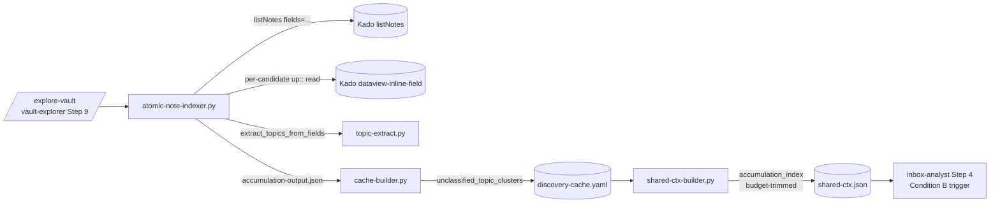

# Solution Design Document

> **Spec:** XDD 015 · **Backlog:** F-34 (Must) · **PRD:** [requirements.md](requirements.md)
> **Design lineage:** brainstorm 2026-06-04 (OQ1–7) + two Kado contract rounds.
> Authoritative decision table lives in [README.md](README.md); this SDD is the
> build specification.

## Validation Checklist

### CRITICAL GATES

- [x] All required sections complete
- [x] No [NEEDS CLARIFICATION] markers remain
- [x] Architecture pattern stated with rationale (cold-path pre-compute → cache → shared-ctx → subagent)
- [x] All architecture decisions confirmed (ADR-1…7, see §Architecture Decisions)
- [x] Every interface has a specification

### QUALITY CHECKS

- [x] Context sources listed with relevance
- [x] Project commands discovered from actual files
- [x] Constraints → Strategy → Design → Implementation path is logical
- [x] Every component maps to a directory
- [x] Error handling covers Kado failure, empty vault, budget overflow
- [x] Clustering algorithm includes a traced walkthrough with example data

---

## Constraints

- **CON-1 — Additive only on hot paths.** `/inbox` hot paths (inbox-analyst,
  instruction-render, suggestions-reducer, shared-ctx-builder) take additive
  changes only. A run with no accumulation index MUST be byte-identical to today
  (PRD A6, memory `feedback_near_mvp_no_breakage`). New cost lives entirely on the
  `/explore-vault` cold path.
- **CON-2 — Kado is the only vault gateway** (Constitution L1). All vault access
  via `kado-search` / `kado-read`; no direct filesystem reads.
- **CON-3 — Shared-ctx envelope ≤ 15 KB** (`shared-ctx-builder.py:enforce_budget`,
  `--max-bytes` default 15360). The accumulation index participates in trimming.
- **CON-4 — No new dependencies.** Reuse `kado_client`, `topic-extract.py`,
  `enforce_budget`. Python 3, stdlib only.
- **CON-5 — Kado contract is fixed and external.** `listNotes` and
  `dataview-inline-field` are Kado-owned; F-34 consumes them as-is. `listNotes`
  ships on Kado branch `feat/listnotes-search-op` (version TBD at release) — live
  validation waits on that release reaching the Tomo instance's Kado.
- **CON-6 — Branch discipline.** Lands on `feat/f-34-msp-condition-b-accumulation`.

## Implementation Context

### Code Context

```yaml
- file: tomo/scripts/lib/kado_client.py
  relevance: CRITICAL
  why: "_search_all() (cursor pagination) gains a fields param; new list_notes() method."
- file: tomo/scripts/topic-extract.py
  relevance: CRITICAL
  why: "Gains extract_topics_from_fields() — structured entry point (ADR-3)."
- file: tomo/scripts/shared-ctx-builder.py
  relevance: CRITICAL
  why: "build_placeholder_mocs() is the copy-template; enforce_budget() gains an accumulation trim pass (A4)."
- file: tomo/scripts/cache-builder.py
  relevance: HIGH
  why: "Lifts producer JSON onto the cache; gains --accumulation arg → cache.unclassified_topic_clusters."
- file: tomo/scripts/moc-tree-builder.py
  relevance: HIGH
  why: "up:: parsing precedent (UP_RE) and topic-extract reuse pattern; NOT extended (722 LOC, ADR-1)."
- file: tomo/dot_claude/agents/inbox-analyst.md
  relevance: CRITICAL
  why: "Step 4 placeholder-MOC block is mirrored for the Condition-B trigger; A7 precedence."
- file: tomo/dot_claude/agents/vault-explorer.md
  relevance: HIGH
  why: "Step 9 orchestration — atomic-note-indexer.py runs alongside moc-tree-builder.py."
- file: tomo/profiles/miyo.yaml
  relevance: MEDIUM
  why: "concepts.atomic_note.base_path; relationships.parent.marker (up::)."
```

### External Interfaces (Kado MCP — consumed, not defined here)

```yaml
- service: kado-search operation="listNotes"
  doc: Kado/docs/api-reference.md §listNotes
  relevance: CRITICAL
  request: { operation: "listNotes", path: <base>, fields: ["links","headings","tags"], limit: 500, cursor? }
  item: { path, name, created, modified, size,
          links:[{target,kind:"link"|"embed"}], headings:[{heading,level}], tags:[str] }
  why: "Bulk, body-free topic signals per atomic note (ADR-2)."

- service: kado-read operation="dataview-inline-field"
  doc: Kado/docs/api-reference.md §kado-read
  relevance: CRITICAL
  request: { operation: "dataview-inline-field", path: <note.md> }
  response: "JSON object of inline key:: value fields, e.g. { up: ['[[MOC]]'] }"
  why: "Per-candidate up:: presence test for A5 classification (ADR-5)."
```

### Implementation Boundaries

- **Must preserve:** byte-identical `/inbox` behaviour when no index present (A6);
  `shared-ctx.schema.json` backward compatibility; `topic-extract.py`'s existing
  `extract_topics(content)` path (other callers depend on it).
- **Can modify:** `kado_client` (additive method + param), `cache-builder` args,
  `shared-ctx-builder` (additive field + trim pass), `inbox-analyst` Step 4 (additive block),
  `vault-explorer` Step 9 (additive invocation), `shared-ctx.schema.json` (additive optional field).
- **Must not touch:** `moc-tree-builder.py` core (ADR-1); suggestions-reducer;
  instruction-render; any Kado source (external contract).

### Project Commands

```bash
Test:  python3 -m pytest tests/ -q
Lint:  ruff check tomo/scripts/ scripts/      # match existing repo config
Run scanner (cold path, manual):
  python3 scripts/atomic-note-indexer.py --config config/vault-config.yaml > tomo-tmp/accumulation-output.json
Cache build (extended):
  python3 scripts/cache-builder.py --structure tomo-tmp/scan-output.json \
    --mocs tomo-tmp/moc-output.json --accumulation tomo-tmp/accumulation-output.json \
    --output config/discovery-cache.yaml --start-time "$(date -u +%Y-%m-%dT%H:%M:%SZ)"
```

## Solution Strategy

- **Architecture pattern:** four-stage cold-path pipeline mirroring F-35
  (`placeholder_mocs`): **produce** (scanner → JSON) → **persist** (cache-builder →
  `discovery-cache.yaml`) → **surface** (shared-ctx-builder → `shared-ctx.json`,
  budget-trimmed) → **consume** (inbox-analyst Step 4, dict lookup per item).
- **Integration approach:** every touch point is additive and guarded by
  "field absent ⇒ today's behaviour". The only new script is `atomic-note-indexer.py`;
  everything else extends an existing seam already proven by `placeholder_mocs`.
- **Justification:** reusing the F-35 pipeline shape minimises risk on near-MVP hot
  paths (CON-1) and gives the implementer a working precedent at every layer.
- **Key decisions:** see ADR-1…7. The load-bearing ones: bulk `listNotes` for topics
  (ADR-2), per-candidate `dataview-inline-field` for `up::` (ADR-5), structured
  topic-extract entry point (ADR-3).

## Building Block View

### Components



### Directory Map

```
.
├── scripts/
│   └── atomic-note-indexer.py            # NEW: scanner (ADR-1). User-cold-path CLI invoked by /explore-vault.
├── tomo/scripts/
│   ├── lib/kado_client.py                # MODIFY: _search_all() gains `fields`; new list_notes()
│   ├── topic-extract.py                  # MODIFY: + extract_topics_from_fields() (ADR-3)
│   ├── cache-builder.py                  # MODIFY: + --accumulation arg; cache["unclassified_topic_clusters"]
│   └── shared-ctx-builder.py             # MODIFY: + build_accumulation_index(); enforce_budget() trim pass (A4)
├── tomo/dot_claude/agents/
│   ├── vault-explorer.md                 # MODIFY: Step 9 runs atomic-note-indexer.py (version bump)
│   └── inbox-analyst.md                  # MODIFY: Step 4 Condition-B block; A7 precedence (version bump)
├── tomo/schemas/
│   └── shared-ctx.schema.json            # MODIFY: + optional accumulation_index field
├── docs/tomo/scripts/
│   └── atomic-note-indexer.md            # NEW: WHY-persistence for the runtime script
└── tests/
    ├── test_atomic_note_indexer.py       # NEW: clustering, up:: filter, embed drop, empty vault
    ├── test_topic_extract_fields.py      # NEW: extract_topics_from_fields() parity + structure handling
    └── test_shared_ctx_accumulation.py   # NEW: surface + A4 budget trim
```

> **Note on `scripts/` vs `tomo/scripts/`** (memory `feedback_scripts_dir_boundary_user_invoked`):
> `atomic-note-indexer.py` is invoked by the `/explore-vault` agent at runtime, so it is
> **runtime pipeline code → `tomo/scripts/`**, not user-CLI `scripts/`. The Directory Map
> places it in `tomo/scripts/atomic-note-indexer.py`; commands above use the instance-relative
> `scripts/` path the agent sees inside the container. **Implementer: confirm against the
> sibling `moc-tree-builder.py` location — match it exactly.**

### Data Storage Changes

```yaml
# discovery-cache.yaml — ADDITIVE field (cache_version stays 1, ADR-7)
Field: unclassified_topic_clusters
  Type: { <topic: string>: [<stem: string>, ...] }
  Semantics: each key is a normalised topic; value lists the stems of UNCLASSIFIED
             atomic notes (no up::) sharing it; only clusters with ≥ min_cluster_size
             members are emitted. Empty dict {} when no clusters / empty vault.
  Written by: cache-builder.py from --accumulation JSON (mirrors placeholder_mocs lift)

# shared-ctx.json — ADDITIVE optional field
Field: accumulation_index
  Type: same shape as unclassified_topic_clusters (after A4 budget trim)
  Emitted only when non-empty (mirrors placeholder_mocs conditional add)

# vault-config.yaml — ADDITIVE optional config
Field: tomo.accumulation.min_cluster_size
  Type: integer, default 3 (ADR-6). Read via read-config-field.py with default fallback.
```

### Internal Interfaces (new/changed function signatures)

```python
# tomo/scripts/lib/kado_client.py
def list_notes(self, path: str, *, fields: list[str] | None = None,
               depth: int | None = None, limit: int = 500) -> list[dict]:
    """kado-search operation=listNotes. Items carry path/name/modified/size and,
    when fields requested, links[]/headings[]/tags[]. Cursor-paginated via _search_all."""
    return self._search_all("listNotes", path=path, depth=depth, limit=limit, fields=fields)

def read_inline_fields(self, path: str) -> dict:
    """kado-read operation=dataview-inline-field → {key: [values]} inline fields."""
    return self._call_read("dataview-inline-field", path)
# _search_all gains:  fields: list[str] | None = None  → args["fields"] = fields when set.

# tomo/scripts/topic-extract.py  (ADR-3, ADR-4)
def extract_topics_from_fields(*, title: str | None,
                               headings: list[dict],   # [{heading, level}]
                               links: list[dict],      # [{target, kind}] — filter kind=="link"
                               tags: list[str]) -> dict:
    """Structured sibling of extract_topics(content). Maps:
       title/H1 → method 1; level==2 headings → method 2;
       link.target (kind=='link' only) → method 3 (alias/path/anchor-stripped);
       '#'-stripped tags → method 4. Returns the same {topics, source_methods} shape."""

# tomo/scripts/shared-ctx-builder.py  (mirrors build_placeholder_mocs)
def build_accumulation_index(cache: dict) -> dict:
    """Pass through cache.unclassified_topic_clusters, drift-guarded. Returns {} if absent/invalid."""
```

## Runtime View

### Primary Flow — index build (`/explore-vault` Step 9)

1. `atomic-note-indexer.py` reads `concepts.atomic_note.base_path` and
   `tomo.accumulation.min_cluster_size` (default 3) from vault-config.
2. `kado_client.list_notes(base_path, fields=["links","headings","tags"])` →
   all atomic notes (cursor-paginated), each with structured signals.
3. For each note → `extract_topics_from_fields(...)` → topic list. Build
   `topic → [stems]` over ALL notes.
4. **Candidate gate:** keep only topics whose group size ≥ `min_cluster_size`.
5. **Classification (A5, ADR-5):** for each note in a candidate group only,
   `read_inline_fields(path)` → presence of `up`. Drop classified notes.
6. Re-test size: keep topics whose *unclassified* member count ≥ `min_cluster_size`.
7. Emit `{topic: [unclassified stems]}` JSON → cache-builder → `cache.unclassified_topic_clusters`.

```mermaid
sequenceDiagram
    participant ANI as atomic-note-indexer
    participant K as Kado
    participant TE as topic-extract
    ANI->>K: listNotes(base, fields=[links,headings,tags])
    K-->>ANI: notes[] (structured, body-free)
    loop each note
        ANI->>TE: extract_topics_from_fields(...)
        TE-->>ANI: topics[]
    end
    ANI->>ANI: group topic→stems; keep groups ≥ min_cluster_size
    loop each candidate-group member
        ANI->>K: read dataview-inline-field(path)
        K-->>ANI: {up?: [...]}
    end
    ANI->>ANI: drop classified; keep groups still ≥ min_cluster_size
    ANI-->>ANI: emit {topic:[stems]}
```

### Secondary Flow — consume (`/inbox` Step 4, inbox-analyst)

Mirrors the placeholder-MOC block, AFTER MOC scoring, BEFORE finalising `needs_new_moc`:

- When `shared_ctx.accumulation_index` is present, for each item topic, compare
  (case-insensitive, whitespace-normalised) against index keys.
- On match: `needs_new_moc: true`, `proposed_moc_topic = <index_key>`; keep scored
  `candidate_mocs[]`.
- **A7 precedence:** placeholder (Condition C) match wins over accumulation
  (Condition B) — the Condition-B block runs only if no placeholder set
  `proposed_moc_topic`. Absent/empty index ⇒ skip silently (A6).

### Error Handling

- **Kado unreachable / listNotes error:** scanner logs to stderr and emits `{}`
  (empty index). `/explore-vault` continues; `/inbox` sees no field → today's behaviour.
- **`dataview-inline-field` error on a candidate:** treat that note as *classified*
  (conservative — avoids proposing a MOC on uncertain data); log the path.
- **Empty / new vault (A6):** zero notes or zero clusters → `{}` → field omitted from
  shared-ctx → byte-identical `/inbox`.
- **Budget overflow (A4):** `enforce_budget` drops clusters tail-first (smallest, then
  alphabetical) until ≤ max-bytes; stderr logs
  `accumulation_clusters_total=N accumulation_clusters_kept=K`.

### Complex Logic — clustering with traced walkthrough

```
ALGORITHM: build_accumulation_clusters
INPUT:  notes[] (from listNotes), min_cluster_size M (default 3)
OUTPUT: { topic: [unclassified stems] } for groups with ≥ M unclassified members

1. groups = {}                       # topic -> set(stem)
2. FOR note IN notes:
     topics = extract_topics_from_fields(note)   # kind=='link' only, '#'-stripped tags
     FOR t IN topics: groups[t].add(stem(note.path))
3. candidates = { t: stems FOR t,stems IN groups IF len(stems) >= M }
4. unclassified = {}                 # cache of stem -> bool (avoid duplicate reads)
   FOR t, stems IN candidates:
     FOR stem IN stems:
       IF stem NOT IN unclassified:
         fields = kado.read_inline_fields(path_of(stem))
         unclassified[stem] = ("up" NOT IN fields)
5. result = {}
   FOR t, stems IN candidates:
     keep = [s FOR s IN stems IF unclassified[s]]
     IF len(keep) >= M: result[t] = sorted(keep)
6. RETURN result
```

**Traced walkthrough** — vault with 4 notes, M=3:

| stem | topics (from fields) | up:: present? |
|---|---|---|
| `monte-carlo-tree-search` | `["mcts","search","games"]` | no |
| `alpha-beta-pruning` | `["search","games"]` | no |
| `board-game-night` | `["games","social"]` | yes (`up:: [[Hobbies MOC]]`) |
| `minimax` | `["search","games"]` | no |

- Step 2 groups: `search`→{mcts-note, ab, minimax} (3), `games`→{mcts, ab, board, minimax} (4), `mcts`→{1}, `social`→{1}.
- Step 3 candidates (≥3): `search` (3), `games` (4).
- Step 4 up:: reads (4 candidate members only): board-game-night → classified; others → unclassified.
- Step 5: `search` keep = {mcts, ab, minimax} = 3 ≥ 3 ✓ → emit. `games` keep = {mcts, ab, minimax} = 3 (board dropped, classified) ≥ 3 ✓ → emit.
- Result: `{"search": ["alpha-beta-pruning","minimax","monte-carlo-tree-search"], "games": [...]}`.
- At `/inbox`, an item about "search algorithms" matches key `search` → propose a "search" MOC.

**Edge case:** if `board-game-night` were the 3rd `social` member with two other
unclassified social notes, `social` would still fail Step 3 (group size 1) — the
candidate gate is computed on raw group size, so a topic never reaching M raw members
is never read for `up::`. This is what bounds the reads.

## Deployment View

- **Environment:** runs inside the Tomo Docker container; reaches the vault only via
  Kado MCP (`127.0.0.1:23026`).
- **Configuration:** `tomo.accumulation.min_cluster_size` (optional, default 3).
- **Dependencies:** Kado with `listNotes` (branch `feat/listnotes-search-op`; live
  validation gated on release reaching the instance — CON-5). `dataview-inline-field`
  already shipped.
- **Performance:** index build is cold-path (`/explore-vault`). One bulk `listNotes`
  (paginated, limit 500) + per-candidate `up::` reads (bounded to candidate-group
  members, not the ~281-note vault). `/inbox` Pass-1 cost unchanged (A6, success signal §7).
- **Rollout:** additive; no migration. Old caches without the field degrade to
  today's behaviour. No version bump on `cache_version` (ADR-7).

## Architecture Decisions

All confirmed during the 2026-06-04 brainstorm + Kado rounds (see README decision table).

- [x] **ADR-1 — Scanner lives in a new `atomic-note-indexer.py`**, not an extension of
  `moc-tree-builder.py`. Rationale: moc-tree-builder is 722 LOC (near Constitution L2
  ~300–500 cap); separation of concerns. Trade-off: extra `/explore-vault` invocation
  wiring. _Confirmed._
- [x] **ADR-2 — Topic signals via `kado-search listNotes`** (`fields=["links","headings","tags"]`),
  not per-note body reads. Rationale: one bulk, body-free, metadata-cache call. Trade-off:
  depends on Kado release. _Confirmed (Kado-shipped)._
- [x] **ADR-3 — `topic-extract.py` gains `extract_topics_from_fields()`** structured entry
  point. Rationale: consume Kado's structure directly; no lossy markdown round-trip.
  Trade-off: a second code path in topic-extract (retain `extract_topics` for other callers).
  _Confirmed._
- [x] **ADR-4 — Links projection filtered to `kind=='link'`**, embeds dropped. Rationale:
  embeds are image/excalidraw/PDF assets → filename noise. Trade-off: misses topical
  `![[note]]` embeds (rare). _Confirmed._
- [x] **ADR-5 — `up::` classification via per-candidate `kado-read dataview-inline-field`**.
  Rationale: Kado declined a bulk inline-field projection (Dataview construct outside core
  cache); reads bounded to candidate-group members. Trade-off: N small reads where N = size
  of candidate groups. _Confirmed (Kado-decided)._
- [x] **ADR-6 — `min_cluster_size` configurable, default 3**
  (`vault-config.tomo.accumulation.min_cluster_size`). Rationale: quieter than spec literal
  of 2; tunable per vault. Trade-off: config plumbing. _Confirmed._
- [x] **ADR-7 — Additive at `cache_version: 1`**, missing field = empty dict. Rationale:
  F-35 precedent (`placeholder_mocs` added without bump). Trade-off: no drift guard on the
  new field beyond the build_* validator. _Confirmed._

## Quality Requirements

- **Performance:** zero `/inbox` Pass-1 cost regression vs F-32 baseline (A6, §7).
  Cold-path build dominated by one paginated `listNotes` + bounded `up::` reads.
- **Reliability:** any Kado/scan failure degrades to an empty index (no `/inbox` impact),
  never a partial/corrupt cluster (Vault-is-SoT, memory `feedback_vault_sot_design_for_corruption`).
- **Security:** all access via Kado under `note.read` scope (CON-2). No content stored —
  index holds topics + stems only (Constitution L2 audit: metadata only).
- **Maintainability:** every new file < 300 LOC; mirrors `placeholder_mocs` shape.

## Acceptance Criteria (EARS — traces PRD A1–A9)

- [ ] **A1** WHEN `/explore-vault` runs against a vault with a cluster, THE SYSTEM SHALL
  write `discovery-cache.yaml.unclassified_topic_clusters` as `{topic: [stems]}` with all
  clusters ≥ `min_cluster_size`; empty dict when none.
- [ ] **A2** WHEN the cache holds a non-empty index, THE SYSTEM SHALL emit a top-level
  `accumulation_index` in `shared-ctx.json` (after A4 trim); WHERE absent/empty, THE SYSTEM
  SHALL omit the field.
- [ ] **A3** WHEN an item topic matches an `accumulation_index` key (case-insensitive,
  normalised), inbox-analyst Step 4 SHALL set `needs_new_moc: true`,
  `proposed_moc_topic = <key>`, preserving `candidate_mocs[]`.
- [ ] **A4** IF the serialised shared-ctx exceeds `--max-bytes`, THEN THE SYSTEM SHALL drop
  clusters tail-first (smallest, then alphabetical) until it fits, logging
  `accumulation_clusters_total=N accumulation_clusters_kept=K`.
- [ ] **A5** THE SYSTEM SHALL count a note "unclassified" IFF `kado-read dataview-inline-field`
  returns no `up` key; honour `relationships.parent.marker` config, default `up::`.
- [ ] **A6** WHILE the vault has zero atomic notes / zero clusters, THE SYSTEM SHALL produce
  an empty index, omit the shared-ctx field, and keep `/inbox` byte-identical to pre-F-34.
- [ ] **A7** IF both Condition B and Condition C fire on one item, THEN THE SYSTEM SHALL
  prefer C (placeholder name).
- [ ] **A8** THE SYSTEM SHALL have unit tests for cluster discovery, `up::` filter, embed
  drop (ADR-4), A4 trim, and Step-4 hit/miss via a shared-ctx fixture.
- [ ] **A9** THE SYSTEM SHALL update the Tier-3 New MOC Proposal spec (Condition B → shipped)
  and bump `inbox-analyst` + `vault-explorer` versions.

## Risks and Technical Debt

- **Risk — Kado release timing (CON-5).** `listNotes` is unmerged; live validation against
  Marcus's vault waits on release reaching the instance. *Mitigation:* build + unit-test
  against fixtures now; gate the live-validation task in PLAN on the Kado release.
- **Risk — `up::` inside callouts.** `moc-tree-builder`'s `UP_RE` is body-regex; F-34 instead
  uses Kado's `dataview-inline-field`, which parses Dataview inline fields (incl. in
  callouts) authoritatively. *Implementer:* verify `> up:: [[X]]` (callout-embedded) is
  returned by `dataview-inline-field` against a real fixture before locking A5.
- **Tech debt — two topic-extract paths.** `extract_topics` (content) and
  `extract_topics_from_fields` must stay behaviourally aligned; a shared
  normalise/dedup/rank core should back both (refactor, not duplicate).
- **Gotcha — link target shapes.** `link.target` is the raw written string —
  may carry `path/prefix`, `|alias`, `#heading`, `^block`. `extract_topics_from_fields`
  must strip these exactly as `extract_from_links` does today.

## Post-Live-Validation Refinements (2026-06-05)

Live validation against the real ~281-note vault (Kado `listNotes` available) surfaced
two defect classes that fixture-based testing could not. Both fixed on
`feat/f-34-msp-condition-b-accumulation`; the original design intent is preserved, the
topic-source policy is corrected.

**R1 — Topic-extraction quality (revises SDD-D1, the level-2-headings decision).**
First live scan: 166 "clusters" / 281 notes, dominated by structural noise. Measured
attribution drove four changes in `topic-extract.py` (v0.4.0):
- **Drop Method 2 (level-2 headings).** Measurement: 168/216 distinct level-2 headings
  occur in exactly one note (genuine but can never reach `min_cluster_size`); every heading
  frequent enough to cluster is a template section (`Definition`, `Resources`, `Code`, …).
  Headings only ever inject template noise into accumulation clusters. SDD-D1 said level-2
  headings → subtopics; live data refutes that for clustering — **superseded.** H1/title
  (Method 1) is retained.
- **Tags restricted to a configurable `topic/` prefix array.** The vault taxonomy is
  `type/` (note types) · `stage/` · `topic/` (themes). All-tags extraction made the
  `note/*` type leaves (`code`, `content`, `plugin`, `knowledge`) into giant false clusters.
  Method 4 now keeps only tags under a configured prefix and emits the leaf. Config:
  `vault-config.tomo.accumulation.topic_tag_prefixes`, default `["topic/"]` (array — other
  vaults differ).
- **No title single-word split.** Multi-word title segments stay whole ("Personal Need" no
  longer explodes into `personal`/`need`).
- **Date-shaped link targets filtered.** Daily-note links (`[[2022-09-06]]`) produced ~90
  date "topics" via Method 3; targets matching `^\d{4}-\d{2}-\d{2}$` are dropped.

Result: **166 → ~118 reliable, thematic clusters** (LYT/PKM concepts, value/need
categories, Japan), zero heading/bracket/date noise.

**R2 — Kado rate-limiting on per-candidate `up::` reads.** The ADR-5 per-candidate
`dataview-inline-field` burst tripped Kado's HTTP 429 limiter; each 429 was raised
immediately and the conservative treat-as-classified path dropped those notes (44 in one
run) — silently unreliable membership. Fixed in the shared HTTP layer
(`kado_client.py` v0.7.0): `_call_tool` retries 429/503 with exponential backoff,
honoring `Retry-After`, capped, surfacing `KadoError` only after exhaustion. Result:
**44 → 0** dropped reads. The treat-as-classified fallback remains correct once retries
are exhausted.

**Still open for T5.2 sign-off:** in-container `/inbox` Proposed-MOC surfacing check +
Pass-1 cost-vs-F-32 baseline; confirm the §Risks callout-embedded `up::` question against a
real fixture; optional residue polish (`@` fragments, structural `i_*` tokens).

## Glossary

| Term | Definition |
|---|---|
| Accumulation cluster | ≥ `min_cluster_size` unclassified atomic notes sharing a normalised topic. |
| Unclassified | An atomic note with no `up::` parent marker (not filed under any MOC). |
| Candidate group | A topic group whose *raw* size ≥ `min_cluster_size` — the only notes read for `up::`. |
| `listNotes` | Kado bulk, body-free search op returning per-note structured metadata. |
| `accumulation_index` | The shared-ctx surface of `unclassified_topic_clusters`. |
| Condition B / C | MSP triggers: B = vault-side accumulation (this spec); C = placeholder MOC (F-35). |
