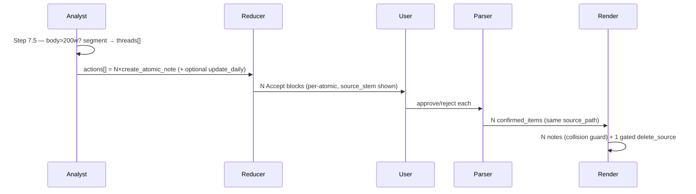

# Solution Design Document — XDD 016 (F-41)

> PRD: [requirements.md](requirements.md) (completed; OQ1–OQ8 resolved 2026-06-10).
> Branch: `feat/f-41-multi-topic-atomic-notes`.
> Grounded in a 4-file codebase survey (2026-06-10) — every touch point below
> carries a verified `file:line` anchor.

## Validation Checklist

### CRITICAL GATES
- [x] All required sections complete
- [x] No [NEEDS CLARIFICATION] markers remain
- [x] Architecture pattern stated with rationale
- [x] **All ADRs confirmed by user**
- [x] Every interface (agent output + 3 script contracts) specified

### QUALITY CHECKS
- [x] Single-thread regression proven (N=1 byte-identical to today)
- [x] Every PRD AC (A1–A11) traced to a design element
- [x] Cost gate (>200 words) specified and measurable
- [x] All six silent-collapse points have a fix mapped

> **Validation 2026-06-10 — PASS.** Empirically confirmed both `item-result.schema.json`
> and `instructions.schema.json` accept N≥2 `create_atomic_note` per item (`maxItems` absent,
> `minItems:1`) — ADR-5/OQ8 proven, not asserted. PRD A1–A11 each trace to a design element;
> C1–C6 each map to a fix; 8 ADRs confirmed. Deferred to PLAN: enumerate A10's 8 test cases
> as tasks; A1 per-thread `summary`/`dominant_classification` field mapping made explicit in render.

---

## Constraints

- **CON-1 — bash/Python runtime.** Scripts run under the instance `./venv` Python; agent is LLM-driven markdown. No new dependencies (Constitution L1 Dependencies).
- **CON-2 — additive on hot paths.** `suggestions-reducer.py`, `suggestion-parser.py`, `instruction-render.py` take cardinality changes (N=1 → N≥1) but NO semantic change for single-thread items (PRD C5). Single-thread regression test is a gate.
- **CON-3 — cost budget +10%.** Pass-1 main-thread cost grows ≤10% vs the F-32 baseline (PRD C2). Segmentation is gated behind a length pre-check (OQ7).
- **CON-4 — no new pipeline phase / artefact type.** The feature lives inside Steps 7+8 of the analyst plus N=1→N≥1 cardinality downstream (PRD C1). No new JSON artefact, no new script (OQ1 → agent-side).
- **CON-5 — voice-audio cleanup unchanged in spirit.** XDD 009 pairing rules survive: audio preserved until ALL derived atomics + the daily entry are committed (PRD C4, OQ6).
- **CON-6 — branch + commit discipline.** Lands on `feat/f-41-multi-topic-atomic-notes`; no direct commits to main; per-task commits.

## Implementation Context

### Implementation Boundaries

- **Must Preserve:**
  - Single-thread emission is byte-identical to today (one item → one `create_atomic_note`).
  - The `actions[]` polymorphic array contract (`item-result.schema.json`) and `instructions.schema.json` action array (already N≥1-capable — no cardinality constraint, `instructions.schema.json:33-48`).
  - The Step 9 coexistence table (atomic + `update_daily` rules, `inbox-analyst.md:474-482`).
- **Can Modify:**
  - `inbox-analyst.md` Steps 7→8 region (insert Step 7.5 between `:194-195`).
  - The six N=1 collapse points (table below).
  - `item-result.schema.json` (add `source_stem` to the atomic action; verify multi-atomic allowance).
- **Must Not Touch:**
  - `instructions.schema.json` cardinality (already correct — OQ8 confirmed).
  - Condition A/B/C MOC logic, `/moc-propose`, FAN trigger semantics beyond the N≥1 resolve-doc fix.

### Code Context

```yaml
- file: tomo/dot_claude/agents/inbox-analyst.md      # v0.15.0
  relevance: CRITICAL
  why: "Step 7 worthiness (:167-193); Step 8/9 emission (:456-495); Step 7.5 insertion (:194-195); voice marker `transcribed:` (:180), `recorded:` (:233)"
- file: tomo/schemas/item-result.schema.json
  relevance: CRITICAL
  why: "Analyst output contract; create_atomic_note action (:50-104); actions[] already a list; no source_stem field today"
- file: tomo/scripts/suggestions-reducer.py           # 1157 LOC, v1.7.1
  relevance: CRITICAL
  why: "render_create_atomic_note (:172-240); N=1 traps at :144 (next()), :1047-1050 (section_titles overwrite)"
- file: tomo/scripts/suggestion-parser.py
  relevance: CRITICAL
  why: "N=1 traps at :1171 (sections_by_stem overwrite), :1274 (resolve_sections_by_stem overwrite); action field unused (:177)"
- file: tomo/scripts/instruction-render.py
  relevance: CRITICAL
  why: "atomic render loop (:1650-1772); filename = slugify(title) (:1738); paired-delete dedup (:933-952) — OQ6 violation point"
- file: tomo/schemas/instructions.schema.json
  relevance: HIGH
  why: "actions[] array (:33-48) — ALREADY N≥1-capable, no change needed"
```

### The six silent-collapse points (survey result)

| # | Location | Current (N=1) | Fix direction |
|---|----------|---------------|---------------|
| C1 | `suggestions-reducer.py:144` | `next(a for a in actions if kind==create_atomic_note)` — only first | Iterate ALL atomics in coexistence enforcement |
| C2 | `suggestions-reducer.py:1047-1050` | `section_titles[section_id] = title` — overwrite | Key per-atomic (list or `section_id+idx`) |
| C3 | `suggestion-parser.py` `parse_section` + `:1171` | `split_into_sections` yields ONE section per `### SNN` heading; `parse_section` collapses N atomic blocks under that heading into ONE item (last-block-wins); `sections_by_stem[stem] = item` then overwrites | **Intra-section split:** `parse_section` (or a pre-split) must yield N items when a section carries N atomic blocks (split on `**Source:**` / `**Suggested name:**` boundaries), each sharing `source_path`; THEN `sections_by_stem` → `dict[str, list[dict]]`; append. *(Plan-time correction 2026-06-11: the render emits N blocks under one heading per OQ5, so the dict→list edit alone is insufficient.)* |
| C4 | `suggestion-parser.py:1274` | `resolve_sections_by_stem[stem] = item` — overwrite (FAN) | `dict[str, list[dict]]`; append |
| C5 | `instruction-render.py:1738` | `filename = date_prefix + slugify(title)` — collision on equal titles | Per-source collision guard → suffix `_NN` |
| C6 | `instruction-render.py:933-952` | `paired_seen` dedup → delete after FIRST move_note | Gate delete on ALL move_notes-for-origin + daily committed |

### Project Commands

```bash
Test:  ./venv/bin/python -m pytest                       # full suite (uses venv — system py lacks jsonschema)
Lint:  ./venv/bin/ruff check tomo/scripts/
Sync:  ./scripts/update-tomo.sh                          # push runtime changes into the instance
Live:  KADO_URL=… ./venv/bin/python tomo/scripts/…       # host-vs-Kado validation (see auto-memory)
```

## Solution Strategy

- **Architecture Pattern:** *LLM-judgment-at-the-edge, deterministic-cardinality-downstream.* The only NEW logic is an LLM segmentation pass in the agent (OQ1 → agent-side, no script). Everything downstream is a mechanical N=1 → N≥1 cardinality widening of existing code — no new behaviour, no new artefact.
- **Wire format decision (key):** The PRD's `threads[]` is a *conceptual* model. On the wire, a multi-thread item emits **N separate `create_atomic_note` actions in the existing `actions[]` array** — NOT a new `threads[]` wrapper object. Rationale: `actions[]` is already polymorphic and multi-capable (`item-result.schema.json`), every downstream consumer already loops it, and this keeps the blast radius to cardinality (not shape). Each atomic is self-contained (its own title/MOC/tags/topic/`source_stem`). This is ADR-2.
- **Integration Approach:** Insert `Step 7.5 — Topical segmentation` between worthiness (Step 7, `:194`) and emission (Step 8, `:195`). For long items, the analyst lists distinct concepts, scores each against its own content, and Step 9 emits one atomic per worthy thread. Short items (≤200 words) skip segmentation entirely → exactly one default thread → today's behaviour.
- **Justification:** Minimises hot-path risk (CON-2), keeps cost bounded (CON-3 via the length gate), and reuses the already-correct `instructions.schema.json` (OQ8).
- **Provenance:** Add an explicit `source_stem` to each atomic action so downstream can group the N atomics back to one source (today provenance is implicit via the note path — insufficient when N>1). This is ADR-4.

## Building Block View

### Components

```mermaid
graph LR
    A[inbox-analyst.md<br/>Step 7.5 segmentation] -->|N create_atomic_note<br/>in actions[]| R[item-result.json]
    R --> RED[suggestions-reducer.py<br/>N Accept blocks]
    RED -->|suggestions doc| U[User approves per-atomic]
    U --> P[suggestion-parser.py<br/>N entries / stem]
    P -->|parsed-suggestions.json| IR[instruction-render.py<br/>N notes + gated delete]
    IR --> INS[instructions.json]
```

### Directory Map

```
tomo/
├── dot_claude/agents/
│   └── inbox-analyst.md              # MODIFY: insert Step 7.5 (:194-195); >200w gate; per-thread scoring; emit source_stem
├── schemas/
│   ├── item-result.schema.json       # MODIFY: add source_stem to create_atomic_note; note N≥1 atomics allowed
│   └── instructions.schema.json      # NO CHANGE (already N≥1-capable :33-48)
└── scripts/
    ├── suggestions-reducer.py        # MODIFY: C1 (:144), C2 (:1047-1050) — render N blocks, per-atomic titles
    ├── suggestion-parser.py          # MODIFY: C3 (:1171), C4 (:1274) — dict→dict[list]; iterate all
    └── instruction-render.py         # MODIFY: C5 (:1738) collision guard; C6 (:933-952) gated paired-delete
docs/tomo/                            # MODIFY: WHY-mirrors for each runtime file touched
docs/XDD/reference/tier-3/inbox/
    └── inbox-analysis.md             # MODIFY: A11 — multi-topic section
tests/                                # NEW: multi-topic happy path + 8 edge cases (A10)
```

### Interface Specifications

#### Analyst output (`item-result.schema.json`) — additive change

```yaml
create_atomic_note:                  # one PER worthy thread (N≥1 in actions[])
  + source_stem: string              # NEW (ADR-4) — the inbox item's stem; groups N atomics to one source
    suggested_title: string          # per-thread (distinct per atomic)
    candidate_mocs: [...]            # per-thread MOC match
    tags_to_add: [...]               # per-thread
    proposed_moc_topic: string|null  # per-thread
    atomic_note_worthiness: number   # per-thread score (scored against the THREAD, not the whole item)
  # No new `threads[]` object — the array of create_atomic_note actions IS the thread list (ADR-2)
```

#### Reducer contract change

- C1 `_enforce_coexistence` (`:144`): replace `next(...)` single-fetch with iteration over all `create_atomic_note` actions; coexistence (atomic-vs-`log_entry`) evaluated per-atomic.
- C2 section titles (`:1047-1050`): key by `(section_id, atomic_index)` (or store `list[str]`) so N titles survive into `_enrich_proposed_mocs`.
- Render: N independent Accept blocks, each with its own flat-numbered `### S0k — title` heading, each showing `**Source:** [[stem]]` and its own `**Decision (atomic note):**` checkboxes (OQ5 → per-item blocks; **OQ5 reversed 2026-06-11 — see below**).

#### Parser contract change

- **C3 intra-section split (prerequisite):** ~~the renderer emits N atomic blocks under ONE `### SNN` heading (OQ5)~~ **[OQ5 reversed 2026-06-11 — each atomic now has its own `### SNN` heading]**. `split_into_sections` splits on `### SNN`; with per-atomic headers the split alone yields N sections (one per atomic), so `parse_section` returns one dict per section. The intra-section split on repeated `**Source:**` / `**Suggested name:**` markers remains as a safety fallback for docs rendered under the old scheme. Single-block sections (the common case) yield exactly one item, byte-identical to today (CON-2).
- C3/C4: `sections_by_stem` and `resolve_sections_by_stem` become `dict[str, list[dict]]`; assignment → append; Force-Atomic reconciliation (`:1297-1342`) iterates the list, not `.get(stem)` scalar.
- `confirmed_items[]` may now contain multiple entries sharing one `source_path` — downstream (render) keys per-entry, not per-stem.

#### Render contract change

- C5 filename collision guard (`:1738`): when N rendered notes from one `source_stem` slugify to the same `filename`, append a stable disambiguator (`_01`, `_02` in action order). Different titles already produce different filenames (no-op for the common case).
- C6 paired-delete (`:933-952`): replace the `paired_seen`-after-first dedup with a **completion gate**: emit one `delete_source` for an origin only after ALL move_notes derived from that origin are present AND any `update_daily` for that stem is accepted (OQ6). Implementation: count move_notes per origin-stem; emit the single delete keyed to the origin, reasoned "Origin fully consumed by N atomics + daily."

### Data Storage Changes

No database. Schema (JSON) changes only:
- `item-result.schema.json`: `create_atomic_note.source_stem` (additive, optional→required in SDD-confirmed phase); confirm `actions[]` permits ≥2 `create_atomic_note` (it does — `oneOf` over a `minItems:1` array, no max).
- `instructions.schema.json`: **no change** (verified `:33-48`).

## Runtime View

### Primary Flow — multi-thread item

1. Analyst reaches Step 7 (worthiness) for an item.
2. **Step 7.5 gate:** if body ≤ 200 words → `threads = [single_default_thread]`, skip to Step 8 (today's path).
3. **Step 7.5 segmentation (>200 words):** LLM lists distinct concepts (2–3 worked examples in agent body, OQ2); each thread scored against ITS content (OQ3 → topics per-thread).
4. **Step 9 emission:** for each thread with `worthiness ≥ 0.5` (or `force_atomic`), emit a `create_atomic_note` with thread-scoped title/MOC/tags + shared `source_stem`. Sub-worthy threads contribute to a single `update_daily` summarising the daily-log thread ONLY (OQ4).
5. Reducer renders N Accept blocks (one per atomic) under the source section.
6. User approves/rejects each independently.
7. Parser emits N `confirmed_items` entries for that stem.
8. Render produces N notes (collision-guarded filenames) + a single gated `delete_source` for the origin (after all N committed + daily, OQ6).



### Error Handling

- **Over-segmentation** (3 threads where 2 fit): no auto-merge (PRD N4/§6); user declines the redundant proposal.
- **Segmentation prompt failure / ambiguous:** fall back to `threads = [single_default_thread]` (degrade to today's single-atomic behaviour — never lose the item).
- **Filename collision after guard exhausted:** error loudly in render (do not silent-overwrite — the current silent overwrite at `:1741` is the bug C5 fixes).
- **Partial approval** (thread 1 approved, thread 2 rejected): delete_source gate counts only APPROVED+committed atomics; if a thread is rejected, the origin is still consumed once the remaining approved atomics + daily land (rejected thread does not block deletion, but an un-actioned thread does — preserve source until every *approved* thread is captured).

### Complex Logic — paired-delete completion gate (C6)

```
ALGORITHM: emit_delete_source_for_origin (replaces paired_seen-after-first)
INPUT: move_notes[], daily_updates[], confirmed_by_stem
OUTPUT: at most one delete_source per origin-stem

1. GROUP move_notes by origin_stem → moves_by_origin
2. FOR each origin_stem, moves in moves_by_origin:
   a. IF confirmed_by_stem[origin_stem].keep_origin → SKIP (user opted to keep)
   b. expected = count of approved atomics for origin_stem (from confirmed_items)
   c. daily_pending = any accepted update_daily for origin_stem not yet represented
   d. IF len(moves) == expected AND not daily_pending:
        EMIT one delete_source(source_path=origin, reason="consumed by N atomics + daily")
   e. ELSE: defer (do not emit — source preserved until all threads captured)  # OQ6
```

## Cross-Cutting Concepts

- **Provenance (G3):** every atomic carries `source_stem`; voice transcripts additionally embed the audio reference per XDD 009 §F3 (render side, unchanged mechanism).
- **Cost (CON-3):** the >200-word pre-check (OQ7) keeps short items free of the ~500–1000-token segmentation prompt. Validation: 20-item mixed batch tracked vs F-32 baseline, ≤10%.
- **Single-thread invariance (CON-2):** the default-thread path must produce byte-identical output to today — a dedicated regression test (A10 case 1).
- **Logging:** segmentation decision (thread count, gate hit/skip) emitted to the existing analyst telemetry; no note content logged (Constitution L2).

## Architecture Decisions

- [x] **ADR-1 — Segmentation lives agent-side (OQ1).** New `Step 7.5` in `inbox-analyst.md` (LLM-driven), no `topic-segment.py`.
  - Rationale: "are two threads conceptually distinct" is judgment-heavy; LLM > deterministic script; no new artefact (CON-4).
  - Trade-offs: harder to unit-test deterministically (mitigated by output-contract tests + the live Apothekerpfädchen fixture).
  - User confirmed: ✅ 2026-06-10

- [x] **ADR-2 — Wire format = N `create_atomic_note` in `actions[]`, no `threads[]` wrapper.**
  - Rationale: `actions[]` is already polymorphic + multi-capable; every consumer loops it; keeps the change to cardinality, not shape; reuses `instructions.schema.json` unchanged.
  - Trade-offs: the per-thread grouping is implicit (via `source_stem`) rather than a nested object; downstream must group by `source_stem` not assume one-per-stem.
  - User confirmed: ✅ 2026-06-10

- [x] **ADR-3 — >200-word length pre-check gate (OQ7).** Segmentation runs only when body > 200 words; else single default thread.
  - Rationale: protects the +10% cost budget; short items carry no multi-thread signal (PRD N1).
  - Trade-offs: a rare >2-concept short note is not split (acceptable; FAN/Garden-Audit cover edge recovery).
  - User confirmed: ✅ 2026-06-10

- [x] **ADR-4 — Add explicit `source_stem` to `create_atomic_note`.**
  - Rationale: provenance is implicit today (note path); with N>1 per source, downstream needs an explicit grouping key (G3, render C5/C6, parser C3).
  - Trade-offs: additive schema field; single-thread items carry it harmlessly.
  - User confirmed: ✅ 2026-06-10

- [x] **ADR-5 — No `instructions.schema.json` change; minimal `item-result.schema.json` change (OQ8).**
  - Rationale: survey confirmed `instructions.schema.json:33-48` already permits N≥1 actions/source; only the analyst-output schema needs `source_stem`.
  - Trade-offs: none material.
  - User confirmed: ✅ 2026-06-10

- [x] **ADR-6 — Source-deletion completion gate (OQ6).** Replace `paired_seen`-after-first (`render:933-952`) with a per-origin completion gate: delete only after ALL derived atomics + any daily are committed.
  - Rationale: current code deletes after the FIRST move_note → data loss for threads 2..N (the exact bug PRD C4/OQ6 guards against).
  - Trade-offs: render must count expected atomics per origin (available from `confirmed_items`).
  - User confirmed: ✅ 2026-06-10

- [x] **ADR-7 — Filename collision guard in render (C5).** When N atomics from one source slugify to the same filename, append stable `_NN` suffix in action order; error (never silent-overwrite) if still colliding.
  - Rationale: distinct titles already differ; the guard covers the equal-title edge and removes the silent-overwrite at `:1741`.
  - Trade-offs: filename gains a numeric suffix in the rare collision case.
  - User confirmed: ✅ 2026-06-10

- [x] **ADR-8 — Parser stem maps become `dict[str, list[dict]]` (C3/C4).** Both `sections_by_stem` and `resolve_sections_by_stem`; Force-Atomic reconciliation iterates the list.
  - Rationale: the scalar dicts silently drop N-1 atomics per stem (primary + FAN resolve doc).
  - Trade-offs: reconciliation loop touches a list; single-thread is a length-1 list (no behaviour change).
  - User confirmed: ✅ 2026-06-10

- [x] **OQ5 Reversal — Per-atomic flat-numbered headers (2026-06-11).** The original OQ5 decision ("single heading per source acceptable; blocks carry their own `source_stem`") was reversed after live validation revealed that the second atomic in a multi-source block had no header and was not recognisable as a distinct proposal during review. **New behaviour:** each atomic gets its own flat-numbered `### S0k — title` header (S01, S02, S03 … globally across the whole document). `suggestion_id` is assigned per-atomic in the reducer and the renderer emits one heading per atomic action. The parser needed no change because the per-atomic headers make each block a separate `### SNN` section, which `split_into_sections` already handles; the intra-section split fallback (repeated `**Source:**` markers) remains for backward-compat.
  - Rationale: a headerless second atomic was invisible as a distinct proposal; a renderer-only hotpatch was considered but rejected because `suggestion_id` is a contract field consumed by downstream (source_section in Daily-Updates, parser round-trip). Flat numbering is the simplest scheme consistent with the existing `### SNN` parsing contract.
  - Changed components: `suggestions-reducer.py` v1.9.0 (per-atomic `suggestion_id`), `suggestions-render.py` v0.7.0 (per-atomic `### SNN` header emission). `suggestion-parser.py` v0.10.0 was verified unchanged — existing `split_into_sections` on `### SNN` already handles the new layout; round-trip tests added.
  - Supersedes: OQ5 lean in `requirements.md` §8 ("N independent blocks with single per-source heading"), and the "single heading is acceptable" note in Implementation Gotchas (this section, now marked superseded).

## Quality Requirements

- **Performance:** Pass-1 main-thread cost ≤ +10% vs F-32 baseline (measured, 20-item mixed batch).
- **Reliability:** single-thread output byte-identical to pre-feature (regression-gated).
- **Correctness:** no silent collapse at any of C1–C6 — each has a positive (N≥2 surfaces) AND negative (N=1 unchanged) test.
- **Data safety:** source never deleted before every approved derived thread is committed (OQ6).

## Acceptance Criteria (EARS — from PRD A1–A11)

- [ ] **WHEN** an item body > 200 words carries ≥2 conceptually distinct worthy threads, **THE SYSTEM SHALL** emit one `create_atomic_note` per thread in `actions[]`, each with thread-scoped title/MOC/tags and a shared `source_stem`. *(A1, A2)*
- [ ] **WHILE** an item is single-thread (or ≤200 words), **THE SYSTEM SHALL** emit exactly one `create_atomic_note`, byte-identical to pre-feature output. *(A1, CON-2)*
- [ ] **WHEN** N≥2 atomics share a `source_stem`, **THE SYSTEM SHALL** render N independent Accept blocks (reducer), parse N `confirmed_items` (parser), and render N distinct notes (render) — no collapse. *(A4, A5, A6)*
- [ ] **WHERE** the source is a voice audio + transcript producing N≥1 atomics, **THE SYSTEM SHALL** delete the audio only after all approved atomics AND any daily entry are committed. *(A9, OQ6)*
- [ ] **WHEN** Force-Atomic is ticked on a multi-thread log_entry, **THE SYSTEM SHALL** emit N proposals in the resolve doc and reconcile all N (not one). *(A8, C4)*
- [ ] **IF** two atomics from one source slugify to the same filename, **THEN THE SYSTEM SHALL** disambiguate with a stable suffix rather than overwrite. *(A6, C5)*
- [ ] **THE SYSTEM SHALL** keep Pass-1 cost within +10% of the F-32 baseline. *(§7, CON-3)*

## Risks and Technical Debt

### Known Technical Issues (surfaced by the survey)
- `suggestions-reducer.py:144` `next()` and `:1047-1050` title overwrite — silent N-1 loss (C1, C2).
- `suggestion-parser.py:1171` / `:1274` stem-dict overwrite — silent N-1 loss, incl. FAN resolve (C3, C4).
- `instruction-render.py:1738` filename overwrite + `:933-952` delete-after-first — data-loss class (C5, C6).

### Implementation Gotchas
- `action` field in parser is always `None` (`:177`) — inference is downstream; do not assume the parser sets it.
- ~~Reducer's per-source heading (`### SNN — title`) is emitted by the **orchestrator**, not the reducer — the N-block layout must coordinate with that heading (OQ5: blocks carry their own `source_stem` so the single heading is acceptable).~~ **[SUPERSEDED — see OQ5 Reversal below]**
- Voice items have NO explicit `source_stem` today (implicit = note path) — ADR-4 makes it explicit; ensure the analyst sets it for ALL items, not just multi-thread, to keep downstream uniform.
- Segmentation must score each thread against the **full thread text**, mirroring the existing voice-transcript "score against full content not summary" rule (`inbox-analyst.md:178-183`).

## Glossary

| Term | Definition | Context |
|------|------------|---------|
| Thread | A conceptually distinct, individually worthy segment within one inbox item | The unit Step 7.5 detects |
| `source_stem` | The inbox item's filename stem; groups N atomics to one origin | ADR-4 provenance key |
| Default thread | The single-thread fallback for ≤200-word or unsegmented items | Preserves today's behaviour |
| Completion gate | Delete-source emitted only after all derived atomics + daily committed | ADR-6 / OQ6 |
| Collapse point (C1–C6) | A code site that silently drops N-1 atomics under N≥1 | The six survey findings |
