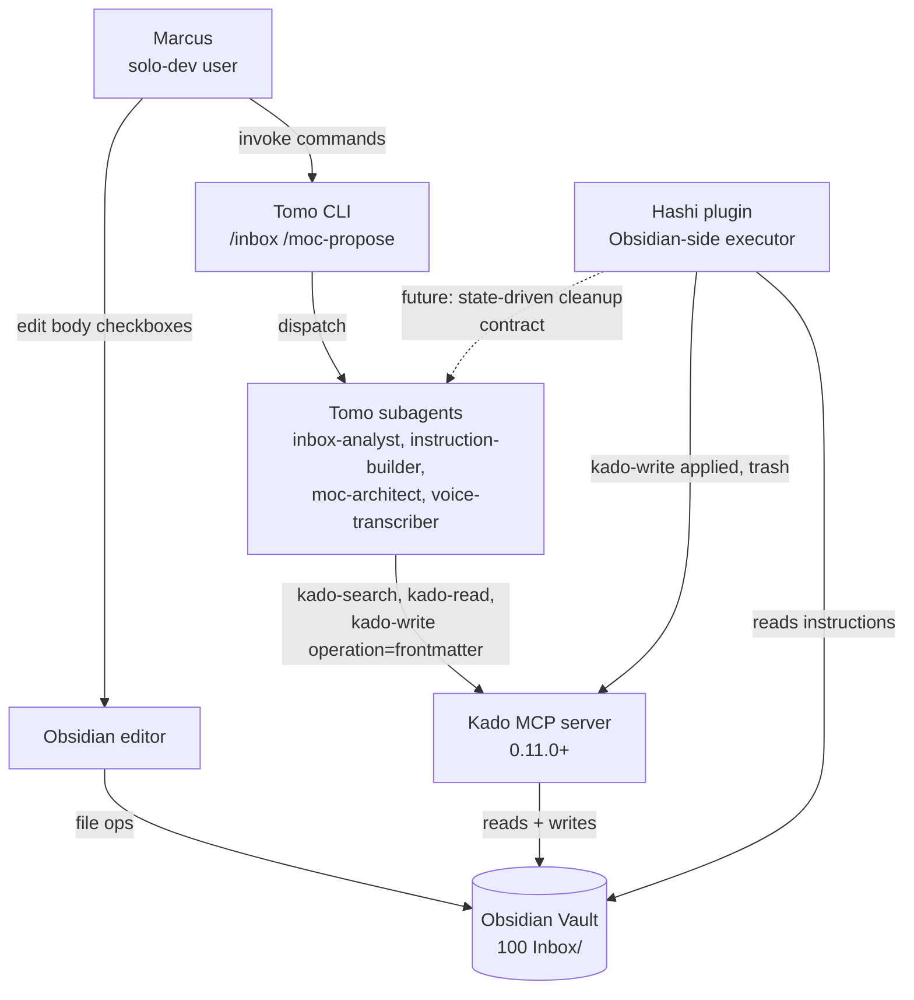
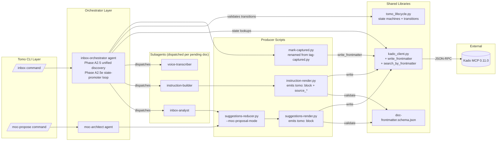
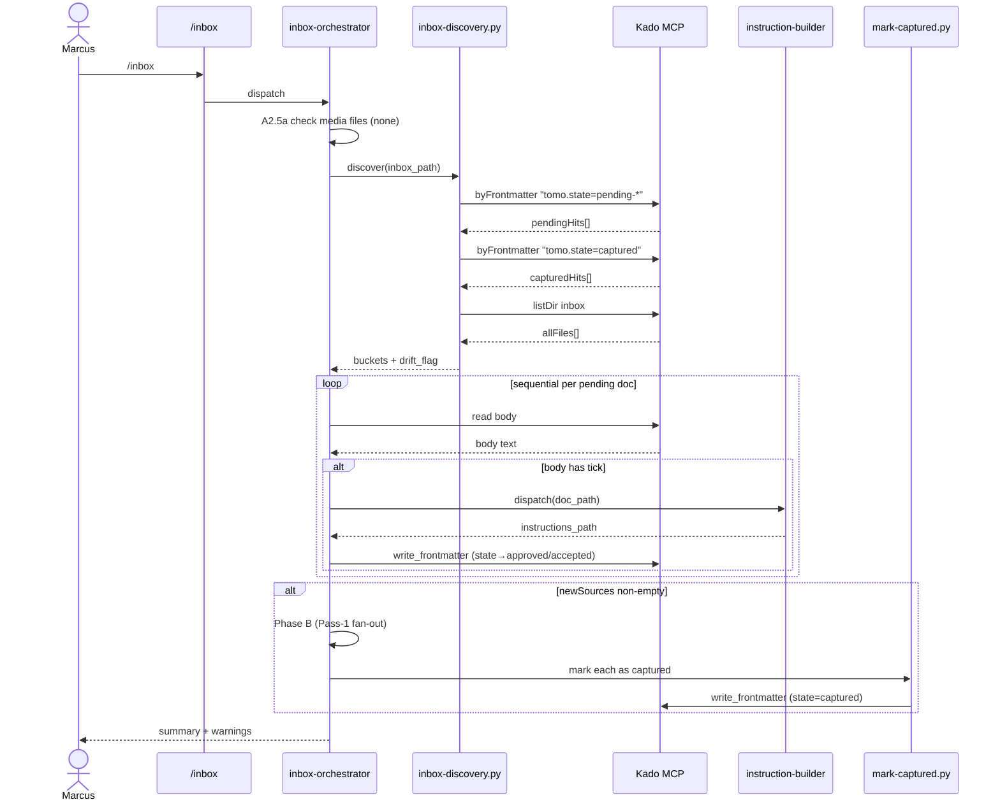
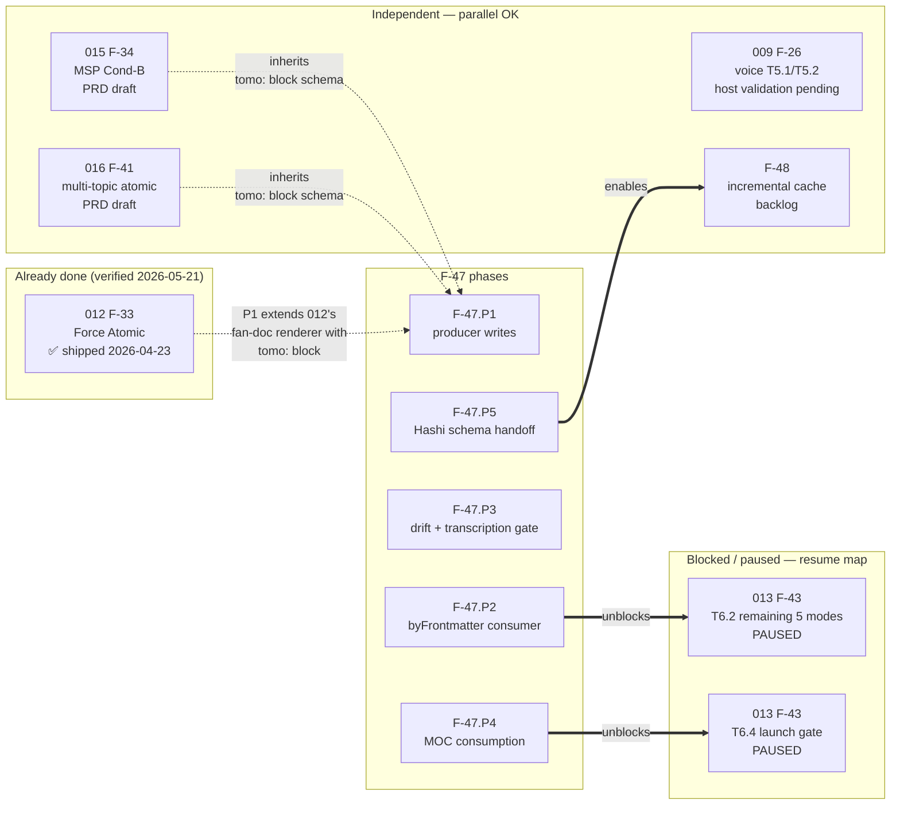

# Solution Design Document

## Validation Checklist

### CRITICAL GATES (Must Pass)

- [x] All required sections are complete
- [x] No [NEEDS CLARIFICATION] markers remain
- [x] Architecture pattern is clearly stated with rationale
- [x] **All architecture decisions confirmed by user** (ADRs 1–6 confirmed 2026-05-21)
- [x] Every interface has specification

### QUALITY CHECKS (Should Pass)

- [x] All context sources are listed with relevance ratings
- [x] Project commands are discovered from actual project files
- [x] Constraints → Strategy → Design → Implementation path is logical
- [x] Every component in diagram has directory mapping
- [x] Error handling covers all error types
- [x] Quality requirements are specific and measurable
- [x] Component names consistent across diagrams
- [x] A developer could implement from this design
- [x] Implementation examples use actual schema column names (not pseudocode), verified against migration files
- [x] Complex queries include traced walkthroughs with example data showing how the logic evaluates

---

## Constraints

**MiYo Constitution (inherited from PRD §8)**:
- **CON-1 Privacy (L1)** — `tomo:` block holds workflow metadata only (`doc_type`, `state`, `run_id`, `updated_at`, `source_*` paths). No PKM body content, no credentials, no excerpts.
- **CON-2 Local-first (L1)** — All state mutations go through Kado MCP. No external state store; `tomo-instance/state/` is local-only persistence aids (squelch, future discovery-cache).
- **CON-3 No telemetry (L1)** — Lifecycle events log to stderr only. Aggregation deferred.
- **CON-4 No main-thread blocking (L1)** — Phase A runs via Bash sub-processes (existing pattern); state-promoter inherits this.
- **CON-5 Bounded payloads (L1)** — byFrontmatter returns paths + frontmatter only; body-reads happen only for the small subset of pending docs actively being promoted (typically 0–3 per run).

**Cross-repo dependencies**:
- **CON-6 Kado 0.11.0+ live** — `kado-write operation=frontmatter` (0.10.0), `kado-search operation=byFrontmatter` (pre-existing), `filter.path` + `filter.modifiedAfter` (0.11.0). All available now; no release-wait.
- **CON-7 Hashi schema-lock follow-up required** — Feature 5 (F-47.P4 ship) blocked until Hashi side accepts the state-driven cleanup contract (`tomo.source_*` iteration). P1–P3 ship without it.

**Code Quality (L2)**:
- **CON-8 State-machine extracted** — lifecycle logic lives in `scripts/lib/tomo_lifecycle.py`, NOT duplicated across producer/consumer scripts.
- **CON-9 Schema-validated emissions** — every producer that emits a `tomo:` block must pass `tomo/schemas/doc-frontmatter.schema.json` validation (CI gate + dev-mode runtime assert).
- **CON-10 Testing (L1)** — every state transition has happy-path + rejection test; F-43 T6.2 regression test required.

**Backward-compat**:
- **CON-11 No legacy fallback** — Privat-Test inbox is wiped before P1 ship (locked OQ4/OQ5). Cut-over is clean.

## Implementation Context

**IMPORTANT**: You MUST read and analyze ALL listed context sources to understand constraints, patterns, and existing architecture.

### Required Context Sources

#### Documentation Context
```yaml
- doc: docs/XDD/specs/017-tomo-lifecycle-tags/requirements.md
  relevance: CRITICAL
  why: "PRD v1.2 — all acceptance criteria, scenarios, and locked decisions"

- doc: docs/XDD/specs/017-tomo-lifecycle-tags/README.md
  relevance: HIGH
  why: "Decisions Log — pre-PRD locks (state machine names, OQ4/5 cut-over) that constrain SDD choices"

- doc: ~/Kouzou/projects/miyo/miyo-constitution.md
  relevance: HIGH
  why: "L1/L2 governance — Privacy, Local-first, Architecture, Code Quality, Testing rules"

- doc: docs/XDD/reference/tier-1/pkm-intelligence-architecture.md
  relevance: MEDIUM
  why: "4-layer Knowledge Stack + 2-pass inbox model — F-47 refactors the discovery layer without changing the layered architecture"

- doc: _inbox/from-kado/2026-05-21_kado-to-tomo_frontmatter-write-shipped-plus-bonus.md
  relevance: HIGH
  why: "Authoritative Kado 0.11.0 capability list + recommended F-47 hot-path pattern"

- doc: docs/XDD/specs/013-moc-creation-skill/plan/phase-6.md
  relevance: MEDIUM
  why: "F-43 T6.2/T6.4 paused-state notes — F-47.P4 unblocks these"
```

#### Code Context
```yaml
- file: tomo/scripts/lib/kado_client.py
  relevance: CRITICAL
  why: "Kado MCP client wrapper — must extend with write_frontmatter() and search_by_frontmatter()"

- file: tomo/scripts/state-init.py
  relevance: CRITICAL
  why: "Current discovery script — fully replaced by unified-discovery block in inbox-orchestrator (SKIP_SUFFIXES + body-read logic deleted)"

- file: tomo/scripts/tag-captured.py
  relevance: CRITICAL
  why: "Current captured-tag writer with regex YAML edit (feedback_frontmatter_newline_guard bug class) — rewritten to use kado_client.write_frontmatter()"

- file: tomo/dot_claude/agents/inbox-orchestrator.md
  relevance: CRITICAL
  why: "Phase A flow — receives new A2.5 unified discovery step + sequential state-promoter loop"

- file: tomo/dot_claude/commands/inbox.md
  relevance: HIGH
  why: "Entry point — needs --recover flag for drift recovery (Feature 5a); message format for stop-gate and parallel-instructions warning"

- file: tomo/scripts/suggestions-render.py
  relevance: HIGH
  why: "Producer of <ts>_suggestions.md — emits the `tomo:` block per AC-1.2"

- file: tomo/scripts/instruction-render.py
  relevance: HIGH
  why: "Producer of <ts>_instructions.md — emits `tomo.source_*` cross-refs per AC-1.3 / AC-5.1; bundled MOC actions"

- file: tomo/scripts/suggestions-reducer.py
  relevance: HIGH
  why: "Producer of <ts>_moc-proposal-<slug>.md (--moc-proposal-mode) — emits the `tomo:` block per AC-1.4"

- file: tomo/dot_claude/agents/instruction-builder.md
  relevance: HIGH
  why: "Pass-2 dispatch target — receives suggestion-doc OR proposal-doc and produces instructions doc"

- file: tomo/dot_claude/agents/moc-architect.md
  relevance: MEDIUM
  why: "Step 7.5 writes the proposal-doc via kado-write; must include `tomo:` block in rendered output"

- file: tomo/dot_claude/agents/voice-transcriber.md
  relevance: MEDIUM
  why: "Transcription producer — must not auto-capture; sets the stop-gate signal (Feature 5b)"

- file: tomo/schemas/instructions.schema.json
  relevance: MEDIUM
  why: "Existing schema pattern — model `doc-frontmatter.schema.json` after the same shape (jsonschema draft-07, additionalProperties:false where appropriate)"

- file: tomo/scripts/lib/squelch_persist.py
  relevance: MEDIUM
  why: "Existing tomo-instance/state/ persistence pattern — drift recovery may reuse the same disk shape"
```

### Implementation Boundaries

- **Must Preserve**:
  - The 2-pass inbox model (Pass-1 suggestions → Pass-2 instructions) — F-47 strengthens it, doesn't restructure.
  - Existing instruction-set JSON contract (`tomo/schemas/instructions.schema.json`) — Hashi consumes this; F-47 only adds a `tomo:` block on the companion `.md`, not on the `.json` payload.
  - F-43 squelch persistence (`tomo-instance/state/moc-squelch.json`) — unchanged.
  - All existing inbox-analyst / instruction-builder business logic — F-47 changes how state is *carried*, not what decisions are made.
- **Can Modify**:
  - `state-init.py` — body-read logic + SKIP_SUFFIXES deleted; renamed/repurposed (SDD decides: full delete vs convert to thin listDir-helper).
  - `tag-captured.py` — regex YAML edit removed; renamed conceptually (proposed: `mark-captured.py`) or kept under same name for git-history continuity (ADR-6).
  - `inbox-orchestrator.md` — Phase A rewrite; A4 step removed; A2.5 expands.
  - `inbox.md` — new `--recover` flag; new stop-gate exit path; new parallel-instructions warning text.
  - All producer scripts (`suggestions-render.py`, `instruction-render.py`, `suggestions-reducer.py --moc-proposal-mode`) — emit `tomo:` block; no longer emit lifecycle tag.
- **Must Not Touch**:
  - Hashi codebase — Tomo emits the contract via the schema-lock handoff; Hashi implementation is out-of-scope for this spec.
  - Kado codebase — all needed capabilities are shipped; no further handoff.
  - `_archive/` content — historical.

### External Interfaces

#### System Context Diagram



#### Interface Specifications

```yaml
inbound:
  - name: "Tomo CLI commands"
    type: in-process (slash command dispatch)
    format: Markdown frontmatter + body
    authentication: N/A (single-user container)
    doc: tomo/dot_claude/commands/inbox.md, moc-propose.md
    data_flow: "User-triggered orchestration; produces vault writes via Kado"

outbound:
  - name: "Kado MCP server"
    type: HTTPS (JSON-RPC 2.0 over /mcp)
    format: JSON-RPC tools/call
    authentication: Bearer token (KADO_TOKEN from env)
    doc: tomo/scripts/lib/kado_client.py
    criticality: CRITICAL
    data_flow: |
      F-47 calls (all metadata-only or body-read for actively-promoted pending docs):
      - kado-search operation=byFrontmatter   (NEW — primary discovery)
      - kado-search operation=listDir          (existing — fresh source enum)
      - kado-read operation=note               (existing — body-read pending docs)
      - kado-write operation=frontmatter       (NEW in 0.10.0 — state flips, captured marking)
      - kado-write operation=note              (existing — workflow doc creation)

data:
  - name: "tomo-instance/state/discovery-cache.json (FUTURE — F-48)"
    type: JSON file
    connection: Direct filesystem
    doc: N/A (deferred)
    data_flow: "Out of scope for F-47; mentioned for SoT principle alignment"

  - name: "tomo-instance/state/moc-squelch.json"
    type: JSON file
    connection: Direct filesystem (via squelch_persist.py)
    doc: tomo/scripts/lib/squelch_persist.py
    data_flow: "F-43 squelch — unchanged by F-47"
```

### Cross-Component Boundaries

- **API Contracts** (public, must not break between releases):
  - `tomo/schemas/doc-frontmatter.schema.json` — Tomo→Hashi cross-component contract for the `tomo:` block shape. Breaking changes require coordinated Tomo + Hashi release.
  - `tomo/schemas/instructions.schema.json` — Tomo→Hashi instruction-set contract. F-47 does NOT modify this; only the companion `.md` carries the new `tomo:` block.
- **Team Ownership**:
  - Tomo repo owns: producers (renderers), state-promoter, kado_client wrappers, schema definitions.
  - Hashi repo owns: cleanup detection, source_* path iteration, state flip on applied, trash dispatch.
  - Kado repo owns: byFrontmatter semantics, write_frontmatter merge rules, filter.path/modifiedAfter behaviour.
- **Shared Resources**:
  - The vault is the SoT for all three (Tomo, Hashi, Marcus's manual edits).
  - Kado serializes concurrent writes via `expectedModified` optimistic concurrency.
- **Breaking Change Policy**:
  - `tomo:` block schema additions are non-breaking (Hashi ignores unknown `source_*` keys → forward-compat).
  - `tomo:` block field removals are breaking → coordinated release.

### Project Commands

```bash
# Core Commands (discovered from project files)
Install: ./install-tomo.sh           # installs Tomo into tomo-instance/
Dev:     ./begin-tomo.sh             # launches Docker container, runs Tomo CLI
Test:    pytest tests/               # host-side unit tests (kado_client, schemas, state machine)
Lint:    python3 -m py_compile <file>  # no project-level linter beyond syntax check; PEP 8 via convention
Build:   N/A (no build step — Tomo is interpreted Python + markdown agents)

# Schema validation (NEW for F-47)
Validate-schema: python3 -m jsonschema -i <doc.frontmatter.json> tomo/schemas/doc-frontmatter.schema.json

# /inbox lifecycle (existing)
/inbox            # full Phase A → B → C run
/inbox --recover  # NEW: drift-recovery mode (F-47.P3)
/moc-propose ...  # existing — emits proposal-doc with `tomo:` block (F-47.P1)
```

## Solution Strategy

- **Architecture Pattern: Layered consumer/producer + shared state-machine library**
  - **Producers** (agents + scripts) emit Tomo workflow docs with a structured `tomo:` block in frontmatter.
  - **Consumers** (orchestrator state-promoter, Hashi cleanup) discover work via a single byFrontmatter query and act on `tomo.state`.
  - **Shared state-machine** (`tomo/scripts/lib/tomo_lifecycle.py`) defines allowed transitions and is imported by every producer/consumer that mutates state.
  - **MCP boundary** (Kado client wrapper) is the only path to vault data — no direct file I/O on vault content.

- **Integration Approach**:
  - F-47 refactors existing Phase A discovery + state-init + tag-captured paths. No new top-level command. No new agent (state-promoter is orchestrator logic, not a subagent — ADR-3).
  - The producer scripts (renderers) gain one new responsibility: emit the `tomo:` block + validate it. All other behaviour preserved.
  - The Kado client gains two new methods (`write_frontmatter`, `search_by_frontmatter`) — additive, no existing call sites touched.
  - Hashi receives the schema via cross-repo handoff (`_outbox/for-hashi/`) when P4 ships.

- **Justification**:
  - **Layered** because the system has clear producer/consumer separation already — F-47 strengthens the seams, doesn't replace the architecture.
  - **Shared library** for state machine because Constitution L2 Code Quality forbids duplicating transition logic across 4+ scripts.
  - **Frontmatter-only state** (v1.2 PRD lock) because the user doesn't browse via tag pane and hides frontmatter in editor — every visual artefact of state is delivered via filename conventions, body checkboxes, and `/inbox` summary output instead.
  - **byFrontmatter primary** (v1.1 PRD lock) because it returns paths + frontmatter inline in one call — Kado-recommended pattern; collapses old byTag + N×read_frontmatter chain.

- **Key Decisions** (locked in PRD or as ADRs in this SDD):
  - `tomo.state` is the single SoT field (PRD v1.2)
  - `byFrontmatter` is the primary discovery call (PRD v1.1)
  - State-promoter runs as orchestrator-embedded Phase A2.5, not a subagent (ADR-3)
  - State-machine module is pure data (dict-of-dicts), not class-based (ADR-1)
  - Schema validation uses `jsonschema` (Python stdlib-adjacent, already in Tomo's deps) with CI gate + dev-mode runtime assert (ADR-4)
  - kado_client extensions are additive methods with optional `filter` dict (ADR-2)
  - Migration phases P1–P5 are sequential; each phase is independently shippable (ADR-6)

## Building Block View

### Components



### Directory Map

**Component**: Tomo source tree (under `tomo/`)
```
tomo/
├── scripts/
│   ├── lib/
│   │   ├── kado_client.py                  # MODIFY: + write_frontmatter, + search_by_frontmatter
│   │   ├── tomo_lifecycle.py               # NEW: state machines per doc-type + validate_transition()
│   │   └── doc_frontmatter.py              # NEW: produce/parse `tomo:` block, schema-validate
│   ├── state-init.py                       # DELETE (or shrink to listDir helper — ADR-6)
│   ├── tag-captured.py                     # RENAME→mark-captured.py + REWRITE to use write_frontmatter
│   ├── state-promoter.py                   # NEW (small): body-tick detection helper called from orchestrator
│   ├── suggestions-render.py               # MODIFY: emit `tomo:` block
│   ├── instruction-render.py               # MODIFY: emit `tomo:` block + source_* refs
│   ├── suggestions-reducer.py              # MODIFY: `--moc-proposal-mode` emits `tomo:` block for proposal-doc; `--fan-resolve` (from XDD 012) emits `tomo:` block for fan-doc (doc_type=suggestions-fan)
│   ├── inbox-discovery.py                  # NEW (small): unified byFrontmatter + listDir + bucketing helper
│   └── ... (unchanged)
├── schemas/
│   ├── doc-frontmatter.schema.json         # NEW: `tomo:` block JSON Schema
│   └── ... (existing schemas unchanged)
├── dot_claude/
│   ├── agents/
│   │   ├── inbox-orchestrator.md           # MODIFY: Phase A unified discovery + state-promoter loop
│   │   ├── inbox-analyst.md                # (no change in v1 — analyst still receives source items)
│   │   ├── instruction-builder.md          # MODIFY: emit `tomo.source_*` ref into output instructions doc
│   │   ├── moc-architect.md                # MODIFY: render proposal-doc with `tomo:` block
│   │   ├── voice-transcriber.md            # MODIFY: implement stop-gate signal (Feature 5b)
│   │   └── ... (unchanged)
│   └── commands/
│       ├── inbox.md                        # MODIFY: + --recover flag; + parallel-instructions warning
│       └── ... (unchanged)
└── ... (rest unchanged)
```

**Component**: Test tree (under `tests/`)
```
tests/
├── test_tomo_lifecycle.py                  # NEW: state-machine transition tests (happy + rejection)
├── test_doc_frontmatter.py                 # NEW: schema validation tests + round-trip
├── test_kado_client_frontmatter.py         # NEW: write_frontmatter wrapper + search_by_frontmatter wrapper
├── test_inbox_discovery.py                 # NEW: bucket logic + drift-detection threshold
└── ... (existing tests unchanged)
```

**Component**: Spec tree (under `docs/XDD/specs/017-tomo-lifecycle-tags/`)
```
docs/XDD/specs/017-tomo-lifecycle-tags/
├── requirements.md                         # PRD v1.2 (committed)
├── solution.md                             # THIS DOCUMENT (NEW)
├── README.md                               # MODIFY: append v1.1/v1.2 decision-log entries + SDD pointer
└── plan/                                   # populated by /tcs-workflow:xdd-plan in the next step
```

### Interface Specifications

#### Interface Documentation References

```yaml
interfaces:
  - name: "Kado MCP — kado-search operation=byFrontmatter"
    doc: "_inbox/from-kado/2026-05-21_kado-to-tomo_frontmatter-write-shipped-plus-bonus.md (recommended F-47 pattern)"
    relevance: CRITICAL
    sections: [query syntax, filter object, response shape]
    why: "Primary discovery mechanism for state-promoter"

  - name: "Kado MCP — kado-write operation=frontmatter"
    doc: "_inbox/from-kado/2026-05-20_kado-to-tomo_kado-write-frontmatter-shipped.md + 2026-05-21 follow-up"
    relevance: CRITICAL
    sections: [mode=merge semantics, expectedModified concurrency, array-replace rule]
    why: "Every state transition writes via this op; merge semantics critical to avoid clobbering user-added frontmatter keys"

  - name: "tomo/schemas/doc-frontmatter.schema.json"
    doc: "NEW — see Data Models below"
    relevance: CRITICAL
    sections: [tomo block structure, state enum, source_* pattern]
    why: "Cross-component contract between Tomo producers, Tomo state-promoter, and Hashi cleanup"

  - name: "tomo/schemas/instructions.schema.json"
    doc: "Existing — unchanged by F-47"
    relevance: HIGH
    sections: [action types, full file shape]
    why: "Reference for cross-doc-type consistency in JSON schemas"
```

#### Data Storage Changes

No database. The vault filesystem (via Kado) is the only persistent store. F-47 adds one **frontmatter shape** to all Tomo workflow docs:

```yaml
# tomo/schemas/doc-frontmatter.schema.json (NEW)
schema_doc: tomo/schemas/doc-frontmatter.schema.json
migration_scripts: N/A — Privat-Test inbox is wiped on cut-over (locked OQ4/5)
```

The `tomo:` block:

```yaml
# Present on every Tomo-produced doc + captured source items
tomo:
  doc_type: <enum: suggestions | moc-proposal | instructions | source>
  state:    <enum per doc-type, see Data Models below>
  run_id:   <string — run-id.py output, format: YYYY-MM-DD-HHMMSS-<hash>>
  updated_at: <ISO-8601 timestamp at last write>

  # Cross-references (only on instructions docs):
  source_suggestions:  "<vault-relative path>"   # if instructions came from a suggestions doc
  source_moc_proposal: "<vault-relative path>"   # if instructions came from an accepted proposal-doc
  # Future doc-types (F-44/45/46) extend with source_garden_audit, source_weekly_review, etc.
```

#### Internal API Changes

```yaml
# kado_client.py extensions

Method: KadoClient.write_frontmatter
  Signature: write_frontmatter(path: str, frontmatter: dict, mode: str = "merge", expected_modified: int = None) -> dict
  Wraps:     kado-write operation=frontmatter
  Behaviour: |
    Sends only the supplied frontmatter object to Kado. mode='merge' deep-merges
    with existing frontmatter (arrays replace, scalars replace, untouched keys
    preserved). mode='replace' clears the block and writes verbatim.
  Returns:   {path, modified} on success; raises KadoToolError on conflict/validation
  Errors:    KadoConcurrencyError on expectedModified mismatch

Method: KadoClient.search_by_frontmatter
  Signature: search_by_frontmatter(query: str, *, path_prefix: str = None, modified_after: int = None, limit: int = 500) -> list
  Wraps:     kado-search operation=byFrontmatter
  Behaviour: |
    Returns [{path, modified, frontmatter}] for every match. Server-side filter
    via path_prefix (filter.path) and modified_after (filter.modifiedAfter, 0.11.0+).
  Returns:   list of dicts with frontmatter inline (no separate read_frontmatter call needed)

# CLI command changes

Command: /inbox --recover
  Behaviour: |
    Treats all docs with tomo.state=captured as fresh sources. Pass-1 runs
    inbox-analyst against them; tag-captured re-asserts captured tag idempotently
    on success.

Command: /inbox (default — when media files present in inbox)
  Behaviour: |
    Runs transcription sub-step → produces <stem>.md per media file → exits with
    stop-gate message. NO Phase A discovery, NO Pass-1 for the new transcripts
    in this run.
```

#### Application Data Models

```pseudocode
# State machine — pure data, no behaviour beyond lookup

MODULE: tomo_lifecycle.py (NEW)

  CONSTANT: STATE_MACHINE = {
    "suggestions": {
      "initial":    null,
      "states":     ["pending-approval", "approved"],
      "transitions": [
        {"from": null,                "to": "pending-approval", "trigger": "renderer write"},
        {"from": "pending-approval",  "to": "approved",         "trigger": "state-promoter after Pass-2 success"}
      ],
      "terminal":   ["approved"]
    },
    "suggestions-fan": {
      # XDD 012 Force-Atomic Resolve doc — companion to suggestions, same lifecycle shape
      "initial":    null,
      "states":     ["pending-approval", "approved"],
      "transitions": [
        {"from": null,                "to": "pending-approval", "trigger": "suggestions-reducer --fan-resolve write"},
        {"from": "pending-approval",  "to": "approved",         "trigger": "state-promoter after FAN-resolve Pass-2 success"}
      ],
      "terminal":   ["approved"]
    },
    "moc-proposal": {
      "initial":    null,
      "states":     ["pending-accept", "accepted"],
      "transitions": [
        {"from": null,              "to": "pending-accept", "trigger": "moc-architect write"},
        {"from": "pending-accept",  "to": "accepted",       "trigger": "state-promoter after MOC Pass-2 success"}
      ],
      "terminal":   ["accepted"]
    },
    "instructions": {
      "initial":    null,
      "states":     ["pending-apply", "applied"],
      "transitions": [
        {"from": null,             "to": "pending-apply", "trigger": "instruction-builder write"},
        {"from": "pending-apply",  "to": "applied",       "trigger": "Hashi after last [x] Applied"}
      ],
      "terminal":   ["applied"]
    },
    "source": {
      "initial":    null,
      "states":     ["captured"],
      "transitions": [
        {"from": null,        "to": "captured", "trigger": "mark-captured at Pass-1 dispatch"}
      ],
      "terminal":   ["captured"]
    }
  }

  FUNCTION: validate_transition(doc_type, from_state, to_state) -> bool
    Lookup STATE_MACHINE[doc_type].transitions; return True iff (from→to) is listed.

  FUNCTION: is_terminal(doc_type, state) -> bool
    Lookup STATE_MACHINE[doc_type].terminal.

  FUNCTION: is_pending(state) -> bool
    Return state.startswith("pending-")

# Producer helper for `tomo:` block

MODULE: doc_frontmatter.py (NEW)

  FUNCTION: build_tomo_block(doc_type, state, run_id, **source_refs) -> dict
    Construct the `tomo:` block dict; auto-set updated_at = now ISO-8601.
    Validate via jsonschema against doc-frontmatter.schema.json.
    Raise SchemaValidationError on failure (dev-mode runtime assert).

  FUNCTION: parse_tomo_block(frontmatter: dict) -> TomoBlock or None
    Extract and validate. Return None if no `tomo:` key present.

# Discovery bucket helper

MODULE: inbox-discovery.py (NEW — small script invoked from orchestrator Phase A2.5)

  FUNCTION: discover(inbox_path: str) -> DiscoveryResult
    1. kado_client.search_by_frontmatter("tomo.state=pending-*", path_prefix=inbox_path)
       → pendingHits (list of {path, frontmatter})
    2. kado_client.search_by_frontmatter("tomo.state=captured", path_prefix=inbox_path)
       → capturedHits
    3. kado_client.list_dir(inbox_path, depth=1)
       → allFiles
    4. newSources = allFiles − pendingHits.paths − capturedHits.paths − non-.md files
    5. Bucket pendingHits by tomo.doc_type:
       - pendingApproval (doc_type=suggestions, state=pending-approval)
       - pendingAccept   (doc_type=moc-proposal, state=pending-accept)
       - pendingApply    (doc_type=instructions, state=pending-apply)
    6. Compute drift = (capturedHits.count > 0) AND (pendingApproval+Accept+Apply == 0)
    7. Return DiscoveryResult(buckets, drift_hint)
```

#### Integration Points

```yaml
# Inter-component communication (within Tomo)
- from: inbox-orchestrator (Phase A2.5)
  to: inbox-discovery.py
  protocol: subprocess (Bash)
  data_flow: "Orchestrator invokes; receives JSON bucket counts + paths via stdout"

- from: inbox-orchestrator (Phase A2.5e)
  to: instruction-builder subagent
  protocol: Task tool dispatch (one per pending doc, sequential)
  data_flow: "Orchestrator passes source-doc path; receives output instructions path"

- from: any producer renderer
  to: doc_frontmatter.build_tomo_block()
  protocol: Python import
  data_flow: "Produces validated `tomo:` block dict; renderer assembles into frontmatter YAML"

# Cross-repo (Tomo ↔ Hashi)
Hashi:
  doc: _outbox/for-hashi/2026-05-21_tomo-to-hashi_state-driven-cleanup-schema-lock.md (NEW — sent at P4)
  sections: [doc-frontmatter.schema.json full text, source_* iteration contract, applied-state trigger]
  integration: |
    Hashi watches frontmatter on instructions docs. When tomo.state flips to 'applied',
    Hashi reads the `tomo:` block, collects every value under any key matching `source_*`,
    trashes those paths + the instructions doc itself.
  critical_data: [tomo.state, tomo.source_*]
```

### Implementation Examples

#### Example: byFrontmatter discovery call

**Why this example**: The new primary discovery call is the load-bearing change in F-47. Showing the exact call shape (with filter syntax) prevents implementer guesswork about Kado 0.11.0 conventions.

```python
# In tomo/scripts/inbox-discovery.py

from lib.kado_client import KadoClient

def discover_pending(client: KadoClient, inbox_path: str) -> list[dict]:
    """Return all docs in inbox with tomo.state=pending-*.

    Returns
    -------
    list of {path, modified, frontmatter} where frontmatter is the parsed
    YAML object including the `tomo:` block.
    """
    hits = client.search_by_frontmatter(
        query="tomo.state=pending-*",
        path_prefix=inbox_path.rstrip("/") + "/",
        # modified_after=  # deferred to F-48 incremental-cache
        limit=500,
    )
    return hits
```

#### Example: State-flip with optimistic concurrency

**Why this example**: The merge-mode contract is subtle (arrays replace, scalars replace, unrelated keys preserved). A wrong call would clobber `up::` or user-added tags. Worth a concrete trace.

```python
# In tomo/scripts/state-promoter.py (called from orchestrator)

from lib.kado_client import KadoClient
from lib.tomo_lifecycle import validate_transition
from lib.doc_frontmatter import build_tomo_block
import datetime, sys

def flip_state(client: KadoClient, doc_path: str, doc_type: str,
               from_state: str, to_state: str, run_id: str,
               expected_modified: int) -> None:
    """Flip tomo.state from `from_state` to `to_state` on `doc_path`.

    Asserts the transition is legal per the state machine BEFORE writing.
    Uses optimistic concurrency to surface conflicts with concurrent Hashi runs.
    """
    if not validate_transition(doc_type, from_state, to_state):
        # Log + skip — emits lifecycle.transition_rejected event
        print(f"REJECT: {doc_type} {from_state}→{to_state}", file=sys.stderr)
        return

    tomo_block = {
        "state": to_state,
        "updated_at": datetime.datetime.utcnow().isoformat() + "Z",
    }
    # Merge mode: only `state` and `updated_at` change; doc_type, run_id,
    # source_*, and any user-added frontmatter keys (e.g. tags they manually
    # added) are preserved.
    try:
        client.write_frontmatter(
            doc_path,
            frontmatter={"tomo": tomo_block},
            mode="merge",
            expected_modified=expected_modified,
        )
    except KadoConcurrencyError:
        # Retry once — typically Hashi flipped applied mid-run
        latest = client.read_frontmatter(doc_path)
        if latest["content"].get("tomo", {}).get("state") == to_state:
            return  # already flipped by someone else; idempotent
        raise  # genuine conflict — surface to orchestrator
```

**Traced walkthrough — concurrent Hashi conflict:**

| Step | Tomo state | Hashi state | Kado vault state |
|---|---|---|---|
| t0: discovery | reads `<ts>_instructions.md` modified=1000, state=pending-apply | — | state=pending-apply, modified=1000 |
| t1: Hashi finishes last action | — | flips state=applied, modified→1010 | state=applied, modified=1010 |
| t2: Tomo tries flip pending-apply→approved (invalid for instructions anyway) | validate_transition rejects | — | unchanged |
| t2': Tomo tries legal flip (different doc) with expected_modified=1000 | KadoConcurrencyError raised | — | unchanged |
| t3: retry path reads latest, finds already-applied | logs no-op | — | unchanged |

#### Test Examples as Interface Documentation

```python
# tests/test_tomo_lifecycle.py — state machine contract

def test_suggestions_pending_to_approved_legal():
    assert validate_transition("suggestions", "pending-approval", "approved") is True

def test_suggestions_pending_to_applied_rejected():
    # "applied" is not in suggestions' state list — should reject
    assert validate_transition("suggestions", "pending-approval", "applied") is False

def test_terminal_state_no_outgoing():
    # captured is terminal for source items; no further transition allowed
    assert is_terminal("source", "captured") is True
    assert validate_transition("source", "captured", "anything") is False
```

```python
# tests/test_doc_frontmatter.py — schema round-trip

def test_build_tomo_block_minimum_fields():
    block = build_tomo_block(
        doc_type="suggestions",
        state="pending-approval",
        run_id="2026-05-21-1430-abc123",
    )
    assert block["doc_type"] == "suggestions"
    assert block["state"] == "pending-approval"
    assert "updated_at" in block  # auto-set
    # Schema validation passes
    validate_against_schema(block)

def test_build_tomo_block_with_source_ref():
    block = build_tomo_block(
        doc_type="instructions",
        state="pending-apply",
        run_id="2026-05-21-1430-abc123",
        source_suggestions="100 Inbox/2026-05-21-1400_suggestions.md",
    )
    assert block["source_suggestions"] == "100 Inbox/2026-05-21-1400_suggestions.md"

def test_invalid_state_for_doc_type_rejected():
    with pytest.raises(SchemaValidationError):
        build_tomo_block(
            doc_type="suggestions",
            state="applied",  # not in suggestions' state set
            run_id="x",
        )
```

## Runtime View

### Primary Flow

#### Primary Flow: `/inbox` unified discovery + sequential state-promotion

1. User runs `/inbox` (or `/inbox --recover`).
2. Orchestrator Phase A0–A2: read concepts.inbox, mkdir scratch, gen RUN_ID.
3. **A2.5a Transcription pre-check**: scan inbox for media files. If any → invoke voice-transcriber → exit with stop-gate message. **STOP HERE for this run.**
4. **A2.5b Unified discovery**: invoke `inbox-discovery.py` → returns four buckets + drift flag.
5. **A2.5d Drift check**: if drift_hint, emit user-facing warning. If `--recover` not present, continue normally.
6. **A2.5e Sequential state-promotion**: for each doc in `pendingApproval`, then each in `pendingAccept` (in that order):
   - kado-read operation=note → fetch body
   - Inspect for the required tick (`[x] Approved` at header for suggestions; any `[x] Accept` for moc-proposal)
   - If no tick → skip (doc stays pending)
   - If ticked → dispatch instruction-builder subagent (sequential, one at a time)
   - On subagent success → `flip_state` on source doc via state-promoter helper
7. **Phase A3**: shared-ctx-builder runs (counters fed from 2.5c).
8. **Phase A5 branch**:
   - If `newSources` non-empty → Phase B Pass-1 (fan out inbox-analyst per item, mark-captured at end).
   - If only state-promotion happened → skip B/C, jump to summary.
9. **Phase D summary** (NEW): print structured summary including any parallel-instructions warning if `pendingApply.count > 0 OR newly-produced instructions > 1`.



### Error Handling

- **Schema validation failure on producer write** (dev mode): raise `SchemaValidationError` before the write reaches Kado. Block the producer. In production mode (env flag), log + warn but allow write through (avoid breaking real-vault runs on a bad schema rev).
- **Kado concurrency conflict** (`expected_modified` mismatch): retry once with fresh read; if conflicting state is the target state, treat as idempotent no-op; otherwise surface error.
- **Body-read fails / malformed body**: log `lifecycle.transition_rejected` with reason='malformed_body', skip the doc, continue with next.
- **Transcription failure**: log error, do NOT exit with stop-gate; continue to Phase A2.5b. Media file remains; user can re-trigger transcription manually.
- **Invalid transition request** (validate_transition returns False): log `lifecycle.transition_rejected`, skip, continue.
- **State-promoter mid-run crash**: docs already flipped this run stay flipped (writes are independent); orchestrator surfaces the crash; next `/inbox` run continues from current vault state (idempotent).
- **`--recover` against fresh inbox** (no captured docs to recover): no-op + info message.

### Complex Logic

```
ALGORITHM: Phase A2.5 — Unified Discovery + Sequential State-Promotion
INPUT: inbox_path, --recover flag (default false)
OUTPUT: buckets, transitions_applied, summary_message

1. TRANSCRIPTION PRE-CHECK:
   media_files = listDir(inbox_path) where extension ∈ {.mp3, .m4a, .wav, ...}
   IF media_files:
     dispatch voice-transcriber on each
     PRINT stop-gate message
     EXIT 0 — Phase A halts here

2. UNIFIED DISCOVERY:
   pendingHits  = byFrontmatter("tomo.state=pending-*", path_prefix=inbox_path)
   capturedHits = byFrontmatter("tomo.state=captured", path_prefix=inbox_path)
   allFiles     = listDir(inbox_path, type=file, ext=md)

3. BUCKETING:
   newSources       = allFiles.paths − pendingHits.paths − capturedHits.paths
   pendingApproval  = pendingHits where tomo.doc_type=suggestions
   pendingAccept    = pendingHits where tomo.doc_type=moc-proposal
   pendingApply     = pendingHits where tomo.doc_type=instructions

4. DRIFT DETECTION:
   IF capturedHits.count > 0 AND (pendingApproval ∪ pendingAccept ∪ pendingApply).count == 0:
     IF NOT --recover:
       EMIT drift_hint
     IF --recover:
       newSources = capturedHits.paths   # override; re-Pass-1 these

5. SEQUENTIAL STATE-PROMOTION (in this order):
   FOR doc IN pendingApproval ∪ pendingAccept (sorted by tomo.updated_at ASC):
     body = read(doc.path)
     ticked = check_tick(body, doc.doc_type)
     IF NOT ticked:
       CONTINUE   # stays pending for next run
     dispatch instruction-builder(doc.path) → instructions_path
     IF dispatch succeeded:
       new_state = "approved" if doc.doc_type=suggestions else "accepted"
       flip_state(doc.path, doc.doc_type, doc.state, new_state, expected_modified=doc.modified)

6. PARALLEL-INSTRUCTIONS WARNING:
   total_pending_apply = pendingApply.count + transitions_applied
   IF total_pending_apply > 1:
     EMIT parallel-instructions warning ("you now have N pending-apply docs")

7. RETURN: buckets, transitions_applied, summary
```

## Deployment View

### Single Application Deployment

- **Environment**: Tomo runs in a Docker container (`tomo-instance/`); all code is interpreted at runtime (Python, markdown agents). No build artefact.
- **Configuration**:
  - `KADO_URL`, `KADO_TOKEN` (env, existing) — Kado MCP endpoint
  - `TOMO_SCHEMA_STRICT` (env, NEW, optional) — if set to `1`, raise on schema validation failure; if unset, warn + allow
- **Dependencies**:
  - Kado MCP 0.11.0+ (live in vault — verified 2026-05-21)
  - Hashi (for P4 cleanup contract; P1–P3 ship without it)
- **Performance**:
  - `/inbox` steady-state discovery: target ≤ 2,000 tokens (PRD §7); 2 Kado calls (byFrontmatter + listDir)
  - `/inbox` heavy-backlog discovery: target ≤ 6,000 tokens (PRD §7); +1 byFrontmatter call for captured + N body-reads for pending docs being promoted

### Multi-Component Coordination

- **Deployment Order**:
  1. Kado 0.11.0+ (already shipped)
  2. Tomo F-47.P1 (producer-side writes — `tomo:` block emission, write_frontmatter wrapper, schema)
  3. Tomo F-47.P2 (consumer-side — unified discovery, state-promoter loop)
  4. Tomo F-47.P3 (drift + transcription gate)
  5. Tomo F-47.P4 (MOC-consumption; sends schema-lock handoff to Hashi)
  6. Hashi side adopts state-driven cleanup (independent timeline after P4 handoff)
- **Version Dependencies**: Tomo P2 requires Kado 0.11.0+ (verified).
- **Feature Flags**: None at runtime. `--recover` flag is invocation-time, not deploy-time.
- **Rollback Strategy**: each P-phase is independently revertable via git. P1 → P2 → P3 each pass Privat-Test before merging. No DB migrations to undo.
- **Data Migration Sequencing**: N/A — Privat-Test inbox wipe at P1 start absorbs the only migration cost (locked OQ4/5).

### Cross-Spec Coordination

F-47 sits in the middle of an active spec backlog. The phase ship order also unlocks (or constrains) several adjacent specs.

#### Spec dependency map



#### Coordination rules per spec

**013 F-43 MOC creation (PAUSED, hard-dependent on F-47)**
- T6.2 remaining modes (folder, class, title, free-text, scan) — **resume after F-47.P2 ships**. P2 gives unified discovery so `/inbox` sees the proposal-doc and routes it; T6.2 tests cover proposal-doc *creation* + discovery, which is what P1+P2 unblock.
- T6.4 final launch gate — **resume after F-47.P4 ships**. P4 ships the actual MOC-consumption flow (bundled `create_moc` + child-relationship-update actions). T6.4 includes the accept-flow end-to-end test, which only works with P4 live.
- T6.3 Stream B (live-validation links in XDD index + `/memory-add`) — picks up after T6.2 completes.
- Action: update `docs/XDD/specs/013-moc-creation-skill/README.md` and `plan/phase-6.md` T6.2 pause note to reference P2 (not P1+P2) and add T6.4 → P4 dependency. Done as a follow-up edit (this session).

**012 F-33 Force Atomic Synthesis (✅ ALREADY DONE — verified 2026-05-21)**
- Original SDD coordination assumed 012 was in-progress per its README. Code verification on 2026-05-21 found 012 was actually shipped 2026-04-23 (commit `08a1f22 feat(force-atomic): synthesize atomics via resolve doc (XDD 012)`, merged via `301708f`). All 5 phase-1 source-file changes are live + 2 test files exist. 012's README has been corrected to reflect this.
- **Remaining F-47 coordination**: 012's shipped output includes a new workflow doc type — `<date>_suggestions-fan.md` — that today carries no `tomo:` block. F-47.P1's producer sweep MUST extend 012's fan-doc renderer to emit the block.
- **Schema decision (small, SDD-level)**: the fan-doc's `tomo.doc_type` value. Two options:
  - **(a) New enum value** `doc_type: suggestions-fan` — explicit, distinguishes fan-docs in discovery buckets and lifecycle transitions
  - **(b) Reuse** `doc_type: suggestions` with the filename suffix `-fan` carrying the distinction implicitly
- **Recommended: (a)** because byFrontmatter queries that want only main suggestions (e.g. `tomo.doc_type=suggestions AND tomo.state=pending-approval`) shouldn't accidentally match fan-docs. Explicit enum keeps the discovery layer clean.
- Implication for `doc-frontmatter.schema.json`: state machine adds a `suggestions-fan` doc_type with states `pending-approval → approved` (mirrors `suggestions`). Behaviour is the same — user ticks `[x] Approved` on the fan-doc, state-promoter dispatches instruction-builder.
- **No 012-side work needed**. F-47.P1 producer sweep extends the existing 012 fan-doc renderer in one pass alongside `suggestions-render.py` and `instruction-render.py`.

**009 F-26 Voice Memo Transcription (CODE-COMPLETE, host validation pending)**
- T5.1 (5-min memo end-to-end) and T5.2 (performance ≤ 5 min wall on M-series) are host-side live tests, NOT blocked by F-47 codebase changes.
- **However**: F-47 Feature 5b (transcription stop-gate) reshapes the voice → /inbox flow. T5.1 should be re-run AFTER F-47.P3 ships to validate the stop-gate doesn't regress the existing voice workflow.
- Concrete sequencing:
  1. Run T5.1/T5.2 NOW (against current voice flow) — gets 009 to spec-done independent of F-47.
  2. After F-47.P3 ships, run a slim 009 regression: same voice memo, verify stop-gate fires, re-/inbox processes transcript correctly on the second run.
- Action: 009 README gets a "post-F-47.P3 regression" task added to T5.x.

**015 F-34 MSP Condition B + 016 F-41 Multi-topic Atomic (PRD draft, independent)**
- Both touch `inbox-analyst.md` (Steps 4 and 7-8 respectively) + supporting scripts (`cache-builder.py`, `shared-ctx-builder.py`). F-47 does NOT touch these.
- They CAN proceed in parallel with F-47 implementation. But: their producers (inbox-analyst outputs → reducer → renderer) will emit suggestions docs, which **will need to carry the `tomo:` block from P1 onward**.
- Coordination: when 015/016 reach SDD/plan phase, their renderer-touch tasks must include "emits `tomo:` block per F-47 schema". This is a one-line addition to each, not a blocker.
- Action: when scaffolding 015/016 plan phases, reference `docs/XDD/specs/017-tomo-lifecycle-tags/solution.md` Data Models section.

**F-48 Incremental-Discovery Cache (backlog)**
- Depends on F-47's discovery layer being byFrontmatter-based + the `filter.modifiedAfter` capability (already in Kado 0.11.0). Hard-prereq for F-45 weekly-review (time-windowed by design).
- Action: defer until F-47 ships + /moc-propose repeat-run cost is measurable on Privat-Test.

#### Post-F-47 work queue (expected)

| Trigger | Spec | Task |
|---|---|---|
| F-47.P1 starts | 012 outputs (✅ already shipped) | F-47.P1 producer sweep extends 012's `<date>_suggestions-fan.md` renderer to emit `tomo:` block (`doc_type=suggestions-fan`) |
| F-47.P2 merged | 013 | Resume T6.2 modes folder/class/title/free-text/scan |
| F-47.P2 merged | 009 | Run T5.1/T5.2 if not already done |
| F-47.P3 merged | 009 | Voice stop-gate regression test |
| F-47.P4 merged | 013 | Resume T6.4 final launch gate + accept-flow end-to-end |
| F-47.P4 merged | F-47 itself | Send Hashi schema-lock handoff (`_outbox/for-hashi/2026-XX-XX_state-driven-cleanup-schema-lock.md`) |
| F-47.P5 merged (Hashi adopts) | F-48 | Eligible to start (depends on F-47 + Kado 0.11.0 — both live) |
| F-47.P1 schema live | 015, 016 | When their plan phases scaffold, renderer tasks reference the schema |

#### Branch-state coordination (operational)

Current branch: `feat/013-phase-4` carries:
- 013 T6.5 + T6.5.5 fixes (already shipped, in commits `a12c12f` and earlier)
- F-47 PRD v1.2 + SDD v1.0 (committed: `3e2d3a0`, `2c99350`)
- This SDD cross-spec coordination update (committed next)

**Plan (user-confirmed 2026-05-21)**: merge `feat/013-phase-4` directly into `main` without PR — the user does not need PR-flow for this branch. After merge:
1. ~~012 resumes~~ — verified 2026-05-21 that 012 was already shipped on 2026-04-23 (commit `08a1f22`). No pre-F-47 work needed.
2. `feat/017-tomo-lifecycle-tags` is cut from main for F-47.P1 implementation. P1's producer sweep includes extending 012's existing fan-doc renderer to emit `tomo.doc_type=suggestions-fan`.
3. F-47 phases P1–P5 each get their own short-lived feature branch off main, OR all phases land on a single F-47 branch — operator's choice at P1 start.

## Cross-Cutting Concepts

### Pattern Documentation

```yaml
# Existing patterns used in this feature
- pattern: docs/XDD/reference/tier-3/inbox/discovery-flow.md
  relevance: HIGH
  why: "Today's Phase A flow being refactored — SDD inherits the phase-numbered structure"

- pattern: tomo/scripts/lib/squelch_persist.py
  relevance: MEDIUM
  why: "Existing tomo-instance/state/ persistence shape — F-48 future cache will follow"

- pattern: docs/ai/memory/decisions.md 2026-05-20 entry (vault-write pattern)
  relevance: MEDIUM
  why: "Scripts produce, agents transport — applies to renderer outputs going via agent kado-write"

# New patterns created for this feature
- pattern: tomo/scripts/lib/tomo_lifecycle.py (NEW)
  relevance: CRITICAL
  why: "Single source of truth for all lifecycle state transitions; consumed by every producer + consumer"

- pattern: tomo/schemas/doc-frontmatter.schema.json (NEW)
  relevance: CRITICAL
  why: "Cross-component contract between Tomo and Hashi for the tomo: block shape"
```

### User Interface & UX

Not applicable — F-47 is an internal pipeline refactor. The user's only UI surfaces are:
- `/inbox` Phase A5 / Phase D summary output (stderr) — formatted text, no GUI
- Body checkboxes in Obsidian (unchanged by F-47)
- Filename convention in Obsidian file explorer (unchanged)

The user **does not** browse via tag pane and **hides frontmatter** in editor — these are explicit non-requirements driving the v1.2 tag-drop. See `user_marcus_tomo_ux_model` memory.

### System-Wide Patterns

- **Security**: Inherited from Kado — bearer token auth on MCP calls; Kado's ACL is the gate. No new auth surface in F-47.
- **Error Handling**: Two-tier — schema validation errors at write-time (producer side) + transition rejection at state-flip time (consumer side). Both log structured events to stderr.
- **Performance**:
  - Discovery: 2 Kado calls/run regardless of backlog (target met by Kado 0.11.0 byFrontmatter)
  - State-flip: 1 metadata-only write per transition (no body transfer)
  - Body-reads: bounded to actively-promoted pending docs (typically 0–3)
- **Logging/Auditing**: stderr-only structured events (`lifecycle.transition`, `lifecycle.discovery`, `lifecycle.cleanup`, `lifecycle.transition_rejected`) per PRD §7 Tracking Requirements. No persistent log file.

### Multi-Component Patterns

- **Communication Patterns**: Async via shared filesystem (vault). Tomo writes → Hashi observes via Obsidian metadata cache. No direct Tomo↔Hashi messaging.
- **Data Consistency**: Eventual via optimistic concurrency on Kado writes (`expectedModified`). Single-writer per file at any given moment (Tomo or Hashi, never both).
- **Shared Code**: None — Tomo and Hashi are separate repos. The shared contract is `tomo/schemas/doc-frontmatter.schema.json`, copied into Hashi's source tree at handoff time.
- **Service Discovery**: N/A (single Kado endpoint, configured via env).
- **Circuit Breakers**: N/A (Kado is local; failure is a hard error, not a degradable service).
- **Distributed Tracing**: `run_id` propagates from Tomo through to Hashi via `tomo.run_id` field — usable as a correlation ID across logs.

## Architecture Decisions

Each ADR below requires user confirmation before implementation can proceed.

- [ ] **ADR-1 State-machine module structure**: Pure-data (dict-of-dicts in `tomo_lifecycle.py`) over class-based or external library.
  - **Rationale**: 4 doc-types × 2-3 states each is trivially small. Class-based or `transitions` library would be over-engineered. Pure dict + a `validate_transition()` function is auditable in one glance.
  - **Trade-offs**: Lose static-typing on state names (mitigated by jsonschema enum validation at write time). No state-visitor pattern (not needed — no per-state behaviour beyond promotion).
  - **User confirmed**: ✅ 2026-05-21

- [ ] **ADR-2 kado_client API extensions**: Additive methods `write_frontmatter(...)` and `search_by_frontmatter(...)` on the existing `KadoClient` class. `_search_all()` helper extended with optional `filter` dict (for `filter.path`, `filter.modifiedAfter`).
  - **Rationale**: Existing call sites untouched. Backward-compat with current scripts. Matches Kado's own naming.
  - **Trade-offs**: `KadoClient` grows to 600+ LoC (currently 559). Could split per-operation, but that's a future refactor; not load-bearing for F-47.
  - **User confirmed**: ✅ 2026-05-21

- [ ] **ADR-3 State-promoter as orchestrator-embedded logic, not a subagent**: Phase A2.5e runs as inline orchestrator steps (Bash dispatch of a small `state-promoter.py` helper for body-tick detection + the existing instruction-builder subagent for dispatch).
  - **Rationale**: State-promotion is control flow, not LLM reasoning. A subagent would burn tokens on deterministic logic. The orchestrator already runs Bash sub-processes for Phase A0-A4.
  - **Trade-offs**: Orchestrator agent prompt grows ~30 lines. Less reusable than a dedicated subagent (mitigated: state machine + helper are pure-Python and trivially reusable from F-44/F-45/F-46 orchestrators).
  - **User confirmed**: ✅ 2026-05-21

- [ ] **ADR-4 Schema validation library + enforcement**: Use Python `jsonschema` library (Draft 7) — already implicit in Tomo's pattern. CI gate: validate all schema files parse. Runtime: dev-mode raises `SchemaValidationError`; prod-mode (env-flag `TOMO_SCHEMA_STRICT` unset) warns + allows write.
  - **Rationale**: `jsonschema` is the de-facto standard for Python JSON Schema validation. Dev-mode strict is the right default for /inbox-during-development; prod-mode tolerant is safer for live vault writes where a bad schema rev shouldn't block real work.
  - **Trade-offs**: Adds one dependency (small footprint). Two modes adds branch in `build_tomo_block()`. Alternative considered: always-strict + canary releases — rejected as too risky for solo-developer who has no canary env.
  - **User confirmed**: ✅ 2026-05-21

- [ ] **ADR-5 `tag-captured.py` fate**: RENAME to `mark-captured.py` AND rewrite to use `kado_client.write_frontmatter()`. Old script deleted after migration.
  - **Rationale**: The name "tag-captured" is misleading once the tag is gone. `mark-captured` reflects what it actually does (sets `tomo.state=captured`). Git history is preserved via rename (no content-blame loss).
  - **Trade-offs**: Anything pinning the old filename (agent prompts, install-tomo.sh, evolution log entries) needs grep-and-sweep. Mitigated: rg sweep is a P1 task.
  - **User confirmed**: ✅ 2026-05-21

- [ ] **ADR-6 Migration phase atomicity**: Each P-phase (P1–P5) is independently shippable — i.e. between phases, the system must still produce correct results. P1 ships producer writes (with v1.2 schema) WITHOUT removing the legacy detection paths; P2 ships consumer rewrite (byFrontmatter + state-promoter) AND removes legacy paths. Privat-Test inbox wipe happens at P1 start.
  - **Rationale**: Solo-developer with one real vault — partial-state failures must not strand inbox content. Phase atomicity gives a clean rollback point between phases.
  - **Trade-offs**: P1 carries some duplication (legacy + new co-exist briefly). P2 is the "big bang" that removes legacy. Alternative considered: full-cutover P1 — rejected because P2 byFrontmatter consumer would block on P1 not being live yet, creating a chicken-and-egg.
  - **User confirmed**: ✅ 2026-05-21

## Quality Requirements

- **Performance**:
  - Discovery cost ≤ 2,000 tokens steady state (PRD §7 Scenario A); ≤ 6,000 tokens heavy backlog (Scenario B). Verified via `lifecycle.discovery` event `token_estimate`.
  - State-flip latency ≤ 200ms per doc (single metadata-only Kado write, local network). Measured via stderr timing.
- **Usability**:
  - Drift hint message must include the count and the `--recover` command line verbatim. User must not need to remember the flag.
  - Transcription stop-gate message must explicitly say "re-run /inbox" (not just "run /inbox") to disambiguate from a fresh invocation.
  - Parallel-instructions warning must list ALL pending-apply paths (so user can grep them in Obsidian).
- **Security**: No new auth surface. Kado bearer-token reuse only.
- **Reliability**:
  - State-promoter is idempotent — re-running `/inbox` against a partially-promoted backlog never produces duplicate instructions docs.
  - Drift detection produces zero false positives in steady-state (verified by F-47.P3 regression test on a fresh post-cleanup inbox).
  - Schema validation catches every malformed `tomo:` block at write time in dev mode (CI gate enforces).

## Acceptance Criteria

EARS-format restatements of PRD acceptance criteria (cross-referenced to PRD AC-x.y).

**Main Flow Criteria: PRD AC-1.x — `tomo:` block emission**
- [ ] WHEN a fresh source item is dispatched to inbox-analyst, THE SYSTEM SHALL write `tomo.state=captured`, `tomo.doc_type=source`, `tomo.run_id`, `tomo.updated_at` via `kado_client.write_frontmatter(mode='merge')`. (PRD AC-1.1)
- [ ] WHEN orchestrator writes `<ts>_suggestions.md`, THE SYSTEM SHALL include a `tomo:` block with `doc_type=suggestions`, `state=pending-approval`, `run_id`, `updated_at`. (PRD AC-1.2)
- [ ] WHEN `suggestions-reducer.py --fan-resolve` writes `<date>_suggestions-fan.md` (XDD 012 FAN-Resolve doc), THE SYSTEM SHALL include a `tomo:` block with `doc_type=suggestions-fan`, `state=pending-approval`, `run_id`, `updated_at`. (extends PRD AC-1.2 via post-PRD discovery; see §Cross-Spec Coordination)
- [ ] WHEN instruction-builder writes `<ts>_instructions.md`, THE SYSTEM SHALL include `tomo.source_suggestions` (or `tomo.source_moc_proposal`) pointing to the upstream doc. (PRD AC-1.3, AC-1.4)
- [ ] THE SYSTEM SHALL validate every emitted `tomo:` block against `doc-frontmatter.schema.json` before write. (PRD AC-1.5, AC-7.2)

**Main Flow Criteria: PRD AC-2.x — Unified byFrontmatter discovery**
- [ ] WHEN `/inbox` runs Phase A discovery, THE SYSTEM SHALL execute exactly ONE `kado-search byFrontmatter` call for pending states + ONE for captured + ONE `listDir` call — no per-doc `read_frontmatter` and no body-reads on non-pending docs. (PRD AC-2.1, AC-2.2)
- [ ] WHILE the inbox is empty of `tomo.state=pending-*` docs, THE SYSTEM SHALL still execute the listDir call (hybrid fresh-source discovery). (PRD AC-2.3)
- [ ] WHERE `filter.path` server-side narrowing is active, THE SYSTEM SHALL exclude vault-wide hits outside `<inbox_path>`. (PRD AC-2.4)

**Main Flow Criteria: PRD AC-3.x — Sequential state-promotion**
- [ ] WHEN a `tomo.state=pending-approval` doc has `[x] Approved` ticked, THE SYSTEM SHALL dispatch instruction-builder and on success flip state to `approved`. (PRD AC-3.1)
- [ ] WHEN a `tomo.state=pending-accept` doc has at least one `[x] Accept` ticked, THE SYSTEM SHALL dispatch instruction-builder MOC-branch and on success flip state to `accepted`. (PRD AC-3.2)
- [ ] WHILE pending docs are processed, THE SYSTEM SHALL process them sequentially (one at a time, in `tomo.updated_at` ASC order). (PRD §5 Business Rules)
- [ ] IF a pending doc has no tick, THEN THE SYSTEM SHALL leave it pending and continue with the next. (PRD AC-3.3)

**Main Flow Criteria: PRD AC-4.x — Hashi cleanup contract**
- [ ] WHEN Hashi flips the last `[x] Applied`, THE SYSTEM SHALL accept Hashi's `kado-write operation=frontmatter` setting `tomo.state=applied`. (PRD AC-4.1 — Tomo-side: produce the schema, accept Hashi's writes)
- [ ] THE SYSTEM SHALL emit `source_*` cross-refs in a generic pattern (any key prefixed `source_`) so Hashi can iterate without doc-type-aware code. (PRD AC-4.5)

**Main Flow Criteria: PRD AC-5.x — F-43 MOC consumption**
- [ ] WHEN a proposal-doc has `[x] Accept` ticked on cluster MOC01 + N child wikilinks, THE SYSTEM SHALL emit ONE bundled instructions set containing 1× `create_moc` (path: `<inbox_path>/<YYYY-MM-DD>_<slug>.md`) + N× child-relationship updates. (PRD AC-5.1, AC-5.4)

**Edge Case Criteria: PRD §3 N1–N4**
- [ ] WHILE mixed pending types are present (N1), THE SYSTEM SHALL process all of them in one run, each producing its own instructions doc. (PRD §3 N1)
- [ ] WHILE pending-apply docs exist AND new sources were just processed (N2), THE SYSTEM SHALL emit the parallel-instructions warning listing all pending-apply paths. (PRD §3 N2)
- [ ] WHEN drift is detected (N3), THE SYSTEM SHALL emit the drift hint with the `--recover` command verbatim and NOT auto-recover. (PRD AC-5a.1, AC-5a.4)
- [ ] WHEN media files are present (N4), THE SYSTEM SHALL run transcription then EXIT before Pass-1 — transcripts are NOT auto-captured. (PRD AC-5b.1)

**Error Handling Criteria**
- [ ] WHEN a `kado-write operation=frontmatter` returns `expectedModified` conflict, THE SYSTEM SHALL retry once after re-reading. (PRD §5 Edge Cases)
- [ ] IF the retry's latest state == intended target state, THEN THE SYSTEM SHALL treat the transition as idempotent no-op. (PRD §5 Edge Cases)
- [ ] WHEN a pending doc has a malformed body (cannot detect tick), THE SYSTEM SHALL log a `lifecycle.transition_rejected` event with reason=`malformed_body` and skip the doc.
- [ ] IF schema validation fails in dev mode (`TOMO_SCHEMA_STRICT=1`), THEN THE SYSTEM SHALL raise `SchemaValidationError` and block the write.

## Risks and Technical Debt

### Known Technical Issues

- `tag-captured.py:131-177` uses regex YAML edit — the `feedback_frontmatter_newline_guard` bug class. F-47.P1 resolves by switching to `kado_client.write_frontmatter()`.
- `state-init.py` SKIP_SUFFIXES uses suffix matching but `tomo-moc-proposal-*` is a prefix — proposal-docs leak into source-item seeding today (F-43 T6.2 finding).
- `instruction-render.py:388/416` calls `resolve_stem_to_path()` and `path_exists()` — these methods DO NOT EXIST on `kado_client.py`. Latent bug, surfaced for follow-up. NOT in F-47 scope but noted.

### Technical Debt

- `inbox-orchestrator.md` Phase A is dense (200+ lines of structured prompt). F-47 adds A2.5; future cleanup pass should split Phase A into named sub-prompts (post-MVP).
- No schema-validation tooling exists in Tomo today. F-47 introduces the pattern; F-44/F-45/F-46 will benefit (they'll all need schema-validated outputs too).

### Implementation Gotchas

- **Kado `byFrontmatter` query syntax for nested keys**: queries are dot-notated (`tomo.state=pending-*`). Globbing on the value side uses Kado's standard `*`. Confirm against Kado integration tests during P2.
- **Merge mode on writes preserves untouched keys** including user-added tags. Do not write `tomo: {state: approved}` thinking it will clobber the whole `tomo:` block — it merges into the existing block. Use `mode=replace` only if you intend to clear.
- **`updated_at` ISO-8601** must include UTC indicator (`Z` suffix or `+00:00`); parse-failure tolerant on read but write-side must be canonical.
- **`run_id` continuity across phases**: Pass-2 instructions emit a NEW `run_id` (the current `/inbox` invocation's), not the upstream suggestions doc's run_id. The upstream's run_id is recoverable via `tomo.source_suggestions → read frontmatter` if ever needed.
- **`tomo.updated_at` for sort ordering** is best-effort: clock skew between Tomo and Hashi could reorder. Sort is for predictable processing order, not correctness — the state-machine rejects illegal transitions regardless of order.

## Glossary

### Domain Terms

| Term | Definition | Context |
|------|------------|---------|
| Lifecycle state | The phase a Tomo workflow doc is in (pending-approval, approved, etc.) | Carried in `tomo.state` frontmatter field |
| Doc-type | The class of Tomo workflow doc (suggestions, moc-proposal, instructions, source) | Carried in `tomo.doc_type` |
| Capture | The Pass-1 act of marking a source item as ingested (no longer needs Pass-1) | `tomo.state=captured` |
| Pending state | Any state matching `pending-*` — a state requiring user action via body checkbox | Discoverable via `byFrontmatter "tomo.state=pending-*"` |
| Drift | Vault state where captured sources exist but no workflow docs reference them (deleted mid-flow) | Detected in Phase A2.5d; surfaced as user hint |
| Bundled actions | One instructions doc carrying multiple related actions (e.g. `create_moc` + N child updates per accepted MOC cluster) | F-47.P4 / PRD AC-5.1 |
| Parallel workflows | Multiple `pending-apply` instructions docs co-existing in inbox (user produced new work without applying old) | N2 scenario; surfaced via warning |

### Technical Terms

| Term | Definition | Context |
|------|------------|---------|
| `byFrontmatter` | Kado MCP search operation that queries by frontmatter field values | Primary discovery call (Kado 0.11.0) |
| `mode=merge` | Kado write semantic: arrays replace, scalars replace, unrelated keys preserved | Used in every state flip |
| `expectedModified` | Optimistic concurrency token (Unix-ms timestamp) for safe writes | Used to detect Hashi mid-run conflicts |
| `filter.path` | Server-side path-prefix narrowing on Kado searches | Eliminates byTag-pollution risk |
| `filter.modifiedAfter` | Server-side time-range filter (Kado 0.11.0) | Reserved for F-48 incremental cache |
| State machine | Pure-data definition of allowed transitions per doc-type | `tomo/scripts/lib/tomo_lifecycle.py` |
| Schema validation | jsonschema Draft-7 validation of `tomo:` block at write time | CI gate + dev runtime |

### API/Interface Terms

| Term | Definition | Context |
|------|------------|---------|
| `tomo:` block | Structured frontmatter object on every Tomo-produced doc | See Data Models |
| `source_*` key pattern | Any key on `tomo:` block prefixed `source_` carries an upstream-doc path | Hashi iterates these generically for cleanup |
| `kado_client.write_frontmatter` | Tomo-side wrapper around `kado-write operation=frontmatter` | Replaces all regex YAML edit paths |
| `kado_client.search_by_frontmatter` | Tomo-side wrapper around `kado-search operation=byFrontmatter` | Replaces byTag-based discovery |
| `lifecycle.transition` event | stderr-emitted structured log entry per state flip | Constitution L2 audit pattern |
| `--recover` flag | `/inbox` invocation mode that re-Pass-1's captured sources | Drift recovery (Feature 5a) |
