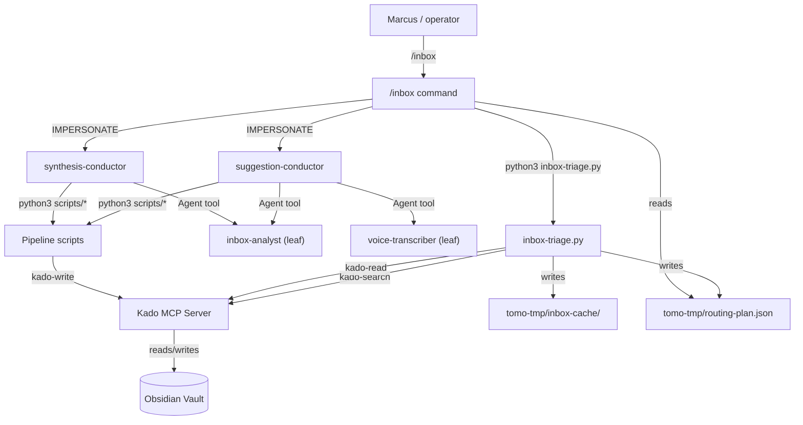
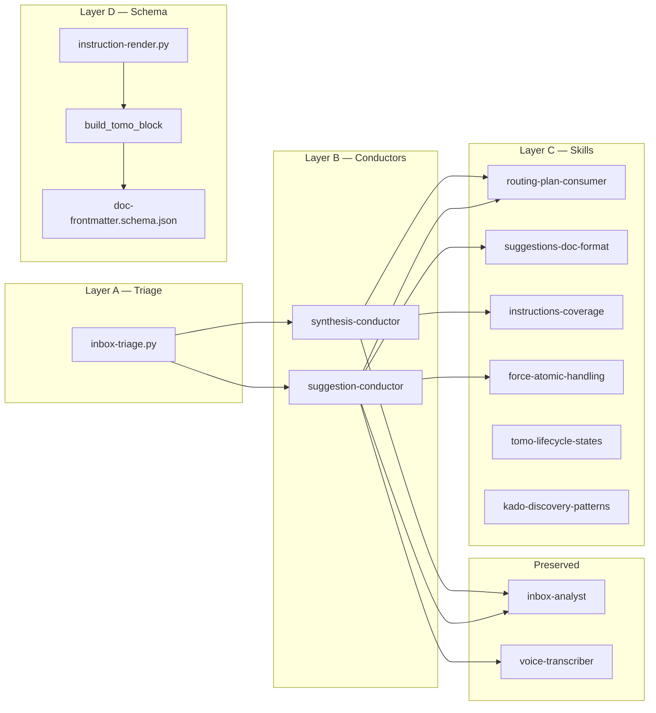
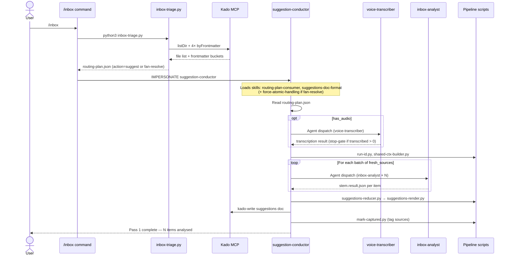
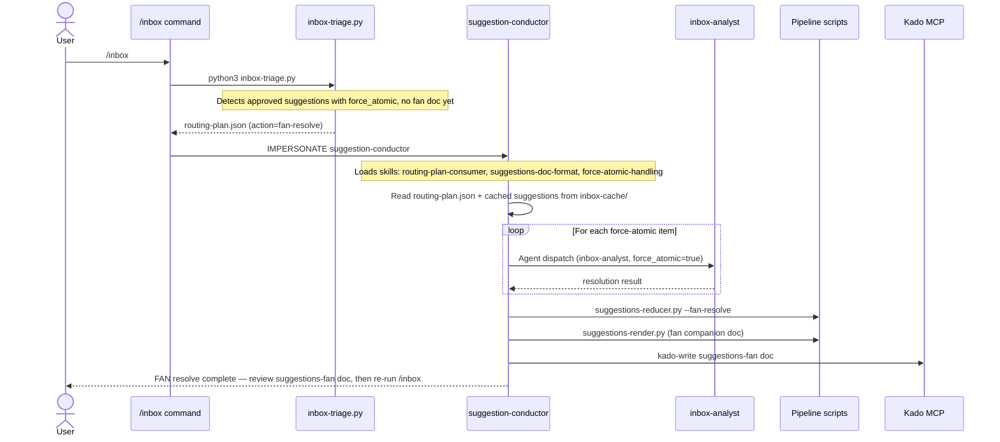
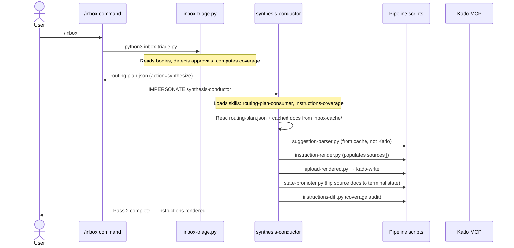

# Solution Design Document

## Validation Checklist

### CRITICAL GATES (Must Pass)

- [ ] All required sections are complete
- [ ] No [NEEDS CLARIFICATION] markers remain
- [ ] Architecture pattern is clearly stated with rationale
- [ ] **All architecture decisions confirmed by user**
- [ ] Every interface has specification

### QUALITY CHECKS (Should Pass)

- [ ] All context sources are listed with relevance ratings
- [ ] Project commands are discovered from actual project files
- [ ] Constraints → Strategy → Design → Implementation path is logical
- [ ] Every component in diagram has directory mapping
- [ ] Error handling covers all error types
- [ ] Quality requirements are specific and measurable
- [ ] Component names consistent across diagrams
- [ ] A developer could implement from this design
- [ ] Implementation examples use actual schema column names (not pseudocode), verified against migration files
- [ ] Complex queries include traced walkthroughs with example data showing how the logic evaluates

---

## Constraints

**CON-1 — Docker container runtime.** All Tomo agents, scripts, and
skills run inside a Docker container (`tomo-instance/`). Runtime
agents can only read `$INSTANCE_PATH` + `/home/coder`. Host-repo
files (docs/, tests/) are invisible. Config and scripts are synced
at install/update time via `update-tomo.sh`.

**CON-2 — Claude Code agent architecture.** Subagents dispatched via
the `Agent` tool CANNOT themselves use the `Agent` tool (empirically
confirmed F-54 2026-05-22). Agents that need to dispatch further
agents MUST be impersonated (run in main session context).
Impersonated agents inherit the parent session's model — frontmatter
`model:` is ignored. Only dispatched agents honour model frontmatter.

**CON-3 — Kado MCP interface.** `kado-search byFrontmatter` is strict
equality only — no wildcard, no prefix matching. Querying
`tomo.state=pending-*` returns zero hits. Discovery requires N
separate calls (one per known state value). `kado-read` returns full
document body — no partial reads.

**CON-4 — Runtime hygiene.** Runtime files (`tomo/dot_claude/`) contain
only imperatives, tool invocations, and branching logic. No script
descriptions, spec refs, dates, or historical wording. Rationale
lives in `docs/tomo/<mirrored-path>.md`. `Why:` in STRICT blocks
only when Claude Code needs it to execute correctly.

**CON-5 — Token budget.** Pass-2 peak context ≤ 30k tokens (target),
≤ 40k hard cap. Pre-018 baseline: 65k. The budget includes conductor
spec + skills loaded + routing-plan + cached doc bodies.

## Implementation Context

### Required Context Sources

#### Documentation Context
```yaml
- doc: docs/XDD/specs/018-agent-architecture-cleanup/requirements.md
  relevance: CRITICAL
  why: "PRD v0.2 — all requirements, features, ACs, and decided OQs"

- doc: docs/XDD/specs/018-agent-architecture-cleanup/audit.md
  relevance: HIGH
  why: "Pre-018 agent inventory, dispatch classification, clutter density"

- doc: docs/XDD/specs/018-agent-architecture-cleanup/audit-2026-05-25.md
  relevance: HIGH
  why: "Runtime-deviation risk audit — violation inventory for cleanup"

- doc: docs/XDD/specs/017-tomo-lifecycle-tags/solution.md
  relevance: MEDIUM
  why: "STATE_MACHINE design, doc-frontmatter schema foundation"
```

#### Code Context
```yaml
- file: tomo/dot_claude/agents/inbox-orchestrator.md
  relevance: CRITICAL
  why: "760-line monolith being replaced — must trace every code path"

- file: tomo/dot_claude/agents/instruction-builder.md
  relevance: CRITICAL
  why: "380-line monolith being replaced — Steps 2-6 + MOC branch"

- file: tomo/dot_claude/commands/inbox.md
  relevance: CRITICAL
  why: "120-line command being rewritten as thin router"

- file: tomo/scripts/inbox-discovery.py
  relevance: HIGH
  why: "247-line discovery script being replaced by inbox-triage.py"

- file: tomo/scripts/lib/doc_frontmatter.py
  relevance: HIGH
  why: "build_tomo_block() API — source_refs interface changes to sources"

- file: tomo/schemas/doc-frontmatter.schema.json
  relevance: HIGH
  why: "Schema being extended — patternProperties → explicit sources"

- file: tomo/scripts/instruction-render.py
  relevance: HIGH
  why: "1724-line renderer — must populate sources[] at render time"

- file: tomo/scripts/lib/tomo_lifecycle.py
  relevance: MEDIUM
  why: "STATE_MACHINE definition, validate_transition(), is_pending()"

- file: tomo/dot_claude/agents/inbox-analyst.md
  relevance: MEDIUM
  why: "622-line leaf agent — kept, dispatched by conductors"

- file: tomo/dot_claude/agents/voice-transcriber.md
  relevance: MEDIUM
  why: "268-line leaf agent — kept, dispatched by suggestion-conductor"

- file: tomo/scripts/voice-precheck.py
  relevance: MEDIUM
  why: "Audio cache check — triage uses this to decide transcribe action"

- file: tomo/scripts/suggestion-parser.py
  relevance: MEDIUM
  why: "1433-line parser consumed by synthesis-conductor"

- file: tomo/scripts/suggestions-reducer.py
  relevance: MEDIUM
  why: "Aggregator consumed by suggestion-conductor Phase C"
```

### Implementation Boundaries

- **Must Preserve**: inbox-analyst.md (leaf agent, dispatched),
  voice-transcriber.md (leaf agent, dispatched), all tomo/scripts/
  (except inbox-discovery.py), STATE_MACHINE definition, kado_client
  patterns, update-tomo.sh sync logic, tomo-tmp/ scratch dir layout
- **Can Modify**: /inbox command (rewrite), doc-frontmatter.schema.json
  (extend), build_tomo_block() API (change source_refs → sources),
  instruction-render.py (populate sources), inbox-analyst.md (minor —
  update dispatch interface if needed)
- **Must Not Touch**: Kado server, Hashi plugin, /moc-propose command,
  /explore-vault, /execute, vault-explorer, vault-executor,
  moc-architect, tomo-setup

### External Interfaces

#### System Context Diagram



#### Interface Specifications

```yaml
inbound:
  - name: "/inbox command"
    type: Claude Code slash command
    format: Markdown agent spec
    authentication: Session-level (Claude Code)
    data_flow: "User triggers → triage → routing → conductor → output"

outbound:
  - name: "Kado MCP"
    type: HTTP (localhost:23026)
    format: MCP StreamableHTTP
    authentication: Bearer token
    data_flow: "All vault reads/writes go through Kado"
    criticality: CRITICAL

data:
  - name: "tomo-tmp/ scratch directory"
    type: Local filesystem (container)
    data_flow: "Inter-step data passing, caching, state"

  - name: "Vault frontmatter (tomo: block)"
    type: YAML frontmatter in .md files
    data_flow: "Lifecycle state, source tracking, coverage"
```

### Project Commands

```bash
# Tests (host-side, not in container)
Test:    python3 -m pytest tests/ -v
Lint:    python3 -m ruff check tomo/scripts/ scripts/
Type:    python3 -m mypy tomo/scripts/lib/

# Instance sync
Sync:    bash scripts/update-tomo.sh

# Token measurement
Measure: python3 scripts/measure-inbox-pass-2-token-cost.py --session-latest
```

## Solution Strategy

- **Architecture Pattern:** Layered pipeline with deterministic triage
  routing. A Python triage script makes all routing decisions
  deterministically; thin conductor agents handle orchestration only;
  domain knowledge lives in lazy-loaded skills; the schema tracks
  source provenance and drift.

- **Integration Approach:** Drop-in replacement. The `/inbox` command
  entry point stays the same. The triage script replaces both the
  command's inline auto-discovery logic AND `inbox-discovery.py`. Two
  new conductor agents replace the two monoliths. Leaf agents
  (inbox-analyst, voice-transcriber) are kept unchanged.

- **Justification:** The 4-layer split (triage → conductors → skills →
  schema) addresses all three PRD problems: P1 (MOC-proposal
  visibility) is fixed at the triage layer; P2 (token burn) is fixed
  by moving triage to a script; P3 (monolith loading) is fixed by
  decomposing into thin conductors + lazy skills.

- **Key Decisions:**
  - Triage-first: all routing decisions are made by a deterministic
    script before any LLM context is loaded (ADR-1)
  - Source tracking as objects: `sources: [{path, checksum}]` enables
    both coverage and drift detection in a single field (ADR-3)
  - Big-bang migration: no dual-path; old agents deleted at end (ADR-6)

## Building Block View

### Components



### Directory Map

**New files:**
```
tomo/
├── scripts/
│   └── inbox-triage.py                    # NEW: Layer A — deterministic triage
├── schemas/
│   └── routing-plan.schema.json           # NEW: strict routing-plan schema
├── dot_claude/
│   ├── agents/
│   │   ├── suggestion-conductor.md        # NEW: Layer B — Pass 1 orchestrator
│   │   └── synthesis-conductor.md         # NEW: Layer B — Pass 2 orchestrator
│   └── skills/
│       ├── routing-plan-consumer/SKILL.md # NEW: Layer C — routing-plan reader
│       ├── suggestions-doc-format/SKILL.md# NEW: Layer C — doc layout patterns
│       ├── instructions-coverage/SKILL.md # NEW: Layer C — coverage semantics
│       ├── force-atomic-handling/SKILL.md # NEW: Layer C — FAN sub-flow
│       ├── tomo-lifecycle-states/SKILL.md # NEW: Layer C — state machine patterns
│       └── kado-discovery-patterns/SKILL.md# NEW: Layer C — Kado recipes
docs/
├── tomo/
│   └── dot_claude/
│       ├── agents/
│       │   ├── suggestion-conductor.md    # NEW: WHY docs for conductor
│       │   ├── synthesis-conductor.md     # NEW: WHY docs for conductor
│       │   ├── inbox-orchestrator.md      # NEW: WHY harvest before deletion
│       │   └── instruction-builder.md     # NEW: WHY harvest before deletion
│       └── commands/
│           └── inbox.md                   # NEW: WHY docs for router rewrite
```

**Modified files:**
```
tomo/
├── dot_claude/
│   └── commands/
│       └── inbox.md                       # MODIFY: rewrite as thin router
├── schemas/
│   └── doc-frontmatter.schema.json        # MODIFY: add sources field
├── scripts/
│   ├── lib/
│   │   └── doc_frontmatter.py             # MODIFY: build_tomo_block() API
│   └── instruction-render.py              # MODIFY: populate sources[]
```

**Deleted files:**
```
tomo/
├── dot_claude/
│   └── agents/
│       ├── inbox-orchestrator.md           # DELETE: replaced by suggestion-conductor
│       └── instruction-builder.md          # DELETE: replaced by synthesis-conductor
├── scripts/
│   └── inbox-discovery.py                  # DELETE: replaced by inbox-triage.py
```

### Interface Specifications

#### routing-plan.json Schema

The central new artifact. Strict typed (`additionalProperties: false`)
to prevent field drift.

```json
{
  "$schema": "http://json-schema.org/draft-07/schema#",
  "title": "Tomo Inbox Routing Plan",
  "type": "object",
  "required": ["action", "timestamp", "inbox_path"],
  "additionalProperties": false,
  "properties": {
    "action": {
      "type": "string",
      "enum": ["suggest", "fan-resolve", "synthesize", "transcribe", "idle"],
      "description": "Which conductor to impersonate, or idle/transcribe"
    },
    "timestamp": {
      "type": "string",
      "format": "date-time"
    },
    "inbox_path": {
      "type": "string",
      "description": "Vault-relative inbox folder path"
    },
    "fresh_sources": {
      "type": "array",
      "items": {
        "type": "object",
        "required": ["path"],
        "additionalProperties": false,
        "properties": {
          "path": {"type": "string"},
          "modified": {"type": "string"}
        }
      },
      "description": "New .md files not yet classified"
    },
    "has_audio": {
      "type": "boolean",
      "description": "True if uncached audio files exist in inbox"
    },
    "approved_suggestions": {
      "type": "array",
      "items": {
        "type": "object",
        "required": ["path"],
        "additionalProperties": false,
        "properties": {
          "path": {"type": "string"},
          "modified": {"type": "string"},
          "cache_path": {"type": "string"}
        }
      },
      "description": "Suggestions docs with [x] Approved ticked"
    },
    "approved_fan": {
      "type": "array",
      "items": {
        "type": "object",
        "required": ["path"],
        "additionalProperties": false,
        "properties": {
          "path": {"type": "string"},
          "modified": {"type": "string"},
          "cache_path": {"type": "string"}
        }
      },
      "description": "Suggestions-fan docs with [x] Approved ticked"
    },
    "approved_moc_proposals": {
      "type": "array",
      "items": {
        "type": "object",
        "required": ["path"],
        "additionalProperties": false,
        "properties": {
          "path": {"type": "string"},
          "modified": {"type": "string"},
          "cache_path": {"type": "string"}
        }
      },
      "description": "MOC-proposal docs with [x] Accept ticked"
    },
    "force_atomic_items": {
      "type": "array",
      "items": {
        "type": "object",
        "required": ["stem", "source_path"],
        "additionalProperties": false,
        "properties": {
          "stem": {"type": "string"},
          "source_path": {"type": "string"},
          "section_id": {"type": "string"}
        }
      },
      "description": "Items with [x] Force Atomic Note ticked"
    },
    "pending_approval": {
      "type": "array",
      "items": {
        "type": "object",
        "required": ["path", "doc_type"],
        "additionalProperties": false,
        "properties": {
          "path": {"type": "string"},
          "doc_type": {"type": "string"},
          "message": {"type": "string"}
        }
      },
      "description": "Docs awaiting user approval (not yet ticked)"
    },
    "idle_reasons": {
      "type": "array",
      "items": {"type": "string"},
      "description": "Human-readable reasons for idle action"
    },
    "drift_indicators": {
      "type": "array",
      "items": {
        "type": "object",
        "required": ["path", "type"],
        "additionalProperties": false,
        "properties": {
          "path": {"type": "string"},
          "type": {"type": "string", "enum": ["checksum_mismatch", "orphaned_state", "missing_source"]},
          "detail": {"type": "string"}
        }
      },
      "description": "Drift warnings (non-blocking in v1)"
    },
    "skip_stems": {
      "type": "array",
      "items": {"type": "string"},
      "description": "F-9: stems to exclude from suggestion-conductor"
    },
    "metrics": {
      "type": "object",
      "additionalProperties": false,
      "properties": {
        "listDir_ms": {"type": "number"},
        "byFrontmatter_ms": {"type": "number"},
        "body_reads_ms": {"type": "number"},
        "total_ms": {"type": "number"},
        "kado_calls": {"type": "integer"},
        "docs_cached": {"type": "integer"}
      }
    }
  }
}
```

#### inbox-cache Structure

Triage materialises full doc bodies so conductors read locally:

```
tomo-tmp/inbox-cache/
├── 2026-05-22_1432_suggestions.md        # body of approved suggestions
├── 2026-05-23_1328_suggestions-fan.md    # body of approved fan companion
├── 2026-05-22_1832_moc-proposal-board-games.md  # body of accepted proposal
└── manifest.json                          # {filename: {vault_path, checksum, cached_at}}
```

Naming: vault filename preserved (no path encoding). Flat directory —
all inbox workflow docs have unique timestamped filenames.

#### sources[] Frontmatter Shape (Layer D)

**SDD refinement over PRD v0.2:** `sources` is an array of objects
(not strings) to embed checksums for drift detection.

```yaml
tomo:
  doc_type: instructions
  state: pending-apply
  run_id: "2026-05-26-143022-a1b2c3"
  updated_at: "2026-05-26T14:30:22Z"
  sources:
    - path: "100 Inbox/2026-05-22_1432_suggestions.md"
      checksum: "sha256:e3b0c44298fc1c149afb..."
    - path: "100 Inbox/2026-05-23_1328_suggestions-fan.md"
      checksum: "sha256:7f83b1657ff1fc53b92d..."
    - path: "100 Inbox/2026-05-22_1832_moc-proposal-board-games.md"
      checksum: "sha256:4a44dc15364204a80fe8..."
```

Schema change in `doc-frontmatter.schema.json`:

```json
{
  "tomo": {
    "properties": {
      "sources": {
        "type": "array",
        "items": {
          "type": "object",
          "required": ["path"],
          "additionalProperties": false,
          "properties": {
            "path": {
              "type": "string",
              "description": "Vault-relative path to source document"
            },
            "checksum": {
              "type": "string",
              "pattern": "^sha256:[a-f0-9]{64}$",
              "description": "SHA-256 of document body at processing time"
            }
          }
        },
        "description": "Source documents feeding this instructions doc"
      }
    }
  }
}
```

Replaces the current `patternProperties: "^source_[a-z_]+$"` pattern.

#### build_tomo_block() API Change

Current signature:
```python
def build_tomo_block(
    doc_type: str, state: str, run_id: str,
    **source_refs: str,  # e.g. source_suggestions="100 Inbox/..."
) -> dict
```

New signature:
```python
def build_tomo_block(
    doc_type: str, state: str, run_id: str,
    sources: list[dict[str, str]] | None = None,
) -> dict
```

Callers migrate from:
```python
build_tomo_block("instructions", "pending-apply", run_id,
    source_suggestions="100 Inbox/2026-05-22_1432_suggestions.md")
```
to:
```python
build_tomo_block("instructions", "pending-apply", run_id,
    sources=[{"path": "100 Inbox/2026-05-22_1432_suggestions.md",
              "checksum": "sha256:..."}])
```

#### Conductor → Leaf Agent Dispatch Interface

Both conductors dispatch leaf agents from the main session (since
conductors are impersonated). The dispatch interface stays compatible
with the current inbox-analyst contract:

```yaml
# Agent tool dispatch (from conductor running in main session)
Agent:
  name: "inbox-analyst"
  prompt: |
    stem: <stem>
    path: <vault-relative-path>
    shared_ctx_path: tomo-tmp/shared-ctx.json
    state_path: tomo-tmp/inbox-state.jsonl
    items_dir: tomo-tmp/items/
    run_id: <run_id>
    force_atomic: <true|false>
```

### Implementation Examples

#### inbox-triage.py Algorithm

```
ALGORITHM: inbox-triage
INPUT:  inbox_path, flags (--force-pass1, --force-pass2, --recover)
OUTPUT: tomo-tmp/routing-plan.json + tomo-tmp/inbox-cache/*.md

 1. RESOLVE inbox_path via read-config-field.py --field concepts.inbox
 2. DISCOVER all files:
    a. kado-search listDir(inbox_path, depth=1) → all_files
    b. Partition: audio_files, md_files
 3. QUERY frontmatter (4 Kado calls, one per known state):
    a. byFrontmatter(tomo.state=pending-approval) → pending_approval_hits
    b. byFrontmatter(tomo.state=pending-accept)   → pending_accept_hits
    c. byFrontmatter(tomo.state=pending-apply)     → pending_apply_hits
    d. byFrontmatter(tomo.state=captured)           → captured_hits
 4. COMPUTE new sources:
    known_paths = union(all hits from step 3)
    new_sources = [f for f in md_files if f.path not in known_paths]
 5. CHECK audio:
    Run voice-precheck.py → {all_cached, missing}
    has_audio = len(audio_files) > 0 AND NOT all_cached
 6. READ approval state (body-reads for pending docs):
    FOR each doc in pending_approval_hits ∪ pending_accept_hits:
      body = kado-read(doc.path)
      Cache body → tomo-tmp/inbox-cache/<filename>.md
      IF doc_type in (suggestions, suggestions-fan):
        approved = body contains "- [x] Approved"
        Scan for "[x] Force Atomic Note" per item → force_atomic_items
      ELIF doc_type == moc-proposal:
        approved = body contains "- [x] Accept"
      IF approved: add to approved_* bucket
      ELSE: add to pending_approval[]
 7. COMPUTE coverage (from existing instructions):
    covered_paths = set()
    FOR each instr_doc in pending_apply_hits:
      fm = instr_doc.frontmatter.tomo
      FOR each source in fm.get("sources", []):
        covered_paths.add(source["path"])
    to_process = {d.path for d in approved_*} - covered_paths
 8. DETECT drift:
    FOR each instr_doc in pending_apply_hits:
      FOR each source in fm.get("sources", []):
        IF source["path"] in approved_paths AND source.get("checksum"):
          current = sha256(cached_body[source["path"]])
          IF current != source["checksum"]:
            drift_indicators.append(checksum_mismatch)
 9. DETERMINE action (first match wins):
    IF --force-pass1:                  action = "suggest"
    ELIF --force-pass2:                action = "synthesize"
    ELIF has_audio:                    action = "transcribe"
    ELIF force_atomic_items AND NOT fan_doc_exists:
                                       action = "fan-resolve"
    ELIF len(to_process) > 0:          action = "synthesize"
    ELIF --recover:
      fresh_sources = captured_hits    # treat as new
                                       action = "suggest"
    ELIF len(new_sources) > 0:         action = "suggest"
    ELSE:                              action = "idle"
10. BUILD routing-plan.json and write to tomo-tmp/
    Note: inbox_path is included in routing-plan.json (required field).
    Conductors and the /inbox command read it from there — no need to
    re-call read-config-field.py.
11. EMIT metrics to stderr for timing tracking
```

#### Coverage Computation — Traced Walkthrough

Given Privat-Test vault state:
- `2026-05-22_1432_suggestions.md` — approved ✓
- `2026-05-23_1328_suggestions-fan.md` — approved ✓
- `2026-05-22_1832_moc-proposal-board-games.md` — accepted ✓
- `2026-05-24_0900_instructions.md` — existing, sources:
  `[{path: "...suggestions.md", checksum: "sha256:abc"}]`

Step 7 computes: `covered_paths = {"...suggestions.md"}`
Step 7 result: `to_process = {"...suggestions-fan.md", "...moc-proposal-board-games.md"}`
Step 9: `len(to_process) == 2 > 0` → `action = "synthesize"`

The routing-plan sends only the fan-doc and moc-proposal to
synthesis-conductor. The already-covered suggestions doc is skipped
(AC-7 satisfied). synthesis-conductor produces a new instructions doc
covering the remaining two sources (AC-8 satisfied).

## Runtime View

### Primary Flow: Suggest (Pass 1)



### Primary Flow: FAN Resolve (Pass 1b)

FAN resolve moves to suggestion-conductor (ADR-7). It's analysis
work: dispatching inbox-analyst, producing a suggestions-fan doc.
The output goes through the same approval cycle as regular suggestions.



### Primary Flow: Synthesize (Pass 2)

synthesis-conductor handles only rendering — no analysis branches.
All inputs are approved and complete (including fan docs if needed).



### Primary Flow: Idle

```
1. Triage runs, finds no actionable items
2. /inbox reads routing-plan.json with action=idle
3. /inbox surfaces idle_reasons[] and pending_approval[] to user
4. Exit 0
```

### Primary Flow: Transcribe (stop-gate)

```
1. Triage detects untranscribed audio (audio files without a sibling .md)
   voice-precheck.py determines this: for each audio file, check if a
   sibling .md with the sanitized stem exists. If all have transcripts,
   has_audio=false and this flow is skipped entirely.
2. routing-plan.json: action=transcribe, has_audio=true
3. /inbox dispatches voice-transcriber directly (no conductor impersonation)
4. voice-transcriber transcribes audio → writes sibling .md files
5. /inbox reports: "N transcript(s) created. Review, then re-run /inbox."
6. Exit 0 (stop-gate — next run picks up transcripts as new sources)
```

### Error Handling

| Error | Layer | Handling |
|-------|-------|----------|
| Kado unreachable | Triage | Exit 1 with clear error; no routing-plan written |
| kado-read fails for one doc | Triage | Skip doc, add to `drift_indicators` with type=missing_source |
| Schema validation fails | Triage | Exit 2 — routing-plan.json not written, error on stderr |
| Conductor skill load fails | Conductor | Fallback: proceed without skill, log warning |
| Leaf agent times out | Conductor | Mark item as failed in state-file, continue batch |
| instruction-render.py fails | Synthesis | Exit non-zero, conductor reports failure, no state flip |
| sources[] checksum mismatch | Triage | Non-blocking: drift_indicators[], conductor still processes |

### Complex Logic: Action Determination

```
ALGORITHM: determine_action
INPUT:  flags, has_audio, to_process, new_sources, captured,
        force_atomic_items, fan_doc_exists
OUTPUT: action enum

Priority order (first match wins):
  1. --force-pass1       → "suggest"     (override, ignores all state)
  2. --force-pass2       → "synthesize"  (override, even if nothing approved)
  3. has_audio           → "transcribe"  (stop-gate: audio before analysis)
  4. force_atomic_items present
     AND NOT fan_doc_exists → "fan-resolve" (FAN before synthesis — ADR-7)
  5. to_process non-empty→ "synthesize"  (approved items not yet covered)
  6. --recover           → "suggest"     (captured items treated as fresh)
  7. new_sources present → "suggest"     (new items to classify)
  8. else                → "idle"        (nothing to do)
```

## Deployment View

No change to existing deployment. New files are synced to the Docker
container instance via `update-tomo.sh` (existing mechanism).

New files added to sync:
- `tomo/scripts/inbox-triage.py`
- `tomo/schemas/routing-plan.schema.json`
- `tomo/dot_claude/agents/suggestion-conductor.md`
- `tomo/dot_claude/agents/synthesis-conductor.md`
- 6 skill directories under `tomo/dot_claude/skills/`

Deleted files removed from sync:
- `tomo/dot_claude/agents/inbox-orchestrator.md`
- `tomo/dot_claude/agents/instruction-builder.md`
- `tomo/scripts/inbox-discovery.py`

## Cross-Cutting Concepts

### Pattern Documentation

```yaml
- pattern: Deterministic triage → LLM orchestration
  relevance: CRITICAL
  why: "Core architectural pattern for 018. Script computes routing; LLM handles content."

- pattern: Impersonate conductors, dispatch leaves
  relevance: CRITICAL
  why: "F-54 constraint. Conductors need Agent tool access → must run in main session."

- pattern: Skill-based lazy loading
  relevance: HIGH
  why: "Reduces conductor token footprint. Skills loaded only on branches that need them."

- pattern: Cache-once, read-many
  relevance: HIGH
  why: "Triage reads and caches doc bodies. Conductors read from cache, never re-fetch via Kado."

- pattern: Frontmatter as coverage ledger
  relevance: HIGH
  why: "instructions.sources[] is the single truth for what has been processed."
```

### User Interface & UX

Not applicable — no UI changes. `/inbox` command interface preserved.

### System-Wide Patterns

- **Error Handling**: Triage exits non-zero on fatal errors; conductors
  handle per-item failures gracefully (mark failed in state-file,
  continue). Schema validation failures are fatal (exit 2).
- **Performance**: Token budget managed by: (a) triage in Bash not LLM,
  (b) conductors load only needed skills, (c) doc bodies read from
  cache. Triage timing exposed in routing-plan metrics.
- **Logging/Auditing**: Triage emits timing metrics to stderr.
  Conductors use existing state-file (`inbox-state.jsonl`) pattern.
  Lifecycle events emitted per existing `lifecycle.discovery` pattern.

### Multi-Component Patterns

Not applicable — single-system architecture. Kado is the only
external boundary, accessed via established kado_client patterns.

## Architecture Decisions

- [x] **ADR-1 — Triage-first routing:** All routing decisions made by
  `inbox-triage.py` before any LLM context is loaded.
  - Rationale: Deterministic triage eliminates P2 (25k+ tokens burned
    on checkbox scanning). Script can make 4 Kado calls + body-reads
    in ~2s vs. loading full agent specs into LLM context.
  - Trade-offs: Two-step invocation (script then conductor) vs. single
    agent. Adds a filesystem handoff (routing-plan.json). Acceptable
    given the token savings.
  - User confirmed: ✅

- [x] **ADR-2 — Skills at `tomo/dot_claude/skills/`:** New 018 skills
  placed alongside existing skills, not at `tomo/skills/`.
  - Rationale: Consistent with existing 6 skills. update-tomo.sh sync
    already handles this path. Claude Code skill loader discovers them.
  - Trade-offs: PRD reference (`tomo/skills/`) needs correction.
  - User confirmed: ✅ (session decision)

- [ ] **ADR-3 — Sources as object array with checksums:** `sources`
  field in instructions frontmatter is `[{path, checksum}]`, not
  `string[]` as PRD v0.2 specified.
  - Rationale: Embeds drift-detection checksums alongside paths in a
    single self-describing field. No separate checksum store needed.
    Extensible — future fields (e.g. `processed_at`) can be added
    per-source without schema restructuring.
  - Trade-offs: Slightly more complex than flat string array. Coverage
    computation extracts `.path` from each object. Consumers must
    handle the object shape. PRD v0.2 requires update.
  - User confirmed: ✅ (session decision, "In instructions frontmatter")

- [ ] **ADR-4 — Model escalation via leaf dispatch:** Conductors
  (impersonated) run at session model. Opus-level reasoning is
  achieved by dispatching leaf agents with `model: opus` in the Agent
  tool call.
  - Rationale: CON-2 constraint — impersonated agents inherit session
    model; only dispatched agents honour model frontmatter. Leaf
    dispatch is the only mechanism for selective model escalation.
  - Trade-offs: Heavy reasoning must be delegable to a leaf agent.
    Full-session opus requires launching /inbox in an opus session.
    Platform constraint — no alternative exists.
  - User confirmed: ✅ (leaf dispatch at opus, per-task granularity)

- [x] **ADR-5 — Strict routing-plan schema:** `routing-plan.schema.json`
  with `additionalProperties: false` on all objects.
  - Rationale: OQ3 decision. Lesson from F-47 force_atomic drift where
    unvalidated fields silently no-oped.
  - Trade-offs: Schema changes require coordinated updates to triage
    script and consuming conductors. Acceptable — the coordination
    cost is the point (prevents silent drift).
  - User confirmed: ✅

- [x] **ADR-6 — Big-bang migration:** Build all new files → write tests
  → live-test on Privat-Test vault → delete old files (last commit).
  - Rationale: OQ8 decision. Safety net during live test. No dual-path
    means no fallback complexity.
  - Trade-offs: Old and new agents coexist on the feature branch during
    development. Deletion is a named commit, not a side-effect.
  - User confirmed: ✅

- [x] **ADR-7 — FAN resolve in suggestion-conductor (Pass 1b):**
  Force-Atomic-Note resolution moves from synthesis-conductor to
  suggestion-conductor. Triage routes `action=fan-resolve` when
  approved suggestions have force_atomic items and no fan doc exists.
  - Rationale: FAN resolve is analysis work (dispatching inbox-analyst,
    producing a suggestions-type artifact). It belongs in the analysis
    conductor, not the rendering conductor. This makes
    synthesis-conductor purely about rendering — no analysis branches.
    The fan doc goes through the same user-approval cycle as regular
    suggestions before feeding into synthesis.
  - Trade-offs: Adds a `fan-resolve` action to routing-plan. Adds an
    extra /inbox cycle (FAN resolve → user review → synthesis) but
    this is already the current behavior — instruction-builder halts
    after FAN resolve today. suggestion-conductor now has two modes
    (fresh classify + FAN resolve) but both use inbox-analyst as leaf.
  - User confirmed: ✅ (session decision)

## Quality Requirements

| Quality | Target | Measurement |
|---------|--------|-------------|
| Pass-2 peak context | ≤ 30k tokens (hard cap: 40k) | `measure-inbox-pass-2-token-cost.py` |
| Pass-1 main-thread cost | ≤ 75% of pre-018 | `measure-inbox-phase-b-token-cost.py` |
| Coverage false-negatives | 0 | AC-7 / AC-8 manual verification |
| MOC-proposal pickup | 100% | AC-1 / AC-2 manual run on Privat-Test |
| Triage wall-clock | < 10s for typical inbox | routing-plan metrics.total_ms |
| Conductor content | Orchestration-only | Manual inspection per AC-9 |

## Acceptance Criteria

### Main Flow Criteria

- [ ] **AC-1/PRD:** WHEN a `*_moc-proposal-*.md` with `[x] Accept` exists AND no other approved items exist, THE SYSTEM SHALL invoke synthesis-conductor AND the resulting instructions doc SHALL list the proposal in `sources[].path`
- [ ] **AC-2/PRD:** WHEN approved suggestions AND approved moc-proposal both exist, THE SYSTEM SHALL produce ONE instructions doc covering both in a single synthesis-conductor invocation
- [ ] **AC-3/PRD:** WHEN only an unticked moc-proposal exists, THE SYSTEM SHALL route to suggestion-conductor (not synthesis) AND surface the proposal in `routing-plan.pending_approval[]`
- [ ] **AC-4/PRD:** WHEN /inbox runs, THE SYSTEM SHALL execute exactly one `inbox-triage.py` call before any conductor impersonation AND SHALL NOT perform in-command routing logic
- [ ] **AC-5/PRD:** WHEN synthesis-conductor processes a cached document, THE SYSTEM SHALL read from `tomo-tmp/inbox-cache/`, NOT via kado-read

### Coverage Criteria

- [ ] **AC-7/PRD:** IF an instructions doc lists `sources: [{path: "X"}]` AND X still has `[x] Approved`, THEN THE SYSTEM SHALL NOT include X in `routing-plan.approved_suggestions[]`
- [ ] **AC-8/PRD:** IF approved docs A and B exist AND instructions covers only A, THEN THE SYSTEM SHALL process B only

### Drift Detection Criteria

- [ ] **DRIFT-1:** WHEN a covered source doc's body has changed since instructions were rendered, THE SYSTEM SHALL surface a `checksum_mismatch` entry in `routing-plan.drift_indicators[]`
- [ ] **DRIFT-2:** THE SYSTEM SHALL NOT block processing based on drift indicators (warn-only in v1)

### Hygiene Criteria

- [ ] **AC-9/PRD:** THE conductor files SHALL contain only orchestration logic (routing, dispatch, branching) with domain knowledge in skills
- [ ] **AC-13/PRD:** THE runtime files SHALL contain no script descriptions, spec refs, dates, or historical wording
- [ ] **AC-14/PRD:** BEFORE any rationale-shaped content is stripped from a runtime file, THE corresponding `docs/tomo/` entry SHALL capture the WHY

### Migration Criteria

- [ ] **AC-11/PRD:** WHEN 018 implementation is complete, `inbox-orchestrator.md` and `instruction-builder.md` SHALL NOT exist in `tomo/dot_claude/agents/`
- [ ] **AC-12/PRD:** WHEN /inbox runs end-to-end on the Privat-Test vault, THE peak Pass-2 context SHALL be at most 40k tokens (target: 30k)

## Risks and Technical Debt

### Known Technical Issues

- **instruction-render.py source_* mapping (line 1117-1119):** Hardcoded
  `_UPSTREAM_TO_SOURCE_KEY` dict maps upstream types to `source_*`
  field names. Must be replaced with `sources[]` population logic.
  Legacy code path at line 1173-1177 emits `source_suggestions` for
  pre-F-47 callers — can be deleted (big-bang, no backward compat).

- **inbox-orchestrator sequential state-promotion (Phase A2.5e):** The
  current instruction-builder dispatch loop is sequential (one
  instruction-builder per pending doc). 018's triage computes coverage
  upfront, eliminating the need for sequential promotion during routing.

### Technical Debt

- **inbox-analyst.md at 622 lines:** The leaf agent is kept but is the
  largest remaining agent. Not in 018 scope, but worth noting for
  future decomposition.
- **suggestions-reducer.py inline rendering:** The reducer currently
  renders markdown inline. F-11 (suggestions-pipeline.py) would
  collapse this into a single wrapper — Should priority in PRD.

### Implementation Gotchas

- **Kado byFrontmatter strict equality:** Cannot query
  `tomo.state=pending-*`. Must fan out to N calls (one per state
  value). Alternative: query by `tomo.doc_type` instead (5 calls,
  one per type) and filter state locally — gets both pending and
  terminal docs in one call per type, which helps coverage computation.
  Or: single listDir + per-file frontmatter reads (proportional to
  inbox size, not vault size). Exact strategy decided at
  implementation time based on typical inbox sizes.
- **Checkbox scanning requires full body:** Kado has no partial-body
  read. Triage must `kado-read` each pending doc's full body just to
  check one checkbox. This is the reason for the cache — read once,
  cache for downstream.
- **patternProperties removal:** Removing `^source_[a-z_]+$` from the
  schema is a clean break — no existing instructions docs in production
  use `source_*` fields (feature not yet shipped). Test vault will be
  reset. No migration needed.
- **build_tomo_block() callers:** `instruction-render.py` is the
  primary caller. Also check: `suggestions-reducer.py` (emits
  suggestions tomo block, not instructions — unaffected by sources
  change), `mark-captured.py` (emits source tomo block — unaffected).
- **voice-transcriber stop-gate:** The transcribe action bypasses both
  conductors entirely. /inbox dispatches voice-transcriber directly,
  then exits. This preserves the current "transcribe → review → re-run"
  UX (users review transcripts before classification).

## Glossary

### Domain Terms

| Term | Definition | Context |
|------|------------|---------|
| Pass 1 | Fresh inbox items → classification → suggestions document | suggestion-conductor scope |
| Pass 2 | Approved suggestions/proposals → instructions + atomic notes | synthesis-conductor scope |
| Suggestions doc | Markdown document with per-item analysis and decision checkboxes | Output of Pass 1, input to Pass 2 |
| Instructions doc | Machine-readable instruction set (JSON) + human-readable view (MD) | Output of Pass 2, consumed by Hashi |
| MOC-proposal | Proposed new MOC with supporting items, produced by /moc-propose | Triggers Pass 2 when accepted |
| FAN (Force Atomic Note) | Per-item override forcing atomic note creation regardless of score | Triggers inbox-analyst re-dispatch |
| Coverage | Set of source docs already processed into instructions | Tracked via `sources[].path` in instructions frontmatter |
| Drift | Source doc modified after instructions were rendered from it | Detected via `sources[].checksum` comparison |

### Technical Terms

| Term | Definition | Context |
|------|------------|---------|
| Impersonation | Agent spec loaded into main session (no subagent spawn) | How conductors run — preserves Agent tool access |
| Dispatch | Agent spawned as subagent via Agent tool | How leaf agents run — isolated context |
| Routing plan | JSON manifest specifying which conductor to invoke and with what data | Central artifact of inbox-triage.py |
| Triage | Deterministic pre-scan of inbox state to produce routing plan | Replaces LLM-based auto-discovery |
| Conductor | Thin orchestration agent that reads routing-plan and dispatches leaves | Replaces monolithic agents |
| Stop-gate | Early exit after transcription, deferring classification to next run | voice-transcriber UX pattern |
