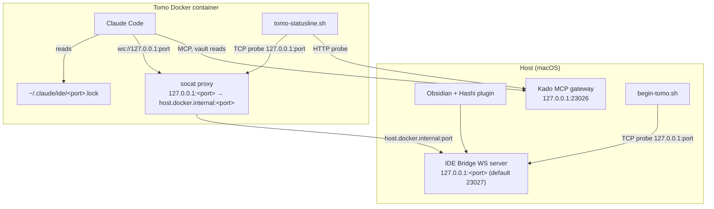
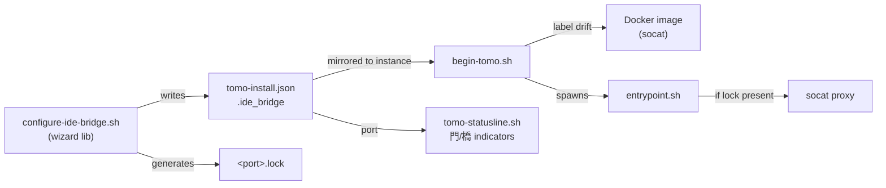
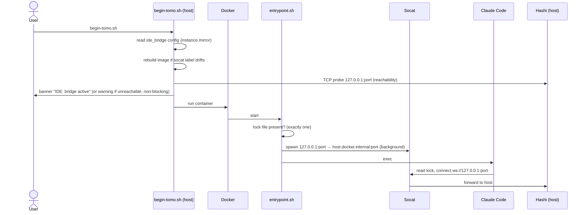

# Solution Design Document

## Validation Checklist

### CRITICAL GATES (Must Pass)

- [x] All required sections are complete
- [x] No [NEEDS CLARIFICATION] markers remain
- [x] Architecture pattern is clearly stated with rationale
- [x] **All architecture decisions confirmed by user**
- [x] Every interface has specification

### QUALITY CHECKS (Should Pass)

- [x] All context sources are listed with relevance ratings
- [x] Project commands are discovered from actual project files
- [x] Constraints → Strategy → Design → Implementation path is logical
- [x] Every component in diagram has directory mapping
- [x] Error handling covers all error types
- [x] Quality requirements are specific and measurable
- [x] Component names consistent across diagrams
- [x] A developer could implement from this design

---

## Constraints

- CON-1: Scripts must run on **bash 3.2** (macOS default) — no `declare -A`, no bash 4+ features.
- CON-2: `host.docker.internal` is the only host-reachability mechanism — macOS/OrbStack/Docker-Desktop specific; Linux is documented-as-unsupported for v0.1.
- CON-3: **No ports exposed** in `docker run` — the proxy runs entirely inside the container on localhost; the connection is host-only (`127.0.0.1`).
- CON-4: **Kado is the sole vault surface** (MiYo constitution) — the IDE Bridge wiring must not introduce any alternative vault-read path. Editor context (selection) arrives over the bridge; vault reads go through Kado.
- CON-5: Lock-file JSON must match Claude Code's expected schema exactly: `pid`, `workspaceFolders`, `ideName`, `transport`, `authToken`.
- CON-6: Changes are **additive** to the existing voice/Kado feature patterns — must not regress the voice wizard, the launch banner, or the current statusline.

## Implementation Context

### Required Context Sources

#### Code Context

```yaml
- file: scripts/install-tomo.sh
  relevance: HIGH
  why: "Wizard host. Mirror the voice wizard call site (sources lib/configure-voice.sh; uses prompt_default/prompt_yn; honors NON_INTERACTIVE)."

- file: scripts/lib/configure-voice.sh
  relevance: CRITICAL
  why: "Template for a new lib/configure-ide-bridge.sh — jq-merge a config block into tomo-install.json with schema_version/enabled/... fields."

- file: scripts/update-tomo.sh
  relevance: HIGH
  why: "Update-path wizard (keep / update token-or-port / disable) and tomo-install.json reads via jq."

- file: tomo-install.json
  relevance: HIGH
  why: "Config schema. Existing blocks: kado {host,port,protocol}, voice {schema_version,enabled,model,language}. Add a sibling ide_bridge block."

- file: docker/entrypoint.sh
  relevance: CRITICAL
  why: "v0.2.0. Where the socat proxy is conditionally spawned (before exec \"$@\"). on-start.sh hook is the reference pattern."

- file: docker/Dockerfile
  relevance: HIGH
  why: "v0.3.1. apt-get layer (add socat); voice uses ARG VOICE_ENABLED + image label tomo.voice_enabled for drift detection."

- file: scripts/lib/begin-tomo.sh.template
  relevance: HIGH
  why: "v0.11.0. Launch banner (Voice line pattern) + image-rebuild-on-label-drift logic to mirror; host-side reachability probe lives here."

- file: tomo/scripts/tomo-statusline.sh
  relevance: CRITICAL
  why: "v0.4.0. Kado render case block (lines ~189-196) + instance label 友 (lines ~184-186). Reformat Kado to 門:<port>, add 橋:<port> Hashi indicator."
```

### Implementation Boundaries

- **Must Preserve**: voice wizard flow, Kado statusline semantics (connectivity + Tags probe), existing launch banner lines, `tomo-install.json` existing keys.
- **Can Modify**: `install-tomo.sh` / `update-tomo.sh` (add wizard step), `docker/Dockerfile` (add socat), `docker/entrypoint.sh` (spawn proxy), `begin-tomo.sh.template` (banner + drift), `tomo-statusline.sh` (indicator redesign). Add `scripts/lib/configure-ide-bridge.sh`.
- **Must Not Touch**: the Kado MCP gateway and its permission gates (separate repo); no new vault-read path (CON-4).

### External Interfaces

#### System Context Diagram



### Project Commands

```bash
Install:    scripts/install-tomo.sh        # interactive wizard (+ --non-interactive)
Update:     scripts/update-tomo.sh         # keep / update / disable IDE Bridge
Launch:     <instance>/begin-tomo.sh       # builds image (drift-aware), prints banner, runs container
Test:       pytest tests/                  # host-only Python unit tests
Statusline: tomo/scripts/tomo-statusline.sh  # rendered by Claude Code inside the container
```

## Solution Strategy

- **Architecture Pattern**: Feature-mirror across the existing Tomo delivery surfaces. The IDE Bridge reuses the exact pattern the voice feature already established — a `configure-*.sh` wizard lib writing a typed block into `tomo-install.json`, an instance-mirrored config the launcher reads, a Dockerfile capability gated by an image label with drift-rebuild, and a statusline indicator.
- **Integration Approach**: Six touch points — (1) `lib/configure-ide-bridge.sh` + wizard call site, (2) lock-file generation in `tomo-home/.claude/ide/<port>.lock`, (3) `socat` in the image, (4) conditional proxy spawn in the entrypoint, (5) launch-banner line + reachability probe, (6) statusline indicator redesign.
- **Single source of truth for the port**: `tomo-install.json → ide_bridge.port` (default 23027). The lock-file name, the socat proxy, the banner probe, and the statusline indicator all derive from it.
- **Justification**: Mirroring the voice pattern minimizes new concepts, satisfies CON-6 (additive), and keeps the feature reviewable. No new architectural primitives are introduced.

### Feature 5 (Vault Path Resolution) — CLAUDE.md routing rule (Kokoro ADR-019 §5)

**Resolved 2026-05-28** (handoff `_inbox/from-kokoro/2026-05-28_kokoro-to-tomo_ide-bridge-vault-path-resolution.md`). Mechanism (a): a **namespace-based routing rule** encoded in the Tomo container `CLAUDE.md`, rendered from `tomo/CLAUDE.md.template`. Vault-note paths — the editor-context active file, `[[wikilinks]]`, `@`-mentions, and `kado-search` results — are read via `kado-read` first; local `Read` is reserved for container-local working files; an ambiguous bare relative path tries `kado-read` first and falls back to local `Read` only on a Kado not-found/denied result. No protocol prefix (ADR-019 §2.3 preserved); Hashi emits plain vault-relative paths. The bridge transport designed below is the prerequisite; this rule is the routing layer on top. Mechanism (b) (`kado:` prefix) is the documented reserve. Implementation is a single edit to `tomo/CLAUDE.md.template`, sequenced in the plan — it does not block Features 1–4, 6, 7.

## Building Block View

### Components



### Directory Map

```
.
├── scripts/
│   ├── install-tomo.sh                 # MODIFY: add IDE Bridge wizard call (alongside voice)
│   ├── update-tomo.sh                  # MODIFY: keep/update token-or-port/disable path
│   └── lib/
│       ├── configure-voice.sh          # REFERENCE: pattern to mirror
│       └── configure-ide-bridge.sh     # NEW: prompts + jq-merge .ide_bridge + lock-file gen
├── docker/
│   ├── Dockerfile                      # MODIFY: add socat to base apt-get layer
│   └── entrypoint.sh                   # MODIFY: conditional socat proxy spawn before exec
├── scripts/lib/
│   └── begin-tomo.sh.template          # MODIFY: banner line + reachability probe + drift label
└── tomo/
    ├── CLAUDE.md.template               # MODIFY: vault-path routing rule (Feature 5 / ADR-5)
    └── scripts/
        └── tomo-statusline.sh          # MODIFY: 門:<port> Kado reformat + 橋:<port> Hashi indicator
```

### Interface Specifications

#### Data: `tomo-install.json` — new `ide_bridge` block

```yaml
ide_bridge:
  schema_version: 1
  enabled: true                  # bool
  auth_token: "hashi_<uuid>"     # hashi_ prefix + 8-4-4-4-12 hex UUID; cleartext; host-only connection (see ADR-4 / Cross-Cutting)
  port: 23027                    # number, default 23027 (Kado uses 23026)
```

#### Data: IDE lock file — `tomo-home/.claude/ide/<port>.lock`

```json
{
  "pid": 0,
  "workspaceFolders": [],
  "ideName": "Obsidian",
  "transport": "ws",
  "authToken": "<hashi_<uuid> from ide_bridge.auth_token>"
}
```
- `pid: 0` — not meaningful across the host/container boundary.
- `workspaceFolders: []` — empty; IDE-only field, no meaning in this topology (PRD assumption).
- Exactly one `.lock` file is supported; the entrypoint fails fast on more than one.

#### Statusline indicator format (`tomo-statusline.sh`)

```
Kado:   門:23026 ✓   (GREEN)   門:23026 ✗   (RED)
        門:23026 ✓ Tags ✗ (YELLOW)   門:23026 ? (YELLOW, no_config)
Hashi:  橋:23027 ✓   (GREEN)   橋:23027 ✗   (RED)   橋:23027 ? (YELLOW, not configured)
```
- Color (GREEN/RED/YELLOW) is retained from the current implementation — not replaced by symbols.
- Hashi has no `Tags` sub-state (the IDE Bridge exposes no capability gate).
- Instance label `友 <instance>` rendering is unchanged.

## Runtime View

### Primary Flow: First-time setup (install/update wizard)

1. User runs `install-tomo.sh` (or `update-tomo.sh`).
2. After the voice wizard, the IDE Bridge wizard asks: enable? → auth token (validated `hashi_<uuid>`) → port (default 23027, validated numeric/in-range).
3. `configure-ide-bridge.sh` jq-merges the `ide_bridge` block into `tomo-install.json`.
4. The lock file is generated at `tomo-home/.claude/ide/<port>.lock`.
5. `--non-interactive` skips the wizard, preserving any existing config.

### Primary Flow: Launch + connect



### Error Handling

- **No lock file / IDE Bridge disabled** → entrypoint starts no proxy, no error (silent, per Feature 2 AC2).
- **Multiple `.lock` files** → entrypoint fails fast with a clear message pointing at the directory (Feature 1 edge case).
- **Hashi unreachable at launch** → non-blocking banner warning; launch continues (Feature 6).
- **Invalid auth token (not `hashi_<uuid>`) / invalid port (non-numeric / out of range)** → wizard rejects with a clear message (Feature 4).
- **socat dies mid-session** → no auto-restart; Claude Code's IDE protocol handles disconnection; user restarts the container (accepted risk).

## Deployment View

- **Environment**: Docker container (macOS host via OrbStack/Docker Desktop).
- **Configuration**: `tomo-install.json → ide_bridge`, mirrored into the instance; lock file in `tomo-home/.claude/ide/`.
- **Image change**: `socat` added to the base image; drift detected via image label so existing (pre-socat) images rebuild on next launch.
- **No new exposed ports**; proxy is container-localhost only.

## Cross-Cutting Concepts

### Security

- The auth token is stored cleartext in `tomo-install.json` and the lock file. This is acceptable **because the connection is host-only (`127.0.0.1`) and the file is bind-mounted into the container** — OS file-permission hardening (`0600`) does not hold across the macOS/Docker bind mount and adds no protection in this topology (PRD decision; ADR-4).
- CON-4 upheld: no new vault-read path; the bridge carries editor context only.

### Logging/Observability

- Tracking events (per PRD): IDE Bridge enabled/disabled, lock file created (port), socat proxy started (port, pid), begin-tomo IDE status (active/not-configured/error). Metadata only — no vault content (constitution L2).

## Architecture Decisions

- [x] **ADR-1 — socat availability**: Bake `socat` into the **base** Docker image (always present), not behind a conditional `ARG`.
  - Rationale: Feature 3 AC1 requires the proxy tool available "regardless of whether IDE Bridge is configured"; socat is ~1 MB; avoids a second drift dimension. Drift detection still rebuilds images built *before* socat existed (via a bumped image label).
  - Trade-offs: marginally larger base image for all users; diverges from the voice conditional-`ARG` precedent.
  - Alternative: conditional `ARG IDE_BRIDGE_ENABLED` mirroring voice (smaller default image, but contradicts AC1 and adds drift complexity).
  - User confirmed: Yes (2026-05-28)

- [x] **ADR-2 — proxy lifecycle**: The **entrypoint** spawns `socat` in the background (only if a lock file is present), **unsupervised**, before `exec "$@"`.
  - Rationale: simplest; entrypoint is the right layer for core infra (vs the user-facing `on-start.sh` hook); matches the PRD's accepted risk that a dead proxy is recovered by restarting the container.
  - Trade-offs: no auto-restart if socat crashes mid-session.
  - Alternative: a supervised restart loop (more robust, unwarranted for a host-only dev proxy).
  - User confirmed: Yes (2026-05-28)

- [x] **ADR-3 — reachability probe**: Detect Hashi reachability with a **TCP-connect test** to `127.0.0.1:<port>` (bash `/dev/tcp` or `nc -z`) — host-side in `begin-tomo.sh`, container-side (via the proxy) in the statusline. Not a full WS handshake, not lock-file-presence-only.
  - Rationale: a TCP accept is a cheap, accurate "something is listening" signal; lock-file presence can't detect "configured but Hashi down"; a WS handshake is heavy and fragile in shell.
  - Trade-offs: TCP-accept proves the port is open, not that the WS server is healthy; host-side it can't distinguish Hashi from another listener on that port. Acceptable for a status hint.
  - Alternative: lock-file-only (no network signal); WS handshake (accurate but fragile).
  - User confirmed: Yes (2026-05-28)

- [x] **ADR-4 — auth token storage**: Token lives cleartext in `tomo-install.json` (+ lock file); the `0600` permission requirement is dropped.
  - Rationale/Trade-offs: see Security. **Confirmed by PRD v1.1/v1.2** — not re-litigated here.

- [x] **ADR-5 — vault-path routing (Feature 5)**: A namespace-based routing rule in `tomo/CLAUDE.md.template` steers vault-relative paths (bridge active file, `[[wikilinks]]`, `@`-mentions, `kado-search` results) to `kado-read` first; local `Read` is reserved for container-local files, with a not-found/denied fallback. No protocol prefix.
  - Rationale: one rule covers every vault-path source (a prefix would tag only the bridge path); preserves ADR-019 §2.3 (no protocol extensions); fails closed since the vault is unmounted.
  - Trade-offs: relies on prompt-level steering; mechanism (b) (`kado:` prefix) retained as a documented reserve if steering proves unreliable (would need its own ADR + a Hashi convention + a Tomo parser).
  - **Confirmed by Kokoro ADR-019 §5 (2026-05-28).**

## Quality Requirements

- **Performance**: statusline Kado/Hashi probes must not block rendering — reuse the existing 60s statusline cache; per-probe timeout ≤ 3s (matching the current Kado probe).
- **Reliability**: container startup must never fail because IDE Bridge is unconfigured or Hashi is down (non-blocking everywhere).
- **Security**: no exposed ports; metadata-only tracking; no new vault-read path.
- **Compatibility**: all shell runs on bash 3.2.

## Acceptance Criteria (EARS)

**Lock file (PRD Feature 1)**
- [ ] WHEN the wizard completes with IDE Bridge enabled, THE SYSTEM SHALL write `tomo-home/.claude/ide/<port>.lock` with valid JSON (`pid:0`, `workspaceFolders:[]`, `ideName:"Obsidian"`, `transport:"ws"`, `authToken`).
- [ ] IF more than one `.lock` file exists, THEN THE SYSTEM SHALL fail fast and point the user at the directory.

**Proxy (PRD Feature 2)**
- [ ] WHILE a lock file is present, THE SYSTEM SHALL run a socat proxy forwarding container `127.0.0.1:<port>` → `host.docker.internal:<port>`.
- [ ] WHERE no lock file exists, THE SYSTEM SHALL start no proxy and surface no error.

**Image (PRD Feature 3)**
- [ ] THE SYSTEM SHALL include socat in every freshly built image.
- [ ] IF the running image predates socat, THEN THE SYSTEM SHALL rebuild on next launch (label drift).

**Wizard (PRD Feature 4)**
- [ ] WHEN install/update runs interactively, THE SYSTEM SHALL prompt enable / auth token / port and persist `ide_bridge` to `tomo-install.json`.
- [ ] IF the token is not a `hashi_<uuid>` or the port is non-numeric/out-of-range, THEN THE SYSTEM SHALL reject with a clear message.
- [ ] WHERE `--non-interactive`, THE SYSTEM SHALL skip configuration and preserve current state.

**Banner (PRD Feature 6)**
- [ ] WHEN begin-tomo.sh launches with IDE Bridge configured, THE SYSTEM SHALL show bridge status and, IF Hashi is unreachable, a non-blocking warning.

**Statusline (PRD Feature 7)**
- [ ] THE SYSTEM SHALL render Kado as `門:<port>` and Hashi as `橋:<port>` with retained GREEN/RED/YELLOW color; Hashi has no Tags sub-state.

**Vault path resolution (PRD Feature 5)**
- [ ] WHERE editor context provides an active-file vault path, THE SYSTEM SHALL read it via `kado-read`, not the local filesystem.
- [ ] WHEN a vault-relative reference (wikilink, @-mention, search result) needs content, THE SYSTEM SHALL route it through `kado-read` first.
- [ ] IF `kado-read` returns not-found/denied for an ambiguous bare path, THEN THE SYSTEM SHALL fall back to local `Read` (container-local only); a true vault path that is not local fails closed.

## Risks and Technical Debt

- **`host.docker.internal` not on Linux** (High/Low) — documented macOS-only for v0.1.
- **socat dies mid-session** (Medium/Low) — no supervisor (ADR-2); restart container.
- **TCP probe false-positive** (Low/Low) — another listener on the port reads as "reachable" (ADR-3 trade-off).
- **Token cleartext** (accepted) — host-only connection; see Security.
- **Feature 5 routing**: resolved (Kokoro ADR-019 §5, mechanism (a)); implementation is a `tomo/CLAUDE.md.template` edit, sequenced in the plan. Mechanism (b) (`kado:` prefix) documented as the reserve if prompt-steering proves unreliable.

## Glossary

| Term | Definition |
|------|------------|
| IDE Bridge | Hashi's WebSocket server implementing the Claude Code IDE protocol; pushes editor context (active file, selection) to Claude. |
| Lock file | `~/.claude/ide/<port>.lock` JSON that Claude Code reads to discover and authenticate to an IDE server. |
| socat | Lightweight TCP relay; here forwards container localhost to the host's bridge port. |
| `host.docker.internal` | DNS name resolving to the host from inside the container (macOS/OrbStack/Docker Desktop). |
| `workspaceFolders` | IDE-protocol lock-file field for editor workspace roots; empty here (no IDE workspace concept across the boundary). |
| Tags (statusline) | Kado-only capability probe — connected but tag-read denied → `Kado ✓ Tags ✗`. No Hashi equivalent. |
