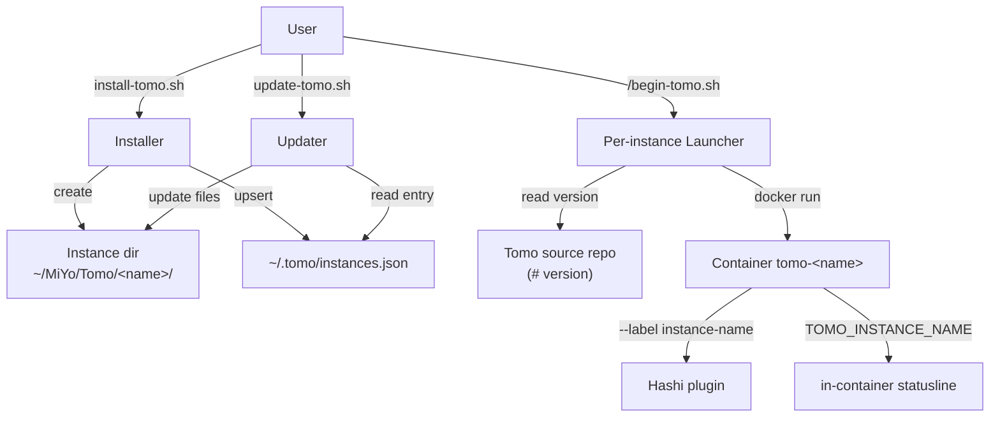

# Solution Design Document

## Validation Checklist

### CRITICAL GATES (Must Pass)

- [x] All required sections are complete
- [x] No [NEEDS CLARIFICATION] markers remain
- [x] Architecture pattern is clearly stated with rationale
- [x] **All architecture decisions confirmed by user** (ADR-1..ADR-7 confirmed 2026-05-31)
- [x] Every interface has specification

### QUALITY CHECKS (Should Pass)

- [x] Context sources listed with relevance ratings
- [x] Project commands discovered from actual project files
- [x] Constraints → Strategy → Design → Implementation path is logical
- [x] Every component in the diagram has a directory mapping
- [x] Error handling covers all error types
- [x] Quality requirements are specific and measurable
- [x] Component names consistent across diagrams
- [x] A developer could implement from this design
- [x] Examples use actual field/file names verified against the codebase

---

## Constraints

- **CON-1 — bash 3.2 (macOS default).** No associative arrays, no `mapfile`/`readarray`, no GNU-only flags assumed. `jq` is already a hard install dependency and is the JSON tool. Version comparison must not rely on GNU `sort -V` (BSD `sort` on macOS lacks it) — use a portable field-by-field compare.
- **CON-2 — MiYo Constitution L1 (Testing).** This is almost entirely filesystem/path/config code; every path that creates, reads, or mutates instance files or the registry needs a happy-path AND a failure/denial test. Tests MUST use isolated tmpdirs and the existing `--instance-location/--home-dir/--config-file` flags — never touch `$REPO_ROOT/tomo-instance` (memory: `feedback_test_scripts_must_never_touch_real_install`).
- **CON-3 — Local-first (Constitution L1).** The registry holds paths + metadata only — never vault content. It lives under `~/.tomo/`, on the user's machine, and is never synced.
- **CON-4 — Additive on in-container hot paths.** Agents and the inbox pipeline must be unaffected. Changes concentrate in install / update / launcher / statusline / a new registry lib. The only in-container touch is the statusline (label source + the Kado read-access probe).
- **CON-5 — No telemetry / no new network surface** (Constitution L1).

## Implementation Context

### Required Context Sources

#### Documentation Context
```yaml
- doc: docs/XDD/specs/020-multi-instance-install/requirements.md
  relevance: HIGH
  why: "The PRD this design implements — 6 Must-Have features + ACs + carried OQs"
- doc: ~/Kouzou/projects/miyo/miyo-constitution.md
  relevance: HIGH
  why: "L1 testing/local-first/operations rules constrain the design"
- doc: docs/XDD/specs/019-hashi-ide-bridge-docker-wiring/solution.md
  relevance: MEDIUM
  why: "Per-instance tomo-home already isolates the IDE lock file; launcher render + version-gating patterns to reuse"
- doc: docs/XDD/backlog.md
  relevance: MEDIUM
  why: "D-09 (shared render-launcher helper) is folded into this work; D-10 docs refresh is adjacent"
```

#### Code Context
```yaml
- file: scripts/install-tomo.sh
  relevance: HIGH
  why: "Single-config wizard to convert to a multi-instance, registry-backed flow; remove tag-prefix step"
- file: scripts/update-tomo.sh
  relevance: HIGH
  why: "Must select and update a specific instance via the registry / per-instance config"
- file: scripts/lib/begin-tomo.sh.template
  relevance: HIGH
  why: "Per-instance launcher; add update-availability check; --hostname + TOMO_INSTANCE_NAME identity"
- file: scripts/lib/configure-voice.sh, scripts/lib/configure-ide-bridge.sh
  relevance: MEDIUM
  why: "Pattern for sourced wizard libs (write-tmp-then-mv jq config writers) to mirror for the registry lib"
- file: tomo/scripts/tomo-statusline.sh
  relevance: HIGH
  why: "Instance-name label source (:264) + tag-access probe (:142-159) to repoint"
- file: tomo/scripts/state-scanner.py
  relevance: HIGH
  why: "Dead tag-based discovery — delete"
- file: tomo/scripts/mark-captured.py
  relevance: MEDIUM
  why: "Confirms the real lifecycle model is tomo.state frontmatter (no tags)"
```

### Implementation Boundaries
- **Must Preserve:** in-container runtime (agents, inbox pipeline, Kado + IDE-bridge wiring); the F-47 frontmatter lifecycle model; the existing `tomo-<name>` container-name + `miyo.tomo.instance-name` label contract Hashi depends on; single-instance simplicity for first-time users.
- **Can Modify:** `install-tomo.sh`, `update-tomo.sh`, `begin-tomo.sh.template`, `tomo-statusline.sh`, the `tomo-install.json` schema, `vault-example.yaml`, docs; add new `scripts/lib/` helpers.
- **Must Not Touch:** the vault; `tomo/dot_claude/agents/*` and the inbox pipeline scripts; the repo's existing `tomo-instance/` (the maintainer reconciles that test instance by hand).

### External Interfaces

#### System Context



#### Interface Specifications

```yaml
interfaces:
  - name: "Instance registry"
    type: JSON file
    path: ~/.tomo/instances.json
    writer: install-tomo.sh + update-tomo.sh (via scripts/lib/instance-registry.sh)
    readers: install (list/discover), update (select), begin-tomo (optional repo lookup)
    role: rebuildable INDEX — not the config source of truth

  - name: "Per-instance config"
    type: JSON file
    path: <instance-dir>/tomo-install.json
    role: source of truth for ONE instance's config (vault, kado, voice, ide_bridge, paths, versions)

  - name: "Container identity"
    type: docker run flags + env
    contract: "--name tomo-<name>; --hostname <sanitized-name>; --label miyo.tomo.instance-name=<raw-name>; -e TOMO_INSTANCE_NAME=<raw-name>; -e TOMO_INSTANCE_DIR=<instance/ path>"

  - name: "Repo version source"
    type: comment line
    path: <repo>/tomo/dot_claude/rules/project-context.md  (`# version: X.Y.Z`)
    role: the 'available' version the launcher compares against the instance's installed tomoVersion
```

## Architecture

### Pattern
**Convention-over-configuration CLI with a thin index.** Each Tomo instance is a self-contained directory (the unit of isolation); a small JSON registry under `~/.tomo/` indexes instances so the installer/updater can discover and target them. The instance directory's own `tomo-install.json` remains the authoritative config; the registry is a rebuildable index (no config lives only in the registry). This mirrors the existing "write-tmp-then-mv jq config" pattern already used by `configure-voice.sh` / `configure-ide-bridge.sh`.

### Target directory layout (per instance)

```
<parent>/<instance-name>/            # default parent: ~/MiYo/Tomo/
├── begin-tomo.sh                    # this instance's launcher (rendered from template)
├── tomo-install.json                # this instance's config (source of truth)
├── instance/                        # Claude Code workspace (was tomo-instance/)
│   ├── .claude/ , config/ , scripts/, profiles/ ...
└── home/                            # Docker /home/coder mount (was tomo-home/)
    └── .claude/ide/<port>.lock      # per-instance IDE-bridge lock (spec 019)
```

Registry:
```
~/.tomo/
└── instances.json                   # index of all instances
```

### Component → directory mapping

| Component | Path | New/changed |
|-----------|------|-------------|
| Registry library (read/list/upsert/remove-stale, atomic) | `scripts/lib/instance-registry.sh` | NEW |
| Shared launcher renderer (D-09) | `scripts/lib/render-launcher.sh` | NEW |
| Installer (multi-instance flow, no tag-prefix step) | `scripts/install-tomo.sh` | CHANGED |
| Updater (per-instance selection) | `scripts/update-tomo.sh` | CHANGED |
| Launcher template (+update check, identity) | `scripts/lib/begin-tomo.sh.template` | CHANGED |
| Statusline (name source + frontmatter probe) | `tomo/scripts/tomo-statusline.sh` | CHANGED |
| Dead tag-discovery | `tomo/scripts/state-scanner.py` | DELETED |
| Example config | `tomo/config/vault-example.yaml` | CHANGED (drop tag_prefix) |
| User docs | `docs/*.md` | CHANGED (sweep) |
| Tests | `tests/` | NEW |

### Registry schema (resolves OQ7)

```json
{
  "schema_version": 1,
  "instances": [
    {
      "name": "privat",
      "path": "/Users/marcus/MiYo/Tomo/privat",
      "repo": "/Volumes/Moon/Coding/MiYo/Tomo",
      "version": "0.13.0",
      "updatedAt": "2026-05-31T14:00:00Z"
    }
  ]
}
```
- `name` unique key; `path` = instance dir; `repo` = source-repo it was built from (enables the launcher/update version checks); `version` = installed `tomoVersion` (mirrors the instance's `tomo-install.json`); `updatedAt` = last install/update.
- Registry is **rebuildable** from instance dirs — if it disappears, instances still work via their own `begin-tomo.sh`; the next install re-creates and re-registers.

### `tomo-install.json` delta
- **Remove** `lifecyclePrefix` (Part B).
- **Add** `repoPath` (the source repo) so an instance is self-describing for updates without depending on the registry. The launcher's baked `TOMO_REPO_ROOT` and this field agree.
- `tomoVersion` (already present) = the installed version compared against the repo's `# version:`.

### Version-comparison (launcher update check, ADR-4)
- Read installed = instance `tomoVersion`; available = `# version:` from `<repo>/tomo/dot_claude/rules/project-context.md`.
- Compare with a portable bash-3.2 semver compare (split on `.`, numeric compare field-by-field) — NOT `sort -V` (absent on BSD/macOS). Equal/ahead → silent. Behind → warn + offer update.

## Architecture Decision Records

### ADR-1 — Self-contained per-instance directory; inner dirs renamed `instance/` + `home/` (resolves OQ2)
- **Choice:** `<parent>/<name>/{begin-tomo.sh, tomo-install.json, instance/, home/}`. Default parent `~/MiYo/Tomo/`, prompted; created-with-printed-note if absent (resolves OQ8).
- **Rationale:** the instance directory name carries the identity; inner dirs become generic (`instance/`, `home/`) because the parent already disambiguates. Everything an instance needs is in one movable/deletable folder.
- **Trade-offs:** renaming inner dirs from `tomo-instance/`/`tomo-home/` means the statusline can no longer derive the display name from the workspace basename (it would read "instance" for all) → name must be surfaced via env (ADR-3). Repo's existing flat test layout is unaffected (no migration, ADR-5).
- **Confirmed:** CONFIRMED 2026-05-31.

### ADR-2 — Registry as rebuildable index at `~/.tomo/instances.json`; instance dirs are config SoT (resolves OQ7)
- **Choice:** a `scripts/lib/instance-registry.sh` helper provides `registry_list`, `registry_upsert <name> <path> <repo> <version>`, `registry_remove <name>`, `registry_resolve <name>` with atomic write-tmp-then-mv via `jq`. The registry stores only the index fields above.
- **Rationale:** matches the user's choice over dir-scan; lets instances live anywhere; keeps the vault-is-SoT principle (the registry never holds config that exists nowhere else, so a lost/corrupt registry is non-catastrophic).
- **Trade-offs:** a second file that can drift → mitigated by treating it as rebuildable and handling stale entries (dir missing → report + offer drop). `~/.tomo/` unwritable → fail clearly before creating instance files.
- **Confirmed:** CONFIRMED 2026-05-31.

### ADR-3 — Container identity via `TOMO_INSTANCE_NAME` env + sanitized `--hostname` (resolves OQ5)
- **Choice:** `docker run` gets `-e TOMO_INSTANCE_NAME=<raw-name>`, `--hostname <sanitized>` (map to `[a-zA-Z0-9-]`, collapse/strip leading-trailing dashes, fallback `tomo` if empty), and keeps `--label miyo.tomo.instance-name=<raw-name>` (Hashi) and `--name tomo-<sanitized>`. The statusline reads `TOMO_INSTANCE_NAME`, falling back to `basename "$TOMO_INSTANCE_DIR"` for back-compat.
- **Rationale:** decouples the *display* name from the workspace dir basename (which is now the generic `instance/`); keeps the Hashi label contract intact; satisfies hostname charset rules without losing the human name.
- **Trade-offs:** one more env var on the contract; sanitized hostname may differ from the display name (acceptable — hostname is cosmetic in-shell, the statusline shows the real name).
- **Confirmed:** CONFIRMED 2026-05-31.

### ADR-4 — Non-fatal launcher update-availability check
- **Choice:** `begin-tomo.sh` reads its instance `tomoVersion` and the repo's `# version:` (via baked `TOMO_REPO_ROOT`); if behind, prints a warning with installed vs available and offers to run `update-tomo.sh` for this instance (y → run + relaunch; n → launch anyway). Any error (repo path gone, version unreadable) → skip silently with a one-line note; NEVER block launch.
- **Rationale:** the user's requirement; keeps instances current without manual version tracking; non-fatal honors "never block the container start" (consistent with the spec-019 socat probe).
- **Trade-offs:** adds a few file reads at launch (negligible). Inline auto-update + relaunch is the Could-have polish (PRD).
- **Confirmed:** CONFIRMED 2026-05-31.

### ADR-5 — No legacy migration
- **Choice:** build no automatic migration of the flat `$REPO_ROOT/tomo-instance` layout. New layout only.
- **Rationale:** stakeholder confirmed the repo's flat install is a hand-maintained dev/test instance, not real user legacy; building migration would be speculative scope.
- **Trade-offs:** the repo's test instance won't be registry-discoverable unless registered manually — acceptable for a dev artifact; documented.
- **Confirmed:** CONFIRMED 2026-05-31.

### ADR-6 — Remove lifecycle tag prefix; repoint statusline probe to frontmatter (Part B)
- **Choice:** delete the wizard's "Lifecycle tag prefix" step + `--prefix` flag + the `lifecyclePrefix`/`lifecycle.tag_prefix` writes; delete `tomo/scripts/state-scanner.py`; change `tomo-statusline.sh` Test 2 from `byTag #<prefix>` to a `byFrontmatter tomo.state=<any-known-state>` read-access probe; sweep docs + `vault-example.yaml`.
- **Rationale:** post-F-47 the prefix drives nothing (state is `tomo.state` frontmatter). The probe should exercise the capability Tomo actually uses (frontmatter read) instead of searching for a tag that is never written.
- **Trade-offs:** the statusline probe now reads a representative `tomo.state` value (e.g. `captured`); on a brand-new vault with zero processed items it returns empty but the *call* still verifies read access — same semantics as today, just against the real model.
- **Confirmed:** CONFIRMED 2026-05-31.

### ADR-7 — Extract a shared `render-launcher.sh` helper (closes backlog D-09)
- **Choice:** move the 5-substitution launcher sed-render into `scripts/lib/render-launcher.sh` (atomic tmp→mv), called by both install and update. Per-instance launchers multiply the previously-duplicated render, so the duplication must die now.
- **Rationale:** D-09 already flagged the install/update duplication as a latent bug (add a placeholder → edit both or ship an unrendered `{{...}}`); multi-instance makes it worse.
- **Trade-offs:** one more sourced lib; net reduction in duplicated logic. Adds a direct helper test so install's docker-gated render path gains coverage.
- **Confirmed:** CONFIRMED 2026-05-31.

## Key Flows

### Install (create new)
1. Read `~/.tomo/instances.json` (create empty if absent; fail clearly if `~/.tomo/` unwritable).
2. List registered instances → offer **create new** / **update `<name>`**.
3. Create new: prompt name (unique; reject dup) + parent (default `~/MiYo/Tomo/`, create-with-note if absent).
4. `INSTANCE_PATH=<parent>/<name>/instance`, `HOME_DIR=<parent>/<name>/home`, `CONFIG_FILE=<parent>/<name>/tomo-install.json`, `LAUNCHER_PATH=<parent>/<name>/begin-tomo.sh`.
5. Run the existing install steps against those paths; write per-instance `tomo-install.json` (no `lifecyclePrefix`, with `repoPath`).
6. `render_launcher` into the instance dir; `registry_upsert <name> <path> <repo> <version>`.

### Update (select instance)
1. `update-tomo.sh --instance <name>` → `registry_resolve` → instance dir + config; OR `--config-file <path>` (explicit, test-friendly).
2. Update that instance's files only; re-render its launcher (shared helper); refresh its `tomoVersion` + registry entry.

### Launch + update check
1. `<instance>/begin-tomo.sh` reads baked `TOMO_INSTANCE_NAME`, `TOMO_REPO_ROOT`, installed version.
2. Compare installed vs repo `# version:` → if behind, warn + offer update; else proceed.
3. `docker run … --hostname <sanitized> -e TOMO_INSTANCE_NAME=<raw> --label miyo.tomo.instance-name=<raw> …`.

## Error Handling

| Error | Handling |
|-------|----------|
| `~/.tomo/` not writable | Fail with clear message BEFORE creating any instance files |
| Registry entry → missing dir (stale) | Report stale entry on list; offer to drop; never crash |
| Duplicate instance name | Reject + re-prompt (interactive) / non-zero exit (non-interactive) |
| Default parent dir absent | Create with a printed note (OQ8) |
| Repo path gone / version unreadable (launch check) | Skip check, one-line note, launch normally (non-fatal) |
| Instance name unsafe for hostname | Sanitize for `--hostname`; keep raw for label + env + display |
| Registry corrupt/unparseable | Treat as "no instances"; back up the bad file; recreate on next successful install |

## Quality & Testing (Constitution L1)

- **Registry lib:** unit tests for upsert (new + overwrite), resolve, list, remove-stale, atomic write, corrupt-file recovery, unwritable dir — happy + failure each. Isolated `HOME`/tmpdir; never touch `$REPO_ROOT/tomo-instance` or the user's real `~/.tomo/`.
- **Install flow:** create-new produces the self-contained layout; second instance leaves the first byte-unchanged; registry entry correct; no `lifecyclePrefix` written; no tag-prefix prompt (assert removed).
- **Identity:** rendered launcher contains `--hostname <sanitized>`, `-e TOMO_INSTANCE_NAME=<raw>`, the label; statusline prefers env over basename.
- **Launch check:** behind → prompt; equal/ahead → silent; missing repo/version → non-fatal skip.
- **Part B:** `state-scanner.py` gone + unreferenced; statusline probe uses `byFrontmatter`; regression guard that `/inbox` lifecycle is unchanged (frontmatter-driven).
- All shell `bash -n` clean on bash 3.2; `ruff` clean on any Python test.

## PRD Traceability

| PRD Feature | Design element |
|-------------|----------------|
| F1 self-contained dir | ADR-1 layout |
| F2 registry + discovery | ADR-2 registry lib + install list flow |
| F3 name surfaced | ADR-3 env + hostname + label; statusline read |
| F4 per-instance update | Update flow (registry_resolve / --config-file) |
| F5 launcher update check | ADR-4 |
| F6 remove tag prefix | ADR-6 |
| Should: doc sweep | Component map (docs/*.md, vault-example.yaml) |
| Could: top-level picker, inline auto-update | Out of design scope this phase (noted) |
| D-09 render duplication | ADR-7 |

## Open Questions
All PRD-carried OQs resolved as ADRs: OQ2→ADR-1, OQ5→ADR-3, OQ7→ADR-2, OQ8→ADR-1. No open questions remain; ADR confirmations pending user sign-off.
