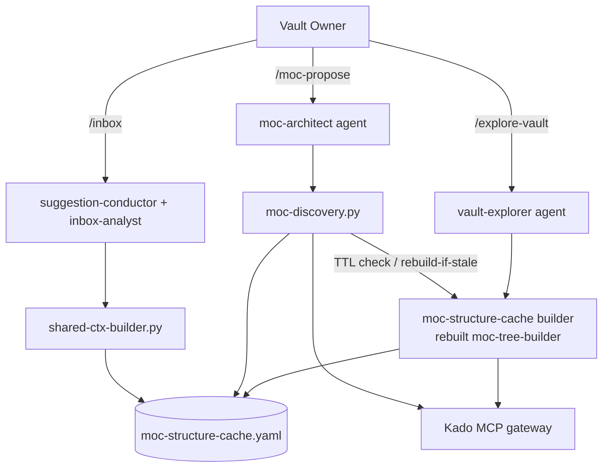
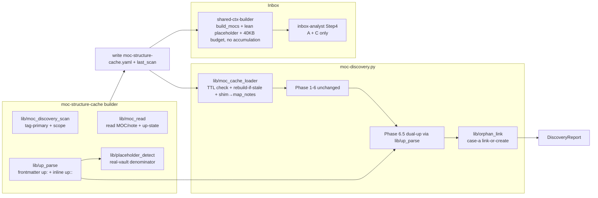
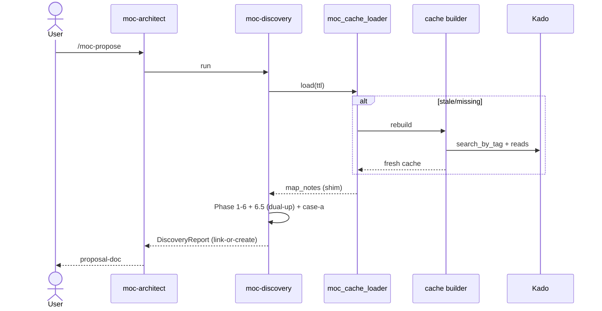

# Solution Design Document

## Validation Checklist

### CRITICAL GATES (Must Pass)

- [x] All required sections are complete
- [x] No [NEEDS CLARIFICATION] markers remain
- [x] Architecture pattern is clearly stated with rationale
- [x] **All architecture decisions confirmed by user** (ADR-1…4 confirmed 2026-06-05; ADR-5…10 follow from PRD-locked decisions)
- [x] Every interface has specification

### QUALITY CHECKS (Should Pass)

- [x] All context sources are listed with relevance ratings
- [x] Project commands are discovered from actual project files
- [x] Constraints → Strategy → Design → Implementation path is logical
- [x] Every component has directory mapping
- [x] Error handling covers all error types
- [x] Quality requirements are specific and measurable
- [x] Component names consistent across sections
- [x] A developer could implement from this design
- [x] Complex logic includes traced walkthroughs

---

## Output Schema

### SDD Status Report

| Field | Value |
|-------|-------|
| specId | 021-moc-propose-consolidation |
| architecture | Layered Python pipeline + timed cache; deterministic scripts, LLM orchestration only |
| adrs | ADR-1…10 (1–4 user-confirmed, 5–10 derived from PRD decisions) |
| nextSteps | Proceed to PLAN |

---

## Constraints

- **CON-1 (Language/runtime):** Python 3 scripts running inside the Tomo Docker instance; all vault access via `KadoClient` (`tomo/scripts/lib/kado_client.py` v0.7.0). No direct filesystem vault access (Constitution L1 — route through Kado).
- **CON-2 (File size, Constitution L2):** `moc-discovery.py` is already ~1929 LOC (≈4× the 300–500 LOC guidance). New logic MUST be extracted into `lib/` modules, not appended. The `moc-tree-builder` rebuild must split discovery/read/placeholder rather than reproduce one large file.
- **CON-3 (2-pass model):** `/moc-propose` proposes only — it writes a proposal-doc to the inbox and never mutates vault notes. Any `up:` write happens later via `/execute` (Hashi) through `kado_client.write_frontmatter(mode='merge')`.
- **CON-4 (Runtime-file discipline):** runtime agent/command files (`moc-architect.md`, `inbox-analyst.md`) carry imperatives only; all WHY/rationale lives in `docs/tomo/<mirrored-path>.md`. Script-header docstrings are part of the code (carve-out).
- **CON-5 (Privacy, Constitution L1/L2):** the cache stores metadata only — paths, titles, topics, stems, tags, up-state, timestamps — never note body bytes or frontmatter values beyond discovery needs. Out-of-scope paths (daily/templates) are never pulled into the cache.
- **CON-6 (No regex YAML edits):** `up` is only ever READ in 021 (`read_frontmatter`/`read_inline_fields`); no string-built YAML.
- **CON-7 (Container visibility):** runtime scripts see only the instance dir; cache + config live inside the instance and are synced via `update-tomo`.

## Implementation Context

### Required Context Sources

#### Code Context
```yaml
- file: tomo/scripts/moc-tree-builder.py
  relevance: CRITICAL
  why: "Rebuilt into the scoped MOC-structure cache builder. v0.3.0 anchor-strip + per-note dedup already on branch; detect_placeholders all_vault_paths bug at :616/:637 is the 224-false-positive root."

- file: tomo/scripts/moc-discovery.py
  relevance: CRITICAL
  why: "/moc-propose backend (1929 LOC). Phase 6.5 _UP_MARKER_RE:1271 is inline-only; validate_cache_loaded:583; Phase 6 dedup is the case-(a) seam; _handle_scan:482 is the live-pull to replace with cache."

- file: tomo/scripts/cache-builder.py
  relevance: HIGH
  why: "TTL primitives to reuse: CACHE_VERSION, last_scan via utc_now_iso, ISO validation, atomic tmp-rename. Lifts map_notes/placeholder_mocs/unclassified_topic_clusters into discovery-cache.yaml."

- file: tomo/scripts/shared-ctx-builder.py
  relevance: HIGH
  why: "build_mocs:209 reads cache.map_notes; enforce_budget:559-639 (15KB default :657, Pass-6 accumulation trim); placeholder_mocs build :229. Accumulation removal + budget raise live here."

- file: tomo/scripts/lib/kado_client.py
  relevance: HIGH
  why: "search_by_tag, read_frontmatter:144, read_inline_fields:160, list_notes(fields=)/list_dir with _search_all pagination. All reads needed by 021 already exist (v0.7.0)."

- file: tomo/scripts/atomic-note-indexer.py
  relevance: MEDIUM
  why: "Feeds the retired accumulation index; same inline-only up blind spot at :162. Retirement + up-helper retrofit scope."

- file: tomo/dot_claude/agents/inbox-analyst.md
  relevance: HIGH
  why: "Step 4: Condition A (Classification Guard), B (Accumulation — retire), C (Placeholder — keep). Scores items against shared_ctx.mocs (:115). A7 STRICT block."

- file: tomo/dot_claude/agents/moc-architect.md
  relevance: HIGH
  why: "/moc-propose orchestration; routes args to moc-discovery + suggestions-reducer. Add the case-(a) link-or-create rendering."

- file: tomo/config/vault-example.yaml
  relevance: HIGH
  why: "concepts.map_note.{paths,tags=[type/others/moc]}, concepts.atomic_note, calendar.daily, template. Home of the new tomo.moc_structure_cache scope config."
```

### Implementation Boundaries
- **Must Preserve:** moc-discovery Phases 1–6 behaviour (via the loader shim → `map_notes`); inbox Conditions A & C output; the 2-pass proposal boundary; `kado_client` public surface.
- **Can Modify:** moc-tree-builder internals (rebuild), moc-discovery Phase 6.5 + cache-source + a new case-(a) emitter, shared-ctx-builder (remove accumulation, raise budget), vault-config (add scope block), cache-builder wiring.
- **Must Not Touch:** Kado plugin code (capability gaps are noted, not implemented here); `/execute`/Hashi; the per-item context-shaping path (deferred to issue #45 (epic #24)).

### External Interfaces

#### System Context Diagram


#### Interface Specifications
All vault I/O is via Kado MCP (`http://host.docker.internal:<port>/mcp`, bearer token from instance `.mcp.json`). No HTTP/REST surface is added by 021. Reads used: `search_by_tag`, `list_notes`/`list_dir`, `read_frontmatter`, `read_inline_fields` (all existing in `kado_client` v0.7.0).

#### Data Storage Changes
New cache file (YAML, inside instance `config/`): `moc-structure-cache.yaml` — see Application Data Models. No relational DB. `discovery-cache.yaml` loses the `unclassified_topic_clusters` lift (accumulation retirement).

### Project Commands
```bash
# Discovered from the repo
Test:    python3 -m pytest tests/ -q
Lint:    (ruff/biome per repo config where present)
Sync:    ./scripts/update-tomo.sh --yolo   # sync source → running instance
Host-vs-live diagnostics: KADO_URL=http://127.0.0.1:<port>/mcp + token, sandbox off
```

## Solution Strategy

- **Architecture Pattern:** Layered deterministic Python pipeline behind LLM orchestration. Logic lives in scripts (Constitution); agents route + render only. A timed cache decouples expensive vault scans from per-run reads.
- **Integration Approach:** Reuse the existing producer→cache→consumer chain. The rebuilt `moc-tree-builder` becomes the single MOC-structure cache builder; `moc-discovery` and `shared-ctx-builder` consume the cache. A loader shim projects `entries[kind==moc]` → `map_notes` so downstream phases stay unchanged.
- **Justification:** Minimises blast radius on a 1929-LOC consumer; fixes correctness (tag-primary discovery, real-vault placeholder denominator, dual-up) at the source; removes the inbox-hot-path coupling (accumulation) that never worked.
- **Key Decisions:** ADR-1 (schema Option A + shim), ADR-2 (inline-`up::` wins), ADR-3 (explore force-rebuild / propose rebuild-if-stale), ADR-4 (raise budget; shaping → issue #45 (epic #24)), plus ADR-5…10 below.

## Building Block View

### Components


### Directory Map

**Component**: tomo/scripts (runtime pipeline)
```
tomo/scripts/
├── moc-tree-builder.py            # MODIFY → rebuilt as MOC-structure-cache builder (tag-primary, scope, dual-up, real-vault placeholder, last_scan). Split internals into lib/.
├── moc-discovery.py               # MODIFY → cache-source via loader; Phase 6.5 dual-up; case-(a) emitter. Extract new logic to lib/ (CON-2).
├── shared-ctx-builder.py          # MODIFY → remove accumulation_index + Pass-6 trim; raise --max-bytes default to 40960; keep placeholder un-trimmed.
├── cache-builder.py               # MODIFY → stop lifting unclassified_topic_clusters; (map_notes lift stays, now sourced from new cache).
├── atomic-note-indexer.py         # REMOVE (or retire) → accumulation feed gone. Confirm no other consumer.
└── lib/
    ├── up_parse.py                # NEW → single SSoT: parse frontmatter up: (YAML list) + inline up::; inline wins on conflict (ADR-2); returns (state, target).
    ├── moc_cache_loader.py        # NEW → load moc-structure-cache; TTL staleness; rebuild-if-stale; shim entries[kind==moc]→map_notes.
    ├── moc_scan.py                # NEW → tag-primary discovery (#type/others/moc) + scope/exclude filter.
    ├── placeholder_detect.py      # NEW → detect_placeholders against real in-scope vault set (moves v0.3.0 anchor logic here).
    └── orphan_link.py             # NEW → case-(a): orphan (note OR MOC) → top-3 existing-MOC link suggestions, else new-MOC + reason.

tomo/dot_claude/agents/
├── inbox-analyst.md               # MODIFY → delete Condition B (accumulation) sub-block + A7-vs-B STRICT; keep A + C. Bump version.
└── moc-architect.md               # MODIFY → render case-(a) link-or-create in proposal-doc. Bump version.

tomo/config/templates/ (+ instance config/vault-config.yaml)
└── vault-example.yaml             # MODIFY → add tomo.moc_structure_cache.{scope_paths,exclude_paths,ttl_days,moc_tag}.

docs/tomo/scripts/                 # NEW → WHY docs for moc-tree-builder rebuild, up_parse, moc_cache_loader, orphan_link, placeholder_detect.

tests/
├── test_moc_tree_placeholders.py  # EXISTS (10 green) → extend for real-vault denominator.
├── test_up_parse.py               # NEW → frontmatter/inline/both/empty/broken (ADR-2 precedence).
├── test_moc_cache_loader.py       # NEW → TTL fresh/stale/missing/corrupt; shim projection.
├── test_orphan_link.py            # NEW → link-existing (top-3) vs create-new; notes AND MOCs.
└── test_shared_ctx_no_accumulation.py # NEW → accumulation absent; A/C unaffected; placeholder un-trimmed; 40KB budget.
```

### Interface Specifications

#### Application Data Models

```pseudocode
ENTITY: MocStructureCache (NEW)  — file: config/moc-structure-cache.yaml
  FIELDS:
    moc_cache_version: int            # schema version constant
    last_scan: str                    # ISO-8601 UTC (reuse cache-builder utc_now_iso)
    ttl_days: int                     # from config (default 1)
    scope_paths: list[str]            # included prefixes (config)
    exclude_paths: list[str]          # excluded prefixes (config; exclude wins — ADR/OQ-5)
    moc_tag: str                      # "type/others/moc"
    entries: list[CacheEntry]         # ADR-1 Option A — single list, kind discriminator

ENTITY: CacheEntry (NEW)
  FIELDS:
    path: str
    stem: str
    kind: str                         # "moc" | "note"
    title: str
    discovered_via: str               # "tag" | "path" | "both"
    topics: list[str]
    up_state: str                     # "absent" | "valid" | "broken"
    up_target: str | null             # resolved parent stem (inline wins — ADR-2)
    up_source: str | null             # "inline" | "frontmatter" | null (provenance)
    tags: list[str]

# Loader shim (moc_cache_loader): cache["map_notes"] = [e for e in entries if e.kind=="moc"]
# → moc-discovery Phases 1-6 read map_notes byte-for-byte unchanged.

ENTITY: UpParseResult (NEW)  — lib/up_parse.parse_up(frontmatter: dict, body: str)
  FIELDS:
    state: str                        # absent | valid(=has target) | (broken decided by caller vs MOC set)
    target: str | null                # inline up:: wins over frontmatter up: when both present (ADR-2)
    source: str | null                # "inline" | "frontmatter"
  RULES:
    - inline `up:: [[X]]` present (non-empty wikilink)        → target=X, source=inline   (WINS)
    - else frontmatter `up:` non-empty YAML list/scalar link  → target=first, source=frontmatter
    - else (missing / [] / null / `up::` w/o wikilink)        → target=null, state=absent

ENTITY: OrphanLinkSuggestion (NEW)  — emitted into DiscoveryReport
  FIELDS:
    stem: str
    path: str
    kind: str                         # note | moc
    mode: str                         # "link_existing" | "create_new"
    candidates: list[{target_moc, score}]   # top-3 when mode=link_existing (ADR/OQ-4)
    reason: str                       # rendered into proposal-doc (+ /execute instruction) when create_new

# REMOVED from shared-ctx: accumulation_index. KEEP: placeholder_mocs (corrected, un-trimmed).
```

#### Integration Points
```yaml
- from: moc-structure-cache builder (rebuilt moc-tree-builder)
  to: discovery-cache.yaml (cache-builder) AND moc-structure-cache.yaml
  data_flow: "map_notes (kind=moc projection) + corrected placeholder_mocs; last_scan timestamp"
- from: moc-structure-cache.yaml
  to: moc-discovery.py (via moc_cache_loader, shim→map_notes) and shared-ctx-builder.py (build_mocs + placeholder)
  data_flow: "MOC/note entries, up-state, topics; lean placeholder list"
- external: Kado MCP
  integration: "search_by_tag(#type/others/moc), list_notes/list_dir (scope + placeholder universe), read_frontmatter + read_inline_fields (dual up)"
  critical_data: "MOC paths, tags, frontmatter up:, inline up::, in-scope note paths"
```

### Implementation Examples

#### Example: dual-`up` parse (ADR-2 — inline wins)
**Why:** the single most error-prone change; today three call sites only see inline `up::`.
```python
# lib/up_parse.py — SSoT for "does this note declare a parent?"
_INLINE_UP = re.compile(r"^[\s>\-]*up::\s*\[\[(.+?)\]\]", re.MULTILINE)

def parse_up(frontmatter: dict, body: str) -> UpParseResult:
    # Inline wins on conflict (ADR-2)
    m = _INLINE_UP.search(body or "")
    if m and m.group(1).strip():
        return UpParseResult(state="present", target=_strip_anchor(m.group(1)), source="inline")
    fm_up = frontmatter.get("up")
    target = _first_wikilink(fm_up)        # handles list | scalar | "[[X]]"; None for [] / null / ""
    if target:
        return UpParseResult(state="present", target=target, source="frontmatter")
    return UpParseResult(state="absent", target=None, source=None)
# Caller resolves "present" → "valid" vs "broken" by checking target stem against the MOC set.
```

#### Example: case-(a) seam (orphan → link-or-create)
**Why:** clarifies where new code attaches without disturbing Phase 1–6.
```python
# In Phase 6, when a single orphan note/MOC matches an existing MOC by exact-title or Jaccard≥0.80:
# instead of routing to duplicates_skipped, emit an OrphanLinkSuggestion.
def resolve_orphan(orphan, existing_mocs):  # lib/orphan_link.py
    matches = score_against_mocs(orphan.topics, existing_mocs)   # reuse Phase-5 keyword overlap
    strong = [m for m in matches if m.score >= LINK_THRESHOLD]
    if strong:
        return OrphanLinkSuggestion(mode="link_existing",
                                    candidates=top_n(strong, 3))   # ADR/OQ-4
    return OrphanLinkSuggestion(mode="create_new",
                                reason=build_reason(orphan, matches))
# Eligibility: relax restrict_to_atomic_note_paths so orphan MOCs are also candidates.
```

## Runtime View

### Primary Flow: `/moc-propose` (cache-backed)
1. User runs `/moc-propose [scope]`.
2. `moc-discovery` calls `moc_cache_loader`: reads `last_scan`; if `now − last_scan > ttl_days` OR missing/corrupt → invokes the builder inline (rebuild-if-stale, ADR-3).
3. Loader projects `entries[kind==moc]` → `map_notes`; Phases 1–6 run unchanged.
4. Phase 6.5 validates each candidate's `up` via `lib/up_parse` (frontmatter + inline).
5. For each orphan (note or MOC), `lib/orphan_link` emits top-3 link suggestions OR a create-new proposal with a reason.
6. `suggestions-reducer` + `moc-architect` render the proposal-doc (link-or-create). User ticks; `/execute` applies.



### Secondary Flow: `/explore-vault`
`vault-explorer` Step 9 invokes the builder with **force-rebuild** (ADR-3) — always refreshes the MOC-structure cache and pre-warms it; Step 10 summary reads the same output.

### Secondary Flow: `/inbox`
`shared-ctx-builder` builds `shared_ctx.mocs` (= `entries[kind==moc]`, now complete incl. notes-area MOCs — Feature 5) + lean `placeholder_mocs` (un-trimmed); NO `accumulation_index`. `inbox-analyst` Step 4 runs Condition A (against the complete MOC set) + Condition C (placeholder); Condition B sub-block removed.

### Error Handling
- **Cache missing/corrupt:** treat as stale → inline rebuild (propose) / force rebuild (explore).
- **Kado read denial on an in-scope path:** skip with stderr warning, continue (mirror existing `discover_via_paths` try/except) — never fabricate presence/absence (AC-P2).
- **Empty scope / zero MOCs:** cache builds empty; `/moc-propose` surfaces existing `cache-empty` message; no crash.
- **Cache-write unwritable:** surface failure; do not proceed on a half-written cache (atomic tmp-rename guards partial writes).
- **`last_scan` in the future (clock skew):** treat as fresh.

### Complex Logic: placeholder correction (traced)
```
INPUT: MOC bodies' wikilinks, real in-scope vault note set (NEW denominator)
For each wikilink L in each MOC body:
  note = strip_anchor(L)                 # "X#^id"/"X#Heading" → "X"; "" for same-note anchor → skip
  if resolves_to_known_MOC(note): continue
  if note in real_in_scope_vault_set: continue   # ← the 224 fix: was "only 89 MOCs"
  emit placeholder {target: note, referenced_by: MOC}, deduped per (note, MOC)
RESULT (live vault): 397 → ~171 (37 anchors + 224 existing-notes removed)
```

## Deployment View
No change to deployment. Scripts ship in the Tomo source repo, synced into the running instance via `update-tomo --yolo`. New cache file is created on first build inside the instance `config/`. No ports, no services.

## Cross-Cutting Concepts

### System-Wide Patterns
- **Up-parsing SSoT:** `lib/up_parse` is the single parser for both `up` forms; `moc_scan`, Phase 6.5, and (retrofit) `atomic-note-indexer` consume it — kills the current three-way regex drift (`feedback_spec_schema_consumer_three_way_drift`).
- **Schema-first ordering:** land the cache schema + writer + loader shim BEFORE consumer reads (drift guard).
- **Cleanup discipline:** retire accumulation scaffolding by deletion, not patching (`feedback_post_refactor_drop_scaffolding_not_patch`): `build_accumulation_index`, shared-ctx Pass-6 trim, `cache-builder` `unclassified_topic_clusters` lift, `atomic-note-indexer.py`, inbox-analyst Condition B block.
- **Performance:** TTL cache removes the per-run live scan (M1); corrected placeholder shrinks the per-subagent envelope ×N (toward GH #40); raised 40KB budget keeps essential placeholder un-trimmed; per-item context shaping deferred to issue #45 (epic #24).
- **Privacy/Audit:** cache is metadata-only; out-of-scope (daily/template) content never enters it (CON-5, AC-P3/P4).

### Pattern Documentation
```yaml
- pattern: cache-builder TTL primitives (CACHE_VERSION, last_scan, ISO validation, atomic write)
  relevance: HIGH
  why: "Reused wholesale for moc-structure-cache TTL"
- pattern: F-47 doc-frontmatter / write_frontmatter(mode=merge)
  relevance: MEDIUM
  why: "Any future up: write (at /execute) routes through it — not in 021 scope"
```

## Architecture Decisions

- [x] **ADR-1 Cache schema:** Option A — single `entries[]` with `kind: moc|note` + loader shim projecting `entries[kind==moc]` → `map_notes`.
  - Rationale: keeps moc-discovery Phases 1–6 byte-for-byte unchanged on a 1929-LOC file; one TTL check; case-(a) iterates entries once.
  - Trade-offs: a thin shim layer vs a drop-in second list (Option B).
  - User confirmed: **Yes (2026-06-05)**

- [x] **ADR-2 Dual-`up` precedence:** inline `up::` wins when both forms present.
  - Rationale: user's call; inline is treated as the more deliberate manual setting. For orphan detection either form suffices; precedence only sets `up_target`.
  - Trade-offs: differs from "frontmatter is canonical"; documented + tested.
  - User confirmed: **Yes (2026-06-05)**

- [x] **ADR-3 Cache build behaviour:** `/explore-vault` force-rebuilds; `/moc-propose` rebuilds-if-stale (TTL). One cache file, one builder script.
  - Rationale: "refresh my vault" should always pre-warm; propose stays fast on same-day repeats; matches OQ-2 inline-rebuild.
  - Trade-offs: explore pays a full rebuild each run (acceptable — it already does a full scan).
  - User confirmed: **Yes (2026-06-05)**

- [x] **ADR-4 Shared-ctx budget:** raise `--max-bytes` default 15360 → 40960; `placeholder_mocs` never trimmed; remove accumulation + Pass-6 trim. Per-item context shaping deferred to a follow-up spec (issue #45 (epic #24)).
  - Rationale: placeholder is essential Condition-C data; prompt-caching softens the larger byte cost; shaping is a correctness-sensitive optimization that deserves its own spec.
  - Trade-offs: budget stops being a hard guard for the big fields until shaping lands; net Pass-1 cost still drops (corrected 34–36KB < 54.5KB).
  - User confirmed: **Yes (2026-06-05)**

- [x] **ADR-5 Tag-primary discovery + real-vault placeholder denominator** — `#type/others/moc` is the primary MOC signal; `detect_placeholders` checks against the real in-scope vault set, not the 89 discovered MOCs. (Derived from PRD F1/F4; fixes the 224.)
- [x] **ADR-6 Dual-`up` via single `lib/up_parse`** reusing `read_frontmatter` + `read_inline_fields`. (PRD F2; kills 3-way drift.)
- [x] **ADR-7 Case-(a) seat at Phase 6 match point**, relax `restrict_to_atomic_note_paths` so orphan MOCs are eligible. (PRD F3.)
- [x] **ADR-8 TTL = rolling 24 h from `last_scan`; script-driven inline rebuild.** (OQ-2/OQ-3.)
- [x] **ADR-9 `lib/` extraction mandated** for all new moc-discovery logic; moc-tree-builder rebuild splits discovery/read/placeholder/up into lib modules. (Constitution L2 / CON-2.)
- [x] **ADR-10 Retire accumulation (Condition B) by deletion**, including scaffolding (atomic-note-indexer, Pass-6 trim, cache lift, inbox block). (PRD F4.)

## Quality Requirements
- **Performance:** `/moc-propose` does 0 full whole-vault tree-builds when cache is fresh (M1); shared-ctx envelope 54.5KB → ~34–36KB (M6).
- **Correctness:** placeholder false positives 397 → ~171 (M2); inbox `shared_ctx.mocs` includes notes-area MOCs, excludes template-vault MOCs (M4/M8); dual-`up` (M5).
- **Reliability:** stale/missing/corrupt cache never yields a silent stale proposal (inline rebuild or actionable abort); Kado denial degrades gracefully.
- **Maintainability:** new logic in `lib/` modules ≤ ~300–500 LOC each (Constitution L2); single up-parse SSoT.
- **Privacy:** cache metadata-only; daily/templates never scanned.

## Acceptance Criteria (EARS — maps to PRD ACs)

**Cache freshness & source (PRD F1)**
- [ ] WHILE the cache `last_scan` is within `ttl_days`, THE SYSTEM SHALL read MOC structure from the cache and SHALL NOT perform a full whole-vault MOC tree-build (M1).
- [ ] IF the cache is older than `ttl_days`, missing, or corrupt, THEN `/moc-propose` SHALL rebuild it inline before proposing; `/explore-vault` SHALL force-rebuild regardless (ADR-3).
- [ ] WHERE a note is tagged `#type/others/moc` inside an in-scope path, THE SYSTEM SHALL record it as `kind: moc` and SHALL NOT flag it as a placeholder.
- [ ] WHERE a `#type/others/moc` note lies in an excluded path, THE SYSTEM SHALL NOT treat it as a MOC (exclude wins).

**Dual-`up` (PRD F2)**
- [ ] WHEN a note has frontmatter `up:` with a valid link and no inline `up::`, THE SYSTEM SHALL classify it as having a parent.
- [ ] WHEN a note has both forms with differing targets, THE SYSTEM SHALL use the inline `up::` target (ADR-2).
- [ ] IF `up`/`up::` is empty (`[]`, null, `up::` without wikilink), THEN THE SYSTEM SHALL classify the note as `absent` (orphan).

**Orphan link-or-create (PRD F3)**
- [ ] WHEN an orphan note/MOC matches existing MOCs at/above threshold, THE SYSTEM SHALL offer the top-3 link candidates (ADR/OQ-4), not a new-MOC proposal.
- [ ] IF an orphan matches no existing MOC, THEN THE SYSTEM SHALL propose a new MOC with a reason rendered in the proposal-doc (and an `/execute` instruction to stamp it into the note(s)).
- [ ] WHERE the orphan is itself a MOC, THE SYSTEM SHALL apply the same link-or-create treatment.

**Inbox retire B / keep A+C / Feature 5 (PRD F4, F5)**
- [ ] WHEN `shared-ctx` lacks `accumulation_index`, THE SYSTEM SHALL run `/inbox` with Conditions A and C unchanged and no error.
- [ ] THE SYSTEM SHALL never trim `placeholder_mocs` under the budget enforcer; THE SYSTEM SHALL accommodate the envelope within a 40 960-byte budget.
- [ ] WHEN an inbox item matches a notes-area MOC, THE SYSTEM SHALL offer that MOC (it is present in `shared_ctx.mocs`); template-vault MOCs SHALL be absent (M8).

**Privacy/permission (Constitution L1)**
- [ ] WHEN Kado denies read on an in-scope path, THE SYSTEM SHALL skip it with a warning and continue (no crash, no fabricated state).
- [ ] THE SYSTEM SHALL persist only metadata in the cache (paths/titles/topics/stems/tags/up-state/timestamps).

## Risks and Technical Debt

### Known Technical Issues
- `moc-discovery.py` is 1929 LOC (4× L2 cap) — 021 must extract, not append (ADR-9).
- `detect_placeholders` real-vault denominator requires a vault listing; bound to scope roots to avoid a 5393-note whole-vault pull on every build.
- Three inline-only `up` regexes today (moc-tree, moc-discovery, atomic-note-indexer) — converge to `lib/up_parse`.

### Technical Debt
- Per-item context shaping (the real per-subagent cost lever) deferred to issue #45 (epic #24) — the 40KB budget is an interim, not the final answer.
- `atomic-note-indexer.py` removal must confirm no other consumer before deletion.

### Implementation Gotchas
- Instance `vault-config.yaml` has a trailing space in `Calendar/301 Daily/ ` — exclude matching must trim and match precise prefixes, not loose substrings.
- `byFrontmatter` returns empty `frontmatter:{}` — DON'T use it for discovery; use `search_by_tag` + per-note `read_frontmatter` (real parsed content).
- Kado `byTag` is strict-equality with no server-side scope filter — scope restriction is client-side prefix filtering.
- Bump `# version:` on every modified runtime file or `update-tomo` silently ships nothing.

## Glossary

### Domain Terms
| Term | Definition | Context |
|------|------------|---------|
| MOC | Map of Content — an index note linking related notes | Tagged `#type/others/moc`; may live in the MOC folder or the notes area |
| Orphan | A note or MOC with no `up`/`up::` parent link | Drives case-(a) link-or-create |
| Placeholder MOC | A dead `[[wikilink]]` to a MOC name that doesn't exist | Feeds inbox Condition C |
| Condition A/B/C | Inbox MOC triggers: A=per-item classification guard, B=vault accumulation (retired), C=placeholder match (kept) | `inbox-analyst.md` Step 4 |

### Technical Terms
| Term | Definition | Context |
|------|------------|---------|
| TTL | Time-to-live; rebuild when `now − last_scan > ttl_days` | ADR-3/ADR-8 |
| Loader shim | Projects `entries[kind==moc]` → `map_notes` | ADR-1; keeps Phases 1–6 unchanged |
| Dual-`up` | Detecting both frontmatter `up:` and inline `up::` | `lib/up_parse`; inline wins (ADR-2) |
