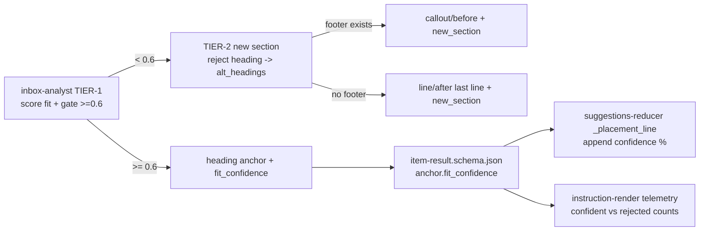

# Solution Design Document

## Validation Checklist

### CRITICAL GATES (Must Pass)

- [x] All required sections are complete
- [x] No [NEEDS CLARIFICATION] markers remain
- [x] Architecture pattern is clearly stated with rationale
- [x] **All architecture decisions confirmed by user** (ADR-1..4 confirmed 2026-06-16)
- [x] Every interface has specification

### QUALITY CHECKS (Should Pass)

- [x] All context sources are listed with relevance ratings
- [x] Project commands discovered from actual project files
- [x] Constraints → Strategy → Design → Implementation path is logical
- [x] Every component has directory mapping
- [x] Error handling covers all error types
- [x] Quality requirements are specific and measurable
- [x] A developer could implement from this design
- [x] Implementation examples use actual field names (verified against item-result.schema.json + inbox-analyst.md)
- [x] Complex logic includes a traced walkthrough

---

## Output Schema

### SDD Status Report

| Field | Value |
|-------|-------|
| specId | 023-moc-placement-fit-confidence |
| pattern | Decision-gate extension of spec 022's Pass-1 four-tier resolution |
| validationPassed | 13 |
| validationPending | 1 (ADR confirmation) |

---

## Constraints

- **CON-1** Builds on spec 022 — requires the shipped `candidate_mocs[].anchor` (type/value/placement/new_section/alt_headings), the four-tier order in `inbox-analyst.md`, the shared `lib/moc_structure.py`, the `_serialize_new_sections` honor path in `instruction-render.py`, and the suggestions-doc `**Placement:**` line in `suggestions-reducer.py`.
- **CON-2** No new Kado reads and no new LLM passes — `fit_confidence` is scored within the existing Pass-1 analysis over already-loaded inventory (the 022 cost contract holds).
- **CON-3** No new Hashi wire shape — the no-footer fallback reuses the existing `type:line` anchor + `placement:after`.
- **CON-4** Threshold is hardcoded in `inbox-analyst.md` (matching existing 0.7/0.5/0.15 inline thresholds); no config surface this phase.
- **CON-5** Metadata-only telemetry (MiYo Constitution L2 Privacy) — counts and the confidence *number* only; never note content or heading text.
- **CON-6** Insertion-point only — must not touch MOC-selection (`candidate_mocs[].score`, `needs_new_moc`, `proposed_moc_topic`).
- **CON-7** Hard ordering: schema change BEFORE its consumers (`additionalProperties:false` strips undeclared fields → consumer reads `None`). Bump `# version:` on every edited managed file or `update-tomo` silently skips it.

## Implementation Context

### Required Context Sources

#### Documentation Context
```yaml
- doc: docs/XDD/specs/022-moc-insertion-point-intelligence/solution.md
  relevance: CRITICAL
  why: "This spec extends 022's four-tier resolution + anchor carrier + honor path"
- doc: docs/XDD/specs/023-moc-placement-fit-confidence/requirements.md
  relevance: CRITICAL
  why: "The 12 ACs this design must satisfy"
- doc: docs/XDD/reference/tier-3/lyt-moc/section-placement.md
  relevance: MEDIUM
  why: "Documents the structural-vs-content heading distinction (Content/Structure are scaffolding) — the motivation, though 023 uses confidence not a blocklist"
```

#### Code Context
```yaml
- file: tomo/schemas/item-result.schema.json
  relevance: CRITICAL
  why: "candidate_mocs[].anchor (lines ~77-89 after 022) gains fit_confidence; additionalProperties:false"
- file: tomo/dot_claude/agents/inbox-analyst.md
  relevance: CRITICAL
  why: "TIER-1 (~158-174) gains the confidence gate; TIER-2 (~176-183) gains the no-footer branch; threshold hardcoded inline. version 0.17.5"
- file: tomo/scripts/suggestions-reducer.py
  relevance: HIGH
  why: "_placement_line (~95-144) appends the confidence %; back-compat when absent. version 1.10.7"
- file: tomo/scripts/instruction-render.py
  relevance: MEDIUM
  why: "_emit_resolution_telemetry gains a tier-1-confident vs tier-1-rejected→tier-2 count (metadata only). version 0.24.9"
- file: tomo/scripts/lib/moc_structure.py
  relevance: MEDIUM
  why: "footer_index() identifies whether a MOC has a footer (drives the no-footer branch); last body line for the line anchor"
```

### Implementation Boundaries
- **Must Preserve**: 022 behavior when `fit_confidence` is absent (back-compat); the four-tier order and tier shapes for tiers 3-4; the Hashi wire schema (`instructions.schema.json` anchor stays `{type,value}`); MOC-selection logic.
- **Can Modify**: TIER-1 / TIER-2 wording in `inbox-analyst.md`; the anchor schema (additive); `_placement_line` render; the resolution telemetry line.
- **Must Not Touch**: `candidate_mocs[].score` / `needs_new_moc` (MOC selection); `instructions.schema.json` anchor shape; the FOOTER_CALLOUTS hardcoded set semantics (F-55).

### External Interfaces
No external/network interfaces. All changes are within the Tomo Pass-1 → suggestions-render pipeline; the Pass-2 → Hashi wire contract is unchanged.

### Project Commands
```bash
Test:    ./venv/bin/python -m pytest tests/        # system python3 lacks jsonschema — MUST use venv
Sync:    ./scripts/update-tomo.sh                  # bump # version: first; sandbox-off for .claude/{agents,commands}
Live:    KADO_URL=127.0.0.1:<port>/mcp + token from tomo-instance/.mcp.json (sandbox off)
```

## Solution Strategy

- **Architecture Pattern:** *Decision-gate extension.* Spec 022 made Pass-1 pick a heading (tier-1) whenever any heading looked plausible. 023 inserts a **confidence gate** between "pick the best heading" and "commit to tier-1": the LLM scores the best heading's semantic fit (0-1), and tier-1 only wins if that score clears a hardcoded threshold (0.6); otherwise the order falls through to tier-2 (new section). The rejected best heading is carried into the existing `alt_headings` advisory so the user can still one-click retarget to it.
- **Integration Approach:** Additive — one optional schema field, two TIER-block prompt edits, one render append, one telemetry counter. No new scripts, no new Kado/LLM/Hashi calls.
- **Justification:** Confidence is the missing signal (PRD problem); it generalizes where a structural-heading blocklist would be brittle and per-profile; it reuses an established LLM-confidence pattern already in the pipeline.
- **Key Decisions:** threshold hardcoded at 0.6 (ADR-4); no-footer tier-2 → `line` anchor (ADR-2); rejected runner-up → `alt_headings` (ADR-3); LLM self-confidence is acceptable per existing precedent (ADR-1).

## Building Block View

### Components



### Directory Map

**Component**: Tomo pipeline (single component)
```
tomo/
├── schemas/
│   └── item-result.schema.json        # MODIFY: + anchor.fit_confidence (optional, 0-1, nullable)
├── dot_claude/agents/
│   └── inbox-analyst.md               # MODIFY: TIER-1 confidence gate (>=0.6) + reject→alt_headings; TIER-2 no-footer line branch; bump version
└── scripts/
    ├── suggestions-reducer.py         # MODIFY: _placement_line appends " (confidence: NN%)"; bump version
    └── instruction-render.py          # MODIFY: telemetry gains tier1_confident / tier1_rejected counts (metadata only); bump version

tests/
├── test_spec022_schema_additions.py   # MODIFY/ADD: fit_confidence accepts 0-1/null + back-compat + out-of-range reject
├── test_moc_insertion_resolution.py   # ADD: TIER-1 gate contract fixtures (confident→tier1; weak→tier2; Japan-Content regression; reject→alt_headings); no-footer→line
└── test_suggestions_reducer_t6_1_placement.py  # ADD: confidence % rendered; absent → unchanged
```

### Interface Specifications

#### Data Storage Changes
No database. The only persisted-shape change is the JSON anchor schema below.

#### Application Data Models

```pseudocode
ENTITY: candidate_mocs[].anchor (MODIFIED — item-result.schema.json)
  FIELDS (existing, 022):
    type: enum[heading, callout, line]
    value: string | null
    placement: enum[inside, before, after]
    new_section: string | null
    alt_headings: array<string(minLength 1)> | null
  FIELDS (new, 023):
    + fit_confidence: number | null   (minimum 0, maximum 1)
        # LLM's confidence in the chosen tier-1 heading's semantic fit.
        # Present only for tier-1 heading anchors; null/absent otherwise.
  CONSTRAINTS:
    additionalProperties: false  (so fit_confidence MUST be declared)
    fit_confidence NOT in required[]  (back-compat: 022 anchors validate unchanged)
```

#### Internal API Changes
No HTTP API. The "interface" is the Pass-1 → suggestions-render contract (the schema above) and the prompt-emission contract (Implementation Examples below).

### Implementation Examples

#### Example: TIER-1 confidence gate (inbox-analyst.md emission rule)

**Why this example:** This is the crux — how the LLM is instructed to score fit and gate tier-1 vs tier-2, and where the rejected heading goes.

```text
- **TIER-1 — Semantic heading fit (confidence-gated).**
  Look at `moc.headings[]`. Pick the heading whose *meaning* best fits the note's
  dominant topic (by conceptual meaning, not keyword overlap). Rate that fit 0.0-1.0
  in `fit_confidence`: 1.0 = the heading is clearly the note's topical home; ~0.3 =
  the heading is generic/structural scaffolding (e.g. "Content", "Structure",
  "Overview", "Primer Questions") that doesn't actually describe the note's topic.
  IF fit_confidence >= 0.6:
    {"type":"heading","value":"<heading>","placement":"after","new_section":null,
     "fit_confidence":<0.6-1.0>,"alt_headings":[<other plausible headings>]}
  ELSE (no heading is a confident home) → go to TIER-2, and put the best-but-rejected
  heading into that anchor's `alt_headings` so the user can retarget to it in one edit.
```

#### Example: TIER-2 with the no-footer branch (inbox-analyst.md)

**Why this example:** Routing more notes to tier-2 makes the no-footer case common; this shows both branches.

```text
- **TIER-2 — New section (no confident heading fit).**
  Name the section from the note's dominant topic (NEVER literal "Key Concepts").
  IF the MOC has a footer callout (one of the footer markers):
    {"type":"callout","value":"<footer callout text>","placement":"before",
     "new_section":"<topic>","alt_headings":[<rejected heading if any>]}
  ELSE (MOC has no footer callout):
    {"type":"line","value":"<last body line of the MOC>","placement":"after",
     "new_section":"<topic>","alt_headings":[<rejected heading if any>]}
```

#### Example: render the confidence (suggestions-reducer.py `_placement_line`)

```python
# In the anchor_type == "heading" branch, after building the base line:
conf = anchor.get("fit_confidence")
suffix = f" (confidence: {int(conf * 100)}%)" if isinstance(conf, (int, float)) else ""
return (
    f"**Placement:** under `## {value}`{suffix}"
    "    ← edit the heading to move the link"
)
# absent/None fit_confidence → suffix == "" → line identical to 022 (back-compat, AC-12)
```

#### Test Examples as Interface Documentation

```python
# 1. Confident fit → tier-1 with fit_confidence (AC-1, AC-4)
#    anchor == {type:heading, value:"Thinking Frameworks", placement:after,
#               new_section:None, fit_confidence:0.89, alt_headings:["Core Concepts"]}
# 2. Weak/scaffolding fit → tier-2, NOT tier-1 (AC-5, AC-6) — the Japan-"Content" regression
#    best heading "Content" scored < 0.6 → anchor.type == "callout" or "line" (new_section set),
#    "Content" appears in alt_headings (AC: reject→advisory)
# 3. No-footer tier-2 → line anchor (AC-9) — Concepts (MOC) has no footer
#    anchor == {type:line, value:<last body line>, placement:after, new_section:"<topic>"}
# 4. Back-compat (AC-12): anchor without fit_confidence validates + renders unchanged
# 5. Schema: fit_confidence 1.01 or -0.1 → ValidationError (minimum 0 / maximum 1)
```

## Runtime View

### Primary Flow: confidence-gated placement
1. Pass-1 pre-checks a thematic MOC; reads `moc.headings` / `moc.editable_callouts` from shared-ctx.
2. TIER-1: LLM picks the best heading, assigns `fit_confidence` (0-1).
3. Gate: `fit_confidence >= 0.6` → emit tier-1 heading anchor carrying `fit_confidence` (+ runner-ups in `alt_headings`).
4. Else: fall through to TIER-2 → new section named from topic; footer present → `callout/before`, else → `line/after` last body line; rejected heading → `alt_headings`.
5. Pass-2 honor path (022, unchanged) stamps the anchor; `_serialize_new_sections` builds `line_to_add`.
6. Render: `_placement_line` shows the confidence % on tier-1 placements; resolution telemetry counts confident-tier-1 vs rejected→tier-2.

### Error Handling
- **Empty/degraded inventory** (no headings cached): no `fit_confidence`; behaves as 022 graceful-degradation (omit anchor / tier-4). The prompt must NOT fabricate a confidence for inventory it wasn't given.
- **Malformed/out-of-range confidence** from the LLM: schema rejects <0 or >1 (validate-result step strips/flags); render guards with `isinstance` so a non-number suffix is simply omitted.
- **fit_confidence on a non-heading anchor**: schema allows it (nullable) but the render only reads it for `type==heading`; tiers 2-4 carry null.

### Complex Logic — confidence-gated four-tier (Pass-1)

```
ALGORITHM: resolve_placement_v2(note, moc_inventory)   # extends 022
INPUT: note, moc_inventory {headings[], editable_callouts[], h1_title, footer?, last_line}
OUTPUT: anchor {type, value, placement, new_section?, alt_headings?, fit_confidence?}

1. IF moc.is_classification: EXCLUDE                         # EC-5 (022)
2. TIER-1: best, others = LLM_rank_headings(note, headings)  # semantic
   conf = LLM_fit_confidence(note, best)                     # 0..1
   IF best AND conf >= 0.6:
     RETURN {heading, best, after, new_section:null, fit_confidence:conf, alt_headings:others}
3. TIER-2: IF headings non-empty (but none confident):       # NEW gate condition
     name = topic_name(note)
     reject = [best] + others   # carry the rejected heading(s) for retarget
     IF footer: RETURN {callout, footer, before, new_section:name, alt_headings:reject}
     ELSE:      RETURN {line, last_line, after, new_section:name, alt_headings:reject}   # no-footer (NEW)
4. TIER-3: IF editable_callouts non-empty:                   # unchanged (022)
     RETURN {callout, editable[priority], inside}
5. TIER-4: RETURN {heading, h1_title, after}                 # unchanged; line if no H1
```

**Traced walkthrough (the two walk cases):**
- *First Principles Thinking → Concepts (MOC):* best heading "Thinking Frameworks", `conf≈0.9 ≥ 0.6` → TIER-1 heading anchor, `fit_confidence:0.9`, `alt_headings:["Core Concepts"]`. Renders `under \`## Thinking Frameworks\` (confidence: 90%)`. ✅ AC-1/4/11.
- *Sapporo → Japan (MOC):* best heading "Content" is structural, `conf≈0.3 < 0.6` → TIER-1 rejected → TIER-2. Japan (MOC) HAS a `[!video]` footer → `{callout, "[!video]…", before, new_section:"Japanische Städte", alt_headings:["Content"]}`. Renders `new section \`## Japanische Städte\``, advisory offers `Content`. ✅ AC-5/6/7. (If Japan had no footer → `line/after` last line, AC-9.)

## Deployment View
No change to deployment topology. Ships via `scripts/update-tomo.sh` into the instance (bump `# version:` on each edited managed file). No feature flag — additive and degrades to 022 behavior when `fit_confidence` is absent. No Hashi/Kado version dependency.

## Cross-Cutting Concepts

### System-Wide Patterns
- **LLM-confidence pattern (existing):** mirrors `type_confidence`, `candidate_mocs[].score`, `classification.confidence`, `atomic_note_worthiness` — all 0-1 LLM judgments surfaced as percentages in the suggestions-doc "Why" line (`suggestions-reducer.py`).
- **Logging/Auditing:** extends 022's metadata-only resolution telemetry (`instruction-render.py:_emit_resolution_telemetry`) — adds counts of tier-1-confident vs tier-1-rejected→tier-2. Number only; no heading text (Constitution L2).
- **Error Handling:** schema bounds + render `isinstance` guard + graceful-degradation on empty inventory.

## Architecture Decisions

- [x] **ADR-1 Reuse LLM self-assessed confidence (no calibration layer)**: `fit_confidence` is the LLM's own 0-1 score.
  - Rationale: the pipeline already relies on this exact pattern for four other fields; calibration need only separate "clear topic home" from "generic/structural heading"; surfaced % + editable Placement line catch mis-scores.
  - Trade-offs: LLM confidence is uncalibrated; mitigated by tuning the threshold against the live-walk corpus and user review.
  - User confirmed: **Yes (2026-06-16)**

- [x] **ADR-2 No-footer tier-2 → `line`/`after` last body line**: when a MOC has no footer callout, anchor the new section after the last body line.
  - Rationale: reuses an existing Hashi shape (verified `type:line` matches any body line); avoids a new `end_of_note` placement + Hashi handoff; tier-2 is now common so footer-less MOCs must be handled.
  - Trade-offs: "after last line" is a slightly arbitrary spot for sparse MOCs; acceptable and editable.
  - User confirmed: **Yes (2026-06-16)**

- [x] **ADR-3 Rejected tier-1 runner-up → `alt_headings`**: a heading rejected by the gate is carried into 022's existing advisory.
  - Rationale: preserves one-click retarget to the heading the system *almost* chose; reuses the shipped `alt_headings` field + render; no new surface.
  - Trade-offs: `alt_headings` now means "plausible-but-not-chosen headings (incl. gate-rejected)", a slightly broader semantic — documented.
  - User confirmed: **Yes (2026-06-16)**

- [x] **ADR-4 Threshold hardcoded at 0.6**: the gate constant lives inline in `inbox-analyst.md`.
  - Rationale: matches existing 0.7/0.5/0.15 inline thresholds; no config plumbing; 0.6 is the starting point to calibrate against the live-walk corpus.
  - Trade-offs: tuning requires a prompt edit + version bump (not runtime-configurable); a config surface is a deferred Could-Have.
  - User confirmed: **Yes (2026-06-16)**

## Quality Requirements
- **Performance:** zero new Kado reads, zero new LLM passes; negligible added output tokens (one number + occasional alt_headings entry). The 022 `/inbox` cost envelope holds.
- **Privacy:** telemetry remains metadata-only (Constitution L2).
- **Reliability:** back-compat is total — any anchor without `fit_confidence` behaves exactly as 022; schema bounds reject malformed confidence.
- **Correctness (measurable):** on the live-walk corpus, 0 content notes placed under a structural heading where a new section is warranted; ≥1 genuine tier-2/#28 trigger; 100% intra-cluster tier consistency.

## Acceptance Criteria (EARS — traces to PRD ACs)

**Confidence emission [PRD AC-1..3]**
- [ ] WHEN Pass-1 selects a tier-1 heading, THE SYSTEM SHALL emit `fit_confidence` (0-1) on that anchor.
- [ ] WHERE the anchor is not a tier-1 heading fit, THE SYSTEM SHALL leave `fit_confidence` null/absent.

**Threshold gate [PRD AC-4..7]**
- [ ] IF the best heading's `fit_confidence` ≥ 0.6, THEN THE SYSTEM SHALL emit a tier-1 heading anchor.
- [ ] IF the best heading's `fit_confidence` < 0.6, THEN THE SYSTEM SHALL fall through to tier-2 (new section) and place the rejected heading in `alt_headings`.
- [ ] WHEN no MOC offers a heading ≥ threshold for a note, THE SYSTEM SHALL fire the tier-2 new-section path (closes 022 #28).

**No-footer fallback [PRD AC-8..10]**
- [ ] IF a tier-2 MOC has a footer callout, THEN THE SYSTEM SHALL anchor `callout/before` (unchanged).
- [ ] IF a tier-2 MOC has no footer callout, THEN THE SYSTEM SHALL anchor `line/after` the last body line.

**Render [PRD AC-11..12]**
- [ ] WHEN a tier-1 placement carries `fit_confidence`, THE SYSTEM SHALL render `(confidence: NN%)` on the Placement line.
- [ ] WHERE `fit_confidence` is absent, THE SYSTEM SHALL render the Placement line unchanged from 022.

**Back-compat / bounds**
- [ ] THE SYSTEM SHALL validate 022-shaped anchors (no `fit_confidence`) without error.
- [ ] IF `fit_confidence` < 0 or > 1, THEN THE SYSTEM SHALL reject the result at schema validation.

## Risks and Technical Debt

### Known Technical Issues
- Stale `moc-structure-cache.yaml` starves Pass-1 of headings (no headings → no confident fit → everything routes to tier-2 or omits). This is an operational issue (rebuild via `/explore-vault`) and **out of scope**, but it amplifies 023's behavior — flagged so implementers don't mistake stale-cache symptoms for gate bugs. (Separately worth a follow-up: `/inbox` reads the cache without the TTL-gated `moc_cache_loader` rebuild-if-stale guard that `/moc-propose` uses.)

### Technical Debt
- LLM-confidence is uncalibrated (accepted, ADR-1). If the hardcoded 0.6 proves wrong, a config threshold (deferred Could-Have) is the escape hatch.

### Implementation Gotchas
- **Schema BEFORE consumers** — add `fit_confidence` to the schema first, or `additionalProperties:false` strips it and the analyst's emission is silently dropped → render reads None. (Same 022 trap.)
- **Version bumps** — bump `# version:` on `inbox-analyst.md`, `suggestions-reducer.py`, `instruction-render.py` or `update-tomo` silently skips them.
- **`alt_headings` semantic broadened** — now also carries the gate-rejected heading; keep the render dedup/empty-filter from 022 (don't show an empty/`## ` advisory).
- **Don't double-gate Pass-2** — the honor path already suppresses the heuristic on a populated anchor; 023 changes only what Pass-1 emits, not Pass-2 resolution.
- **`fit_confidence` is NOT a Hashi field** — like `placement`/`new_section`, it stays on the item-result anchor; it must NOT leak into the `instructions.schema.json` anchor ({type,value} only). 022's `_emit` decomposition already strips non-{type,value} keys — confirm `fit_confidence` is not carried into the Pass-2 action anchor.

## Glossary

### Domain Terms
| Term | Definition | Context |
|------|------------|---------|
| Structural/scaffolding heading | An LYT-template heading that organizes the MOC but is not a topic home (Content, Structure, Overview, Primer Questions, Processes) | The thing a low `fit_confidence` should detect |
| New-section (tier-2) | Proposing a fresh `## <Topic>` rather than filing under an existing heading | Fires when no heading is a confident home |

### Technical Terms
| Term | Definition | Context |
|------|------------|---------|
| `fit_confidence` | LLM 0-1 score of how well the chosen heading is the note's topical home | New anchor field; gates tier-1 |
| Threshold (0.6) | Hardcoded gate: tier-1 wins iff `fit_confidence ≥ 0.6` | Inline in inbox-analyst.md |
| Honor path | 022's Pass-2 mechanism that stamps the Pass-1 anchor and suppresses the heuristic | Unchanged by 023 |

### API/Interface Terms
| Term | Definition | Context |
|------|------------|---------|
| `alt_headings` | Runner-up heading texts surfaced as the "Other sections" advisory | 023 broadens it to also carry the gate-rejected heading |
| `type:line` anchor | Hashi anchor matching a body line by content | Reused for the no-footer new-section fallback |
