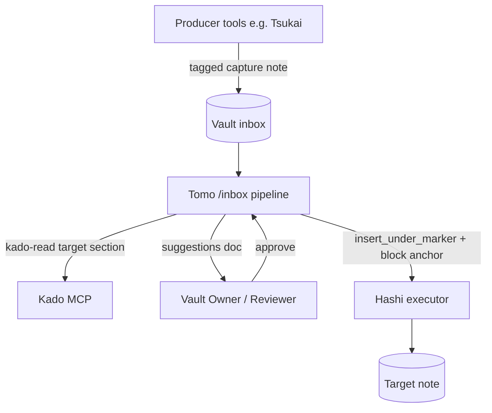
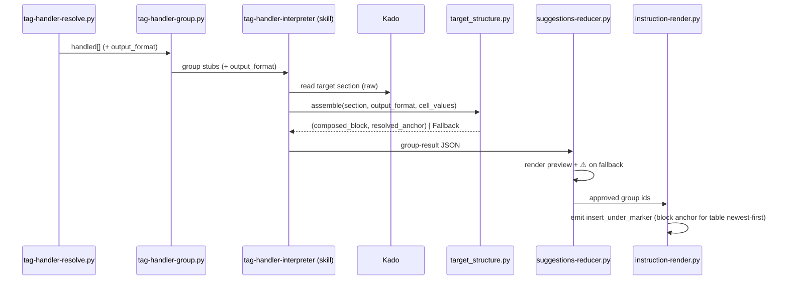

# Solution Design Document

> Spec 025. Implements `requirements.md` (FR-15…FR-22). Extends spec 024-tag-handler-framework.
> Cross-repo Hashi dependency (`block` anchor + `replace_section`) is **already shipped/merged**.

## Validation Checklist

### CRITICAL GATES (Must Pass)
- [x] All required sections are complete (N/A sections marked with reason)
- [x] No [NEEDS CLARIFICATION] markers remain
- [x] Architecture pattern is clearly stated with rationale
- [x] **All architecture decisions confirmed by user** (ADR-1…ADR-11 confirmed 2026-06-25)
- [x] Every interface has specification

### QUALITY CHECKS (Should Pass)
- [x] Context sources listed with relevance
- [x] Project commands discovered from actual project files
- [x] Constraints → Strategy → Design → Implementation path is logical
- [x] Every component has a directory mapping
- [x] Error handling covers all error types (the fallback matrix)
- [x] Quality requirements specific and measurable
- [x] Implementation examples use actual file/function names (verified against the codebase)

---

## Output Schema

**Architecture:** Layered data pipeline extension — pure deterministic helper + AI-glue skill + schema
coordination. **Key components:** `tag-handler.schema.json`, `tag-handler-group.schema.json`,
`tag-handler-resolve.py`, `tag-handler-group.py`, `target_structure.py` (NEW), `tag-handler-interpreter`
skill, `suggestions-reducer.py`, `instruction-render.py`, `instructions.schema.json` +
`hashi-instructions.schema.json`. **External integrations:** Kado (read target note), Hashi (consumes the
`block` anchor — already shipped).

---

## Constraints

- **CON-1 (3-way drift):** `additionalProperties:false` on `tag-handler.schema.json` (:7) and
  `tag-handler-group.schema.json` (:7) means any new field must land in **schema → producer → consumer**
  in that order, or it is silently stripped/rejected and the feature no-ops (validate-result strips
  schema-invalid fields → consumer reads None → prose fallback with no error). This is the highest risk.
- **CON-2 (instance layout):** runtime runs in the flattened Docker instance (`tomo-instance/{scripts,config}`).
  New scripts MUST use cwd-relative defaults. Do **not** replicate `tag-handler-resolve.py:44-46`'s
  `_SCRIPT_DIR.parent.parent` schema-path trick — it breaks in the instance.
- **CON-3 (deterministic core):** Constitution L1 Code Quality — structure parsing and row assembly must
  be testable without an LLM. Only `synthesize` cells touch the model.
- **CON-4 (privacy):** Constitution L1 — the target-note read happens **only** for handlers the user
  explicitly configured with `output_format`. No broadened vault access.
- **CON-5 (runtime files):** SKILL.md changes are imperatives/invocations only; rationale lives in
  `docs/tomo/`. Version comments are number-only. Tests run under `./venv/bin/python`.
- **CON-6 (no new Tomo action):** reuse `insert_under_marker`; the only wire novelty is `anchor.type:"block"`,
  already supported by Hashi.

## Implementation Context

### Required Context Sources

#### Documentation Context
```yaml
- doc: docs/XDD/specs/024-tag-handler-framework/
  relevance: HIGH
  why: "The framework this extends — resolver/grouper/interpreter/reducer/render chain + one-block-per-group invariant"
- doc: docs/XDD/ideas/2026-06-25-structure-aware-tag-handler-compose.md
  relevance: HIGH
  why: "Validated brainstorm; the settled design forks"
- doc: _outbox/for-hashi/2026-06-25_tomo-to-hashi_block-anchor-and-replace-section.md
  relevance: HIGH
  why: "The shipped Hashi contract (block anchor + replace_section)"
```

#### Code Context
```yaml
- file: tomo/scripts/tag-handler-resolve.py        # resolve_item :118, return dict :206-215 — MODIFY (carry output_format)
  relevance: HIGH
- file: tomo/scripts/tag-handler-group.py          # group_handled :33/:61-70, compose_field_template :118 — MODIFY (carry output_format)
  relevance: HIGH
- file: tomo/scripts/lib/moc_structure.py          # purity-contract precedent for the NEW target_structure.py
  relevance: HIGH
- file: tomo/scripts/instruction-render.py         # _build_insert_under_marker_actions :1146, _marker_to_anchor_value :1110 — MODIFY (block anchor)
  relevance: HIGH
- file: tomo/scripts/suggestions-reducer.py        # render_tag_handler_group :641, guards :1167 — MODIFY (preview + ⚠️)
  relevance: HIGH
- file: tomo/dot_claude/skills/tag-handler-interpreter/SKILL.md   # compose step — MODIFY (read target, synth cells, call helper)
  relevance: HIGH
- file: tomo/schemas/tag-handler.schema.json        # MODIFY: add output_format
  relevance: HIGH
- file: tomo/schemas/tag-handler-group.schema.json  # MODIFY: add output_format + resolved anchor
  relevance: HIGH
- file: tomo/schemas/instructions.schema.json       # MODIFY: anchor type enum + "block"
  relevance: HIGH
- file: tomo/schemas/hashi-instructions.schema.json # MODIFY: + "block" + replace_section mirror
  relevance: HIGH
- file: tests/test_tomo_schema_parity.py            # parity gate (producer ⊆ wire, bidirectional)
  relevance: MEDIUM
- file: tomo/config/tag-handlers/tsukai.json        # the motivating handler to migrate
  relevance: MEDIUM
```

#### External APIs
```yaml
- service: Kado (kado-read)
  relevance: HIGH
  why: "Interpreter reads the target note's marker section to get columns + raw header/separator bytes"
- service: Hashi (insert_under_marker executor, block anchor)
  relevance: HIGH
  why: "Consumes the emitted block anchor; resolveBlock shipped (exact-per-line, trailing-trim)"
```

### Implementation Boundaries
- **Must Preserve:** backward compatibility (no `output_format` → byte-identical prose-block behaviour);
  the one-block-per-group invariant (024 FR-8/AC-3); existing guard branches in the reducer.
- **Can Modify:** the resolver return dict, grouper carry-through, interpreter compose step, reducer
  rendering, instruction-render anchor emission, the four schemas.
- **Must Not Touch:** Hashi source (already shipped); `replace_section` emission (no Tomo consumer this
  spec); producer tools (Tsukai keeps writing prose-bodied captures).

### External Interfaces

#### System Context Diagram


#### Interface Specifications

##### Inbound / Outbound
N/A — no HTTP/mobile/webhook surfaces. Tomo is a CLI/skill pipeline. The only outbound calls are Kado MCP
reads and the file-based instruction set Hashi consumes.

#### Data Storage Changes
N/A — no database. "Storage" is JSON artifacts in `tomo-tmp/` and the vault notes (via Kado/Hashi).

#### Internal API Changes — Schema contracts

**`tomo/schemas/tag-handler.schema.json`** — add optional `output_format` (after `compose`, keep
`additionalProperties:false`):
```yaml
output_format:            # OPTIONAL object; absent ⇒ today's prose-block behaviour
  structure: enum[table_row, list_item]          # required
  order:     enum[append, newest_first]          # required
  granularity: enum[per_item, merged]            # required
  cells:                                         # required, minItems 1
    - oneOf:
        - { field: string }       # raw frontmatter / read_fields value, no LLM
        - { synthesize: string }  # LLM one-line directive
  join: string (default " — ")    # list_item only; how cells join into one line
```

**`tomo/schemas/tag-handler-group.schema.json`** — add (keep `additionalProperties:false`):
```yaml
output_format: <same object as above>   # carried through for the interpreter/render
resolved_anchor:                          # the anchor the helper picked (verbatim)
  type: enum[heading, block]
  value: string          # heading text, OR raw "headerRow\nseparatorRow" for block
  placement: enum[inside, after]
fallback:                                 # present only when the helper signalled a mismatch
  reason: enum[cell_count_mismatch, no_structure_under_marker, marker_missing]
# composed_block already supports multi-line (N rows) — no shape change
```

**`tomo/schemas/instructions.schema.json` + `hashi-instructions.schema.json`** — add `"block"` to the
`anchor.type` enum (currently `["callout","heading","line"]` at :120 in both); add the `replace_section`
`$def` to the **mirror** (`hashi-instructions.schema.json`) to faithfully reflect Hashi's shipped surface
(no Tomo emitter — parity-only).

#### Application Data Models
```pseudocode
ENTITY: GroupResult (tomo-tmp/tag-handler-groups/<i>.json)  (MODIFIED)
  FIELDS:
    schema_version, handler, target_path, marker, composed_block, source_paths  # existing
    placement?, compose_mode?                                                    # existing
    + output_format: object        (NEW)
    + resolved_anchor: {type, value, placement}   (NEW — verbatim, from helper)
    + fallback: {reason}           (NEW — present only on mismatch)

ENTITY: TargetStructure (return of target_structure.py)  (NEW, in-memory)
  FIELDS:
    kind: enum[table, list, none]
    columns: int                   # table column count (from header)
    header_line, separator_line: str   # RAW bytes, for the block anchor
    bullet: str                    # list bullet style ("-"/"*"/"1.")
  BEHAVIORS:
    parse_section(raw_section, structure_kind) -> TargetStructure
    assemble_rows(structure, cell_values_per_item, granularity) -> (composed_block, resolved_anchor) | Fallback
    # single-line + pipe-escape applied to every cell value before assembly
```

#### Integration Points
```yaml
- from: tag-handler-interpreter (skill)
  to: Kado
  protocol: MCP kado-read (operation=note, mode=section on the marker heading — least payload)
  data_flow: "raw section body of the target note under the marker → columns + raw header/separator"

- from: instruction-render.py
  to: Hashi (via instruction set file)
  protocol: insert_under_marker action with anchor.type=block
  data_flow: "anchor.value = resolved_anchor.value (RAW header\\nseparator), placement=after, content=row(s)"
  critical_data: "byte-exact anchor — Hashi resolveBlock trims only trailing whitespace, matches per-line"
```

### Implementation Examples

#### Example: `target_structure.py` assembly + fallback (the core deterministic logic)

**Why this example:** it is the heart of the feature and must be pure (no IO/LLM), single-line + pipe-safe,
and emit the **raw-bytes** block anchor. Pseudocode (actual impl in PLAN):

```python
# tomo/scripts/lib/target_structure.py  — pure: no Kado, no LLM, no filesystem
def assemble(section_lines, output_format, cell_values_per_item):
    """cell_values_per_item: list[list[str]] — one inner list of rendered cell strings per row.
    For granularity=merged the caller passes exactly one inner list."""
    structure = parse_section(section_lines, output_format["structure"])
    if structure.kind == "none":
        return Fallback("no_structure_under_marker")

    if output_format["structure"] == "table_row":
        if any(len(cells) != structure.columns for cells in cell_values_per_item):
            return Fallback("cell_count_mismatch")
        rows = ["| " + " | ".join(_sanitize(c) for c in cells) + " |"
                for cells in cell_values_per_item]
        block = "\n".join(rows)
        if output_format["order"] == "newest_first":
            anchor = {"type": "block",
                      "value": structure.header_line + "\n" + structure.separator_line,  # RAW
                      "placement": "after"}
        else:  # append
            anchor = {"type": "heading", "value": <marker text>, "placement": "inside"}
        return (block, anchor)

    # list_item
    join = output_format.get("join", " — ")
    items = [structure.bullet + " " + join.join(_sanitize_line(c) for c in cells)
             for cells in cell_values_per_item]
    block = "\n".join(items)
    placement = "after" if output_format["order"] == "newest_first" else "inside"
    anchor = {"type": "heading", "value": <marker text>, "placement": placement}
    return (block, anchor)

def _sanitize(cell: str) -> str:           # table cell: single-line + escape pipes
    return cell.replace("\n", " ").replace("|", "\\|").strip()
def _sanitize_line(cell: str) -> str:      # list cell: single-line only
    return cell.replace("\n", " ").strip()
```

**Traced walkthrough — newest-first table, per_item, N=2.** Target section:
```
| Date | Type | Description |          ← header_line (3 cols)
| --- | --- | --- |                    ← separator_line
| 2026-06-24 | feature | … |           ← existing row
```
Cells per item: `[["2026-06-25","fix","resolveBlock landed"], ["2026-06-25","feature","output_format schema"]]`.
→ columns=3, each inner list len 3 → OK. block = two `| … | … | … |` rows. anchor = `{type:block,
value:"| Date | Type | Description |\n| --- | --- | --- |", placement:after}`. On apply, Hashi's
`resolveBlock` matches the two header lines (trailing-trim, exact-per-line) and inserts both rows at
`insertAfter` = index after the separator → they become the first two data rows, newest first.

**Edge/fallback mapping:**
- No table under marker → `Fallback("no_structure_under_marker")` → interpreter emits prose block,
  group-result `fallback.reason` set → reducer ⚠️.
- 2-col table but 3 cells → `Fallback("cell_count_mismatch")` → same path.
- Empty table (header+separator, 0 data rows) → not a fallback; columns from header; first row emitted.
- Synth cell `"fixed a|b bug"` → `_sanitize` → `"fixed a\|b bug"` (row stays well-formed).

#### Example: Interpreter step-3 branch (AI glue only)
```text
For each group stub:
  if stub.output_format is absent:  → compose as today (prose block).  [unchanged]
  else:
    read TARGET note section (kado-read, section mode on the marker)        # raw bytes
    for each synthesize cell: produce a ONE-LINE value
       (per_item: once per source capture; merged: once over the whole batch)
    field cells: take the raw value already in stub.fields
    call target_structure.assemble(section_lines, output_format, cell_values_per_item)
    on (block, anchor): write composed_block + output_format + resolved_anchor to the group-result
    on Fallback(reason): compose a plain prose block + write fallback.reason to the group-result
```

## Runtime View

### Primary Flow: structure-aware capture → table row, newest-first
1. Producer drops a tagged capture in the inbox (unchanged).
2. `/inbox` → triage → `tag-handler-resolve.py` matches the handler, now **carries `output_format`** in
   its return dict.
3. `tag-handler-group.py` groups by (handler, target_path), **carries `output_format`** into the stub.
4. `tag-handler-interpreter` reads source notes AND the **target section** via Kado; produces only
   `synthesize` cell values; calls `target_structure.assemble`; writes the group-result (composed_block +
   resolved_anchor + output_format).
5. `suggestions-reducer.py` renders the approvable block with the **structure mode + verbatim row preview**
   (and a ⚠️ line if `fallback` is set).
6. User approves.
7. `instruction-render.py` emits one `insert_under_marker` with `anchor.type=block` (raw header+separator
   value) + `placement=after` for table newest-first; heading anchor otherwise.
8. Hashi resolves the block anchor and inserts the row(s) as the first data row(s).



### Error Handling
| Condition | Handling |
|-----------|----------|
| cell-count ≠ column-count | helper → `Fallback(cell_count_mismatch)`; prose block; reducer ⚠️ |
| no table/list under marker (prose only) | helper → `Fallback(no_structure_under_marker)`; prose block; reducer ⚠️ |
| marker missing | existing guard (`annotate_tag_handler_group_guards` :1167) → `marker_missing`; no silent relocation; reducer drops Approve box per existing branch |
| synth cell with `\|`/newline | `_sanitize` escapes/single-lines (no fallback) |
| field cell empty/missing | render empty cell; row still well-formed (no fallback) |
| target read fails (Kado) | treat as `no_structure_under_marker` fallback; never emit a guessed anchor |

### Complex Logic
The `assemble`/`parse_section` algorithm is the only non-trivial logic — covered by the traced walkthrough
above. **Parse contract (ADR-9):** under the marker, the helper selects the **first** structure matching
the declared `structure` (first table for `table_row`, first list for `list_item`); intervening prose is
skipped; if none found before the next heading → fallback.

## Deployment View
No change to deployment. Ships as part of the Tomo source synced into the instance via `update-tomo`
(scripts/skills/schemas/config). The new `target_structure.py` is a pure lib synced with the other
`tomo/scripts/lib/*.py`. No env vars, no migration. Hashi already deployed the consuming capability.

## Cross-Cutting Concepts

### Pattern Documentation
```yaml
- pattern: tomo/scripts/lib/moc_structure.py (purity contract)
  relevance: CRITICAL
  why: "Precedent for target_structure.py — pure parser over raw strings, no IO/Kado, unit-tested"
- pattern: suggestions-reducer daily-note-existence ⚠️ surfacing
  relevance: HIGH
  why: "Mirror for the fallback warning line + Approve-box gating"
- pattern: link_to_moc anchor/placement decomposition (instruction-render _emit)
  relevance: MEDIUM
  why: "Precedent for emitting anchor {type,value,placement} from a resolved group"
```

### User Interface & UX
The only surface is the **suggestions doc** (markdown). Preview spec (ADR-11): render the row(s)/item(s)
**verbatim** inside the approvable block, plus a one-line mode descriptor. No executor internals
(no "Hashi"/action/script names) per the no-executor-internals rule.

```
### Tag-handler update → Tomo Dev Log
Adds 2 rows to the "Captures" table (newest first):
| 2026-06-25 | fix | resolveBlock landed |
| 2026-06-25 | feature | output_format schema |
- [ ] Approve
```
On fallback:
```
### Tag-handler update → Tomo Dev Log
⚠️ The "Captures" section isn't a 3-column table (found 2 columns) — falling back to a text note.
<prose block preview>
- [ ] Approve
```

### System-Wide Patterns
- **Security/Privacy:** target read only for opted-in handlers (CON-4).
- **Error handling:** fail-safe — never emit a malformed structure; always degrade to prose + warn.
- **Logging:** reuse existing tag-handler telemetry; add structure/order/granularity/fallback fields.
- **Determinism:** assembly is pure and seedless; only `synthesize` cells are model-driven.

## Architecture Decisions

- [x] **ADR-1 Hybrid mechanism** (config declares intent; compose reads target for reality).
  - Rationale: cannot get real columns or the newest-first anchor from config alone; assembly must be
    deterministic. Pure-config (A) and pure-LLM (B) both rejected in brainstorm.
  - Trade-offs: one extra Kado read per structure-aware group.
  - User confirmed: **Yes** (brainstorm 2026-06-25).

- [x] **ADR-2 `output_format` sibling object with typed cells** (vs positional array / 3rd `compose` shape).
  - Rationale: explicit, self-documenting, mixes raw+LLM cells cleanly.
  - Trade-offs: a new object to validate.
  - User confirmed: **Yes** (brainstorm 2026-06-25).

- [x] **ADR-3 Deterministic helper `target_structure.py`** (parsing/assembly out of the LLM).
  - Rationale: Constitution L1 — testable without AI; mirrors `moc_structure.py`.
  - Trade-offs: interpreter must marshal cell values to the helper.
  - User confirmed: **Yes** (implied by brainstorm; Constitution L1).

- [x] **ADR-4 Positional cell→column mapping + count check** (vs named-column).
  - Rationale: simplest; matches brainstorm; count validation guards arity.
  - Trade-offs: column **reorder** silently misfills — documented v1 limitation.
  - User confirmed: **Yes** (/xdd PRD gate 2026-06-25).

- [x] **ADR-5 `merged` reuses cell synthesize directives at batch scope** (no separate merge field).
  - Rationale: smaller schema/test surface; per_item vs merged is just directive scope.
  - Trade-offs: no independent merge-only directive.
  - User confirmed: **Yes** (/xdd PRD gate 2026-06-25).

- [x] **ADR-6 Reuse `insert_under_marker` + `block` anchor** (no new Tomo action).
  - Rationale: Hashi shipped the block anchor; append already works via heading+inside.
  - Trade-offs: newest-first depends on byte-exact anchor fidelity (mitigated: raw bytes).
  - User confirmed: **Yes** (brainstorm + Hashi handoff).

- [x] **ADR-7 Sync schema copies + parity** (add `block` to both wire schemas; mirror `replace_section`).
  - Rationale: `test_tomo_schema_parity.py` enforces producer ⊆ wire bidirectionally; emitting `block`
    without the enum fails the parity test.
  - Trade-offs: mirror carries `replace_section` with no Tomo emitter.
  - User confirmed: **Yes** (research-driven; consistent with locked scope).

- [x] **ADR-8 Fallback via helper signal + reducer ⚠️** (vs hard-fail).
  - Rationale: PRD FR-19; proposal-first means warn + safe prose fallback, user approves knowingly.
  - Trade-offs: a structure-aware run can silently degrade to prose if the user ignores the warning.
  - User confirmed: **Yes** (/xdd PRD gate — FR-19).

- [x] **ADR-9 Parse contract: first structure of the declared type under the marker wins.**
  - Rationale: deterministic, simplest; intervening prose skipped; none-found → fallback.
  - Trade-offs: a section with two tables targets the first; second is unreachable (documented).
  - User confirmed: **Yes** (SDD gate 2026-06-25).

- [x] **ADR-10 Mixed-bullet list: first item's style authoritative, no warning (v1).**
  - Rationale: lists rarely mix; keep it quiet and predictable.
  - Trade-offs: a mixed list renders new items in the first style silently.
  - User confirmed: **Yes** (SDD gate 2026-06-25).

- [x] **ADR-11 Preview shape: verbatim row(s)/item(s) in the approvable block + one-line mode descriptor.**
  - Rationale: the user approves exactly what lands; matches "display as convention enforcer / keep raw".
  - Trade-offs: a large merged preview could be long (acceptable — one block per group).
  - User confirmed: **Yes** (SDD gate 2026-06-25).

## Quality Requirements
- **Performance:** at most one additional Kado section-read per structure-aware group (L2 Performance —
  least-payload section read, not full note).
- **Usability:** the suggestions doc shows mode + verbatim preview; warnings are ⚠️-flagged and
  jargon-free (no executor internals).
- **Security/Privacy:** target read gated to opted-in handlers (L1).
- **Reliability:** zero malformed rows/items written; every mismatch → warn + prose fallback; deterministic
  assembly covered by unit tests (happy + each fallback trigger, L1 Testing).

## Acceptance Criteria (EARS)

**Main flow (PRD FR-15/16/17/18)**
- [ ] WHERE a handler defines `output_format.structure=table_row`, WHEN its group composes against a
  well-formed table, THE SYSTEM SHALL emit one-or-more well-formed table rows with column count equal to
  the target's columns.
- [ ] WHERE `order=newest_first` and `structure=table_row`, WHEN composing, THE SYSTEM SHALL set the
  resolved anchor to the target's raw header+separator lines with placement `after`.
- [ ] WHERE `order=append`, WHEN composing, THE SYSTEM SHALL set a heading anchor with placement `inside`.
- [ ] WHERE `structure=list_item` and `order=newest_first`, WHEN composing, THE SYSTEM SHALL set a heading
  anchor with placement `after`.
- [ ] IF `granularity=per_item` with N captures, THEN THE SYSTEM SHALL emit N lines in exactly one
  composed block; IF `granularity=merged`, THEN exactly one line.
- [ ] WHERE a cell is `{field}`, THE SYSTEM SHALL render the raw value with no model call; WHERE
  `{synthesize}`, THE SYSTEM SHALL render a single-line, pipe-escaped LLM value.

**Error handling (PRD FR-19)**
- [ ] IF cell-count ≠ column-count, OR no table/list exists under the marker, OR the marker is missing,
  THEN THE SYSTEM SHALL emit a ⚠️ warning (handler, target, reason) AND fall back to a prose-block append,
  AND SHALL NOT emit a malformed row/item.

**Backward compatibility (PRD FR-15)**
- [ ] WHERE a handler has no `output_format`, THE SYSTEM SHALL produce output byte-identical to the current
  prose-block behaviour.

**Review (PRD FR-20)**
- [ ] WHEN a structure-aware group is rendered to the suggestions doc, THE SYSTEM SHALL show the target +
  marker, the structure mode, and a verbatim preview, AND SHALL NOT name executor internals.

## Risks and Technical Debt

### Known Technical Issues
- `tag-handler-resolve.py:44-46` uses `_SCRIPT_DIR.parent.parent` for the schema path — fragile under the
  instance layout; the new helper must not copy this (CON-2).

### Technical Debt
- Positional cell→column mapping (ADR-4) is a deliberate v1 limitation; named-column mapping is parked.
- The `hashi-instructions.schema.json` mirror will carry `replace_section` with no Tomo emitter until an
  overwrite-mode handler is specced.

### Implementation Gotchas
- **3-way drift (CON-1)** is the top gotcha: land schema → producer → consumer in order; a missed field is
  silently stripped → prose fallback with no error. Parity test must be updated with the schema change.
- **Byte-exact anchor:** the block anchor value MUST be the target's raw header/separator bytes; a
  re-pretty-printed table will not match Hashi's `resolveBlock` (trailing-trim only) → silent no-insert.
- **One-block-per-group STRICT** wording in the interpreter skill must be updated so the LLM understands
  N rows ≠ N blocks.
- **venv:** run tests under `./venv/bin/python` or `jsonschema` is missing (phantom failures).

## Glossary

### Domain Terms
| Term | Definition | Context |
|------|------------|---------|
| Tag handler | A pure-data config that routes a tagged capture to a target note | spec 024 |
| Capture | A tagged note dropped in the inbox by a producer (e.g. Tsukai) | spec 024/020 |
| Marker | The heading anchor under which content is inserted (e.g. `## Captures`) | resolver/Hashi |

### Technical Terms
| Term | Definition | Context |
|------|------------|---------|
| `output_format` | New optional config object declaring structure/order/granularity/cells | this spec |
| `block` anchor | Hashi anchor matching N consecutive lines (exact-per-line, trailing-trim) | shipped Hashi capability |
| Fallback | Helper signal that the target doesn't match → prose block + ⚠️ | FR-19 |
| 3-way drift | schema/producer/consumer disagreement that silently drops fields | CON-1 |

### API/Interface Terms
| Term | Definition | Context |
|------|------------|---------|
| `resolved_anchor` | The {type,value,placement} the helper picked, carried verbatim to render | group-result |
| `insert_under_marker` | The existing Hashi action reused (no new action) | instructions schema |
