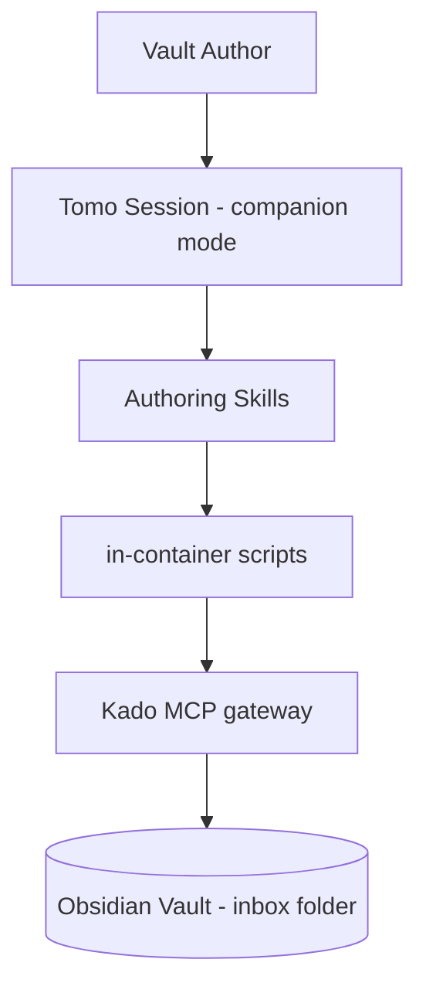
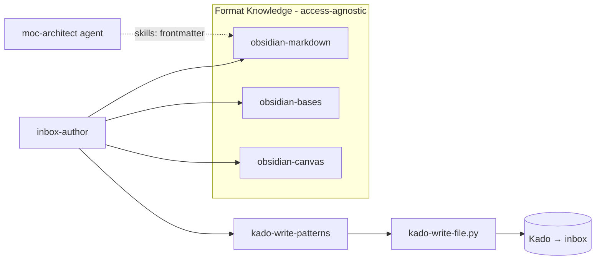

# Solution Design Document

## Validation Checklist

### CRITICAL GATES (Must Pass)

- [x] All required sections are complete
- [x] No [NEEDS CLARIFICATION] markers remain
- [x] Architecture pattern is clearly stated with rationale
- [x] **All architecture decisions confirmed by user**
- [x] Every interface has specification

### QUALITY CHECKS (Should Pass)

- [x] All context sources are listed with relevance ratings
- [x] Project commands are discovered from actual project files
- [x] Constraints → Strategy → Design → Implementation path is logical
- [x] Every component in diagram has directory mapping
- [x] Error handling covers all error types
- [x] Quality requirements are specific and measurable
- [x] Component names consistent across diagrams
- [x] A developer could implement from this design

---

## Constraints

- **CON-1 (Authoring tooling):** All skills are authored/audited via `/skill-author`. Skills are
  directories with `SKILL.md`; runtime SKILL.md contains **imperatives/invocations only** — no
  explanatory prose, dates, or spec refs (WHY → `docs/tomo/<mirror>.md`). `# version: X.Y.Z` header,
  number only.
- **CON-2 (Access boundary, Constitution L1/L2):** All vault writes go through Kado to the **inbox
  folder only**. The Kado key stays read-broad + write-inbox-only. No new agent, persona, or slash
  command. No broader ACL, no cross-repo Kado change, no Kokoro ADR.
- **CON-3 (Runtime reachability):** Source-repo `t_*_tomo.md` templates and host paths are NOT
  reachable inside the container; only vault content (via Kado) and in-container `scripts/` are.
- **CON-4 (Privacy, Constitution L1):** Local-first; no telemetry. kepano (MIT) attribution lives in
  README (general) + optional `docs/tomo/` mirror — never in runtime SKILL.md.
- **CON-5 (Dependency licensing, Constitution L1):** kepano/obsidian-skills is MIT — adaptation
  permitted with attribution; recorded as a dependency note in README.

## Implementation Context

### Required Context Sources

#### Documentation Context
```yaml
- doc: docs/XDD/ideas/2026-06-28-companion-p1-authoring-skills.md
  relevance: HIGH
  why: "Approved brainstorm charter — the design contract this SDD realizes"
- doc: docs/XDD/specs/026-companion-p1-authoring-skills/requirements.md
  relevance: HIGH
  why: "PRD — the 22 acceptance criteria this design must satisfy"
- url: https://github.com/kepano/obsidian-skills
  relevance: HIGH
  why: "MIT source for obsidian-markdown / obsidian-bases / json-canvas format knowledge (adopt)"
- url: https://jsoncanvas.org/spec/1.0/
  relevance: MEDIUM
  why: "Authoritative JSON Canvas 1.0 spec for obsidian-canvas content"
```

#### Code Context
```yaml
- file: tomo/dot_claude/skills/obsidian-markdown/SKILL.md
  relevance: HIGH
  why: "Deliverable 1 — upgrade in place (flip user-invocable, broaden description, expand content)"
- file: tomo/dot_claude/skills/default-doc-writer/SKILL.md
  relevance: HIGH
  why: "Deliverable 4 — rename to inbox-author + extend; preserve its 5-step pipeline + 3 STRICTs"
- file: tomo/dot_claude/skills/kado-discovery-patterns/SKILL.md
  relevance: HIGH
  why: "Read-side complement; kado-write-patterns must state the read/write boundary against it"
- file: tomo/scripts/kado-write-file.py
  relevance: HIGH
  why: "Write helper; lines 78-84 branch .md→write_note vs non-.md→write_file (extension-agnostic)"
- file: tomo/scripts/lib/kado_client.py
  relevance: MEDIUM
  why: "write_note (l.298), write_file (l.322), write_frontmatter (l.352) — kado-write-patterns refs"
- file: tomo/scripts/token-render.py
  relevance: MEDIUM
  why: "Markdown/token-only renderer; the .md path. NOT usable for .canvas (JSON) / .base (YAML)"
- file: tomo/scripts/read-config-field.py
  relevance: MEDIUM
  why: "Resolves concepts.inbox + templates.mapping.<key>"
- file: tomo/dot_claude/agents/moc-architect.md
  relevance: MEDIUM
  why: "Loads obsidian-markdown via skills: frontmatter (l.8-10) — compatibility anchor"
- file: scripts/update-tomo.sh
  relevance: MEDIUM
  why: "RETIRED_SKILLS_DIRS array — add default-doc-writer on rename so old instance dirs are pruned"
- file: tomo/config/templates/t_default_tomo.md
  relevance: LOW
  why: "Shipped starter templates; NOT runtime-reachable, illustrative of template shapes"
```

#### External APIs
```yaml
- service: Kado MCP (門) — kado-write
  doc: tomo/scripts/lib/kado_client.py + Kado src/mcp/request-mapper.ts
  relevance: HIGH
  why: "operation=note (.md) / operation=file (non-.md, base64). VERIFIED: .base/.canvas accepted via operation=file (request-mapper Rule 3). No handoff needed."
```

### Implementation Boundaries

- **Must Preserve:** `default-doc-writer`'s 5-step pipeline behaviour and its 3 STRICT guards
  (built-in template fallback, `--tokens` file, `sanitize_stem`); `moc-architect`'s load of
  `obsidian-markdown`; the inbox-only write boundary.
- **Can Modify:** `obsidian-markdown` frontmatter + body; `default-doc-writer` → `inbox-author`
  (rename + extend); `scripts/update-tomo.sh` `RETIRED_SKILLS_DIRS`; README (attribution).
- **Must Not Touch:** `kado-write-file.py` / `kado_client.py` (already extension-agnostic — no change);
  `/inbox` triage pipeline (`.base`/`.canvas` handling is #93); Kado (no contract change).

### External Interfaces

#### System Context Diagram



#### Interface Specifications

```yaml
inbound:
  - name: "User conversational request / direct skill invocation"
    type: in-session (Claude Code)
    format: natural language / /skill-name
    authentication: n/a (local session)
    data_flow: "Authoring requests; direct format-reference lookups"
outbound:
  - name: "Kado kado-write (via kado-write-file.py)"
    type: MCP over local HTTP (127.0.0.1)
    format: operation=note (utf-8) | operation=file (base64)
    authentication: bearer token (existing Tomo key, write-inbox-only)
    data_flow: "Composed artifact bytes → inbox folder"
    criticality: HIGH
data:
  - name: "Vault (via Kado read)"
    type: Kado kado-read / kado-search
    connection: kado_client
    data_flow: "Template bodies (by stem), source notes for compilation, collision existence check"
```

### Project Commands

```bash
Install: ./venv/bin/python -m pip install -r requirements.txt   # tests need jsonschema
Test:    ./venv/bin/python -m pytest tests/                     # use venv python (system lacks jsonschema)
Lint:    ./venv/bin/ruff check .
Sync:    ./scripts/update-tomo.sh --yolo                        # version-gated sync to instance
SkillAuthor: /skill-author                                      # author/audit every skill
```

## Solution Strategy

- **Architecture Pattern:** Skill-layered knowledge + thin orchestration. Five Claude Code skills
  partitioned into **format-knowledge skills** (access-agnostic), one **authoring-orchestration skill**
  (`inbox-author`), and one **write-helper skill** (`kado-write-patterns`). No new runtime process.
- **Integration Approach:** Reuse the existing `default-doc-writer` write chain
  (`read-config-field.py` → template → `token-render.py` for `.md`; direct-compose for JSON) and the
  already-extension-agnostic `kado-write-file.py`. Extend, do not rebuild.
- **Justification:** Maximizes reuse, keeps each skill small/focused (Constitution L2), preserves the
  inbox-only boundary, and passes the "skill test" (each skill encodes non-obvious knowledge).
- **Key Decisions:** see ADRs. Headline: one write-side skill symmetric to `kado-discovery-patterns`;
  `.canvas` (JSON) / `.base` (YAML) composed directly (no token renderer) → staged file →
  `operation=file`; extension-routed parse-gate in P1 (`.canvas` → `validate-json.py`,
  `.base` → `validate-yaml.py`).

## Building Block View

### Components



### Directory Map

**Component**: Tomo runtime skills + scripts
```
.
├── tomo/dot_claude/skills/
│   ├── obsidian-markdown/SKILL.md          # MODIFY: user-invocable, description, content audit
│   ├── obsidian-bases/SKILL.md             # NEW: .base format knowledge (kepano-adapted)
│   ├── obsidian-bases/references/          # NEW: optional FUNCTIONS_REFERENCE.md (kepano-adapted)
│   ├── obsidian-canvas/SKILL.md            # NEW: JSON Canvas knowledge (kepano json-canvas-adapted)
│   ├── obsidian-canvas/references/         # NEW: optional EXAMPLES.md
│   ├── inbox-author/SKILL.md               # RENAME from default-doc-writer + EXTEND
│   ├── kado-write-patterns/SKILL.md        # NEW: write-side Kado helper invocations
│   └── default-doc-writer/                 # DELETE (renamed → inbox-author)
├── tomo/scripts/
│   ├── validate-json.py                    # NEW: deterministic JSON parse-gate for .canvas (exit 0=valid/1=invalid)
│   ├── validate-yaml.py                    # NEW: deterministic YAML parse-gate for .base (exit 0=valid/1=invalid)
│   └── kado-write-file.py                  # MODIFY: add --no-overwrite (refuse + signal if vault path exists)
├── tests/
│   ├── test_validate_json.py               # NEW: valid .canvas passes, invalid fails non-zero, no write
│   ├── test_validate_yaml.py               # NEW: valid .base passes, invalid fails non-zero, no write
│   ├── test_kado_write_file_no_overwrite.py # NEW: exists→refused signal; absent→writes; .base/.canvas
│   └── test_inbox_author_pipeline.py       # NEW: compose+write, parse-gate blocks, collision warn-path, template fallback (fake Kado)
├── docs/tomo/dot_claude/skills/
│   ├── obsidian-markdown.md                # MODIFY: WHY for the upgrade
│   ├── obsidian-bases.md                   # NEW: WHY + kepano attribution
│   ├── obsidian-canvas.md                  # NEW: WHY + kepano attribution
│   ├── inbox-author.md                     # RENAME from default-doc-writer.md + update scope
│   ├── kado-write-patterns.md              # NEW: WHY + read/write boundary rationale
│   └── default-doc-writer.md               # DELETE (renamed)
├── docs/tomo/scripts/
│   ├── validate-json.md                    # NEW: WHY for the .canvas JSON parse-gate
│   └── validate-yaml.md                    # NEW: WHY for the .base YAML parse-gate
├── evolution/2026-06/
│   └── companion-mode-p1.md                # NEW: rollout log (5 skills, rename, RETIRED_SKILLS_DIRS)
├── scripts/update-tomo.sh                  # MODIFY: RETIRED_SKILLS_DIRS += default-doc-writer
├── PRIVACY.md                              # MODIFY: add "Companion mode" vault-read paragraph
└── README.md                               # MODIFY: kepano MIT attribution + dependency note
```

**Cross-repo:** `_outbox/for-kokoro/` — NEW lightweight design note (companion inbox-only write
contract; `.base`/`.canvas` artifact type now written by Tomo; the "no `/inbox` triage for these"
policy / #93 boundary). Satisfies Constitution L2 Architecture without a full ADR.

### Interface Specifications

#### Skill frontmatter contracts (differentiated triggers — ADR-6)

```yaml
obsidian-markdown:
  user-invocable: true
  description: "Use PROACTIVELY when authoring or writing Obsidian-Flavored Markdown — wikilinks,
    embeds, callouts, frontmatter properties, tables, tags, headings, footnotes, math, Mermaid.
    Triggers when the task mentions writing/fixing .md note SYNTAX. (Metadata classification/field
    semantics → obsidian-fields; .base → obsidian-bases; .canvas → obsidian-canvas.)"
obsidian-bases:
  user-invocable: true
  description: "Use PROACTIVELY when authoring an Obsidian .base (Bases) view — filters, formulas,
    properties, views, summaries. Triggers when the task mentions a .base file or a Bases view.
    (Markdown → obsidian-markdown; .canvas → obsidian-canvas.)"
obsidian-canvas:
  user-invocable: true
  description: "Use PROACTIVELY when authoring an Obsidian .canvas (JSON Canvas) file — nodes, edges,
    groups, layout. Triggers when the task mentions a canvas/.canvas artifact. (Markdown →
    obsidian-markdown; .base → obsidian-bases.)"
inbox-author:
  user-invocable: true
  argument-hint: "what to create, e.g. 'an overview of my 2025 trips' or 'a reading-list base'"
  description: "Use PROACTIVELY when the user asks Tomo to CREATE a free-form artifact and save it
    into the vault — overview, list, summary, comparison, compiled log, a .base view, or a .canvas.
    Composes correct format (via obsidian-markdown/bases/canvas) and writes to the inbox. NOT for
    defined-type notes produced by /inbox Pass-2."
  skills: [kado-write-patterns]    # only the always-needed write helper is pre-loaded; format
                                   # skills (markdown/bases/canvas) auto-trigger by artifact type (ADR-6/ADR-9)
kado-write-patterns:
  user-invocable: true
  description: "Use when composing or WRITING artifacts to the vault — kado-write-file.py (.md→note,
    non-.md→file), write_frontmatter, read-config-field.py, token-render.py, sanitize_stem. The
    read/query side is in kado-discovery-patterns."
```

#### Data Storage Changes
Not applicable — no database. Vault writes go through Kado to the inbox folder.

#### Internal API Changes
Not applicable — no HTTP API. The only "interface" changes are skill frontmatter + invocations above.

#### Application Data Models
Not applicable — no persistent data model. Transient artifacts staged under `tomo-tmp/`.

#### Integration Points
```yaml
External_Service_Kado:
  - doc: tomo/scripts/lib/kado_client.py
  - sections: [write_note, write_file, write_frontmatter, read_note, search_by_name]
  - integration: "inbox-author → kado-write-patterns invocations → kado-write-file.py → Kado kado-write"
  - critical_data: [composed artifact bytes, template bodies, inbox path]
```

### Implementation Examples

#### Example: inbox-author format dispatch + .base/.canvas path

**Why this example:** the new branch (`.md` vs direct-compose: `.canvas` JSON / `.base` YAML) is the
core extension; it must reuse the `.md` pipeline unchanged and add a direct-compose path with an
extension-routed parse-gate.

```text
# Pseudocode — inbox-author orchestration (skill = imperatives; this shows the decision flow)
1. Determine artifact format from the request: md | base | canvas
2. Resolve template (md path only):
     key = mapped type or "default"
     body = read-config-field.py --field templates.mapping.<key>  → kado-read by stem
     on empty/missing → built-in minimal default (Write tool) + tell user
3. Compose:
     md     → token-render.py --template <staged-template> --tokens tomo-tmp/...json
     canvas → compose JSON directly (guided by obsidian-canvas)
                   → Write to tomo-tmp/staged-artifact.canvas
                   → python3 scripts/validate-json.py tomo-tmp/staged-artifact.canvas
                     (exit 1 → STOP, surface error, do NOT write)
     base   → compose YAML directly (guided by obsidian-bases)
                   → Write to tomo-tmp/staged-artifact.base
                   → python3 scripts/validate-yaml.py tomo-tmp/staged-artifact.base
                     (exit 1 → STOP, surface error, do NOT write)
4. Write with collision guard:
     kado-write-file.py --no-overwrite --local tomo-tmp/staged-artifact.<ext> \
       --vault "<inbox>/<sanitized-stem>.<ext>"
     if it returns the "exists" signal → warn + AskUserQuestion (overwrite / rename / cancel);
       on "overwrite" re-run without --no-overwrite
5. Report vault path
```

**Edge cases:** invalid `.canvas` JSON / `.base` YAML → no write (step 3). Unknown type, no vault template → default template +
note (step 2). Collision → user-gated (step 4). Stem sanitization applies to the stem only;
`.<ext>` appended separately.

## Runtime View

### Primary Flow: Compose-to-Inbox

1. User requests an artifact in-session.
2. Tomo classifies format; relevant format skill auto-loads (description trigger).
3. `inbox-author` resolves template (md) / directly composes `.canvas` (JSON) or `.base` (YAML) and
   runs the extension-routed parse-gate (`validate-json.py` for `.canvas`, `validate-yaml.py` for `.base`).
4. Collision check → warn+ask if needed.
5. `kado-write-patterns` invocation writes to the inbox; Tomo reports the path.

```mermaid
sequenceDiagram
    actor User
    participant Session as Tomo Session
    participant IA as inbox-author
    participant Fmt as format skill
    participant KWF as kado-write-file.py
    participant Kado

    User->>Session: "make a reading-list base"
    Session->>Fmt: auto-load obsidian-bases (description)
    Session->>IA: compose + write
    IA->>IA: compose .base YAML (guided by obsidian-bases)
    IA->>IA: Write tomo-tmp/staged-artifact.base ; validate-yaml.py (yaml.safe_load())
    IA->>Kado: collision check (read inbox path)
    IA->>KWF: --local staged-artifact.base --vault <inbox>/<stem>.base
    KWF->>Kado: kado-write operation=file (base64)
    Kado-->>IA: ok
    IA-->>User: "Wrote <inbox>/<stem>.base"
```

### Error Handling

- **Malformed artifact (.canvas JSON / .base YAML):** the extension-routed parse-gate fails
  (`validate-json.py` for `.canvas`, `validate-yaml.py` for `.base`) → no write; surface
  "<artifact> is not valid <JSON|YAML>: <error>"; offer to recompose.
- **Template field empty / template not found in vault:** fall back to built-in minimal default; tell
  the user a fallback was used.
- **Unknown type, no vault template:** use default template; tell the user no type-specific template
  was found.
- **Inbox collision (same stem+ext):** warn + AskUserQuestion (overwrite / rename / cancel).
- **Kado write error / concurrency (write_frontmatter):** surface the Kado error; for
  `expected_modified` conflicts, surface and let the user retry (no silent overwrite).
- **Kado extension rejection:** does not occur (verified). If a live test ever returns
  VALIDATION_ERROR on `.base`/`.canvas`, raise an `_outbox/for-kado/` handoff and fall back to a `.md`
  code-fenced wrapper.

### Complex Logic

```text
ALGORITHM: resolve_template(requested_type)
INPUT: requested_type (string | none)
OUTPUT: template_body, used_fallback (bool), note_to_user (string|none)

1. IF requested_type in KNOWN_KEYS {atomic_note, map_note, daily, weekly, monthly, yearly,
   project, source, default}:
     stem = read-config-field.py --field templates.mapping.<requested_type> --default ""
     IF stem nonempty: body = kado-read(by stem); IF ok → RETURN (body, false, none)
     RETURN (builtin_minimal, true, "template <type> unset/missing — used built-in default")
2. ELSE (unknown type):
     hit = kado-search byName in templates base for a matching format
     IF hit → RETURN (hit_body, false, none)
     RETURN (default_template_or_builtin, true,
             "no type-specific template found — used the default/inbox template")
```

## Deployment View

### Single Application Deployment
- **Environment:** Tomo Docker container; skills under `tomo-instance/.claude/skills/` at runtime.
- **Configuration:** none new. Uses existing `concepts.inbox`, `templates.mapping.*` from vault-config.
- **Dependencies:** Kado reachable (existing). No new runtime dependency.
- **Sync:** `update-tomo.sh` is **version-gated** — every modified/renamed skill must bump its
  `# version`, else the sync SKIPS it. After sync, grep the instance copy to confirm.
- **Rename rollout:** `RETIRED_SKILLS_DIRS += default-doc-writer` so the old instance directory is
  pruned; otherwise both old and new skills co-exist and may double-trigger.

### Multi-Component Coordination
No change — single component (Tomo). Kado/Hashi untouched.

## Cross-Cutting Concepts

### Pattern Documentation
```yaml
- pattern: tomo/dot_claude/skills/kado-discovery-patterns/SKILL.md
  relevance: HIGH
  why: "Read-side sibling; kado-write-patterns mirrors its shape and states the read/write split"
- pattern: tomo/dot_claude/skills/default-doc-writer/SKILL.md
  relevance: CRITICAL
  why: "inbox-author extends this exact pipeline; the 3 STRICTs carry over verbatim"
```

### System-Wide Patterns
- **Security/Privacy:** inbox-only writes; existing key; no telemetry; kepano attribution in README.
- **Error Handling:** fail-closed on invalid `.canvas` JSON / `.base` YAML; user-gated collision; graceful template fallback.
- **Performance:** skills are knowledge (no hot path). `.base`/`.canvas` are single-file writes.
- **Logging/Auditing:** Kado's existing audit log records the write (metadata only).

### Runtime authoring convention (NEW pattern reinforced)
Runtime SKILL.md = imperatives/invocations only. Each new/modified skill gets a `docs/tomo/<mirror>.md`
WHY file authored BEFORE rationale is stripped from runtime. kepano attribution: README general +
`docs/tomo/` mirror optional.

## Architecture Decisions

- [x] **ADR-1 kado-write-patterns (one write-side skill):** package all write-side Kado helper
  invocations in a single skill named `kado-write-patterns`, symmetric to the read-side
  `kado-discovery-patterns`.
  - Rationale: clean read/write split stated in both descriptions; one focused skill; research
    recommended against multiple sub-skills (cognitive/maintenance cost).
  - Trade-offs: a single broader trigger surface vs. several precise ones.
  - User confirmed: **Yes (2026-06-28)**

- [x] **ADR-2 .base/.canvas staging path:** stage the composed artifact (`.canvas` JSON / `.base` YAML)
  to `tomo-tmp/staged-artifact.<ext>` before upload.
  - Rationale: consistent with the existing `tomo-tmp/default-doc.md` pattern; deterministic single
    artifact per run.
  - Trade-offs: generic name (not stem-mirrored) — slightly less self-describing while debugging.
  - User confirmed: **Yes (2026-06-28)**

- [x] **ADR-3 inbox-author = rename + extend (not a new skill):** rename `default-doc-writer` →
  `inbox-author`, preserving its 5-step pipeline and 3 STRICT guards; add format dispatch + template
  mapping + JSON path + collision handling.
  - Rationale: the capability already exists; rename+extend avoids a duplicate skill.
  - Trade-offs: rename fan-out (docs mirror, RETIRED_SKILLS_DIRS, references).
  - User confirmed: **Yes (brainstorm 2026-06-28)**

- [x] **ADR-4 .base/.canvas via direct-compose → operation=file; extension-routed parse-gate:** the
  `.md` path keeps `token-render.py`; the non-`.md` formats are composed directly (token-render is
  md-only) and written via `kado-write-file.py` `operation=file`. `.canvas` is **JSON** (json-canvas
  1.0) composed directly → gated by the deterministic `validate-json.py`; `.base` is **YAML** (not
  JSON) composed directly → gated by the deterministic `validate-yaml.py`. Both gates are scripts, not
  inline LLM logic (see ADR-9), and `inbox-author` routes the gate BY EXTENSION
  (`.canvas` → `validate-json.py`, `.base` → `validate-yaml.py`).
  - Correction: this supersedes the original `.base`-as-JSON assumption — `.base` files are Obsidian's
    YAML-based view format, so a `json.loads()` gate would reject valid `.base` content; YAML needs its
    own parse-gate.
  - Rationale: token-render cannot produce JSON/YAML; `kado-write-file.py` is already
    extension-agnostic; Kado accepts non-`.md` via `operation=file` (verified). The parse-gate prevents
    malformed artifacts, matched to each format's real syntax.
  - Trade-offs: structural/semantic validation deferred to #92.
  - User confirmed: **Yes (2026-06-28)**

- [x] **ADR-5 template mapping uses real schema keys + fallback chain:** keys are
  `atomic_note, map_note, daily, weekly, monthly, yearly, project, source` (+ `default` convention).
  Empty/missing → built-in minimal default + user note. Unknown type → vault search → else default +
  note.
  - Rationale: charter's `note`/`moc` were wrong vs. the actual schema; correctness + graceful
    fallback.
  - Trade-offs: `default` is a convention not in the schema example — documented as special-case.
  - User confirmed: **Yes (2026-06-28)**

- [x] **ADR-6 access-agnostic format skills + differentiated descriptions; no pre-load:** format
  skills never mention Kado; descriptions anchor to one artifact type each to prevent cross-format
  co-load and the obsidian-fields callout collision. `inbox-author` does NOT pre-load them via
  `skills:` frontmatter — they auto-trigger by artifact type; only `kado-write-patterns` (always
  needed) is pre-loaded.
  - Rationale: token economy + correct single-skill loading; preserves obsidian-fields boundary;
    pre-loading all three wastes context on `.md`-only requests (Constitution L2 Performance).
  - Trade-offs: relies on description-match firing at the write moment (mitigated by precise triggers
    + skill-author audit).
  - User confirmed: **Yes (2026-06-28)**

- [x] **ADR-7 inbox collision → warn + ask, via `--no-overwrite`:** `kado-write-file.py` gains a
  `--no-overwrite` flag that refuses the write and returns an "exists" signal if the vault path is
  already present; `inbox-author` then warns and AskUserQuestion before re-writing.
  - Rationale: `default-doc-writer` overwrote silently — data-loss risk. A deterministic flag makes
    the existence check testable (Constitution L1, see ADR-9) instead of LLM-judged.
  - Trade-offs: small change to `kado-write-file.py` + its test.
  - User confirmed: **Yes (2026-06-28)**

- [x] **ADR-9 extract safety logic to deterministic, testable scripts (Constitution L1):** the
  parse-gates → `tomo/scripts/validate-json.py` (`.canvas` JSON) and `tomo/scripts/validate-yaml.py`
  (`.base` YAML); the collision existence-check → a `--no-overwrite` flag on `kado-write-file.py`.
  `inbox-author` SKILL prose *invokes* these (routing the parse-gate by extension); it does
  not implement the logic in LLM-executed imperatives.
  - Rationale: Constitution L1 Code Quality (core logic testable without an AI in the loop) and L1
    Testing (write paths need happy + failure tests). Safety properties (no malformed JSON/YAML, no
    silent overwrite) must not depend on LLM adherence.
  - Trade-offs: two small new/changed scripts + their unit tests vs. pure-prose simplicity.
  - User confirmed: **Yes (2026-06-28)**

- [x] **ADR-8 kepano attribution in README only:** general MIT attribution + dependency note in
  README; optional explicit note in `docs/tomo/` mirrors; never in runtime SKILL.md.
  - Rationale: MIT-sufficient; honors runtime-imperatives-only convention.
  - Trade-offs: none material.
  - User confirmed: **Yes (2026-06-28)**

## Quality Requirements

- **Performance:** no main-thread/hot-path impact (skills are knowledge). Single-file inbox writes.
- **Usability:** correct skill auto-loads per format family without the user naming it; no cross-format
  co-load; clear messages on fallback/collision/invalid-JSON.
- **Security:** inbox-only writes via existing key; no new surface; no telemetry.
- **Reliability:** fail-closed on invalid `.canvas` JSON / `.base` YAML; graceful template fallback; no silent overwrite;
  `moc-architect` unaffected; full test suite green under `./venv/bin/python`.

### Test Strategy (Constitution L1 Testing — happy + failure per write path)

Tests run under `./venv/bin/python -m pytest tests/` (system python lacks jsonschema → use venv).

- **`test_validate_json.py`** — valid `.canvas` JSON → exit 0; malformed JSON → exit 1 +
  error message; no file written by the validator.
- **`test_validate_yaml.py`** — valid `.base` YAML → exit 0; malformed YAML → exit 1 +
  error message; no file written by the validator.
- **`test_kado_write_file_no_overwrite.py`** — `--no-overwrite` with an existing vault path → refused
  + "exists" signal, no overwrite; absent path → writes; covers a non-`.md` extension
  (`.base`/`.canvas`) through `operation=file` (`write_file`) against a fake/mock Kado (happy +
  denial).
- **`test_inbox_author_pipeline.py`** — integration against a fake Kado at the public entry point
  (mock at orchestrator, not helper): (a) compose+write happy path lands the artifact; (b) the extension-routed parse-gate
  blocks the write on malformed `.canvas` JSON and on malformed `.base` YAML; (c) collision path returns the "exists" signal and triggers the
  warn branch; (d) template resolution falls back to built-in default + user note when the mapping is
  empty/missing. Permission boundary: assert writes target only `concepts.inbox`.

## Acceptance Criteria

**Main Flow (PRD Feature 1-5):**
- [ ] WHEN the user requests a free-form artifact, THE SYSTEM SHALL compose it in the correct format
  (guided by the matching format skill) and write it to `concepts.inbox` with a sanitized stem.
- [ ] WHEN a `.md` / `.base` / `.canvas` task fires, THE SYSTEM SHALL auto-load exactly the matching
  format skill and SHALL NOT co-load the other two or `obsidian-fields`.
- [ ] WHERE `obsidian-markdown` is referenced by `moc-architect` via `skills:` frontmatter, THE SYSTEM
  SHALL continue loading it by name with no regression.

**Error Handling (PRD edge cases):**
- [ ] IF composed `.canvas` JSON fails `validate-json.py` (`json.loads()`) OR composed `.base` YAML
  fails `validate-yaml.py` (`yaml.safe_load()`), THEN THE SYSTEM SHALL NOT write and SHALL surface the
  parse error.
- [ ] IF an inbox file with the same stem+extension exists, THEN THE SYSTEM SHALL warn and ask before
  overwriting.
- [ ] IF a requested type has no mapping and no vault template, THEN THE SYSTEM SHALL write with the
  default template and tell the user no type-specific template was found.

**State/Config:**
- [ ] WHILE running on an existing instance after the rename, THE SYSTEM SHALL prune the
  `default-doc-writer` directory (RETIRED_SKILLS_DIRS) and SHALL leave no runtime reference to the old
  name.
- [ ] THE SYSTEM SHALL keep `kado-write-patterns` write-side only and direct read/query tasks to
  `kado-discovery-patterns`.

## Risks and Technical Debt

### Known Technical Issues
- `update-tomo.sh` is version-gated: forgetting to bump a skill's `# version` silently skips the sync —
  the instance keeps stale skill content. Mitigation: bump every touched skill; grep instance after sync.

### Technical Debt
- `.canvas` (JSON, via `validate-json.py`) and `.base` (YAML, via `validate-yaml.py`) have only a
  parse-gate in P1; structural/semantic validation is #92.
- `default` template key is a `default-doc-writer` convention absent from the schema example —
  consider canonizing it in a later config pass.

### Implementation Gotchas
- `sanitize_stem` on a name that includes the extension would mangle the dot — apply to the stem only,
  append `.<ext>` separately.
- Description wording is the #1 failure point for auto-trigger and the obsidian-fields callout
  collision — run `/skill-author` audit on every description.
- Source-repo `t_*_tomo.md` are NOT runtime-reachable — only the built-in minimal default is the
  in-container fallback (STRICT-1 preserved).

## Glossary

### Domain Terms
| Term | Definition | Context |
|------|------------|---------|
| Companion | The existing conversational Tomo session in authoring mode | No separate process |
| Inbox | The vault folder (`concepts.inbox`) Tomo writes to | Only permitted write target |
| MOC | Map of Content | obsidian-markdown / moc-architect |

### Technical Terms
| Term | Definition | Context |
|------|------------|---------|
| OFM | Obsidian-Flavored Markdown | obsidian-markdown skill |
| JSON Canvas | The `.canvas` JSON node/edge format (spec 1.0) | obsidian-canvas skill |
| Bases / `.base` | Obsidian's YAML-based view format | obsidian-bases skill |
| STRICT block | One-line `Why:` runtime guard for an observed deviation | inbox-author preserves 3 |

### API/Interface Terms
| Term | Definition | Context |
|------|------------|---------|
| operation=note | Kado write for `.md` (utf-8) | kado-write-file.py `.md` path |
| operation=file | Kado write for non-`.md` (base64) | `.base`/`.canvas` path |
| RETIRED_SKILLS_DIRS | update-tomo.sh array pruning removed skill dirs | rename fan-out |

---

## SDD Status Report

| Field | Value |
|-------|-------|
| specId | 026-companion-p1-authoring-skills |
| architecture.pattern | Skill-layered knowledge + thin orchestration (5 skills) |
| architecture.keyComponents | obsidian-markdown, obsidian-bases, obsidian-canvas, inbox-author, kado-write-patterns |
| architecture.externalIntegrations | Kado MCP (kado-write/kado-read) |
| adrs | ADR-1..9 all CONFIRMED |
| validationPending | 0 — constitution validate run; L1 fixes folded in (validate-json.py, --no-overwrite, Test Strategy); L2 fixes (name, no-preload, evolution/PRIVACY/Kokoro tasks) folded in |
| nextSteps | PLAN (test tasks + evolution-log + PRIVACY + Kokoro handoff included) |
