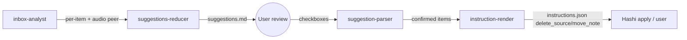

# Solution Design Document

## Validation Checklist

### CRITICAL GATES (Must Pass)

- [x] All required sections are complete
- [x] No [NEEDS CLARIFICATION] markers remain
- [x] Architecture pattern is clearly stated with rationale
- [x] **All architecture decisions confirmed by user** (ADR-1 audio_peer, ADR-3 hard cutover, ADR-4 two-box + per-atomic "Delete source" box removed)
- [x] Every interface has specification

### QUALITY CHECKS (Should Pass)

- [x] Constraints → Strategy → Design → Implementation path is logical
- [x] Project commands discovered from actual project files
- [x] Component names consistent across diagrams
- [x] Error handling covers all error types
- [x] A developer could implement from this design
- [x] Implementation examples use actual field names verified against code

---

## Constraints

- **CON-1 (Architecture L2):** `origin_inbox_item` is a public wire field in two schemas
  (`instructions.schema.json`, `hashi-instructions.schema.json`). Renaming it is a breaking
  inter-component change requiring a documented migration path (Kokoro ADR) + Hashi handoff.
- **CON-2 (Testing L1):** every keep/delete decision and every filesystem-mutation proposal
  must be covered by tests proving BOTH the delete and the keep (reject) outcome.
- **CON-3:** deterministic script rendering only — no LLM assembly of documents/instructions.
- **CON-4 (Privacy L2):** instruction-render telemetry stays metadata-only (paths/counts).
- **CON-5:** Tomo near-MVP — prefer additive changes on hot paths; no gratuitous breakage.
- **CON-6:** Tomo never deletes — it only emits `delete_source` instructions.

## Implementation Context

### Required Context Sources

#### Code Context
```yaml
- file: tomo/scripts/suggestions-reducer.py
  relevance: HIGH
  why: "Renders per-item decision block (374) + consolidation keep control (788)"
- file: tomo/scripts/suggestion-parser.py
  relevance: HIGH
  why: "Parses checkbox state → keep_origin/delete_source/source_path (337-456, 1440-1530)"
- file: tomo/scripts/instruction-render.py
  relevance: HIGH
  why: "_build_move_note_actions (739-772), _build_delete_source_actions (974-1104), keep_origin plumbing, display 1411"
- file: tomo/scripts/instructions-diff.py
  relevance: MEDIUM
  why: "Consumes origin_inbox_item (366-368) + keep_origin (297) for idempotency diff"
- file: tomo/schemas/instructions.schema.json
  relevance: HIGH
  why: "Wire contract; origin_inbox_item:93, additionalProperties:false"
- file: tomo/schemas/hashi-instructions.schema.json
  relevance: HIGH
  why: "Hashi-facing wire contract; origin_inbox_item:94"
- file: tomo/dot_claude/agents/inbox-analyst.md
  relevance: HIGH
  why: "Detects voice via transcribed:; reads transcript source: frontmatter (must also EMIT audio peer)"
- file: tomo/dot_claude/agents/voice-transcriber.md
  relevance: MEDIUM
  why: "Writes transcript with `source: <audio filename>` frontmatter — the audio↔transcript link"
```

### Implementation Boundaries

- **Must Preserve:** the Pass-1→review→Pass-2 two-pass model; the propose-only invariant; the
  completion gate (delete a source only after all expected atomics for it are rendered); the
  default-delete-after-move behavior; existing green test suite (1782).
- **Can Modify:** per-item decision-block render; parser checkbox labels + field names; the
  delete-source builder; the move_note builder; the analyst's per-item output (add audio peer);
  both wire schemas (with migration); `instructions-diff` consumers.
- **Must Not Touch:** unrelated Pass-1 MOC-insertion logic (spec 022/023); Kado client; the
  voice-transcriber's audio handling (it already writes the `source:` link).

### External Interfaces

The only external boundary is the **instruction-set wire contract** consumed by Hashi (and the
user applying instructions). No network/DB/queue. System context:



### Project Commands
```bash
# Test (host-only, venv): ./venv/bin/python -m pytest tests/ -q
# Targeted: ./venv/bin/python -m pytest tests/test-resolve-section-names.py tests/test_instruction_render_*.py -q
```

## Solution Strategy

Extend the existing deterministic script pipeline — **no new components**. Model an item's
source as a **set of files** so one keep/delete decision governs the whole set; carry the
audio peer from the analyst (which already reads the transcript `source:` frontmatter) through
the manifest/confirmed-item to the delete builder; unify naming on `source`; and rename the
wire field behind a backward-compatible dual-accept window so Tomo and Hashi can deploy in any
order before the old name is retired.

## Building Block View

### Components (all existing scripts; changes are additive where possible)

| Component | Change |
|-----------|--------|
| `inbox-analyst` (agent) | Emit `audio_peer` (vault-relative path) per item when the transcript declares a `source:` audio file. No new Kado reads. |
| `suggestions-reducer.py` | Collapse the 4-box block to the new decision model (ADR-4); render the source as a file set for voice items; rename labels origin→source. |
| `suggestion-parser.py` | Parse the new label set; rename `keep_origin`→`keep_source`; carry the source set + audio peer onto confirmed items. |
| `instruction-render.py` | `_build_move_note_actions`: emit `source_inbox_item` (new name) + carry audio peer. `_build_delete_source_actions`: emit a `delete_source` for EACH file in the source set (transcript + audio) unless kept. Rename `keep_origin_*`→`keep_source_*`. |
| `instructions-diff.py` | Accept both old/new wire field names (migration); rename internal `keep_origin`. |
| `instructions.schema.json` + `hashi-instructions.schema.json` | Rename `origin_inbox_item`→`source_inbox_item` (no alias); bump `schema_version` const `"1"`→`"2"` (ADR-3). |
| `docs/instructions-json.md` + `tomo/CHANGELOG.md` | Document the schema_version v2 bump + the breaking rename (incompatible-change classification). |

### Directory Map
```
tomo/scripts/{suggestions-reducer,suggestion-parser,instruction-render,instructions-diff}.py
tomo/schemas/{instructions,hashi-instructions}.schema.json
tomo/dot_claude/agents/inbox-analyst.md
docs/tomo/scripts/*.md            # WHY-persistence counterparts (update alongside)
tests/                            # host-only; add authorize+reject coverage
```

### Interface Specifications

#### Data model change — confirmed item / manifest (Application Data Models)

Additive `audio_peer` companion alongside the existing `source_path` (ADR-1 option B):

```python
# confirmed item (suggestion-parser output) — ADDED fields in **bold** intent
{
  "id": "S01",
  "source_path": "100 Inbox/2026-04-08_1430_oh-my-zsh.md",  # primary (transcript/origin)
  "audio_peer": "100 Inbox/2026-04-08_1430_oh-my-zsh.m4a",   # NEW — None when no peer
  "keep_source": False,   # RENAMED from keep_origin
  "delete_source": False, # unchanged (skip-with-delete path)
}
```

#### Wire schema change (`instructions.schema.json` + `hashi-instructions.schema.json`)

Hard cutover (ADR-3): `move_note`'s `origin_inbox_item` is **renamed** to `source_inbox_item`
in both schemas — no alias retained (`additionalProperties:false` preserved):

```json
"source_inbox_item": {"type": ["string","null"], "description": "Vault-relative path of the inbox source this note derived from. Renderer emits this; the paired delete_source is the cleanup signal."}
```

Tomo emits and Hashi accepts ONLY `source_inbox_item`. Both repos deploy in lockstep; the
migration procedure is "apply pending instruction sets, THEN upgrade Tomo + Hashi together".

The top-level required `schema_version` const bumps `"1"`→`"2"` in both schemas (and the
renderer's emitted header, `instruction-render.py:2707`). Per the `docs/instructions-json.md`
contract, Hashi must reject unknown versions explicitly — so a v2 doc reaching a v1-only Hashi
fails loud with a version error rather than a confusing field error.

#### Integration Points
- **Hashi apply** (`miyo-tomo-hashi#41`): must accept `source_inbox_item` (renamed, no alias)
  and apply a `delete_source` per audio peer. Must land in the SAME deploy as this change
  (ADR-3 lockstep). Handoff via `_outbox/for-tomo-hashi/`.
- **Kokoro**: ADR recording the wire-field rename + migration window.

## Runtime View

### Primary Flow — confirm a voice item, default delete
1. Analyst emits item with `audio_peer` set (from transcript `source:` frontmatter).
2. Reducer renders one **Keep source** control (unchecked default); source shown as the set.
3. User confirms (Keep source unchecked) → parser sets `keep_source=False`, carries `audio_peer`.
4. `_build_move_note_actions` emits `move_note` with `source_inbox_item` = transcript.
5. `_build_delete_source_actions`: completion gate passes → emits `delete_source` for the
   transcript AND one for `audio_peer`.

### Error Handling
- **No audio peer** (`audio_peer is None`): single-file source; one `delete_source` — unchanged.
- **Keep source checked** (`keep_source=True`): stem added to `keep_source_stems` → suppresses
  BOTH the transcript and the audio peer delete.
- **Analyst fails to emit audio_peer** (degraded): renderer behaves as single-file (no audio
  delete) — fail-safe, never deletes something it wasn't told about.
- **Pre-cutover instruction doc** (uses old `origin_inbox_item`): NOT supported post-cutover
  (ADR-3). Migration procedure: apply pending instruction sets BEFORE upgrading Tomo + Hashi.

### Complex Logic — source-set deletion with completion gate (traced)
```
move_notes for stem "oh-my-zsh": [move_note(source_inbox_item=.../oh-my-zsh.md, audio_peer=.../oh-my-zsh.m4a)]
expected_by_stem["oh-my-zsh"] = 1 ; len(moves)=1 → gate passes
keep_source_stems = {}            → not suppressed
emit delete_source(.../oh-my-zsh.md, reason="Origin consumed by 1 atomic")
emit delete_source(.../oh-my-zsh.m4a, reason="Audio peer of consumed origin")
# If keep_source had been checked → emit NEITHER.
```

## Cross-Cutting Concepts

### User Interface & UX
The per-item decision block is redesigned (ADR-4) to separate the **approve/skip** axis from
the **keep/delete-source** axis, eliminating the origin/source double-naming. See ADR-4 for the
two candidate layouts.

### Pattern Documentation
- Reuses: deterministic render (scripts), `write_frontmatter` discipline, the completion-gate
  pattern in `_build_delete_source_actions`, schema `additionalProperties:false` as a drift gate.
- New: source-as-set model; dual-accept wire-field migration window.

## Architecture Decisions

> Status: **CONFIRMED** (2026-06-30). ADR-1 = additive `audio_peer`; ADR-3 = hard cutover
> (Hashi in lockstep); ADR-4 = two-box block (Approve + Keep source). ADR-2/ADR-5 as proposed.

### ADR-1 — Source representation: additive `audio_peer` (CONFIRMED)
- **Choice:** Option B — keep `source_path` as the primary and ADD an optional `audio_peer`
  companion field. The delete builder emits one delete per {primary, audio_peer}.
- **Alternative (rejected):** replace `source_path` with a `source_files: []` list everywhere.
- **Rationale:** additive on a hot path (CON-5); `source_path` has 20+ consumers in the parser
  alone — reworking all into a list is high-churn for a set almost always size 1–2.
- **Trade-offs:** a 2-field representation (primary + peer) rather than a uniform list;
  acceptable since the voice case is the only multi-file source today.

### ADR-2 — Audio peer captured by the analyst (recommended, low-controversy)
- **Choice:** `inbox-analyst` emits `audio_peer` per item from the transcript `source:`
  frontmatter it already reads. Carried through manifest → confirmed item → renderer.
- **Alternative (rejected):** renderer re-derives the peer by listing the inbox for
  `<stem>.<audioext>` — extra Kado reads (429 risk), and must guess the extension.
- **Rationale:** no new Kado calls; the link already exists at analysis time.

### ADR-3 — Wire-field rename: hard cutover with `schema_version` bump, Tomo+Hashi lockstep (CONFIRMED)
- **Choice:** Hard cutover. Rename `origin_inbox_item`→`source_inbox_item` cleanly in both
  schemas; Tomo emits and Hashi accepts ONLY the new name. No deprecated alias. **Bump the
  instruction-set `schema_version` `"1"`→`"2"`** (it is a required top-level `const` field in both
  schemas) as the explicit cutover signal. The documented migration path (CON-1) is: **apply any
  pending instruction sets BEFORE upgrading**, then deploy Tomo + Hashi together (single operator
  controls both deploys — "Hashi will be in sync").
- **Why the version bump (per `docs/instructions-json.md` contract):** `schema_version` "bumps
  when the structure becomes incompatible" and Hashi **must reject unknown versions explicitly**.
  A field rename is a structure-incompatible change, so it earns v2. Safe failure mode: a v2 doc
  hitting an un-upgraded (v1-only) Hashi yields a **clear "unknown schema_version" rejection**
  rather than a confusing missing-field error — making the lockstep window fail loud, not silent.
- **Alternative (rejected):** dual-accept window with a deprecated alias — unnecessary given the
  single-operator lockstep deploy; avoids alias debt + a retirement follow-up.
- **Rationale:** simplest correct design when one operator deploys both repos; the version bump
  provides clean cross-version rejection without a compat shim to build, test, or retire.
- **Trade-offs:** a pre-change (v1) instruction doc left un-applied across the upgrade fails to
  apply against v2 Hashi — by design (clear version error); mitigated by "apply pending first".
- **Migration path artifacts:** Kokoro ADR (breaking rename + version bump + lockstep procedure);
  `_outbox/for-tomo-hashi/` handoff to land Hashi#41 in the same deploy; CHANGELOG +
  `docs/instructions-json.md` updated for schema_version v2.

### ADR-4 — Decision-block layout: two boxes, no redundant Skip (CONFIRMED)
- **Choice (user-formulated):** Drop the redundant "Skip" box — **not approving IS skipping**
  (item stays in inbox). The per-item atomic block becomes two boxes: `Approve` (primary) and a
  single `Keep source files` toggle, whose purpose is exactly the old "keep in inbox / do not
  delete" intent — the user may still need the original(s).
  ```
  **Decision (atomic note):**
  - [x] Approve
  - [ ] Keep source files
        (don't delete the original(s) after the note is created — you may still need them)

  **Source:** [[transcript]] + [[audio.m4a]]     ← voice item shows the file SET
  ```
- **Disposition matrix:**
  - Approve checked, Keep source unchecked (default) → note created; source set proposed for
    deletion (transcript + audio).
  - Approve checked, Keep source checked → note created; source set kept.
  - Approve unchecked → skip; item stays in inbox; nothing deleted.
- **Junk delete-only (no note):** preserved via the existing **skipped-items** flow
  (`disposition=delete_source`), NOT a per-atomic box — keeps the atomic block to two controls.
  *(Confirmed 2026-06-30: remove the per-atomic "Delete source" box.)*
- **Rationale:** matches the user's mental model; eliminates the origin/source double-naming and
  the Approve/Skip redundancy; one toggle governs the whole source set.

### ADR-5 — Internal rename `keep_origin`→`keep_source` (recommended, low-controversy)
- **Choice:** mechanical rename across parser/reducer/render/diff/tests; non-breaking (internal).
- **Rationale:** PRD terminology unification; no wire impact.

## Quality Requirements

| Quality | Target |
|---------|--------|
| Correctness | Voice item delete proposes BOTH files; keep suppresses BOTH; no-peer = single file |
| Compatibility | 100% of old-name instruction docs apply during the window |
| Safety | 0 Tomo-side deletes (instructions only); fail-safe when audio_peer absent |
| Testability | Authorize + reject path for every decision (CON-2) |

## Acceptance Criteria (trace to PRD)

| PRD Feature | Design element |
|-------------|----------------|
| F1 Terminology | ADR-4 labels + ADR-5 rename; no "origin" in user text/live fields |
| F2 Single decision | ADR-4 Layout |
| F3 Voice set delete | ADR-1 audio_peer + ADR-2 capture + delete-builder per-file emit |
| F4 Migration | ADR-3 dual-accept window + Kokoro ADR + hashi#41 handoff |
| F5 Propose-only | Unchanged: builder emits delete_source instructions only |

## Risks and Technical Debt

### Known Technical Issues
- Analyst output schema must gain `audio_peer`; if a future non-voice multi-file source appears,
  ADR-1 Option B's 2-field model would need revisiting (→ Option A).

### Technical Debt
- None introduced for the wire rename (hard cutover leaves no alias). Sole operational debt: the
  lockstep-deploy requirement must be honored (Hashi#41 ships together) — captured in the Kokoro
  ADR + Hashi handoff, not as code debt.

### Implementation Gotchas
- The completion gate (delete only after all expected atomics rendered) must wrap the audio-peer
  delete too — do not emit the audio delete before the transcript's gate passes.
- `_ensure_md_extension` must NOT be applied to the audio peer (preserve `.m4a`).
- Two schemas must change in lockstep (instructions + hashi-instructions).

## Glossary

- **Source set:** the file(s) an item was derived from; voice = {transcript .md + audio}.
- **Audio peer:** the original audio file linked from a transcript's `source:` frontmatter.
- **Dual-accept window:** period during which both old/new wire field names are accepted on apply.
- **Completion gate:** the rule that a source is proposed for deletion only after all expected
  atomics derived from it are represented in the instruction set.
