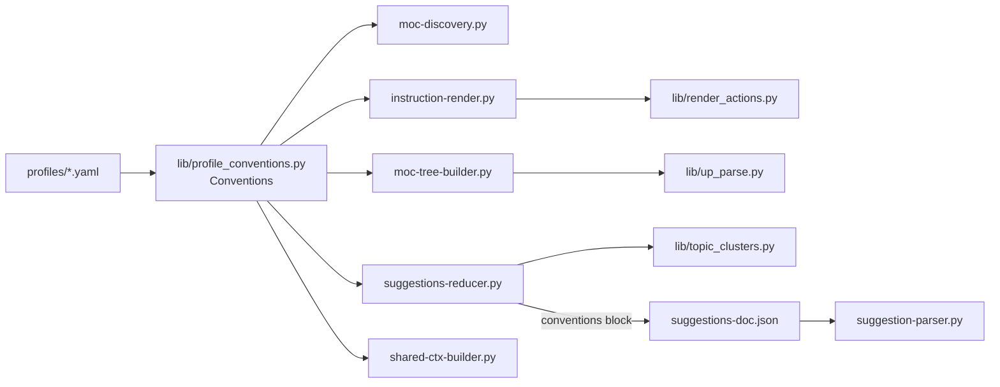

# Solution Design Document

## Validation Checklist

### CRITICAL GATES (Must Pass)

- [x] All required sections are complete
- [x] No [NEEDS CLARIFICATION] markers remain
- [x] Architecture pattern is clearly stated with rationale
- [x] **All architecture decisions confirmed by user** (ADR-1..3 confirmed 2026-07-01)
- [x] Every interface has specification

### QUALITY CHECKS (Should Pass)

- [x] Context sources listed with relevance ratings
- [x] Project commands discovered from actual project files
- [x] Constraints → Strategy → Design → Implementation path is logical
- [x] Every component has directory mapping
- [x] Error handling covers all error types (missing key, empty suffix)
- [x] Quality requirements are specific and measurable
- [x] Component names consistent
- [x] A developer could implement from this design
- [x] Implementation examples use actual symbol names, verified against source

---

## Constraints

- **CON-1** Python 3 (venv at `./venv`); pipeline scripts under `tomo/scripts/` + `tomo/scripts/lib/`. Profiles are pure-data YAML (Constitution: profiles carry no logic).
- **CON-2** Near-MVP: additive-only on hot paths; the `miyo` profile's behavior must be **byte-identical** before/after (primary success metric). No regressions.
- **CON-3** Test scope = personal vault; offline unit tests strongly preferred; exactly **one** live-test cycle budgeted at the very end (429 risk against Kado — see `[[reference_kado_429_blocks_host_full_pipeline]]`).
- **CON-4** Instance runtime uses a **flattened layout** — `SCRIPT_DIR.parent.parent`-style default path resolution breaks there (`[[reference_instance_layout_breaks_script_default_paths]]`). Any new profile-path resolution must be caller-supplied, not computed deep inside a shared lib.
- **CON-5** Managed files carry `# version:` — bump on edit or sync ships nothing (`[[feedback_bump_version_on_managed_file_edit]]`).

## Implementation Context

### Required Context Sources

#### Code Context
```yaml
- file: tomo/scripts/moc-discovery.py
  relevance: HIGH
  why: "Already loads profile_dict + owns resolve_profile()/_load_yaml() — the reusable primitive to generalize. Seams: _PROFILE_TITLE_SUFFIX (888-891), up:: regex (1410)."
- file: tomo/scripts/lib/render_actions.py
  relevance: HIGH
  why: "Writer paths for up::/related::. Seams: _UP_MARKER_RE/_RELATED_MARKER_RE (110-111), related:: literal (169), _make_add_rel marker param (274), emit_up_preservation_actions hardcoded markers (319-369)."
- file: tomo/scripts/lib/up_parse.py
  relevance: HIGH
  why: "up:: parse regex (55). Consumed by moc-tree-builder."
- file: tomo/scripts/lib/topic_clusters.py
  relevance: HIGH
  why: "strip_moc_marker regex (32) — suffix strip."
- file: tomo/scripts/suggestions-reducer.py
  relevance: HIGH
  why: "Has --profile. Seams: _MOC_SUFFIX / _ensure_moc_suffix (483-528). Producer of suggestions-doc.json (parser's channel)."
- file: tomo/scripts/shared-ctx-builder.py
  relevance: MEDIUM
  why: "Loads profile already. Seam: _MOC_NAME_RE (261) placeholder-MOC detection. NOTE: shared-ctx output is NOT the marker channel."
- file: tomo/scripts/instruction-render.py
  relevance: MEDIUM
  why: "Has --config; must resolve+load profile to feed markers into render_actions."
- file: tomo/scripts/moc-tree-builder.py
  relevance: MEDIUM
  why: "Has --config; feeds markers into up_parse. FOOTER_CALLOUTS here stays hardcoded (OUT of scope)."
- file: tomo/scripts/suggestion-parser.py
  relevance: MEDIUM
  why: "No --config/--profile. German up:: override header (231, 1211). Gets conventions via existing --suggestions-doc."
- file: tomo/profiles/miyo.yaml
  relevance: HIGH
  why: "relationship_defaults markers present (106-113); ADD map_note.name_suffix ' (MOC)'."
- file: tomo/profiles/lyt.yaml
  relevance: HIGH
  why: "relationship_defaults present (98-105); ADD map_note.name_suffix ''."
```

### Implementation Boundaries

- **Must Preserve:** miyo-profile output (rendered actions + MOC titles) byte-identical. `instructions.json`/`suggestions-doc.json` wire shape unchanged except the additive `conventions` block. Vault-safe path emission in render_actions.
- **Can Modify:** the 10 in-scope seams; add `lib/profile_conventions.py`; add `map_note.name_suffix` to both profiles; add an additive `conventions` block to `suggestions-doc.json`.
- **Must Not Touch:** `FOOTER_CALLOUTS` in `moc-tree-builder.py` and `lib/render_resolve.py:28` (footer callouts — separate concern, its own TODO F-55 note is misleading; explicitly OUT of scope). `shared-ctx.schema.json` (no output change). No new profiles, no CLI flags, no UI.

### External Interfaces

N/A — no external/network interfaces. All changes are internal Python pipeline scripts reading local profile YAML. Kado is touched only in the single end-to-end live-test cycle, unchanged.

### Project Commands
```bash
Test:  ./venv/bin/python -m pytest tests/
Lint:  ./venv/bin/ruff check tomo/scripts/
Run:   (offline) invoke individual scripts with fixtures; (live) one /inbox walk against Kado at the end
```
(Run tests under `./venv/bin/python` — system python3 lacks jsonschema: `[[reference_run_tomo_tests_under_venv]]`.)

## Solution Strategy

- **Architecture Pattern:** Dependency injection of a small immutable value object. A new pure-data resolver (`Conventions`) is built once per script at its entry point and its values are threaded into the existing pure library functions as parameters. Libraries stay logic-only and hold no vault-convention literals.
- **Integration Approach:** Two delivery channels that reuse **existing** data flows — no new CLI flags:
  1. **Direct resolution** for scripts that already have `--config` or `--profile` (moc-discovery, instruction-render, moc-tree-builder, suggestions-reducer, shared-ctx-builder).
  2. **Piggyback on `suggestions-doc.json`** for `suggestion-parser` (no config access): the reducer — which runs first and knows the profile — writes an additive `conventions` block, and the parser reads it via its existing `--suggestions-doc` input.
- **Justification:** shared-ctx.json is NOT a universal Python channel (only the reducer loads it, for field→section maps; otherwise it is LLM-facing). Adding markers there would serve no consumer → YAGNI. Per-script resolution matches how moc-discovery already works and how suggestions-reducer already receives `--profile`.
- **Key Decisions:** see ADR-1 (channel), ADR-2 (caller-supplied profiles_dir), ADR-3 (missing-key defaults).

## Building Block View

### Components



### Directory Map

```
tomo/
├── profiles/
│   ├── miyo.yaml                      # MODIFY: + map_note.name_suffix " (MOC)", bump # version
│   └── lyt.yaml                       # MODIFY: + map_note.name_suffix "", bump # version
├── scripts/
│   ├── lib/
│   │   ├── profile_conventions.py     # NEW: Conventions dataclass + resolve_conventions()
│   │   ├── up_parse.py                # MODIFY: parse fns accept parent-marker param
│   │   ├── render_actions.py          # MODIFY: read regexes + write literals from markers
│   │   └── topic_clusters.py          # MODIFY: strip_moc_marker(topic, suffix)
│   ├── moc-discovery.py               # MODIFY: suffix + up:: regex from profile_dict
│   ├── instruction-render.py          # MODIFY: resolve conventions from --config; thread to render_actions
│   ├── moc-tree-builder.py            # MODIFY: resolve conventions from --config; thread to up_parse
│   ├── suggestions-reducer.py         # MODIFY: suffix from conventions; write conventions block
│   ├── shared-ctx-builder.py          # MODIFY: _MOC_NAME_RE from suffix
│   └── suggestion-parser.py           # MODIFY: override-header marker from suggestions-doc conventions
tests/                                  # NEW/MODIFY: parametrized marker+suffix, miyo regression
docs/tomo/scripts/                      # MODIFY: WHY docs for the changed runtime files
```

### Interface Specifications

#### New: `lib/profile_conventions.py`

```python
@dataclass(frozen=True)
class Conventions:
    parent_marker: str    # e.g. "up::"
    peer_marker: str      # e.g. "related::"
    moc_suffix: str       # e.g. " (MOC)" or ""

# profiles_dir is REQUIRED and caller-supplied (CON-4 instance-layout safety).
def resolve_conventions(
    *,
    profiles_dir: Path,
    profile_dict: dict | None = None,     # already-loaded profile (moc-discovery, shared-ctx-builder)
    config_path: Path | None = None,      # vault-config.yaml -> profile name (instruction-render, moc-tree-builder)
    profile_override: str | None = None,  # explicit --profile (suggestions-reducer)
) -> Conventions: ...
```

Resolution order (mirrors existing `moc-discovery.resolve_profile`): explicit `profile_dict` → `profile_override` name → `config_path` `profile:` key → default `"miyo"`. Extraction with defaults (ADR-3):
- `parent_marker`  ← `relationship_defaults.parent.marker`  (default `"up::"`)
- `peer_marker`    ← `relationship_defaults.peer.marker`    (default `"related::"`)
- `moc_suffix`     ← `map_note.name_suffix`                 (default `""`)

#### Modified wire: `suggestions-doc.json` (additive)

```yaml
# top-level, additive — existing consumers ignore unknown keys
conventions:
  parent_marker: "up::"
  peer_marker: "related::"
  moc_suffix: " (MOC)"
```

#### Data Storage / DB / Internal API changes

N/A — no database, no HTTP API. Only local YAML + JSON artifacts as above.

### Implementation Examples

#### Example: suffix apply-once + empty no-op (F-55 business rules)

**Why:** encodes the apply-once and empty-suffix rules that both writer sites (`moc-discovery` phase-4 title, `suggestions-reducer._ensure_moc_suffix`) must share.

```python
def ensure_suffix(title: str, suffix: str) -> str:
    # Rule: empty suffix is a no-op; never double-apply.
    if not suffix:
        return title
    return title if title.endswith(suffix) else f"{title}{suffix}"

def strip_suffix(title: str, suffix: str) -> str:
    # Rule: empty suffix strips nothing. Case-insensitive to match the
    # legacy topic_clusters/shared-ctx regexes (parity, not new behavior).
    if not suffix:
        return title
    if title.lower().endswith(suffix.lower()):
        return title[: -len(suffix)]
    return title
```

#### Example: marker-driven read regex (replacing module-level `_UP_MARKER_RE`)

**Why:** shows markers are compiled from the injected value, preserving the exact current pattern for `up::` so miyo output is byte-identical.

```python
def up_marker_re(parent_marker: str) -> re.Pattern:
    # Same shape as the current _UP_MARKER_RE; only the literal is injected.
    return re.compile(rf"^[\s>\-]*{re.escape(parent_marker)}\s*\[\[(.+?)\]\]", re.MULTILINE)
```

## Runtime View

### Primary Flow: pipeline run under active profile
1. Script starts; resolves `Conventions` once (direct, or from `suggestions-doc.json` for the parser).
2. Reader seams parse existing links using `parent_marker`/`peer_marker`.
3. Writer seams emit new relationship lines using the same markers.
4. Title seams append `moc_suffix` (apply-once); match/normalize strip `moc_suffix`.
5. Output is identical to today for `miyo`; suffix-free for `lyt`.

### Error Handling
- **Missing profile key** → documented default (ADR-3); no crash; logged nowhere sensitive.
- **Missing profile YAML / bad name** → reuse existing `FileNotFoundError` behavior from `resolve_profile` (unchanged).
- **`conventions` block absent from `suggestions-doc.json`** (older artifact) → parser falls back to defaults `up::`/`related::` → identical to today.

## Deployment View

No change to deployment. Changed runtime files ship via `update-tomo` — requires the `# version:` bumps (CON-5) on the two profiles; scripts sync by content. One live `/inbox` walk validates end-to-end after offline tests pass.

## Cross-Cutting Concepts

### System-Wide Patterns
- **Security/Privacy:** unchanged; no new network surface; no content logged (Constitution L2).
- **Error Handling:** default-on-missing-key keeps the pipeline resilient (Vault-is-SoT failback, `[[feedback_vault_sot_design_for_corruption]]`).
- **Performance:** one extra small YAML read per script at startup; negligible.
- **DRY:** single `Conventions` resolver replaces 10 scattered literals/regexes (Constitution L2 dedup).

### Pattern Documentation
- Deterministic rendering / logic-in-scripts pattern preserved (`[[feedback_deterministic_rendering]]`): profiles stay pure data, conventions injected into pure libs.

## Architecture Decisions

- [x] **ADR-1 Delivery channel:** per-script direct profile resolution (`lib/profile_conventions.py`) for `--config`/`--profile` scripts; `suggestions-doc.json` additive `conventions` block for `suggestion-parser`. **NOT** shared-ctx.
  - Rationale: reuses existing data flows; no new CLI flags; shared-ctx has no non-reducer Python consumer for these values (YAGNI).
  - Trade-offs: two channels rather than one uniform bus; parser depends on reducer output shape (already true today).
  - User confirmed: 2026-07-01

- [x] **ADR-2 Caller-supplied `profiles_dir`:** the resolver never computes the profiles directory from its own `__file__`; each caller passes it from its already-working `SCRIPT_DIR`.
  - Rationale: instance flattened layout breaks deep `parent.parent` defaults (CON-4).
  - Trade-offs: minor caller boilerplate (one arg) vs. runtime path bugs.
  - User confirmed: 2026-07-01

- [x] **ADR-3 Missing-key defaults:** absent `relationship_defaults.*.marker` → `up::`/`related::`; absent `map_note.name_suffix` → `""`.
  - Rationale: backward compatibility; empty suffix is the safe default (never invents a suffix a vault doesn't use).
  - Trade-offs: a profile that forgets `name_suffix` silently gets plain titles rather than erroring — acceptable and documented.
  - User confirmed: 2026-07-01

## Quality Requirements

- **Regression (primary):** `miyo` rendered actions + MOC titles byte-identical to pre-change baseline — asserted by test.
- **Correctness:** `lyt` MOC titles contain no `" (MOC)"`.
- **Seam elimination:** zero hardcoded `up::`/`related::`/`" (MOC)"` literals in the 10 in-scope seams — grep-verified in review.
- **Coverage (Constitution L1):** happy + strip/no-op + missing-key-default cases, parametrized across both profiles.
- **Lint:** `./venv/bin/ruff check` clean at each phase gate (`[[feedback_run_ruff_at_phase_gates]]`).

## Acceptance Criteria (EARS)

**Markers (F-16 / #34)**
- [ ] WHEN a script parses existing relationship links, THE SYSTEM SHALL use the active profile's `parent_marker`/`peer_marker`.
- [ ] WHEN a script emits a new `link_to_moc`/up-preservation action, THE SYSTEM SHALL write the active profile's marker text.
- [ ] WHILE the active profile is `miyo`, THE SYSTEM SHALL produce marker read/write output byte-identical to the pre-change baseline.

**Suffix (F-55 / #35)**
- [ ] WHEN a MOC title is generated/enriched under `miyo`, THE SYSTEM SHALL end the title with `" (MOC)"`.
- [ ] WHEN a MOC title is generated/enriched under `lyt`, THE SYSTEM SHALL append no suffix.
- [ ] WHEN a title is normalized/matched, THE SYSTEM SHALL strip using the profile suffix, not a hardcoded `" (MOC)"`.
- [ ] IF a title already ends with the suffix, THEN THE SYSTEM SHALL NOT double-apply it.
- [ ] IF the suffix is `""`, THEN THE SYSTEM SHALL treat append and strip as no-ops.

**Config & fallback**
- [ ] THE SYSTEM SHALL read `map_note.name_suffix` from both bundled profiles.
- [ ] IF a profile omits a marker/suffix key, THEN THE SYSTEM SHALL apply the documented default without crashing.
- [ ] IF `suggestions-doc.json` lacks the `conventions` block, THEN `suggestion-parser` SHALL fall back to default markers.

## Risks and Technical Debt

### Known Technical Issues
- Writer paths in `render_actions.py` (319-369) pass hardcoded marker strings — highest-regression-risk change; guard with byte-identical miyo assertion.

### Technical Debt
- Marker `format` templates (`"up:: {{link}}"`) remain unused (Could-have, deferred). Only the bare marker is threaded now.
- `suggestion-parser`'s German override header couples doc-UI text to the marker — acceptable while both profiles use `up::`; revisit if a profile diverges.

### Implementation Gotchas
- CON-4: do not resolve `profiles_dir` inside the lib.
- CON-5: forgetting the profile `# version:` bump means `update-tomo` ships nothing (`[[reference_update_tomo_is_version_gated]]`).
- Case-insensitive strip must match the *existing* regex behavior to avoid silent MOC-match changes (`[[feedback_count_parity_not_correctness]]`).

## Glossary

### Domain Terms
| Term | Definition | Context |
|------|------------|---------|
| Relationship marker | Dataview inline field prefix linking a note to a parent/peer (`up::`, `related::`) | F-16 |
| MOC suffix | Title suffix marking a Map-of-Content note (`" (MOC)"`) | F-55 |
| Profile | Pure-data YAML defining a vault's conventions | 4-layer Knowledge Stack |

### Technical Terms
| Term | Definition | Context |
|------|------------|---------|
| Conventions | Frozen dataclass carrying the three resolved convention values | `lib/profile_conventions.py` |
| Seam | A code site currently hardcoding a convention literal/regex | 10 in-scope sites |
| shared-ctx | LLM-facing vault-structure artifact; NOT the marker channel | `shared-ctx-builder.py` |
