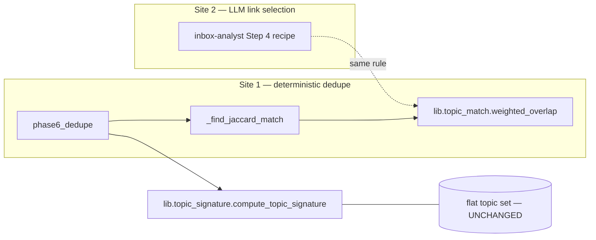
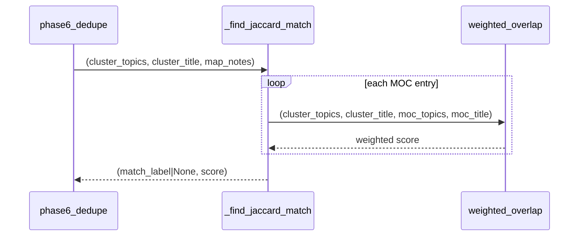

# Solution Design Document

> Spec 029 · Issue #124 · Epic #17 · Track MVP-Polish
> PRD: `requirements.md` · Source design: `docs/XDD/ideas/2026-07-03-f05-topic-weighting-moc-matching.md`
> Scope: a precision refinement to existing topic-set matching. No new services, schemas, or
> user surfaces. All ADRs below were decided during the brainstorm with the owner.

## Validation Checklist

### CRITICAL GATES (Must Pass)

- [x] All required sections are complete
- [x] No [NEEDS CLARIFICATION] markers remain
- [x] Architecture pattern is clearly stated with rationale
- [x] All architecture decisions confirmed by user (during brainstorm; re-listed for veto at the review gate)
- [x] Every interface has specification

### QUALITY CHECKS (Should Pass)

- [x] All context sources listed with relevance ratings
- [x] Project commands discovered from actual project files
- [x] Constraints → Strategy → Design → Implementation path is logical
- [x] Every component has a directory mapping
- [x] Error handling covers all error types
- [x] Quality requirements are specific and measurable
- [x] Component names consistent across sections
- [x] A developer could implement from this design
- [x] Implementation examples use actual function/field names, verified against source
- [x] Complex logic includes a traced walkthrough with example data

---

## Constraints

- **CON-1** — Python 3, stdlib only for the new scorer (matches `lib/topic_signature.py`); no new
  dependencies (Constitution L1 Dependencies).
- **CON-2** — No discovery-cache rebuild, no cache schema change, no schema-version bump, and no
  change to squelch-key computation (PRD Feature 3). The `topic_signature` algorithm is frozen.
- **CON-3** — Additive / near-MVP: existing dedupe and link-selection behavior must not regress
  when no title-derived topics are present (PRD Feature 1, AC "identical to flat").
- **CON-4** — Constitution L1 Testing: every changed placement path covers a happy AND a
  rejection case. Constitution L2 Code Quality: keep files small; the scorer lives in its own
  module, not bolted onto `moc-discovery.py`.
- **CON-5** — Runtime files under `tomo/` are LLM-loaded line-by-line; the `inbox-analyst.md`
  edit carries imperatives only, with rationale persisted to `docs/tomo/`.

## Implementation Context

**IMPORTANT**: Read all listed sources before implementing.

### Required Context Sources

#### Documentation Context
```yaml
- doc: docs/XDD/ideas/2026-07-03-f05-topic-weighting-moc-matching.md
  relevance: CRITICAL
  why: "Full validated design — formula, edge cases, decisions log, parking lot"
- doc: docs/XDD/specs/029-topic-weighting-moc-matching/requirements.md
  relevance: CRITICAL
  why: "Behavioral acceptance criteria this design must satisfy"
- doc: docs/XDD/specs/022-moc-insertion-point-intelligence/requirements.md
  relevance: MEDIUM
  why: "022 fenced F-05 out; confirms F-05 = MOC selection (WHICH), 022 = insertion-point (WHERE)"
```

#### Code Context
```yaml
- file: tomo/scripts/moc-discovery.py
  relevance: CRITICAL
  why: "Site 1. _find_jaccard_match (~1174), _moc_topic_set (~1118), _cluster_topic_set (~1109), call site in phase6_dedupe (~1264-1290), _compute_topic_signature (def ~1139, call ~1293), JACCARD_DUP_THRESHOLD (~1094)"
- file: tomo/scripts/lib/topic_signature.py
  relevance: CRITICAL
  why: "cluster_topic_set + compute_topic_signature; MUST stay flat (squelch key). New scorer is a SIBLING module, not an edit here."
- file: tomo/dot_claude/agents/inbox-analyst.md
  relevance: CRITICAL
  why: "Site 2. Step 4 'Match MOCs' recipe (lines ~114-120); shared_ctx.mocs[] carries .title and .topics"
- file: scripts/analyze-placement-confidence.py
  relevance: MEDIUM
  why: "Distribution-analysis PATTERN reference for PRD Feature 4. NOTE: it measures spec-023 tier-1 heading fit_confidence, NOT dedupe-Jaccard separation — the dedupe threshold must be measured on real dedupe-candidate pairs (see PLAN T3.1)."
- file: tomo/scripts/topic-extract.py
  relevance: MEDIUM
  why: "Confirms provenance: title/H1 + wikilinks + tags are deterministic topics; H2 dropped; content topics are agent-side"
```

### Implementation Boundaries

- **Must Preserve**:
  - `compute_topic_signature` output (byte-identical squelch keys) — operates on the flat topic
    set only.
  - `JACCARD_DUP_THRESHOLD = 0.80` value (validated, not changed, this phase).
  - The exact-title match short-circuit (`_find_exact_title_match`) that runs before Jaccard.
  - The analyst's `≥ 0.15` keep-gate, `top 3` cap, and `+0.1` non-classification depth bonus.
- **Can Modify**:
  - `_find_jaccard_match` signature (add `cluster_title`) and body (delegate scoring to the new
    lib).
  - The `phase6_dedupe` call site (pass `cluster.get("title") or ""`).
  - The `inbox-analyst.md` Step 4 recipe wording (via `tcs-helper:agent-author`).
- **Must Not Touch**:
  - `lib/topic_signature.py` behavior (the scorer is a new sibling module `lib/topic_match.py`).
  - The discovery cache shape / builder.

### External Interfaces

Not applicable — F-05 adds no network surface, port, or external integration. All work is
in-process Python plus one agent-prompt edit. (Constitution: no new network surface.)

### Project Commands

```bash
# Discovered from repo (venv-based per project memory)
Test:  ./venv/bin/python -m pytest tests/ -q
Lint:  ./venv/bin/ruff check tomo/scripts scripts
# Threshold validation (PRD Feature 4) — measure dedupe-candidate pair scores directly;
# analyze-placement-confidence.py is a PATTERN reference only (it measures tier-1 heading fit,
# not dedupe-Jaccard separation). See PLAN T3.1.
Validate: ./venv/bin/python scripts/analyze-placement-confidence.py   # pattern ref, not the dedupe measure
# Deploy to running instance (managed-file sync; bump `# version` first)
Sync:  scripts/update-tomo.sh
```

## Solution Strategy

- **Architecture Pattern**: Shared pure-function library + two thin call sites. One weighting
  rule, implemented once for the deterministic path and mirrored as a prompt recipe for the LLM
  path.
- **Integration Approach**: Introduce `tomo/scripts/lib/topic_match.py` exposing a
  `weighted_overlap(...)` pure function. `moc-discovery.py._find_jaccard_match` delegates to it;
  `inbox-analyst.md` Step 4 expresses the same rule in prose.
- **Justification**: Approach B (title-token weight at match time) keeps the cache and squelch
  signature untouched (CON-2), reuses titles already present in the cache, and is additive
  (CON-3). Alternatives A (typed topics) and C (config weights) rejected/deferred — see ADRs.
- **Key Decisions**: See Architecture Decisions (ADR-1…7).

## Building Block View

### Components



`lib.topic_match` (NEW) and `lib.topic_signature` (UNCHANGED) are siblings. The dashed edge from
Site 2 denotes conceptual rule-sharing, not a code call (the analyst executes the rule in-prompt).

### Directory Map

**Component**: tomo (pipeline scripts)
```
tomo/
├── scripts/
│   ├── lib/
│   │   ├── topic_match.py          # NEW: weighted_overlap(), title_tokens(), _weight()
│   │   └── topic_signature.py      # UNCHANGED (frozen squelch algorithm)
│   ├── moc-discovery.py            # MODIFY: _find_jaccard_match(+cluster_title); call site
│   └── topic-extract.py            # READ ONLY (provenance reference)
├── dot_claude/agents/
│   └── inbox-analyst.md            # MODIFY (via agent-author): Step 4 recipe; bump `# version`
└── ...
docs/tomo/dot_claude/agents/
└── inbox-analyst.md                # NEW/MODIFY: WHY-doc for the recipe change (rationale layer)
tests/
└── test_topic_match.py             # NEW: scorer + call-site + squelch-invariance tests
scripts/
└── analyze-placement-confidence.py # READ ONLY (threshold validation)
```

### Interface Specifications

#### Data Storage Changes

None. No cache, schema, or persisted-format change (CON-2). This is the load-bearing invariant
of Approach B.

#### Internal API Changes (module interfaces)

```yaml
# NEW module: tomo/scripts/lib/topic_match.py  (stdlib only)
Function: weighted_overlap
  Signature: weighted_overlap(topics_a: Iterable[str], title_a: str,
                              topics_b: Iterable[str], title_b: str) -> float
  Returns: Ruzicka weighted-overlap score in [0.0, 1.0]
  Notes: pure; empty topics on either side → 0.0

Function: title_tokens
  Signature: title_tokens(title: str) -> str        # returns normalized title string
  Notes: normalize() == .strip().lower() + whitespace-collapse, matching topic normalization

Function: _weight (internal)
  Signature: _weight(topic: str, normalized_title: str) -> int
  Rule: W_TITLE (2) if normalize(topic) is a SUBSTRING of normalized_title else W_BASE (1)

Constants: W_TITLE = 2, W_BASE = 1   # named; approach C (issue #126) later sources from config

# MODIFIED: tomo/scripts/moc-discovery.py
Function: _find_jaccard_match
  Old: _find_jaccard_match(cluster_topics: set[str], map_notes: list[dict]) -> tuple[str|None, float]
  New: _find_jaccard_match(cluster_topics: set[str], cluster_title: str,
                           map_notes: list[dict]) -> tuple[str|None, float]
  Body: for each map_notes entry, score = weighted_overlap(cluster_topics, cluster_title,
        _moc_topic_set(entry), entry.get("title") or "")
        return first entry with score >= JACCARD_DUP_THRESHOLD (unchanged early-return semantics)
  Call site (phase6_dedupe ~1279):
        _find_jaccard_match(cluster_topics, cluster.get("title") or "", map_notes)
```

#### Application Data Models

No stored model changes. The only "model" is the transient per-comparison weight assignment,
computed inside `weighted_overlap` and never persisted.

#### Integration Points

```yaml
# Inter-component (conceptual rule-sharing, not a code call)
- from: inbox-analyst.md Step 4 recipe (LLM)
  to:   lib.topic_match rule (Python)
  protocol: shared specification (same W_TITLE/W_BASE + same title-derived rule)
  data_flow: "Both weight title-derived topics x2; decision direction must agree (ADR-4)"
External_Service_Name: none
```

### Implementation Examples

#### Example: `weighted_overlap` (the core algorithm)

**Why this example**: it is the one piece of non-obvious math; the reduction-to-flat property and
the missing-side convention must be implemented exactly.

```python
# tomo/scripts/lib/topic_match.py  (illustrative, not prescriptive)
import re

W_TITLE = 2
W_BASE = 1

def _normalize(text: str) -> str:
    return re.sub(r"\s+", " ", (text or "").strip().lower())

def title_tokens(title: str) -> str:
    return _normalize(title)

def _weight(topic: str, norm_title: str) -> int:
    t = _normalize(topic)
    return W_TITLE if t and norm_title and t in norm_title else W_BASE

def weighted_overlap(topics_a, title_a, topics_b, title_b) -> float:
    a = {_normalize(t) for t in topics_a if _normalize(t)}
    b = {_normalize(t) for t in topics_b if _normalize(t)}
    if not a or not b:
        return 0.0
    nt_a, nt_b = title_tokens(title_a), title_tokens(title_b)
    wa = {t: _weight(t, nt_a) for t in a}   # weight ON side A
    wb = {t: _weight(t, nt_b) for t in b}   # weight ON side B
    inter = a & b
    union = a | b
    # missing side = weight 0
    numer = sum(min(wa.get(t, 0), wb.get(t, 0)) for t in inter)
    denom = sum(max(wa.get(t, 0), wb.get(t, 0)) for t in union)
    return (numer / denom) if denom else 0.0
```

**Traced walkthrough** (the misfire discrimination):
`A = {x, y}`, title_a themes → `x`; `B = {x, z}`, title_b themes → `z`; shared `{x}`.

| topic | in | wa | wb | numerator min | denominator max |
|-------|----|----|----|---------------|------------------|
| x | A∩B | 2 | 1 | min(2,1)=1 | max(2,1)=2 |
| y | A only | 1 | 0 | — | max(1,0)=1 |
| z | B only | 0 | 2 | — | max(0,2)=2 |

`score = 1 / (2+1+2) = 1/5 = 0.20` vs flat Jaccard `1/3 ≈ 0.33`. This shows the **discrimination
mechanism** (weighted < flat when title themes disagree) — it drives Site-2 re-ranking. Note it is
NOT itself a threshold crossing: flat 0.33 was already below 0.80, so this pair was never a false
dedupe dup. For the *primary* Site-1 misfire (a false dup being fixed) see the next example.

**Traced walkthrough 2 — a true Site-1 dedupe misfire being fixed** (flat ≥ 0.80 → weighted < 0.80):
`A = {c1..c8, ta}`, title_a themes → `ta`; `B = {c1..c8, tb}`, title_b themes → `tb`. The eight
`c*` are shared content topics (title-derived on neither side); `ta`/`tb` are each side's distinct
title theme.

- Shared `= {c1..c8}` (8); union `= {c1..c8, ta, tb}` (10).
- **Flat Jaccard = 8/10 = 0.80** → triggers a duplicate under the current code (false positive,
  since the titles disagree thematically).
- Weighted: numerator `= Σ min(1,1)` over the 8 content topics `= 8`; denominator `= 8·max(1,1) +
  max(2,0)[ta] + max(0,2)[tb] = 8 + 2 + 2 = 12`.
- **Weighted = 8/12 ≈ 0.667 < 0.80** → NOT flagged as a duplicate. The misfire is fixed.

This is the case the flagship test must assert (flat ≥ 0.80 AND weighted < 0.80) so a no-op flat
implementation cannot pass.

**Edge cases mapped to code**:
- Empty `topics_a` or `topics_b` → early `return 0.0` (no match; unchanged behavior).
- Empty/missing title → `title_tokens("") == ""` → every `_weight` returns `W_BASE` → that side
  contributes flat weights (graceful degradation, PRD Feature 1 AC).
- No title-derived topic anywhere → all weights `W_BASE` → `min/max` collapse to
  `|A∩B| / |A∪B|` == flat Jaccard exactly (the ONLY exact-reduction case; ADR-3).
- Long title (many title-derived topics on one side) → bounded: per-topic weight never exceeds
  `W_TITLE` regardless of title length (a topic is title-derived or not — it cannot accrue extra
  weight from a longer title), so score cannot be distorted beyond the `W_TITLE:W_BASE` ratio.

#### Test Examples as Interface Documentation

```python
# tests/test_topic_match.py (contract sketch)
# NB: at least one assertion MUST falsify a flat no-op implementation (see
# test_dedupe_misfire_crosses_threshold + test_weighting_strictly_below_flat).

def test_reduces_to_flat_when_no_title_topic():
    # neither title shares a topic → exact flat Jaccard
    assert weighted_overlap({"a","b"}, "zz", {"b","c"}, "zz") == 1/3

def test_dedupe_misfire_crosses_threshold():
    # THE discriminating test: flat ≥ 0.80 (a false dup today) but weighted < 0.80.
    # A flat no-op implementation FAILS this. Uses the Traced-walkthrough-2 construction.
    content = {f"c{i}" for i in range(8)}
    a, b = content | {"ta"}, content | {"tb"}
    assert flat_jaccard(a, b) >= 0.80                          # 8/10 = 0.80
    assert weighted_overlap(a, "ta note", b, "tb note") < 0.80  # 8/12 ≈ 0.667

def test_weighting_strictly_below_flat_on_title_disagreement():
    # shared topic title-derived on NEITHER side, distinct title themes differ
    s = weighted_overlap({"x","y"}, "y note", {"x","z"}, "z note")  # x shared, content-only
    assert s < flat_jaccard({"x","y"}, {"x","z"})

def test_true_dup_title_agreement_survives():
    s = weighted_overlap({"x","y"}, "x y", {"x","y"}, "x y")
    assert s >= 0.80

def test_empty_or_missing_title_uses_base_weights():
    # missing title → base weights → equals flat (no crash)
    assert weighted_overlap({"a","b"}, "", {"b","c"}, "") == 1/3

def test_empty_topic_set_returns_zero():
    assert weighted_overlap(set(), "t", {"a"}, "t") == 0.0

def test_squelch_signature_unchanged():
    # GOLDEN_HASH captured from compute_topic_signature on pre-F-05 main — proves
    # byte-identity to prior behavior, not mere self-consistency.
    assert compute_topic_signature(CLUSTER) == GOLDEN_HASH
```

`flat_jaccard(a, b) = |a∩b| / |a∪b|` — a test helper (or the pre-F-05 reference) used only to
prove the weighted scorer diverges from flat where it must.

## Runtime View

### Primary Flow

#### Flow A — Duplicate detection (Site 1, deterministic)
1. `phase6_dedupe` iterates clusters.
2. Exact-title match check (unchanged) — short-circuits if hit.
3. `cluster_topics = _cluster_topic_set(cluster)`; call `_find_jaccard_match(cluster_topics,
   cluster.get("title") or "", map_notes)`.
4. For each MOC entry, `weighted_overlap(...)` scores using both titles; first entry ≥ 0.80 wins.
5. On hit → cluster skipped as duplicate (log now reflects the weighted score). Else → squelch
   check (unchanged, flat signature) → kept.



#### Flow B — MOC link selection (Site 2, LLM recipe)
1. inbox-analyst Step 4 iterates `shared_ctx.mocs`.
2. Computes `overlap_ratio` with title-derived topics weighted ×2 (Option A: either side).
3. `Score = overlap_ratio + depth_bonus`; keep `top 3` with `score ≥ 0.15` (gate/cap/bonus
   preserved).

### Error Handling

- Missing/empty title → treated as no title-derived topics (not an error). Graceful.
- Empty topic set → `0.0` / no match (unchanged).
- Malformed `map_notes` entry (non-dict / no title) → title falls back to `""` (same tolerance as
  `_find_exact_title_match`'s path-stem fallback); scoring proceeds on base weights.
- The scorer is pure and total (no exceptions on valid inputs); no network, no I/O.

### Complex Logic

```
ALGORITHM: weighted_overlap(topics_a, title_a, topics_b, title_b)
1. normalize + dedupe both topic sets; if either empty → return 0.0
2. normalize both titles
3. weight each topic per side: 2 if normalize(topic) substring-of normalize(title_side) else 1
4. numerator = Σ over (A∩B) of min(weight_a, weight_b)      # missing side = 0
5. denominator = Σ over (A∪B) of max(weight_a, weight_b)    # missing side = 0
6. return numerator/denominator (or 0.0 if denominator == 0)
```

## Deployment View

No change to deployment topology. F-05 ships as edited managed files synced into the running
Tomo instance via `update-tomo.sh` (version-gated — bump `# version` in `inbox-analyst.md`).
`lib/topic_match.py` is a new script file picked up by the same sync. No container, port, or
config change.

## Cross-Cutting Concepts

### Pattern Documentation
```yaml
- pattern: "Shared pure-function lib colocated with its caller (local import)"
  relevance: HIGH
  why: "Mirrors lib/topic_signature.py factoring (T5.2); keeps moc-discovery.py small (Constitution L2)"
- pattern: "One rule, two substrates (deterministic + LLM recipe)"
  relevance: HIGH
  why: "Site 1 exact, Site 2 simplified but decision-equivalent (ADR-4)"
```

### System-Wide Patterns
- **Security/Privacy**: no new data exposure; scorer operates on already-in-memory topics/titles.
  No content leaves the process. (Constitution L1 Privacy — unaffected.)
- **Error Handling**: total pure function; graceful degradation on empty/missing title.
- **Performance**: O(|A|+|B|) per comparison, same order as flat Jaccard; substring test on a
  short normalized title string. Negligible added cost on the /inbox hot path (Constitution L1
  Performance — no main-thread concern; this is batch pipeline code).
- **Logging**: existing `phase6` log line now prints the weighted score; no new logging. Squelch
  logging unchanged (flat signature).

### Squelch-Signature Invariance (load-bearing)
`_compute_topic_signature` → `lib.topic_signature.compute_topic_signature` reads the FLAT topic
set and is not touched by F-05. A golden-hash test locks byte-identical output (PRD Feature 3).
This is why Approach B, not A: A would change topic representation and risk churning every
squelch key.

## Architecture Decisions

> All decided with the owner during the 2026-07-03 brainstorm (see ideas doc Decisions Log).
> Re-listed here for veto at the SDD review gate.

- [x] **ADR-1 Approach B (title-token weight at match time)**: weight topics whose normalized form
  is a substring of the note's normalized title.
  - Rationale: no cache/schema/signature change; titles already cached; smallest blast radius.
  - Trade-offs: "title-derived" is a substring proxy, not the extractor's exact method attribution.
  - User confirmed: _Yes (brainstorm)_
- [x] **ADR-2 New module `lib/topic_match.py`** (not an edit to `topic_signature.py`).
  - Rationale: separation of concerns (matching vs hashing); keeps files small (Constitution L2).
  - Trade-offs: one more small module.
  - User confirmed: _Yes (brainstorm)_
- [x] **ADR-3 Ruzicka weighted overlap `Σmin/Σmax`, missing side = 0**; exact reduction to flat
  Jaccard only when no topic is title-derived on either side.
  - Rationale: backward-compatible in the degenerate case; discriminates title disagreement.
  - Trade-offs: general case actively re-scores (this is the intended fix, not a regression).
  - User confirmed: _Yes (brainstorm; corrected after gap review)_
- [x] **ADR-4 Two substrates, decision-equivalent not numerically identical**: Site 1 exact
  min/max; Site 2 simplified "count double if title-derived on either side" (Option A).
  - Rationale: LLMs execute a simple ratio more reliably than min/max bookkeeping.
  - Trade-offs: on partial-title-agreement the two sites can differ numerically near thresholds.
  - User confirmed: _Yes (brainstorm)_
- [x] **ADR-5 Keep `JACCARD_DUP_THRESHOLD = 0.80`; validate in-scope** via
  `analyze-placement-confidence.py`; re-tune only if data shows misseparation.
  - Rationale: weighting re-scores; confirm separation before deferring.
  - Trade-offs: adds a validation step to done-criteria.
  - User confirmed: _Yes (SDD gate 2026-07-03)_
- [x] **ADR-6 `W_TITLE=2` / `W_BASE=1` as named constants** (config-driven deferred to #126).
  - Rationale: YAGNI now; constants make approach C a value swap.
  - User confirmed: _Yes (brainstorm)_
- [x] **ADR-7 Agent edit via `tcs-helper:agent-author`**, with rationale persisted to
  `docs/tomo/dot_claude/agents/inbox-analyst.md`.
  - Rationale: authoring-rule compliance; runtime file stays imperative-only.
  - User confirmed: _Yes (authoring rule)_

## Quality Requirements

- **Performance**: added per-comparison cost is O(|topics|) with a short-string substring test;
  no measurable /inbox latency change.
- **Correctness**: zero known incidental-overlap misfires in a live /inbox run; no regression on
  true dups; squelch keys byte-identical.
- **Reliability**: scorer is pure and total; deterministic given inputs.
- **Testability**: Constitution L1 — happy + rejection paths covered; squelch-invariance locked.

## Acceptance Criteria (EARS)

**Dedupe weighting (PRD Feature 1):**
- [ ] IF a proposed cluster and an existing MOC overlap only on non-title-derived topics while
  their titles disagree thematically, THEN THE SYSTEM SHALL score them below
  `JACCARD_DUP_THRESHOLD` (not a duplicate).
- [ ] IF a proposed cluster and an existing MOC share title-derived topics, THEN THE SYSTEM SHALL
  still flag them as duplicates at ≥ 0.80.
- [ ] WHERE no topic is title-derived on either side, THE SYSTEM SHALL produce a score equal to
  the pre-F-05 flat Jaccard.

**Link selection weighting (PRD Feature 2):**
- [ ] WHEN the analyst ranks candidate MOCs, THE SYSTEM SHALL rank a title-theme match above an
  incidental content-keyword match.
- [ ] THE SYSTEM SHALL preserve the `≥ 0.15` keep-gate, `top 3` cap, and `+0.1` depth bonus.

**Zero-disturbance (PRD Feature 3):**
- [ ] THE SYSTEM SHALL compute squelch keys byte-identically to the pre-F-05 behavior.
- [ ] THE SYSTEM SHALL require no cache rebuild, schema change, or version bump.

**Threshold validation (PRD Feature 4):**
- [ ] WHEN placement-confidence analysis is run on the personal vault, THE SYSTEM SHALL confirm
  0.80 separates true dups from incidental overlap; IF it does not, THEN the threshold SHALL be
  re-tuned before finalizing.

**Edge cases:**
- [ ] IF a note has an empty/missing title, THEN THE SYSTEM SHALL score it on base weights without
  error.
- [ ] IF either topic set is empty, THEN THE SYSTEM SHALL return no match (score 0.0).

## Risks and Technical Debt

### Known Technical Issues
- The `score` printed at `moc-discovery.py:1288` will change scale (weighted, not flat). It is
  log-only — verified not persisted/compared. Update the log wording if "jaccard" becomes
  misleading (minor).

### Technical Debt
- Two definitions of "title-derived" now exist: the Python substring test and the analyst's prose
  recipe. ADR-4 accepts this; issue #126 (config weights) is the natural point to converge them.

### Implementation Gotchas
- `_find_jaccard_match` has one other consideration: it early-returns on the FIRST entry ≥
  threshold (see Interface Specifications — `_find_jaccard_match` Body) — preserve that; do not
  switch to argmax.
- zsh `!` history-expansion trap when writing inline test snippets with `!=`/`!r` — write test
  files with the editor, not inline `python3 -c` (project memory).
- `inbox-analyst.md` edit MUST bump `# version` or `update-tomo.sh` ships nothing (version-gated,
  project memory).

## Glossary

### Domain Terms
| Term | Definition | Context |
|------|------------|---------|
| MOC | Map of Content — an index note grouping related notes | The thing items are matched to |
| Title-derived topic | A topic whose normalized form is a substring of the note's normalized title | The weighting signal |
| Content keyword | A topic not derived from the title (body/LLM-extracted) | Weighted lower |
| Squelch | Suppression registry that hides re-proposed items for N runs | Must not churn (Feature 3) |

### Technical Terms
| Term | Definition | Context |
|------|------------|---------|
| Ruzicka overlap | Weighted Jaccard: Σmin(weights)/Σmax(weights) over ∩/∪ | The Site-1 scorer |
| `JACCARD_DUP_THRESHOLD` | 0.80 dedupe cutoff | Kept; validated (ADR-5) |
| Approach B | Title-token weight at match time (vs A typed-topics, C config) | Chosen (ADR-1) |

### API/Interface Terms
| Term | Definition | Context |
|------|------------|---------|
| `weighted_overlap()` | New pure scorer in `lib/topic_match.py` | Site 1 core |
| `shared_ctx.mocs[]` | Analyst input carrying per-MOC `.title` + `.topics` | Site 2 input |
