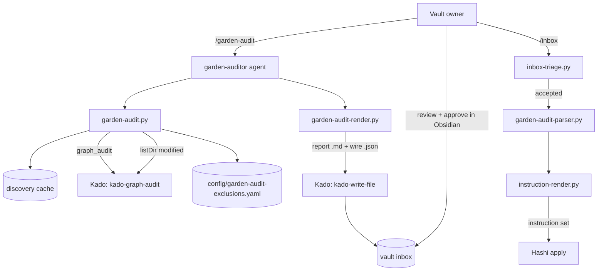
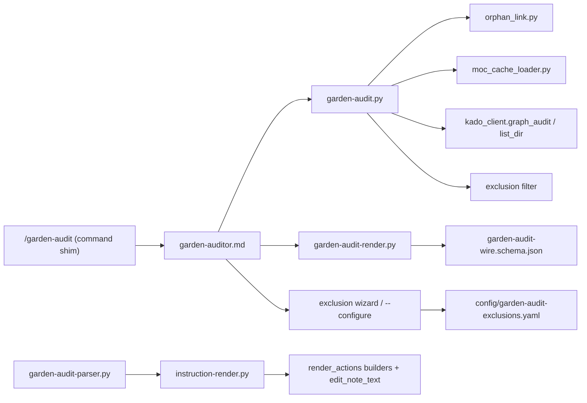
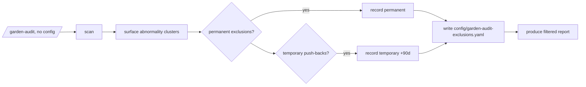

# Solution Design Document

## Validation Checklist

### CRITICAL GATES (Must Pass)

- [x] All required sections are complete
- [x] No [NEEDS CLARIFICATION] markers remain
- [x] Architecture pattern is clearly stated with rationale
- [x] **All architecture decisions confirmed by user** (ADR-1..6, 2026-07-19)
- [x] Every interface has specification

### QUALITY CHECKS (Should Pass)

- [x] All context sources are listed with relevance ratings
- [x] Project commands are discovered from actual project files
- [x] Constraints → Strategy → Design → Implementation path is logical
- [x] Every component in diagram has directory mapping
- [x] Error handling covers all error types
- [x] Quality requirements are specific and measurable
- [x] Component names consistent across diagrams
- [x] A developer could implement from this design

---

## Constraints

- **CON-1 — Reuse over rebuild.** The design MUST reuse the shipped 2-pass pipeline (discovery
  cache, `orphan_link.py`, `instruction-render`, the ADR-026 wire, `kado-graph-audit`) and add no
  new apply path for checks that map to shipped Hashi actions. Mirror the `/moc-propose` track.
- **CON-2 — Runtime files are LLM-loaded.** Agent/command/skill files under `tomo/dot_claude/`
  carry only imperatives + tool invocations; all rationale lives in `docs/tomo/<mirror>.md`. Python
  in `tomo/scripts/` is normal code (docstrings allowed). bash 3.2 for any shell.
- **CON-3 — Privacy (Constitution L1/L2).** All vault access via Kado; audit reports only what the
  key's ACL permits. Telemetry + wire are metadata-only (paths, counts, unresolved-target text,
  heading names) — never note bodies.
- **CON-4 — Instance-local, durable config.** The exclusion config lives in the instance
  (`config/`) and MUST survive `update-tomo` (seed pattern, create-only) and ride `backup-tomo.sh`.
- **CON-5 — Additive on hot paths.** Adding garden-audit as a 4th `/inbox` upstream type must be
  byte-neutral to a no-garden-audit `/inbox` run (a run with no audit doc behaves exactly as today).

## Implementation Context

**IMPORTANT**: Read ALL listed sources before implementing.

### Required Context Sources

#### Documentation Context
```yaml
- doc: docs/XDD/specs/030-garden-audit/requirements.md
  relevance: CRITICAL
  why: "The PRD this design implements — 5 Must features, 18 Gherkin ACs."
- doc: docs/XDD/ideas/2026-07-18-garden-audit-skill.md
  relevance: HIGH
  why: "Brainstorm design + parking lot + approaches considered."
- doc: docs/tomo/scripts/suggestions-reducer.md
  relevance: HIGH
  why: "WHY-notes for the moc-proposal render path this mirrors."
- doc: _inbox/from-kado/2026-07-18_kado-to-tomo_graph-audit-contract.md
  relevance: HIGH
  why: "Final kado-graph-audit response contract (orphans/deadLinks/total/cursor)."
```

#### Code Context
```yaml
- file: tomo/dot_claude/commands/moc-propose.md
  relevance: HIGH
  why: "Command-shim + impersonation pattern to mirror for /garden-audit."
- file: tomo/dot_claude/agents/moc-architect.md
  relevance: HIGH
  why: "Orchestration-agent pattern (scripts do the work; agent never analyses)."
- file: tomo/scripts/lib/orphan_link.py
  relevance: CRITICAL
  why: "Reused verbatim for unparented (check 1) + orphan-candidate scoring."
- file: tomo/scripts/lib/moc_cache_loader.py
  relevance: CRITICAL
  why: "cache.entries provides stem/path/kind/up_state/up_target/topics/tags — checks 1,3,5."
- file: tomo/scripts/moc-tree-builder.py
  relevance: HIGH
  why: "Where up_state (incl. 'broken') + up_target are computed (lines 280-289,414-425)."
- file: tomo/scripts/suggestions-render.py
  relevance: CRITICAL
  why: "ADR-026 two-artifact producer: build_wire_payload + emit_digest to mirror."
- file: tomo/scripts/suggestion-parser.py
  relevance: HIGH
  why: "load_changed_wire / build_from_wire (Pass-2 rebuild-from-wire) to mirror."
- file: tomo/scripts/lib/render_actions.py
  relevance: CRITICAL
  why: "_build_link_to_moc_actions + emit_up_preservation_actions (the fix builders)."
- file: tomo/scripts/lib/render_md.py
  relevance: HIGH
  why: "_UPSTREAM_TYPES (line 203) — add 'garden-audit' as the 4th peer."
- file: tomo/scripts/inbox-triage.py
  relevance: CRITICAL
  why: "query_frontmatter buckets, compute_new_sources exclusion, _get_doc_type routing."
- file: tomo/dot_claude/agents/synthesis-conductor.md
  relevance: HIGH
  why: "Pass-2 doc-type → parser routing table to extend."
- file: tomo/scripts/lib/kado_client.py
  relevance: CRITICAL
  why: "_call_tool retry/backoff; add graph_audit() + list_dir modified-time reads."
- file: tomo/schemas/hashi-instructions.schema.json
  relevance: CRITICAL
  why: "The Hashi action set; add the new edit_note_text action (ADR-3)."
- file: scripts/update-tomo.sh
  relevance: HIGH
  why: "add_seed pattern — must register config/garden-audit-exclusions.yaml (CON-4)."
```

#### External Interfaces (Kado MCP tools)
```yaml
- service: kado-graph-audit (Kado v1.2.0)
  doc: _inbox/from-kado/2026-07-18_kado-to-tomo_graph-audit-contract.md
  relevance: HIGH
  why: "Vault-wide orphans + deadLinks in O(1) calls (checks 2,4)."
- service: kado-search listDir
  relevance: MEDIUM
  why: "modified timestamps for stale-MOC (check 6)."
- service: kado-write-file
  relevance: MEDIUM
  why: "Transport the (potentially large) report + wire into the vault inbox."
```

### Implementation Boundaries

- **Must Preserve:** the shipped `/inbox` Pass-1 cost profile (CON-5); `orphan_link.py`,
  `instruction-render`, and the ADR-026 wire contract (garden-audit is a NEW consumer, not a change
  to these); the `/moc-propose` behaviour.
- **Can Modify:** `render_md._UPSTREAM_TYPES` (append), `inbox-triage.py` (one new bucket + one
  `_get_doc_type` branch), `synthesis-conductor.md` (one parser row), `kado_client.py` (new method),
  `hashi-instructions.schema.json` (new action), `install-tomo.sh` + `update-tomo.sh` (register the
  seed config).
- **Must Not Touch:** the inbox-analyst Pass-1 analysis path; existing Hashi actions' contracts;
  `kado-graph` (the per-note tool stays unchanged — the bulk tool is separate).

### External Interfaces — System Context



### Project Commands
```bash
Test:  ./venv/bin/python -m pytest tests/
Lint:  ./venv/bin/ruff check <paths>
Run:   /garden-audit  (container skill; not a host CLI)
Sync:  scripts/update-tomo.sh   (delivers runtime + seed config into the instance)
```

## Solution Strategy

- **Architecture Pattern:** *New upstream source feeding the shipped 2-pass pipeline.* Garden-audit
  is a fourth peer of the existing upstream doc-types (`suggestions`, `moc-proposal`,
  `suggestions-fan`). It mirrors the `/moc-propose` track structurally: command shim → impersonated
  orchestration agent → deterministic scan script → deterministic render (markdown + ADR-026 wire)
  → transported to inbox → picked up by `/inbox` in its accepted state → parser → `instruction-render`
  → Hashi.
- **Integration Approach:** additive. One new frontmatter bucket + one `_get_doc_type` branch + one
  parser + one `_UPSTREAM_TYPES` entry (ADR-1). No change to the Pass-1 analysis path (CON-5).
- **Justification:** the pattern is proven three times over and the burden analysis confirmed a
  skip-flagged upstream doc adds zero Pass-1 LLM cost. Maximal reuse, minimal new surface.
- **Key Decisions:** ADR-1..6 below.

## Building Block View

### Components



### Directory Map

```
tomo/
├── dot_claude/
│   ├── commands/garden-audit.md          # NEW: command shim (impersonate garden-auditor)
│   └── agents/garden-auditor.md          # NEW: orchestration agent (scans, never analyses)
├── scripts/
│   ├── garden-audit.py                   # NEW: scan orchestrator (cache + graph_audit + listDir + exclusions)
│   ├── garden-audit-render.py            # NEW: emits report .md + garden-audit-wire.json (mirrors suggestions-render.py)
│   ├── garden-audit-parser.py            # NEW: Pass-2 rebuild-from-wire → confirmed fixes (mirrors suggestion-parser.py)
│   └── lib/
│       ├── garden_exclusions.py          # NEW: load/filter/expire the exclusion config
│       ├── kado_client.py                # MODIFY: + graph_audit(); list_dir already returns modified
│       ├── orphan_link.py                # REUSE (unparented + orphan-candidate scoring)
│       ├── render_actions.py             # MODIFY: + _build_edit_note_text_actions (ADR-3)
│       └── render_md.py                  # MODIFY: _UPSTREAM_TYPES += "garden-audit"
│   └── inbox-triage.py                   # MODIFY: + pending-accept-garden bucket + _get_doc_type branch
├── schemas/
│   ├── garden-audit-wire.schema.json     # NEW: wire contract (mirrors suggestions-wire.schema.json)
│   ├── garden-audit-doc.schema.json      # NEW: intermediate doc contract
│   └── hashi-instructions.schema.json    # MODIFY: + edit_note_text action (ADR-3)
├── config/
│   └── garden-audit-exclusions.yaml      # NEW (seed, create-only): the skill-owned exclusion config
scripts/
├── install-tomo.sh                        # MODIFY: seed config/garden-audit-exclusions.yaml
└── update-tomo.sh                         # MODIFY: add_seed the config (CON-4 — must not delete it)
docs/tomo/scripts/garden-audit*.md         # NEW: WHY-persistence per runtime file
```

### Interface Specifications

#### New Hashi action — `edit_note_text` (ADR-3)

```yaml
# Added to hashi-instructions.schema.json action oneOf.
edit_note_text:
  path: string          # note to edit (.md)
  match: string         # exact literal text to locate (e.g. "[[Missing Note]]" or "up:: [[Old MOC]]")
  replace: string       # replacement text; "" (empty) = remove the matched text
  occurrence: enum      # "first" (default) | "all"
# Semantics: Hashi finds `match` in the note body verbatim; replaces `occurrence`
# instance(s) with `replace`. Empty `replace` removes the text (and, when the match
# is a whole line such as an `up::` line, Hashi removes the now-empty line).
# If `match` is not found, Hashi skips the action and reports it (no error, no partial write).
```

Covers all three body-edit fixes with one primitive:
- dead wikilink fix: `match="[[Old]]"`, `replace="[[New]]"`
- dead wikilink remove: `match="[[Old]]"`, `replace=""`
- broken `up::` remove: `match="up:: [[Deleted MOC]]"`, `replace=""` (whole-line removal)

Broken `up::` **repoint** stays on the shipped `add_relationship` (marker-located line replace) —
`edit_note_text` is only for removal + free-text wikilinks (ADR-5, Rule 7). Tomo emits `edit_note_text`
in the wire now; Hashi implements it against Tomo's real example JSON (example-driven, ADR-3).

#### Exclusion config — `config/garden-audit-exclusions.yaml`

```yaml
version: 1
exclusions:
  - target: { type: path, value: "Calendar/" }   # type: path | note | tag
    checks: [unparented, orphan, broken_up]        # subset, OR: all
    mode: permanent                                # permanent | temporary
    reason: "daily notes never get up::"
    created: 2026-07-19
  - target: { type: note, value: "Projects/Big Refactor.md" }
    checks: all
    mode: temporary
    until: 2026-10-17                              # ISO date; auto-expires (default created + ~90d)
    reason: "actively fixing"
    created: 2026-07-19
```
`garden_exclusions.py` loads this, drops expired temporaries (reporting which reappeared), and
exposes `is_excluded(note_entry, check_name) -> bool` applied as a filter before findings render.

#### garden-audit-wire (ADR-4) — mirrors `suggestions-wire.schema.json`

```yaml
schema_version: "1"
generated: <iso>
run_id: <id>
profile: <profile>
emit_digest: <digest over the editable payload with emit_digest absent>
findings:
  - id: "F01"                 # stable join key
    check: unparented|orphan|broken_up|dead_link|duplicate_stem|stale_moc
    tier: integrity|structure|advisory
    fixable: true|false
    target: { path, stem }
    detail: { ... }           # per-check: candidate_mocs[], up_target, dead target+count, dupes[], mtime
    decision: { selected: bool, action: <proposed action(s)> }   # fixable only; absent for advisory
```
Producer `garden-audit-render.py` emits report `.md` + `garden-audit-wire.json` from one doc dict
(no drift by construction; `emit_digest` = change signal).

**Two-artifact split (revised 2026-07-21, user-approved).** The report `.md` is now PURELY
human-facing — per `### F<id>` block it carries only the `- [x] Apply` tick and the typed
`Repoint to:` / `Replace with:` values. There is NO `<!-- garden-audit ... -->` structural
comment. The wire `.json` is the STRUCTURE source and is ALWAYS read (not just a Hashi
override): id, check, tier, target.path/stem, detail (dead_target / up_target / candidate_mocs),
decision defaults. The two artifacts are joined by the F-id in each heading.
Pass-2 `garden-audit-parser.py`:
- `--file <md>` + `--wire <json>` are BOTH required; the conductor always passes both.
- `load_changed_wire` (wire iff present + `schema_version=="1"` + edited) still gates the
  Hashi-authored path → `build_from_wire` (wire fully authoritative).
- otherwise `build_from_report(md, wire)` joins wire structure to the markdown decision map
  (`parse_decision_map`) by F-id — fixable + present + ticked → confirmed_item.
- a missing/unreadable wire degrades to empty `confirmed_items` (warn, no crash).
Reuses `inbox-triage.py` wire-cache helpers (`_cache_wire_sibling`); `inbox-triage` sets
`wire_cache_path` UNCONDITIONALLY on every garden-audit entry so the conductor always has it.

#### kado_client.graph_audit() (ADR-5)

```python
def graph_audit(self, *, include=None, limit=None):
    """Vault-wide link audit → {"orphans":[{path}], "deadLinks":[{source,target,count}], "total":{...}}.
    Concatenates orphans-first-then-deadLinks across cursor pages; retry/backoff inherited from _call_tool."""
    orphans, dead_links, total, cursor = [], [], None, None
    while True:
        args = {k: v for k, v in (("include", include), ("limit", limit), ("cursor", cursor)) if v is not None}
        res = self._call_tool("kado-graph-audit", args)
        orphans.extend(res.get("orphans", []))
        dead_links.extend(res.get("deadLinks", []))   # NB: camelCase
        total = res.get("total", total)
        cursor = res.get("cursor")
        if not cursor:
            break
    return {"orphans": orphans, "deadLinks": dead_links, "total": total}
```

#### /inbox integration (ADR-1)

```yaml
# inbox-triage.py:
- query_frontmatter: add a search_by_frontmatter("tomo.state=pending-accept", doc_type=garden-audit)
  bucket (or reuse pending-accept + distinguish by doc_type). Its paths join known_paths so
  compute_new_sources excludes the audit doc from fresh_sources (zero Pass-1 cost, CON-5).
- _get_doc_type: add a branch → "garden-audit" (tomo.doc_type, filename fallback _garden-audit).
- approval scan: audit with a ticked top-level "- [x] Approved" box (ADR-1 revised 2026-07-21) →
  approved_garden_audits[] → action="synthesize". Unticked → stays pending-accept.
# render_md.py: _UPSTREAM_TYPES += "garden-audit".
# synthesis-conductor.md: DOC_TYPE table row → garden-audit-parser.py.
```

## Runtime View

### Primary Flow: `/garden-audit` run

1. User runs `/garden-audit`. The command shim impersonates `garden-auditor.md`.
2. Agent resolves profile + inbox path (`read-config-field.py`), loads the exclusion config.
3. Agent runs `garden-audit.py`: cache reads (unparented via `orphan_link`, broken-`up::` via
   `up_state=="broken"`+`up_target`, duplicate stems via stem-group) + one `graph_audit()` call
   (orphan, dead-link) + `list_dir` modified times (stale-MOC). Exclusions filter findings.
4. Findings are severity-sorted (integrity > structure > advisory) → `garden-audit-doc.json`.
5. `garden-audit-render.py` emits the report `.md` + `garden-audit-wire.json`, stamped
   `tomo.doc_type=garden-audit`, `tomo.state=pending-accept`, `tomo_skip_inbox_analysis: true`.
6. `kado-write-file.py` transports both into the vault inbox (never inline — the report can be large).
7. User reviews in Obsidian, ticks fixable findings (advisory read-only), approves.
8. User runs `/inbox`; triage picks up the accepted doc → `garden-audit-parser.py` → `instruction-render`
   → Hashi applies the fixes.

### Secondary Flow: first-run exclusion wizard


`--configure` re-runs the wizard against the existing config to add/remove/adjust. Exclusion writes
never route through `/inbox`.

### Error Handling

- Empty vault / empty cache → report with "no notes found — run /explore-vault?"; no wire actions.
- Zero findings → positive "vault healthy" report; no checkboxes.
- All-advisory run → advisory sections render; Summary states "no fixable findings"; approve
  affordance absent.
- `kado-graph-audit` unavailable / errors → fail gracefully: skip checks 2+4, report them as
  "not run (graph unavailable)"; cache-only checks still produce a partial report.
- Kado read failure on `kado-write-file` transport → surface the error; do not leave a half-written doc.
- Expired temporary push-backs → findings reappear; report notes which lapsed.
- ACL-omitted nodes → standing caveat; absent findings ≠ clean.
- Index lag → standing caveat; a run is a snapshot.

## Cross-Cutting Concepts

- **Privacy (L2):** wire + telemetry carry paths, counts, unresolved-target text, heading names —
  never note bodies. Advisory findings carry no body content.
- **Determinism:** classification + prioritisation + rendering are deterministic in the scripts;
  the agent's only LLM judgment is picking a candidate MOC for an orphan/unparented note (reusing
  `orphan_link.py` scoring as the deterministic backbone).
- **Reuse pattern:** `docs/tomo/…` mirrors carry the WHY for each new runtime file (CON-2).
- **Config durability (CON-4):** `garden-audit-exclusions.yaml` is registered as a seed
  (create-only) in both `install-tomo.sh` and `update-tomo.sh`, and must be excluded from any
  retire/cleanup sweep so an update never deletes user exclusions.
- **Cross-component contract (Constitution L2 Architecture):** the new `edit_note_text` Hashi
  action is a public inter-component interface. It MUST be reflected in Kokoro as an ADR/design-note
  and delivered to Hashi via the handoff protocol (`_outbox/for-hashi/`) — example-driven: the
  complete real `garden-audit-wire.json` + a sample instruction-set carrying `edit_note_text` is the
  handoff artifact, delivered when Tomo's build is done. Captured as PLAN + outbox items.

## Architecture Decisions

- [x] **ADR-1 `/inbox` integration as the 4th upstream doc-type**: garden-audit writes a doc stamped
  `tomo.state=pending-accept` + `tomo_skip_inbox_analysis: true`, wired as bucket + `_get_doc_type`
  branch + `garden-audit-parser.py` + `_UPSTREAM_TYPES` entry.
  - Rationale: proven 3× (suggestions/moc-proposal/fan); burden analysis confirmed zero Pass-1 cost.
  - Trade-offs: one more upstream type to maintain; acceptable — the seam is uniform.
  - User confirmed: **Yes (2026-07-19)**
  - **Revised 2026-07-21 (live retest):** garden-audit now uses an **explicit top-level
    `- [x] Approved` gate** (mirroring suggestions), NOT unconditional pickup. `inbox-triage.py`
    only routes the doc into `approved_garden_audits[]` when `_RE_APPROVED` matches the body;
    `state-promoter.check_tick` treats garden-audit like suggestions. The per-finding Apply ticks +
    the wire digest still decide WHICH fixes apply; the top-level box decides WHETHER the doc is
    picked up at all. Rationale: the user wanted a document-level review gate before any fix lands.

- [x] **ADR-2 Skill-owned instance exclusion config**: `config/garden-audit-exclusions.yaml`,
  seed-pattern (create-only), filter-before-render, managed only inside the skill (wizard +
  `--configure`), never via `/inbox`.
  - Rationale: keeps exclusions out of `vault-config.yaml`; instance-local matches where config lives;
    skill-side management avoids the "1000-finding path" problem of per-finding inline exclusion.
  - Trade-offs: instance-local durability tier (mitigated by seed + backup; **update scripts must be
    adjusted so the yaml is never deleted — CON-4**).
  - User confirmed: **Yes (2026-07-19)** — with the update-script-protection reminder.

- [x] **ADR-3 One `edit_note_text` match/replace Hashi action**: `{path, match, replace, occurrence}`
  covers dead-wikilink fix/remove + `up::` removal; Tomo emits it in the wire, Hashi builds against
  the real example.
  - Rationale: one primitive for all body edits; example-driven (a real JSON beats a spec string).
  - Trade-offs: literal match risks unintended hits → `occurrence` guard + exact-string match +
    skip-on-not-found. Repoint stays on `add_relationship` (safer, marker-located).
  - User confirmed: **Yes (2026-07-19)**

- [x] **ADR-4 garden-audit-wire mirrors ADR-026**: two-artifact producer (`.md` + `.json` from one
  dict), `emit_digest` change signal, `load_changed_wire`/`build_from_wire` Pass-2 rebuild.
  - Rationale: parity with the shipped suggestions/fan wire; Hashi editor gets a familiar shape.
  - Trade-offs: a second wire schema to maintain; justified by the ADR-026 editor requirement.
  - User confirmed: **Yes (2026-07-19)**
  - **Revised 2026-07-21 (user-approved cleaner split):** the report `.md` is now PURELY
    human-facing (Apply ticks + typed Repoint/Replace values) — the per-finding
    `<!-- garden-audit ... -->` comment is REMOVED. The wire is the always-read STRUCTURE
    source (not just a Hashi override), joined to the markdown by the F-id in each `### F<id>`
    heading. `garden-audit-parser` gains `build_from_report(md, wire)` (join structure +
    decisions); `--wire` is now required; a Hashi-edited wire (digest mismatch) still routes to
    `build_from_wire` (fully authoritative). `inbox-triage` sets `wire_cache_path` unconditionally
    and the conductor always passes `--wire`. Rationale: one machine artifact (the wire) instead
    of two parallel machine payloads (wire + invisible comment) removes the parity hazard.

- [x] **ADR-5 Check→action mapping + data-source split**: cache (unparented/broken-`up::`/duplicate-
  stems), `kado-graph-audit` (orphan/dead-link), `listDir` modified (stale-MOC). Fixes: unparented/
  orphan = `link_to_moc` + `add_relationship up::`; broken-`up::` repoint = `add_relationship`,
  removal = `edit_note_text`; dead-link = `edit_note_text`; duplicate/stale = advisory.
  - Rationale: cheapest source per check (broken-`up::` is cache-only — no graph call); reuses shipped
    builders; only body edits need the new action.
  - Trade-offs: filing a note needs two actions (MOC bullet + `up::`) — matches shipped preservation.
  - User confirmed: **Yes (2026-07-19)**

- [x] **ADR-6 New pipeline components mirror `/moc-propose`**: `garden-audit.py`,
  `garden-audit-render.py`, `garden-audit-parser.py`, `garden-auditor.md`, `/garden-audit` shim.
  - Rationale: structural parity with the shipped MOC track; predictable, testable seams.
  - Trade-offs: several new files; each mirrors an existing one, so cost is low.
  - User confirmed: **Yes (2026-07-19)**

### Phase 7 — Target Suggestions (D1-D4, user-confirmed 2026-07-20)

On-demand candidate suggestions for the two typeable fixable checks (`dead_link` Replace,
`broken_up` Repoint), added as a second-pass opt-in on top of the shipped apply path.

- [x] **D1 — Suggest is a SEPARATE per-finding opt-in, decoupled from Apply.** Each fixable
  `dead_link`/`broken_up` block renders `- [ ] Suggest targets` independent of `- [x] Apply`.
  Apply = "I'll type the target"; Suggest = "compute candidates for me". Ticking Apply does NOT
  trigger computation.
  - Rationale: the two intents are orthogonal; coupling them would compute for findings the user
    already knows how to fix.
- [x] **D2 — candidates computed ONLY on a `/garden-audit --suggest` re-invocation, only for
  Suggest-ticked findings.** Pass-1 renders just the static box (zero per-finding cost — perf
  constitution; a real scan has hundreds of findings). `--suggest` (mirrors `--configure`) reads
  the published report + wire + cache and rewrites only the opted-in blocks.
  - Implementation: `garden-audit-suggest.py` (deterministic helper) →
    `garden-audit-render.enrich_report_with_suggestions`; agent Step S fetches via
    `kado-read-file.py`, re-uploads via `kado-write-file.py`.
- [x] **D3 — candidate sources.** `dead_link` → `difflib` (stdlib, no new dep) stem fuzzy-match of
  the dead target against cache note stems, top-3 above cutoff. `broken_up` →
  `orphan_link._score_against_mocs` (note as pseudo-orphan, topic overlap) MERGED with difflib
  stem-similarity of the broken up-target against MOC stems (mistyped MOC), deduped, top-3.
  - Home: `lib/target_suggest.py` (`suggest_dead_link_targets`, `suggest_repoint_mocs`).
- [x] **D4 — pick via sub-checkboxes.** `- [ ] [[Candidate]] (0.92)` under the Replace/Repoint
  field, mirroring moc-proposal MOC selection. Parser precedence: a value TYPED into the field >
  a ticked pick sub-checkbox > empty (removal). The resolved value feeds the same `garden_action`
  discrimination as a typed value.
  - No new external surface; no change to the suggestions `build_actions` hot path.

### Surface refinements (user feedback, 2026-07-21)

- [x] **cwd-relative script defaults.** All agent-invoked garden-audit scripts (`garden-audit.py`,
  `garden-audit-render.py`, `garden-audit-suggest.py`, `garden-audit-configure.py`) default their
  CONSTANT paths to instance-cwd-relative values (`config/...`, `tomo-tmp/...`) so `garden-auditor.md`
  calls them bare. Switches remain only for genuine variants (`--no-exclusions` wizard scan,
  `--choices` configure write) + the `kado-read-file`/`kado-write-file` `--vault`/`--local` paths +
  host/test overrides. Follows the standing Tomo default-path standard (memory 2026-06-24). The render
  RUN_ID moved off the local output (stable name) onto the vault filename at upload only.
- [x] **Dated inbox-convention vault filenames + wire-sibling pairing.** The vault filenames now use
  the canonical inbox timestamp `RUN_ID=date +%Y-%m-%d_%H%M`: report `<ts>_garden-audit.md`, wire
  `<ts>_garden-audit.json` (the report's `.json` SIBLING — the `-wire-<epoch>` infix is dropped). This
  matches `upload-rendered.py`'s inbox format and fixes two latent bugs the old `garden-audit-<epoch>`
  naming caused: (1) `inbox-triage._get_doc_type`'s filename fallback requires a `_garden-audit` suffix,
  which the epoch name did not satisfy; (2) `_cache_wire_sibling` derives the wire as
  `report[:-3]+".json"`, which never matched `garden-audit-wire-<epoch>.json`, so the wire (the parser's
  REQUIRED structure source) was never found → empty confirmed_items → the apply path silently did
  nothing. The internal `run_id` field (correlation + emit_digest) is unchanged; only the vault filename
  timestamp changed. `_cache_wire_sibling` was NOT modified — the rename aligns to what it already expects.
- [x] **Mode tokens + inference.** `/garden-audit` accepts bare mode tokens `configure` / `suggest` /
  `stats` / `audit` (legacy `--configure`/`--suggest` flags still aliased). With no token, the agent's
  Step 1 resolves by numbered precedence (first match): (1) explicit token; (2) exclusions not
  configured → configure wizard; (3) a recent published report has a ticked `- [x] Suggest targets` →
  ASK (enrich vs fresh scan); (4) otherwise → audit. Suggest stays in-place (re-uploads to the same
  vault path). User chose BOTH explicit tokens AND inference.

- [x] **Stats overview mode (`/garden-audit stats`).** A read-only overview relayed to the chat — NO
  vault write, re-runnable anytime. The agent runs a fresh scan (reusing `garden-audit.py`, same
  `garden-audit-doc.json`) then `garden-audit-stats.py` AGGREGATES the doc + reads the exclusion
  config and prints a compact markdown overview: (1) open findings by AREA (first path segment;
  root → `(root)`) × CHECK, top-N areas + explicit "others" row (no silent truncation); (2) totals
  per check + per tier + surfaced `skipped_checks`; (3) active exclusions; (4) temporaries on pushback
  with `until` + days remaining (soonest-first); (5) reappeared (expired) exclusions from the doc.
  `GardenExclusions` gained pure read views `active_rules(today)` / `pushback_rules(today)` for
  sections 3-4. `today` is injectable (threaded, not `date.today()` at multiple sites). Same
  conventions as the rest of garden-audit: cwd-relative defaults, `--exclusions` None-sentinel
  (defaulted-absent → "none configured" exit 0; explicit-missing → exit 1), deterministic renderer.

## Quality Requirements

- **Performance:** the link graph is fetched in O(1) Kado calls (cursor-paginated `kado-graph-audit`),
  not O(N) per-note; a no-audit `/inbox` run is byte-neutral (CON-5); cache-only checks add no Kado
  calls beyond the existing cache load.
- **Reliability:** graph-tool failure degrades to a partial (cache-only) report, never a crash;
  exclusion config survives `update-tomo` (CON-4); advisory findings never auto-apply.
- **Privacy:** wire + telemetry metadata-only (L2); ACL-gated (L1).
- **Usability:** severity-ordered report; best-fix pre-selected; index-lag + ACL caveats surfaced.

## Acceptance Criteria (EARS — traces to PRD)

**Scan [PRD Feature 1]**
- [ ] WHEN `/garden-audit` runs, THE SYSTEM SHALL report all six checks, each classified into its
  tier, using cache/graph/listDir per ADR-5.
- [ ] IF a note/path/tag is excluded for a check, THEN THE SYSTEM SHALL suppress that check's
  findings for it (per-check or complete), and WHERE the exclusion is temporary and expired, THE
  SYSTEM SHALL report the finding again.

**Output [PRD Feature 2]**
- [ ] WHEN output is produced, THE SYSTEM SHALL emit both a severity-ordered markdown report AND a
  schema-valid `garden-audit-wire.json` mirroring it, stamped skip-analysis + pending-accept.

**Apply [PRD Feature 3]**
- [ ] WHEN the user approves fixable findings and runs `/inbox`, THE SYSTEM SHALL render them into
  the instruction set via the accepted-state pickup path (no new apply path, zero Pass-1 cost).
- [ ] WHEN an unparented/orphan fix applies, THE SYSTEM SHALL write both the MOC bullet and the
  note's `up::`. WHERE a fix is a body edit (dead-link, `up::` removal), THE SYSTEM SHALL encode it
  as `edit_note_text` in the wire.

**Trust [PRD Feature 4]**
- [ ] THE SYSTEM SHALL fetch the link graph via `kado-graph-audit` in O(1) calls and SHALL carry
  the ACL-scope and index-lag caveats in every report.

## Risks and Technical Debt

### Implementation Gotchas
- **Update-script config protection (CON-4, user-flagged).** `config/garden-audit-exclusions.yaml`
  MUST be registered with `add_seed` in `install-tomo.sh` AND `update-tomo.sh`, and verified NOT to
  be caught by any retire/cleanup sweep — otherwise an update silently deletes the user's permanent
  exclusions. This is a first-class PLAN task (dual-delivery per `feedback_install_update_dual_delivery`).
- **`edit_note_text` literal-match safety.** An over-broad `match` could hit unintended text. The
  producer must emit the most specific match available (full `[[target]]` or the whole `up::` line)
  and default `occurrence:"first"`; Hashi skips (reports) on no-match rather than guessing.
- **camelCase `deadLinks`.** The kado-graph-audit response uses `deadLinks` (not snake_case) — the
  wrapper + fixtures must match, or the dead-link check silently reads empty.
- **Index-lag false positives.** A note can transiently read as orphaned after a restart/external
  bulk change; never auto-destroy on advisory; caveat every report.

### Technical Debt (deferred, not v1)
- Auto-fix for advisory checks (rename/merge, archive-move) — new action types + judgment UX.
- Per-note `kado-graph` fallback — unneeded (bulk tool shipped).
- Configurable stale threshold + scheduled runs — parked.

## Glossary

### Domain Terms
| Term | Definition | Context |
|------|------------|---------|
| Orphan | Note with no resolved links in or out (fully disconnected) | Check 2; from `kado-graph-audit orphans[]` |
| Unparented | Note with links but no `up::` parent | Check 1; from cache `up_state=="absent"` |
| MOC | Map of Content — a navigation/index note | Fix target for unparented/orphan |
| Advisory finding | A finding with no deterministic fix (duplicate stems, stale MOC) | Report-only, no Hashi action |
| Push-back | A temporary, auto-expiring exclusion for an area under active work | Exclusion config `mode: temporary` |

### Technical Terms
| Term | Definition | Context |
|------|------------|---------|
| Upstream doc-type | An inbox doc routed by triage that skips Pass-1 analysis | garden-audit joins as the 4th |
| Wire | The ADR-026 JSON mirror of a review doc, editable by Hashi | `garden-audit-wire.json` |
| emit_digest | Change-detection digest over the editable wire payload | Pass-2 edit detection |
| Seed config | An instance file created once, never overwritten by update | `garden-audit-exclusions.yaml` |

### API/Interface Terms
| Term | Definition | Context |
|------|------------|---------|
| `kado-graph-audit` | Kado v1.2.0 vault-wide orphans + deadLinks tool | Checks 2, 4 |
| `edit_note_text` | New Hashi action: match/replace in a note body | Dead-link fix/remove, `up::` removal |
| `add_relationship` | Shipped Hashi action: marker-located line replace | `up::` repoint |
| `link_to_moc` | Shipped Hashi action: MOC-side child bullet | Filing a note under a MOC |
