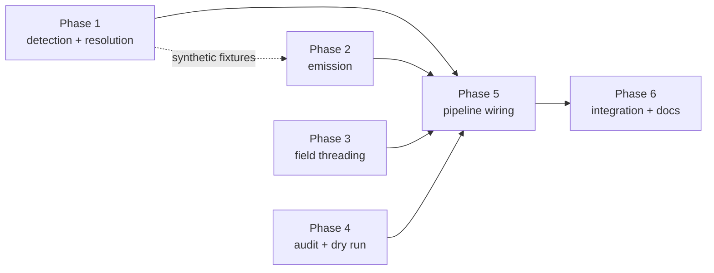

# Implementation Plan

## Validation Checklist

### CRITICAL GATES (Must Pass)

- [x] All `[NEEDS CLARIFICATION: ...]` markers have been addressed
- [x] All specification file paths are correct and exist
- [x] Each phase follows TDD: Prime → Test → Implement → Validate
- [x] Every task has verifiable success criteria
- [x] A developer could follow this plan independently

### QUALITY CHECKS (Should Pass)

- [x] Context priming section is complete
- [x] All implementation phases are defined with linked phase files
- [x] Dependencies between phases are clear (no circular dependencies)
- [x] Parallel work is properly tagged with `[parallel: true]`
- [x] Activity hints provided for specialist selection `[activity: type]`
- [x] Every phase references relevant SDD sections
- [x] Every test references PRD acceptance criteria
- [x] Integration & E2E tests defined in final phase
- [x] Project commands match actual project setup

---

## Context Priming

*GATE: Read all files in this section before starting any implementation.*

**Specification**:

- `docs/XDD/specs/031-inbox-attachment-filing/requirements.md` — Product Requirements
- `docs/XDD/specs/031-inbox-attachment-filing/solution.md` — Solution Design
- `docs/XDD/specs/031-inbox-attachment-filing/README.md` — Research decisions log (the evidence behind every ADR)
- `docs/instructions-json.md` — Hashi consumer contract; `move_asset` section and planner slot 3
- `docs/tomo/scripts/suggestion-parser.md` — lines 180-186, the explicit-projection silent-drop trap

**Key Design Decisions**:

- **ADR-1**: Resolve embeds against a per-run recursive `list_dir` of the inbox, matched on basename. `+1` Kado call, O(1) in notes and embeds. Ambiguity is reported, never guessed.
- **ADR-2**: Detect embeds deterministically in a pure lib, not in the `inbox-analyst`. No agent contract change; testable without an AI in the loop.
- **ADR-3**: Destination collision with a *different* file → skip and report. Renaming stays a Should-have.
- **ADR-4**: Fix `_count_kado_calls` here — the cost metric depends on it.
- **ADR-5**: `attachments` never rides the `move_note` action. A separate `_build_move_asset_actions` reads the manifest, which removes the strip-before-wire step entirely.
- **ADR-6**: An attachment move never implies a deletion. Enforced by a dedicated test.

**Implementation Context**:

```bash
# Testing
./venv/bin/python -m pytest tests/ -q                       # Full suite (2626 baseline)
./venv/bin/python -m pytest tests/test_attachment_index.py -q   # Focused

# Quality
./venv/bin/ruff check tomo/scripts/ scripts/ tests/

# Sync to the running instance (version-gated for tomo/scripts/, bytewise for schemas)
scripts/update-tomo.sh
```

**Standing rules for every phase**

- Bump the `# version:` header on every touched file under `tomo/scripts/` — `update-tomo` is version-gated and ships nothing otherwise.
- Never reuse an existing wikilink regex; none of the nine distinguish `![[…]]` from `[[…]]`.
- Never call `_ensure_md_extension` or `_dest_join` on an attachment path. `_dest_join` unconditionally forces `.md`; `_ensure_md_extension` is a silent no-op for an allowlisted extension (`foto.jpg` → `foto.jpg`) but silently appends `.md` to anything outside the allowlist (`scan.heic` → `scan.heic.md`) — neither behaviour is safe here.
- Never add a field to the `move_asset` action — `additionalProperties:false` rejects the whole set.

---

## Specification Compliance Guidelines

### How to Ensure Specification Adherence

1. **Before Each Phase**: read the phase file's Specification References in full.
2. **During Implementation**: reference the SDD section named in each task.
3. **After Each Task**: run the task's Validate step before checking it off.
4. **Phase Completion**: run the phase's validation task.

### Deviation Protocol

When implementation requires changes from the specification:
1. Document the deviation with clear rationale.
2. Obtain approval before proceeding.
3. Update the SDD when the deviation improves the design.
4. Record all deviations in the spec README's decisions log.

## Metadata Reference

- `[parallel: true]` — tasks that can run concurrently (verified to touch disjoint files)
- `[ref: document/section; lines: 1, 2-3]` — links to specifications
- `[activity: type]` — activity hint for specialist selection

---

## Implementation Phases

Each phase is defined in a separate file. Tasks follow red-green-refactor: **Prime** (understand context), **Test** (red), **Implement** (green), **Validate** (refactor + verify).

> **Tracking Principle**: Track logical units that produce verifiable outcomes. The TDD cycle is the method, not separate tracked items.

**Sequencing rationale.** Phase 1 is pure and depends on nothing. Phases 2–4 each consume a synthetic manifest and can therefore be built before real data exists — they are independent of one another and of Phase 5. Phase 5 connects Phase 1's output to the pipeline, which is why it comes after the consumers exist rather than before. Phase 6 proves the whole chain end to end.

- [x] [Phase 1: Detection and resolution core](phase-1.md)
- [x] [Phase 2: Action emission](phase-2.md)
- [x] [Phase 3: Field threading through both review channels](phase-3.md)
- [x] [Phase 4: Coverage audit and dry run](phase-4.md)
- [x] [Phase 5: Pipeline wiring and cost accounting](phase-5.md)
- [x] [Phase 6: Integration, regression and documentation](phase-6.md) — T6.1-T6.4, T6.6 done; T6.5 (live validation) deliberately left to the user

### Dependency graph



Phases 2, 3 and 4 have no dependency on each other and may run concurrently once Phase 1 fixes the resolved-path shape.

---

## Plan Verification

| Criterion | Status |
|-----------|--------|
| A developer can follow this plan without additional clarification | ✅ |
| Every task produces a verifiable deliverable | ✅ |
| All PRD acceptance criteria map to specific tasks | ✅ — see the traceability table below |
| All SDD components have implementation tasks | ✅ — `attachment_index` (P1), `_build_move_asset_actions` (P2) |
| Dependencies are explicit with no circular references | ✅ — see the dependency graph |
| Parallel opportunities are marked with `[parallel: true]` | ✅ |
| Each task has specification references `[ref: ...]` | ✅ |
| Project commands in Context Priming are accurate | ✅ — verified against the repo |
| All phase files exist and are linked from this manifest | ✅ |

### PRD traceability

| PRD feature | Phase / task |
|---|---|
| F1 — Detect embedded attachments | T1.1 |
| F2 — Resolve each embed to a real file | T1.2, T1.3 |
| F3 — Propose the attachment move for approval | T3.1, T3.2, T3.3, T3.4 |
| F4 — Emit the attachment move | T2.1, T2.2, T2.5 |
| F5 — Coverage audit | T4.1, T4.2, T4.3 |
| F6 — Readable instruction document | T2.3 |
| Should — unresolved-embed reporting | T3.2, T5.3 |
| Should — destination collision | T2.4 (ADR-3: detect and skip) |
| Cost metric integrity | T5.2 (ADR-4), T6.3 |
| Regression safety (CON-8) | T6.2 |
