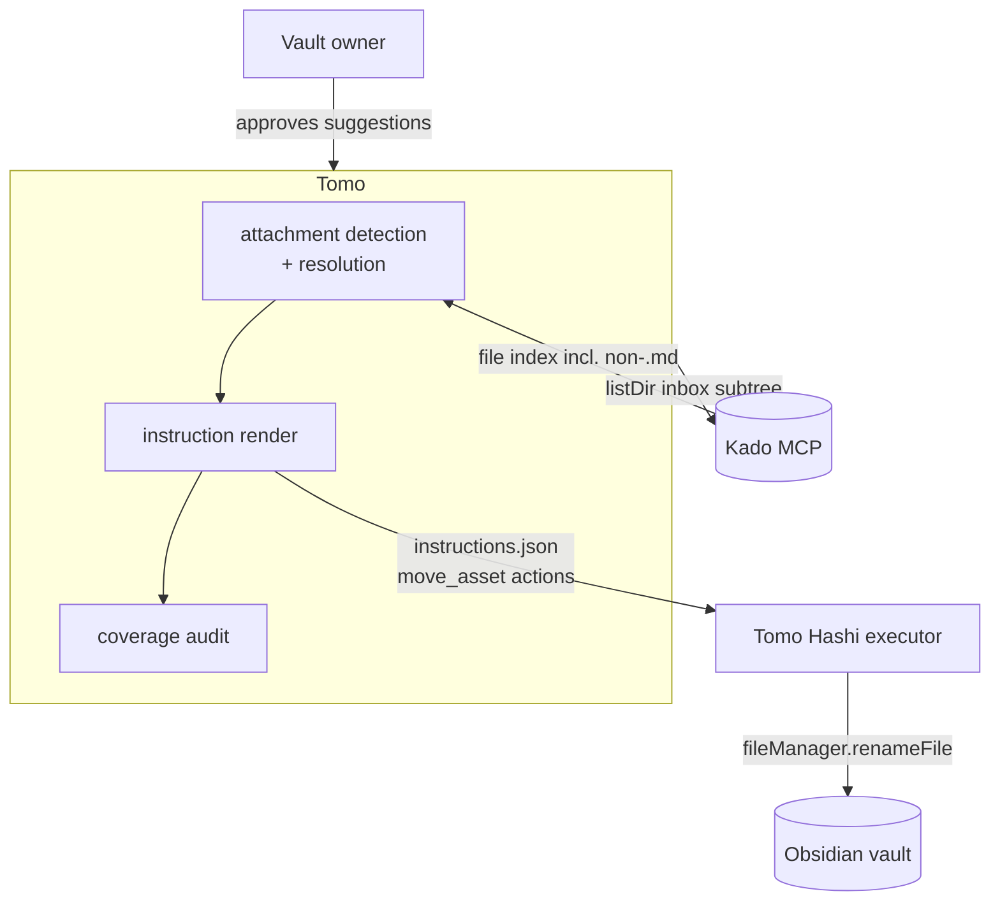
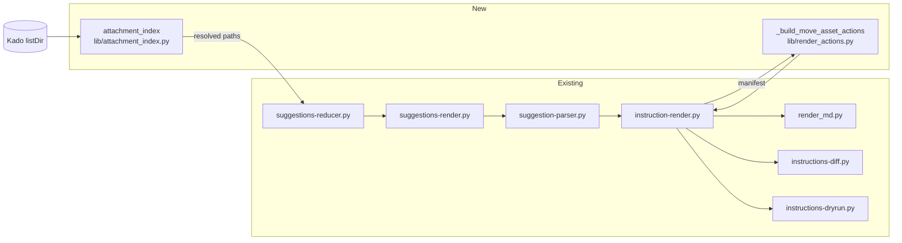

# Solution Design Document

## Validation Checklist

### CRITICAL GATES (Must Pass)

- [x] All required sections are complete
- [x] No [NEEDS CLARIFICATION] markers remain
- [x] Architecture pattern is clearly stated with rationale
- [x] **All architecture decisions confirmed by user** — ADR-1…ADR-4 confirmed 2026-09-01; ADR-5/ADR-6 are corollaries of confirmed decisions
- [x] Every interface has specification

### QUALITY CHECKS (Should Pass)

- [x] All context sources are listed with relevance ratings
- [x] Project commands are discovered from actual project files
- [x] Constraints → Strategy → Design → Implementation path is logical
- [x] Every component in diagram has directory mapping
- [x] Error handling covers all error types
- [x] Quality requirements are specific and measurable
- [x] Component names consistent across diagrams
- [x] A developer could implement from this design
- [x] Implementation examples use actual function and field names, verified against source
- [x] Complex logic includes a traced walkthrough with example data

---

## Constraints

- **CON-1 — The wire contract is fixed and shipped.** `move_asset` accepts exactly
  `{id, action, source, destination, applied?}` with `additionalProperties:false`
  (`tomo/schemas/instructions.schema.json`, mirror `hashi-instructions.schema.json`). No provenance
  field may be added to the action. Tomo-side context must stay Tomo-side.
- **CON-2 — `schema_version` stays `"2"`.** Hashi pins `const: "2"`; any bump makes it reject every
  instruction set, not only ones containing attachments.
- **CON-3 — Note moves and attachment moves are a strict partition.** Hashi 0.20.1 hard-rejects a
  `move_note` whose endpoints are not `.md`/`.canvas`/`.base`. Routing by extension is mandatory.
- **CON-4 — Constant Kado call cost.** Additional calls per `/inbox` run must not scale with note or
  embed count. Precedent: 027 ADR-2 rejected per-item lookups for the audio peer on 429 grounds; the
  429 risk is documented repeatedly (`docs/XDD/backlog.md:215-217`, spec 016 cost analysis :165-166).
- **CON-5 — Two review channels must stay in lockstep.** An item is reviewed as markdown *or* through
  the structured wire channel. A field added to one only is invisible on the other.
- **CON-6 — Python 3, stdlib + `jsonschema` only.** No new runtime dependency; tests run under
  `./venv/bin/python`.
- **CON-7 — Managed runtime files are version-gated.** Any edited file under `tomo/scripts/` needs its
  `# version:` header bumped or `update-tomo` ships nothing to the instance. Schemas are compared
  bytewise and need no bump (`scripts/update-tomo.sh:499-502`).
- **CON-8 — Additive only.** Tomo is near MVP; runs on notes without attachments must produce a
  byte-identical instruction set to today's.

## Implementation Context

### Required Context Sources

#### Documentation Context

```yaml
- doc: docs/XDD/specs/031-inbox-attachment-filing/requirements.md
  relevance: CRITICAL
  why: "The PRD this design implements — 6 Must features, 10 business rules, 9 edge cases"

- doc: docs/instructions-json.md
  relevance: CRITICAL
  why: "The Hashi consumer contract. move_asset section + planner slot 3 + the extension-routing rule"

- doc: docs/XDD/specs/027-suggestions-source-model/solution.md
  relevance: HIGH
  why: "ADR-2 at :233-240 rejected per-item Kado lookups for the audio peer. Same question as ADR-1 here, and the precedent this design follows"

- doc: docs/tomo/scripts/suggestion-parser.md
  relevance: HIGH
  why: ":180-186 documents the explicit-projection silent-drop trap that CON-5 depends on"

- doc: docs/XDD/specs/031-inbox-attachment-filing/README.md
  relevance: HIGH
  why: "Research decisions log — the evidence behind every ADR below"
```

#### Code Context

```yaml
- file: tomo/scripts/lib/render_actions.py
  relevance: CRITICAL
  why: "Emission site. _build_move_note_actions:559 (the template), build_actions:1275 (ordering), _dest_join:488 and _ensure_md_extension:63 (the .md traps), _REQUIRED_PATH_FIELDS:204-219. The classifier itself now lives in lib/file_extensions.py:18-25 (public KNOWN_FILE_EXTENSIONS), relocated during T1.1; render_actions.py keeps _KNOWN_FILE_EXTENSIONS:60 only as a back-compat alias"

- file: tomo/scripts/lib/kado_client.py
  relevance: CRITICAL
  why: "list_dir:235 is the resolution primitive. _search_all:597-617 pagination, retry/429 handling :33-37 and :669-679"

- file: tomo/scripts/instruction-render.py
  relevance: CRITICAL
  why: "Manifest construction :425-430, defaults dict :106 (concepts.asset missing → KeyError), build_actions call :471, _validate_action_paths call :573"

- file: tomo/scripts/instructions-diff.py
  relevance: CRITICAL
  why: "The blind spot. counts init :168-177, ACTION_ORDER :429-433, run_diff reconciliation :645-659, the audio_peer dedup pattern to mirror :296-318"

- file: tomo/scripts/suggestion-parser.py
  relevance: HIGH
  why: "Both parse paths. build_from_wire projection :305, markdown defaults :586, key dispatch :704, markdown projection :2009"

- file: tomo/scripts/suggestions-reducer.py
  relevance: HIGH
  why: "Dual surface. Markdown render :370-390, structured item mirror :1774-1783"

- file: tomo/scripts/suggestions-render.py
  relevance: HIGH
  why: "_wire_note:272 projection to the wire, digest stamp :400"

- file: tomo/scripts/inbox-triage.py
  relevance: HIGH
  why: "discover_files:150-176 (list_dir depth=1 — subfolders unseen today), _count_kado_calls:1521-1533 (ADR-4 target)"

- file: tomo/scripts/lib/render_md.py
  relevance: MEDIUM
  why: "_md_section_for:31-46 and _render_action_md:239 need a move_asset branch or the readable doc prints 'unknown action'"

- file: tomo/scripts/instructions-dryrun.py
  relevance: MEDIUM
  why: "REQUIRED table :25-33 — unlisted kind exits 1"

- file: tomo/schemas/item-result.schema.json
  relevance: HIGH
  why: "Analyst output contract. additionalProperties:false at :52 — a new per-item field must be declared or validation fails"

- file: tomo/scripts/topic-extract.py
  relevance: MEDIUM
  why: ":373-379 holds the inverse embed filter (kind != 'link' → skip, ADR-4) and :308-325 _strip_link_target, the alias/path/anchor normaliser to reuse"
```

#### External APIs

```yaml
- service: Kado MCP gateway
  doc: docs/instructions-json.md, tomo/scripts/lib/kado_client.py
  relevance: CRITICAL
  why: "listDir is the only call this design adds. Confirmed to return non-.md files (Kado search-adapter.ts:242-252 walks every TFile); the .md-only restriction applies to kado-read only (Kado tools.ts:113)"

- service: Tomo Hashi executor
  doc: docs/instructions-json.md
  relevance: CRITICAL
  why: "Executes move_asset via fileManager.renameFile — links and embeds follow the file, and vault.process is never called so bytes are never read. Idempotency matrix is the executor's, not Tomo's"
```

### Implementation Boundaries

- **Must Preserve**
  - Byte-identical instruction sets for items with no attachments (CON-8).
  - The existing per-item approval semantics — attachments add no new approval step.
  - `audio_peer` behaviour in full. It is the template, not a refactor target.
  - The `#93` decision: standalone non-`.md` inbox files stay unpartitioned.
- **Can Modify**
  - `render_actions.py`, `instruction-render.py`, `instructions-diff.py`, `suggestion-parser.py`,
    `suggestions-reducer.py`, `suggestions-render.py`, `render_md.py`, `instructions-dryrun.py`.
  - The four schemas carrying a per-item field.
  - `inbox-triage.py:1521-1533` `_count_kado_calls` (ADR-4, narrowly).
- **Must Not Touch**
  - `tomo/schemas/instructions.schema.json` / `hashi-instructions.schema.json` `move_asset` `$def` —
    shipped in PR #154 and byte-equal with Hashi's. Any change is a cross-repo contract break.
  - Hashi source. The executor is done.
  - `inbox-triage.py:158-175` file partitioning (the `#93` skip).
  - `topic-extract.py`'s ADR-4 embed exclusion — a different concern (topic extraction), left as is.

### External Interfaces

#### System Context Diagram



#### Interface Specifications

```yaml
outbound:
  - name: "Kado listDir — inbox subtree"
    type: MCP over HTTP
    format: JSON
    authentication: bearer token from instance .mcp.json
    doc: tomo/scripts/lib/kado_client.py:235
    data_flow: "One recursive listing of the inbox, returning every file including attachments"
    criticality: HIGH
    call_budget: "+1 per run, plus one page per 500 subtree entries (cursor loop at :597-617)"

  - name: "Tomo Hashi instruction set"
    type: file handoff (instructions.json in the vault)
    format: JSON, schema_version "2"
    authentication: n/a — vault-local
    doc: docs/instructions-json.md
    data_flow: "move_asset actions, planner slot 3 (after move_note, before link_to_moc)"
    criticality: HIGH

data:
  - name: "Suggestions wire (suggestions.json)"
    type: file, schema tomo/schemas/suggestions-wire.schema.json
    doc: tomo/scripts/suggestions-render.py:272
    data_flow: "Per-suggestion attachments list, read-only for the editor"

  - name: "Suggestions doc JSON"
    type: file, schema tomo/schemas/suggestions-doc.schema.json
    doc: tomo/scripts/suggestions-reducer.py:1774-1783
    data_flow: "Structured mirror of the markdown review surface"

  - name: "Render manifest"
    type: in-process + on-disk JSON
    doc: tomo/scripts/instruction-render.py:425-461
    data_flow: "Per-item entry carrying the resolved attachment paths into the emitters"
```

### Cross-Component Boundaries

- **API Contracts**: the `move_asset` action shape is a frozen cross-repo contract (Tomo produces,
  Hashi consumes). Changing it requires a handoff and a Hashi release. This design changes only what
  Tomo *produces*, never the shape.
- **Team Ownership**: Tomo owns detection, resolution, emission and audit. Hashi owns execution and
  idempotency. Kado owns vault access.
- **Shared Resources**: the vault. Tomo only reads; Hashi writes.
- **Breaking Change Policy**: none triggered — this is purely additive on Tomo's side, and the kind is
  already accepted by the shipped executor.

### Project Commands

```bash
# Discovered from the repo
Install: ./venv/bin/pip install -r requirements.txt
Test:    ./venv/bin/python -m pytest tests/ -q
Lint:    ./venv/bin/ruff check tomo/scripts/ scripts/ tests/
Sync:    scripts/update-tomo.sh          # version-gated for tomo/scripts/, bytewise for schemas
Run:     /inbox                          # inside the Tomo container
```

## Solution Strategy

- **Architecture Pattern**: a deterministic pre-pass feeding the existing manifest→emitter pipeline.
  One new resolution component and one new emitter; everything else is field-threading through
  channels that already exist.
- **Integration Approach**: mirror the `audio_peer` threading path exactly where it fits (schemas,
  dual review surface, parser projections, manifest) and deliberately diverge at the two points where
  its intent is inverted — the attachment is *discovered* rather than known by convention, and it is
  *moved* rather than deleted.
- **Justification**: the pipeline already carries a non-`.md` companion path end to end. Reusing that
  shape means no new architecture, and the two divergences are both simplifications (no
  strip-before-wire, no paired deletion). The only genuinely new logic is resolution, which is
  isolated in one pure, testable helper.
- **Key Decisions**: see Architecture Decisions. In short — resolve by indexing the inbox subtree
  once per run (ADR-1); detect embeds deterministically rather than in the analyst (ADR-2); never
  guess (ADR-3); keep attachments off the `move_note` action (ADR-5); never emit a deletion for an
  attachment (ADR-6).

## Building Block View

### Components



`attachment_index` is the only component that talks to Kado. `_build_move_asset_actions` is pure —
manifest in, actions out — matching every other emitter in `render_actions.py`.

### Directory Map

**Component**: tomo (host repo)

```
.
├── tomo/
│   ├── scripts/
│   │   ├── lib/
│   │   │   ├── attachment_index.py        # NEW: embed extraction + inbox index + resolution (pure, no Kado import)
│   │   │   ├── render_actions.py          # MODIFY: _build_move_asset_actions, _asset_dest_join,
│   │   │   │                              #         _REQUIRED_PATH_FIELDS entry, build_actions slot + docstring
│   │   │   └── render_md.py               # MODIFY: _md_section_for + _render_action_md branches
│   │   ├── instruction-render.py          # MODIFY: manifest entry field, concepts.asset default
│   │   ├── instructions-diff.py           # MODIFY: counts init, ACTION_ORDER, derive_expected pass
│   │   ├── instructions-dryrun.py         # MODIFY: REQUIRED entry + describe branch
│   │   ├── suggestion-parser.py           # MODIFY: wire projection, md defaults, key dispatch, md projection
│   │   ├── suggestions-reducer.py         # MODIFY: markdown line + structured item mirror
│   │   ├── suggestions-render.py          # MODIFY: _wire_note projection
│   │   └── inbox-triage.py                # MODIFY: attachment index build + _count_kado_calls fix (ADR-4)
│   ├── schemas/
│   │   ├── item-result.schema.json        # MODIFY: attachments on create_atomic_note
│   │   ├── suggestions-doc.schema.json    # MODIFY: attachments on sections[].actions[].item
│   │   └── suggestions-wire.schema.json   # MODIFY: attachments on suggestions[]
│   └── dot_claude/agents/
│       └── inbox-analyst.md               # UNCHANGED (ADR-2 — detection is deterministic)
├── tests/
│   ├── test_attachment_index.py           # NEW: extraction, indexing, resolution, ambiguity
│   ├── test_move_asset_actions.py         # NEW: emission, dedup, dest join, no-delete guarantee
│   └── (existing files)                   # MODIFY: parity, diff, dryrun, parser round-trip
└── docs/tomo/scripts/lib/
    └── attachment_index.md                # NEW: WHY-layer for the new lib
```

### Interface Specifications

#### Application Data Models

```pseudocode
ENTITY: AttachmentRef (NEW — internal, never reaches the wire)
  FIELDS:
    embed_target: string     # verbatim as written, e.g. "karte.jpg" or "Images/karte.jpg"
    resolved_path: string    # vault-relative, e.g. "100 Inbox/Images/karte.jpg"
    status: enum             # resolved | unresolved | ambiguous

ENTITY: ItemResult (MODIFIED — analyst output, tomo/schemas/item-result.schema.json)
  FIELDS:
    audio_peer: string | null
    + attachments: string[]  (NEW, optional, default [])   # resolved vault-relative paths

ENTITY: SuggestionsDocItem (MODIFIED — suggestions-doc.schema.json)
  FIELDS:
    + attachments: string[]  (NEW, optional, default [])

ENTITY: SuggestionsWireSuggestion (MODIFIED — suggestions-wire.schema.json)
  FIELDS:
    + attachments: string[]  (NEW, read-only for the editor)

ENTITY: ManifestEntry (MODIFIED — instruction-render.py:425)
  FIELDS:
    + attachments: string[]  (NEW)

ENTITY: MoveAssetAction (EXISTING — frozen, PR #154)
  FIELDS: id, action, source, destination, applied?
  # additionalProperties:false — nothing else may be added
```

**Field-name decision:** `attachments`, plural, list-of-string, resolved vault-relative paths.
Rejected `attachment_paths` (redundant) and carrying `AttachmentRef` objects on the wire (the
`status` field is diagnostic, not a filing input — unresolved and ambiguous entries are reported and
then dropped, so only resolved paths travel).

#### Data Storage Changes

None. No database. The only persisted artefacts are the existing vault documents and the render
manifest, both of which gain one optional list field.

#### Integration Points

```yaml
- from: inbox-triage.py
  to: lib/attachment_index.py
    - protocol: in-process function call
    - data_flow: "inbox listDir result (recursive) + per-note embed targets → resolved paths per item"

- from: instruction-render.py
  to: lib/render_actions.py::_build_move_asset_actions
    - protocol: in-process
    - data_flow: "manifest entries carrying attachments[] → move_asset action dicts"

Kado:
  - doc: tomo/scripts/lib/kado_client.py
  - sections: [list_dir]
  - integration: "One recursive list_dir(inbox_path) per run. No depth cap; pagination via the existing _search_all cursor loop"
  - critical_data: [vault-relative paths of every inbox file including attachments]
```

### Implementation Examples

#### Example: Embed extraction — why a new matcher is needed

**Why this example**: nine wikilink regexes exist in this repo and **not one** distinguishes an embed
from a link. Reusing any of them silently treats `![[karte.jpg]]` as a plain link. This is the single
highest-risk copy-paste in the whole feature.

```python
# lib/attachment_index.py
# The leading (!) is the whole point — every existing pattern in this repo omits it.
_EMBED_RE = re.compile(r"(!)?\[\[([^\[\]]+)\]\]")

def extract_attachment_embeds(body: str) -> list[str]:
    """Return embed targets that name a FILE (not a note), in document order, deduplicated.

    Only `![[...]]` counts. A plain `[[...]]` link is a deliberate reference, not a
    dependency of the note (PRD Feature 1, business rule: embeds are the signal).
    """
    out: list[str] = []
    seen: set[str] = set()
    for bang, raw in _EMBED_RE.findall(body):
        if not bang:
            continue                       # plain link — not an attachment
        target = _strip_alias_and_anchor(raw)
        if not _is_attachment_target(target):
            continue                       # note embed, e.g. ![[Some Note]]
        if target not in seen:
            seen.add(target)
            out.append(target)
    return out
```

`_is_attachment_target` reuses the existing classifier rather than inventing an extension list —
`lib/file_extensions.py:18-25` `KNOWN_FILE_EXTENSIONS` already contains `png, jpg, jpeg, gif, webp,
svg, bmp, pdf` plus the audio/video set, and already encodes the Obsidian rule that `[[FooBar]]`
means `FooBar.md` while `[[FooBar.m4a]]` means the literal file. (Relocated out of
`render_actions.py` during T1.1 to keep this library free of the render pipeline's imports — see
`docs/tomo/scripts/lib/file_extensions.md`.)

**It is a two-step test, not a membership check.** That frozenset also contains `md`, so a naive
`ext in KNOWN_FILE_EXTENSIONS` would classify `![[Note.md]]` as an attachment and emit a
`move_asset` for a note — which Hashi rejects (CON-3), and rightly. The test is:

```
is_attachment = ext in KNOWN_FILE_EXTENSIONS and ext not in {"md", "canvas", "base"}
```

Note that `canvas` and `base` are **not** in the frozenset today, so they already fall out at step
one as "no known extension → treat as a note name". Naming them in the exclusion anyway keeps the
partition explicit and survives a future addition to the frozenset.

`_strip_alias_and_anchor` must **preserve a path** if the target has one — unlike
`topic-extract.py:308-325` `_strip_link_target`, which ends with `split("/")[-1]`. A path-qualified
embed is already an answer and must not be discarded (PRD Feature 2, criterion 2).

#### Example: Resolution — traced walkthrough

**Why this example**: this is the ADR-1 algorithm, and its correctness depends on a distinction
(basename index vs path) that is easy to get subtly wrong.

Given this inbox (one recursive `list_dir("100 Inbox/")`):

| path | type |
|---|---|
| `100 Inbox/Places/Dresden.md` | file |
| `100 Inbox/Places/Prag.md` | file |
| `100 Inbox/Images/karte.jpg` | file |
| `100 Inbox/Images/prag-karte.jpg` | file |
| `100 Inbox/Scans/karte.jpg` | file |

the index is built once as `basename → [paths]`:

```
"Dresden.md"      -> ["100 Inbox/Places/Dresden.md"]
"karte.jpg"       -> ["100 Inbox/Images/karte.jpg", "100 Inbox/Scans/karte.jpg"]
"prag-karte.jpg"  -> ["100 Inbox/Images/prag-karte.jpg"]
```

Now trace four embeds:

| # | Embed in note | Basename looked up | Index hits | Outcome |
|---|---|---|---|---|
| 1 | `![[prag-karte.jpg]]` | `prag-karte.jpg` | 1 | **resolved** → `100 Inbox/Images/prag-karte.jpg`. The sibling assumption would have produced `100 Inbox/Places/prag-karte.jpg` — a path that does not exist |
| 2 | `![[karte.jpg]]` | `karte.jpg` | 2 | **ambiguous** → no action, reported. Business rule 4: a wrong move is worse than no move |
| 3 | `![[Images/karte.jpg]]` | `karte.jpg` (its own basename) | 2, narrowed to 1 | **resolved** → `100 Inbox/Images/karte.jpg`. NOT a membership test against the index's path set — Kado's `listDir` returns full vault-relative paths, so the index never holds a bare `Images/karte.jpg` to test against. Instead: look up `karte.jpg`'s two candidates, then keep whichever ends with the given target at a `/` boundary (here, `/Images/karte.jpg`). Business rule 2 |
| 4 | `![[Dresden]]` | — | — | not an attachment at all — no extension, so `_is_attachment_target` rejects it before lookup. A note embed |

Row 3's `resolved_path` is always a value **retrieved** from the index, never a string built by
joining the target onto a prefix — that is what makes fabrication impossible by construction rather
than by test. Narrowing to more than one surviving candidate is `ambiguous`, not first-hit-wins.

Edge cases and their code paths:

- **Zero hits** → `status = unresolved`; no action; reported. Business rule 10 — the note still files
  normally.
- **Empty index** (listDir failed) → every embed is `unresolved`; the run degrades to today's
  behaviour rather than failing. Mirrors `garden-audit.py`'s fail-open `list_dir_fn` handling.
- **Hit outside the inbox** → impossible by construction; the index only contains inbox paths.
  Business rule 3 is satisfied structurally rather than by a filter.
- **Case differences** → the index key is the exact basename. Obsidian is case-insensitive on some
  platforms; matching exactly is the conservative choice and a mismatch degrades to `unresolved`, not
  to a wrong file.

#### Example: Destination join — the trap

**Why this example**: two existing helpers look reusable and are actively harmful here.

```python
# lib/render_actions.py

def _asset_dest_join(asset_folder: str, source_path: str) -> str:
    """Join the asset folder with the source's basename, preserving the extension.

    NOT _dest_join (:488) — that hardcodes a '.md' suffix at :498.
    NOT _ensure_md_extension (:63) — it is a silent NO-OP for any extension
    already in KNOWN_FILE_EXTENSIONS (lib/file_extensions.py:18-25): 'foto.jpg'
    returns unchanged, since 'jpg' IS in the allowlist. The actual hazard is the
    opposite case — it silently appends '.md' to every extension NOT in that
    allowlist ('scan.heic' -> 'scan.heic.md', 'doc.docx' -> 'doc.docx.md'), so
    the failure only shows up for attachment types least likely to appear in a
    test fixture.
    """
    folder = (asset_folder or "").rstrip("/") + "/"
    return f"{folder}{source_path.rsplit('/', 1)[-1]}"
```

The basename is **not** run through `sanitize_stem`. It is an existing filename that Obsidian and the
filesystem already accept, and embeds resolve by that exact name — rewriting it would break the embed
that the whole feature exists to preserve.

### Complex Logic

**Global deduplication across the run.** The `audio_peer` precedent
(`render_actions.py:927-928`) deduplicates *within* an origin-stem group. Attachments must
deduplicate **globally** — two unrelated notes may embed one image (PRD Feature 4, criterion 2). The
set therefore lives in `_build_move_asset_actions`, spanning the whole manifest, not inside a
per-item loop:

```
seen: set[str] = set()
for entry in manifest:                       # manifest = approved items only
    for path in entry.get("attachments") or []:
        if path in seen:
            continue
        seen.add(path)
        emit move_asset(source=path, destination=_asset_dest_join(asset_folder, path))
```

Because the manifest contains only approved items, business rule 6 ("an attachment moves only if at
least one item embedding it is approved") holds without a separate gate.

**The audit must dedup identically.** `instructions-diff.py`'s expectation pass must build its set
from the *same normalised strings*. The research flagged a live asymmetry in the `audio_peer`
analogue — the diff dedups on the parser-supplied basename (`:298`) while the renderer dedups on the
inbox-joined path (`render_actions.py:927`). Those happen to have equal cardinality today; for
attachments they would not, because two embeds can normalise to one file. **Both sides key on the
resolved vault-relative path.**

## Deployment View

Single application. No deployment topology change.

- New and modified files under `tomo/scripts/` reach the running instance through
  `scripts/update-tomo.sh`, which is **version-gated**: every touched script needs its `# version:`
  header bumped (CON-7).
- Schemas are compared bytewise (`update-tomo.sh:499-502`) and need no version bump.
- No Hashi release is required — `move_asset` is already executable in 0.20.1, and the instance's
  vendored schemas refresh on the same `update-tomo` run.
- Rollout is a single merge; there is no migration and no persisted state to convert.

## Cross-Cutting Concepts

### Pattern Documentation

- **Deterministic over LLM-assembled.** Detection and resolution are pure functions over a listDir
  result. This follows the repo's standing preference for scripts producing structured output rather
  than agents freehanding it, and is the substance of ADR-2.
- **Fail open, never guess.** Every failure mode — listDir unavailable, target absent, target
  ambiguous, destination occupied — degrades to "no attachment action, note files normally, user
  told". This is the same posture `garden-audit.py` takes when the graph call fails.
- **Explicit projection.** Both parser paths enumerate the fields that survive; the new field must be
  added to both or it is silently dropped (`docs/tomo/scripts/suggestion-parser.md:180-186`).
- **WHY-layer.** `docs/tomo/scripts/lib/attachment_index.md` carries the rationale; the runtime file
  carries only the code.

### User Interface & UX

The surface is the suggestions document. Two additions, both per item:

```markdown
- **Attachments:** `100 Inbox/Images/prag-karte.jpg` → `Atlas/290 Assets/295 Attachments/`
- **Unresolved embeds:** `karte.jpg` (ambiguous — 2 candidates)
```

Rendered as a **full vault-relative path in backticks**, not a wikilink. Three reasons: the existing
`**Source:**` line already encodes two wikilinks positionally and the parser keys off wikilink index
(`suggestion-parser.py:712`), so a 0..N list cannot share it; a backticked path is unambiguous for
round-tripping; and the subfolder is exactly the information the user needs to sanity-check the
resolution.

The unresolved line appears **only when non-empty**, so items without attachments look exactly as
they do today (CON-8).

### System-Wide Patterns

- **Error handling**: no exceptions cross the component boundary. `attachment_index` returns
  statuses; callers decide. A Kado failure is caught at the call site and yields an empty index.
- **Logging**: unresolved and ambiguous embeds go to stderr with the note path and target, matching
  the `[triage]`/`[render]` prefix convention already in use.
- **Security**: no new external surface. One additional read-only Kado call, inside the existing
  key scope. No attachment *content* is ever read — only paths (Constitution L2: metadata only).
- **Performance**: +1 Kado call per run, O(1) in notes and embeds (CON-4). Index build is O(F) in
  inbox files; resolution is O(1) per embed via dict lookup.

## Architecture Decisions

| ID | Decision | Rationale | Trade-offs | Status |
|---|---|---|---|---|
| **ADR-1** | **Resolve embeds against a per-run index of the inbox subtree** (one recursive `list_dir`), matching on basename | Only option that is both correct for the observed layout (`100 Inbox/Places/note` → `100 Inbox/Images/karte.jpg`) and O(1) in call count. Ambiguity is *detectable*, so rule 4 can be honoured. Failure is local and benign | Misses attachments stored outside the inbox — acceptable, since those need no move. Basename collisions across subfolders must be reported rather than resolved. Rejected: `byName` per embed (O(unique embeds), and `byName` is substring matching — `kado_client.py:277-279` — so it can silently select a wrong file; already rejected for the same purpose in 027 ADR-2 on 429 grounds). Rejected: sibling assumption (0 calls but wrong for the observed case, and fails by fabricating a path) | **CONFIRMED** 2026-09-01 |
| **ADR-2** | **Detect embeds deterministically, not in the analyst** | Keeps structured-data extraction out of the LLM, per the repo's standing preference. Fully unit-testable without an agent in the loop (Constitution L1: domain behaviour testable without an AI). No change to the analyst contract or its output schema semantics | Costs one call the analyst path would have avoided, since the analyst already reads each body. Accepted: total added cost is 2 calls per run, constant. Note `listNotes fields=["links"]` is available as a zero-regex alternative for extraction (returns `kind=='embed'`), but requires the body-less path and is deferred — the regex runs on bodies the pipeline already has | **CONFIRMED** 2026-09-01 |
| **ADR-3** | **On destination collision with a different file: skip and report** | Safe by default and needs no new code. `_disambiguate_filename` (`render_actions.py:448`) asserts `.md` at `:467-469` and cannot be reused; an asset variant would be new code for a Should-have. Same-name-same-file is already handled by Hashi's idempotency (`src✗dst✓` → `skipped-already`) | The user must resolve a genuine collision by hand. Renaming remains a Should-have, deferred with defined behaviour rather than left undefined | **CONFIRMED** 2026-09-01 |
| **ADR-4** | **Fix `_count_kado_calls` in this spec** | It returns `5 + body_reads` while its own docstring says 8, and ignores the per-item reads at `:242`, `:315`, `:583`. It feeds the cost log that this spec's cost metric depends on. A metric that cannot be trusted is worse than none | Small scope addition unrelated to attachments. Contained to one function and its test; the corrected baseline shifts the cost log's historical numbers, which must be noted in the log rather than silently rebased | **CONFIRMED** 2026-09-01 |
| **ADR-5** | **`attachments` never rides the `move_note` action** — a separate `_build_move_asset_actions` reads the manifest directly | `audio_peer` only rides `move_note` because `_build_delete_source_actions` receives `move_notes` as its input (`render_actions.py:1320-1325`). `move_asset` has no such downstream coupling. This removes the strip-before-wire step entirely and makes it structurally impossible for an attachment to reach a `delete_source` | None identified. Strictly simpler than the precedent | Corollary of ADR-1/ADR-2 |
| **ADR-6** | **An attachment move never implies a deletion** | The intent inversion versus `audio_peer`, which is deleted. Filing means the file continues to exist at a new path | Requires an explicit guard in the audit's expectation pass: attachments must **not** be appended to `expected_deletions` (`instructions-diff.py:280`). Enforced by a test asserting zero `delete_source` actions reference an attachment path | Corollary of PRD Won't-Have |

## Quality Requirements

| Quality | Target | Measurement |
|---|---|---|
| Correctness — coverage | 100% of resolvable embedded attachments on approved items produce exactly one action | `instructions-diff` reconciliation; new emission tests |
| Correctness — no fabrication | Zero actions whose `source` does not exist in the inbox index | Resolution returns only indexed paths; asserted by test |
| Correctness — no deletion | Zero `delete_source` actions referencing an attachment path | Dedicated test (ADR-6) |
| Cost | +2 Kado calls per run, independent of note and embed count | Corrected `_count_kado_calls`; asserted by a test that varies note count and holds the call count constant |
| Regression safety | Byte-identical instruction sets for attachment-free items | Golden-file comparison in existing render tests |
| Audit integrity | `move_asset` appears in the audit's totals | Test asserting `ACTION_ORDER` membership and total reconciliation |
| Determinism | Same inputs → same action order and identical IDs | Existing ordering tests, extended |

## Acceptance Criteria

Traceability from PRD features to this design:

| PRD | Covered by |
|---|---|
| F1 — Detect embedded attachments | `attachment_index.extract_attachment_embeds` + `_is_attachment_target`; the `(!)` capture is the whole distinction |
| F2 — Resolve to a real file | ADR-1 index + traced walkthrough; rules 2/3/4/10 map to the four outcomes in that table |
| F3 — Propose for approval | Dual surface: `suggestions-reducer.py` markdown line **and** structured item mirror; `_wire_note` projection; both parser projections (CON-5) |
| F4 — Emit the action | `_build_move_asset_actions` + `_asset_dest_join`; global dedup set; `build_actions` slot 3; ADR-5/ADR-6 |
| F5 — Coverage audit | `instructions-diff` counts init, `ACTION_ORDER` entry, new expectation pass keyed on resolved path; `instructions-dryrun` REQUIRED entry |
| F6 — Readable document | `render_md._md_section_for` + `_render_action_md` branches |
| Should — unresolved reporting | The `**Unresolved embeds:**` line, rendered only when non-empty |
| Should — destination collision | ADR-3: detect, skip, report |

## Risks and Technical Debt

### Known Technical Issues

- **`instructions-diff` blind spot.** An unlisted kind is counted by `summarize_actual`
  (`:365-366`) but never reconciled, because `run_diff` iterates `ACTION_ORDER` (`:645`). The audit
  passes green while N actions go unchecked. Registration is part of the definition of done, not a
  follow-up.
- **`concepts.asset` missing from defaults.** `instruction-render.py:106` has no entry, so
  `cfg["concepts.asset"]` raises `KeyError` on a profile that omits the key. A default must be added
  alongside `"concepts.inbox": "100 Inbox/"`.
- **`_count_kado_calls` under-reports by 3** (ADR-4).

### Technical Debt

- The `audio_peer` dedup asymmetry between renderer (inbox-joined path) and audit (basename) is
  pre-existing. This design does not fix it, but must not replicate it — attachments key on the
  resolved path on both sides.
- `topic-extract.extract_topics_from_fields` has no live caller; the structured `kind=='embed'` path
  it would enable is built but unwired. Noted as the natural home if extraction ever moves off regex.

### Implementation Gotchas

- **Do not reuse any existing wikilink regex.** All nine match the inner `[[…]]` of an embed.
- **Do not call `_ensure_md_extension` or `_dest_join` on an attachment path.** `_dest_join`
  unconditionally forces `.md`; `_ensure_md_extension` is a silent no-op for an allowlisted
  extension (`foto.jpg` → `foto.jpg`) but silently appends `.md` to anything outside the allowlist
  (`scan.heic` → `scan.heic.md`) — neither behaviour is safe here.
- **Do not add `attachments` to the `move_asset` action.** `additionalProperties:false` — the entire
  instruction set is rejected at apply time.
- **Add the field to both review channels and both parser projections**, atomically with the wire
  schema — a half-added wire field makes the `emit_digest` read as "edited" mid-flight.
- **Inserting a kind into `build_actions` renumbers every later action ID.** Expected; fixtures
  asserting literal `I##` values downstream of `move_note` will shift. Not a regression.
- **Bump `# version:` on every touched `tomo/scripts/` file** or the instance never receives the change.

## Glossary

### Domain Terms

| Term | Definition |
|---|---|
| Embed | `![[target]]` — renders the target inline. The signal this feature acts on |
| Link | `[[target]]` — a reference, not a dependency. Deliberately ignored |
| Attachment | A vault file that is not a note (`.jpg`, `.png`, `.pdf`, …) |
| Note file | `.md`, `.canvas`, `.base` — the three Obsidian treats as documents |
| Stranded attachment | An attachment left in the inbox after its note was filed. The problem |
| Asset concept | `concepts.asset` — the configured destination, `Atlas/290 Assets/295 Attachments/` |

### Technical Terms

| Term | Definition |
|---|---|
| Manifest | Per-item render record; the emitters' input (`instruction-render.py:425`) |
| Wire | `suggestions.json` / `instructions.json` — the machine channels |
| Projection | The explicit dict enumerating which parser fields survive. Omission = silent drop |
| Coverage audit | `instructions-diff.py` — reconciles expected against emitted actions |
| Planner slot | Position in `build_actions`' emission order; `move_asset` is slot 3 |

### API/Interface Terms

| Term | Definition |
|---|---|
| `move_asset` | The frozen Hashi action for attachment moves; 5 fields, `additionalProperties:false` |
| `listDir` | Kado directory listing. Sees non-`.md` files; `depth` omitted = unlimited recursion |
| `emit_digest` | SHA-256 over the canonical wire payload; detects user edits |
| `applied` | Monotonic `false → true` flag Hashi writes after executing an action |
