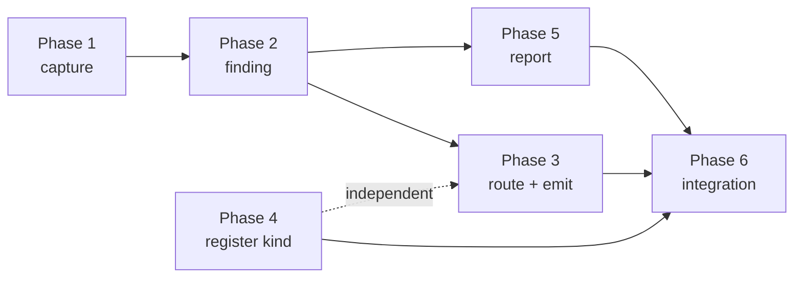

# Implementation Plan

## Validation Checklist

### CRITICAL GATES (Must Pass)

- [x] All `[NEEDS CLARIFICATION: ...]` markers have been addressed
- [x] All specification file paths are correct and exist
- [x] Each phase follows TDD: Prime → Test → Implement → Validate
- [x] Every task has verifiable success criteria
- [x] A developer could follow this plan independently

### QUALITY CHECKS (Should Pass)

- [x] Context priming section is complete
- [x] All implementation phases are defined with linked phase files
- [x] Dependencies between phases are clear (no circular dependencies)
- [x] Parallel work is properly tagged with `[parallel: true]`
- [x] Activity hints provided for specialist selection `[activity: type]`
- [x] Every phase references relevant SDD sections
- [x] Every test references PRD acceptance criteria
- [x] Integration & E2E tests defined in final phase
- [x] Project commands match actual project setup

---

## Context Priming

*GATE: Read all files in this section before starting any implementation.*

**Specification**:

- `docs/XDD/specs/032-up-source-routing/requirements.md` — Product Requirements
- `docs/XDD/specs/032-up-source-routing/solution.md` — Solution Design
- `docs/XDD/specs/032-up-source-routing/README.md` — Decisions log; carries the measured population and the two verified failure shapes
- `docs/XDD/specs/031-inbox-attachment-filing/solution.md` — same `instructions-diff` blind spot, already worked through
- `_inbox/from-hashi/2026-09-01_hashi-to-tomo_edit-frontmatter-kind.md` — the `edit_frontmatter` contract in full

**Key Design Decisions**:

- **ADR-1**: capture the observed property value by extending `UpParseResult` with `raw_value`. `up_parse` already reads it and already derives the property name.
- **ADR-2**: branch in `garden-audit-parser.py`, not in the check. The check describes reality; the parser maps a decision to an action.
- **ADR-3**: stale cache = the new field is **absent**, tested with a `_MISSING` sentinel — `up_value: None` is a legitimate value.
- **ADR-4**: surface the routing split in the report, one line per run.
- **ADR-5**: never fall back to the body-oriented action. The fallback reproduces the defect.
- **ADR-6**: the property name is always derived from the configured marker.

**Implementation Context**:

```bash
./venv/bin/python -m pytest tests/ -q
./venv/bin/ruff check tomo/scripts/ scripts/ tests/
scripts/update-tomo.sh          # version-gated for tomo/scripts/, bytewise for schemas
```

**Standing rules for every phase**

- Bump `# version:` on every touched file under `tomo/scripts/` or `update-tomo` ships nothing.
- Never test cache freshness with `detail.get("up_value")` — use the `_MISSING` sentinel.
- Never map the user's "remove" to `operation: "remove"` unless the broken link is the property's only content.
- Never normalise a scalar property into a list.
- Body-resident output must stay byte-identical.

---

## Specification Compliance Guidelines

1. **Before Each Phase**: read the phase file's Specification References in full.
2. **During Implementation**: reference the SDD section named in each task.
3. **After Each Task**: run the task's Validate step before checking it off.
4. **Phase Completion**: run the phase's validation task.

### Deviation Protocol

Document the deviation with rationale, obtain approval, update the SDD when the deviation improves
the design, and record it in the spec README's decisions log.

## Metadata Reference

- `[parallel: true]` — verified to touch disjoint files
- `[ref: document/section; lines: 1, 2-3]` — links to specifications
- `[activity: type]` — specialist hint

---

## Implementation Phases

**Sequencing rationale.** P1 captures the data and has no consumers, so it is safe to land alone. P2
carries it to the finding. P3 is the behavioural change. P4 is the new-kind checklist — deliberately
its own phase, because it is exactly the work that gets folded into an emission task and then
forgotten; spec 031 hit the same trap. P5 is the user-visible surface. P6 proves the chain.

- [x] [Phase 1: Capture the declaration value](phase-1.md)
- [x] [Phase 2: Carry it to the finding](phase-2.md)
- [ ] [Phase 3: Route and emit](phase-3.md)
- [ ] [Phase 4: Register the new action kind](phase-4.md)
- [ ] [Phase 5: Report surface](phase-5.md)
- [ ] [Phase 6: Integration, regression and documentation](phase-6.md)

### Dependency graph



P4 depends on nothing and may run concurrently with P1–P3; it registers a kind that P3 emits, and the
two only meet in P6. P5 needs P2's finding fields but not P3's routing.

---

## Plan Verification

| Criterion | Status |
|-----------|--------|
| A developer can follow this plan without additional clarification | ✅ |
| Every task produces a verifiable deliverable | ✅ |
| All PRD acceptance criteria map to specific tasks | ✅ — traceability below |
| All SDD components have implementation tasks | ✅ |
| Dependencies are explicit with no circular references | ✅ |
| Parallel opportunities are marked | ✅ |
| Each task has specification references | ✅ |
| Project commands are accurate | ✅ |
| All phase files exist and are linked | ✅ |

### PRD traceability

| PRD feature | Phase / task |
|---|---|
| F1 — finding knows the declaration site | T1.1, T1.2, T2.1 |
| F2 — property fixes proposed as property changes | T3.1, T3.2 |
| F3 — guard against a changed vault | T3.2, T3.3 |
| F4 — proposal discloses the property cost | T5.1 |
| F5 — coverage audit accounts for the kind | T4.2, T4.3 |
| F6 — older caches degrade | T3.4, T5.2 |
| Should — routing split line (ADR-4, accepted) | T5.3 |
| Should — unroutable summary | T5.2 |
| Regression safety (CON-7) | T6.2 |
| Zero added Kado calls (CON-3) | T6.3 |
