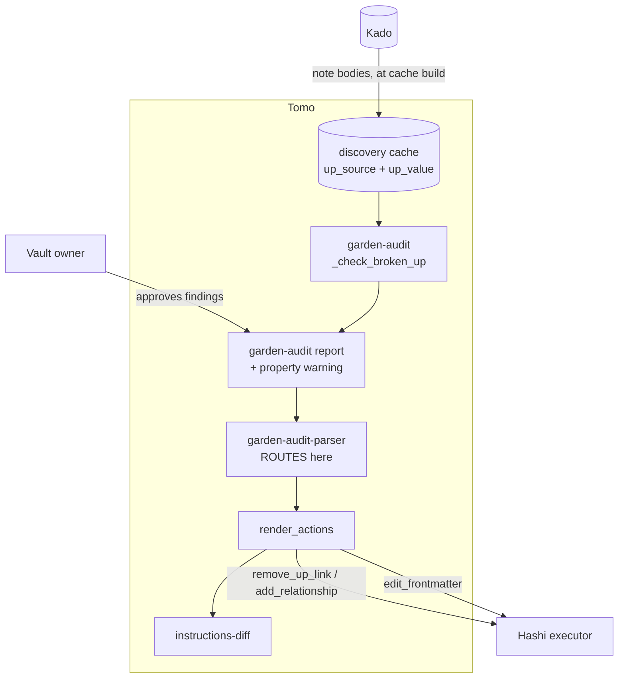
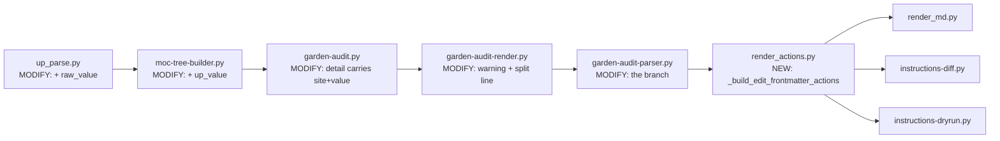

# Solution Design Document

## Validation Checklist

### CRITICAL GATES (Must Pass)

- [x] All required sections are complete
- [x] No [NEEDS CLARIFICATION] markers remain
- [x] Architecture pattern is clearly stated with rationale
- [x] **All architecture decisions confirmed by user** — ADR-1, ADR-3, ADR-4 confirmed 2026-09-01; ADR-2 is a structural corollary; ADR-5/ADR-6 follow from the PRD
- [x] Every interface has specification

### QUALITY CHECKS (Should Pass)

- [x] All context sources are listed with relevance ratings
- [x] Project commands are discovered from actual project files
- [x] Constraints → Strategy → Design → Implementation path is logical
- [x] Every component in diagram has directory mapping
- [x] Error handling covers all error types
- [x] Quality requirements are specific and measurable
- [x] Component names consistent across diagrams
- [x] A developer could implement from this design
- [x] Implementation examples use actual function and field names, verified against source
- [x] Complex logic includes a traced walkthrough with example data

---

## Constraints

- **CON-1 — The `edit_frontmatter` contract is fixed and shipped** (Hashi 0.22.0/0.23.0):
  `{id, action, path, property, operation, value?, expected|expected_absent, applied?}`,
  `additionalProperties:false`. `expected` is compared **deep-equal**; **list order is significant**;
  `expected_absent: true` and `expected: null` are a schema-enforced **exclusive pair**.
- **CON-2 — `schema_version` stays `"2"`.** Hashi pins `const: "2"`.
- **CON-3 — Zero additional Kado calls.** The observed value must come from data already gathered at
  cache-build time. Per-note reads at audit time are the pattern 027 ADR-2 rejected on 429 grounds.
- **CON-4 — The parent marker is profile-driven.** Nothing may hardcode `"up"`; the property name is
  derived via `marker_word(parent_marker)` (`up_parse.py:210`).
- **CON-5 — `broken_up` is cache-only and must stay so.** Spec 030 decided it triggers no
  `graph_audit`; this spec must not turn it into a reading check.
- **CON-6 — Existing caches lack any new field.** Degrade visibly; never fall back to the
  body-oriented action (that fallback *is* the defect).
- **CON-7 — Additive only.** Body-resident findings must produce byte-identical output.
- **CON-8 — Managed runtime files are version-gated.** Every touched `tomo/scripts/` file needs its
  `# version:` bumped; schemas sync bytewise.

## Implementation Context

### Required Context Sources

#### Documentation Context

```yaml
- doc: docs/XDD/specs/032-up-source-routing/requirements.md
  relevance: CRITICAL
  why: "The PRD — 6 Must features, 8 business rules, 8 edge cases"

- doc: docs/XDD/specs/032-up-source-routing/README.md
  relevance: HIGH
  why: "Decisions log; carries the measured population and the verified failure shapes"

- doc: docs/instructions-json.md
  relevance: CRITICAL
  why: "Hashi consumer contract. edit_frontmatter must be documented here as an emitted kind"

- doc: docs/XDD/specs/031-inbox-attachment-filing/solution.md
  relevance: HIGH
  why: "Same instructions-diff blind spot, same new-kind checklist. Reuse its findings rather than rediscovering them"

- doc: docs/XDD/specs/027-suggestions-source-model/solution.md
  relevance: MEDIUM
  why: "ADR-2 at :233-240 — the precedent that value capture belongs at analysis time, not at render time"
```

#### Code Context

```yaml
- file: tomo/scripts/lib/up_parse.py
  relevance: CRITICAL
  why: "SSoT for the parent declaration. UpParseResult :43-47, the frontmatter branch :210-211, marker_word derivation. ADR-1 extends this"

- file: tomo/scripts/moc-tree-builder.py
  relevance: CRITICAL
  why: "Cache build. fm = parse_frontmatter(content) at :406, up_parse call at :410, cache entry at :415-425 incl. the existing up_source at :423"

- file: tomo/scripts/garden-audit.py
  relevance: CRITICAL
  why: "_finding :86-100 (detail is the carrier), _check_broken_up :150-169 (source-agnostic today)"

- file: tomo/scripts/garden-audit-parser.py
  relevance: CRITICAL
  why: "Where the user's choice becomes a garden_action: :520-542 (repoint -> add_relationship, remove -> remove_up_link). ADR-2 branches here"

- file: tomo/scripts/lib/render_actions.py
  relevance: HIGH
  why: "Action emission, _REQUIRED_PATH_FIELDS :204-219, build_actions ordering :1275-1327"

- file: tomo/scripts/instructions-diff.py
  relevance: HIGH
  why: "The blind spot: counts init :168-177, ACTION_ORDER :429-433, run_diff :645-659"

- file: tomo/scripts/instructions-dryrun.py
  relevance: MEDIUM
  why: "REQUIRED table :25-33 — an unlisted kind exits 1"

- file: tomo/scripts/lib/render_md.py
  relevance: MEDIUM
  why: "_md_section_for :31-46, _render_action_md :239 unknown-action fallback"

- file: tomo/scripts/garden-audit-render.py
  relevance: HIGH
  why: "The report surface — where the property warning (F4) and the routing-split line (ADR-4) go"

- file: tomo/scripts/moc-discovery.py
  relevance: MEDIUM
  why: "Second consumer of parse_up_from_content (:63, :1399). Must keep working unchanged when UpParseResult grows a field"
```

#### External APIs

```yaml
- service: Tomo Hashi executor
  doc: docs/instructions-json.md; Hashi docs/action-reference.md
  relevance: CRITICAL
  why: "Executes edit_frontmatter via Obsidian processFrontMatter. Guarantees we rely on: a failed action leaves the file byte-identical (pre-check on a read-only path); a successful one drops YAML comments"
```

### Implementation Boundaries

- **Must Preserve**
  - Body-resident output, byte-for-byte (CON-7).
  - The inline-wins precedence in `up_parse` (its ADR-2). This spec reads the outcome; it does not
    re-rank the sources.
  - `broken_up` as a cache-only check (CON-5).
  - `moc-discovery.py`'s use of `parse_up_from_content`.
- **Can Modify**
  - `up_parse.py` (additively), `moc-tree-builder.py` cache entry, `garden-audit.py` finding detail,
    `garden-audit-parser.py` routing, `render_actions.py`, `render_md.py`, `instructions-diff.py`,
    `instructions-dryrun.py`, `garden-audit-render.py`, and the garden-audit doc/wire schemas.
- **Must Not Touch**
  - Hashi source. Our recommendation was explicitly that **no guard be added** to `remove_up_link`;
    it was accepted and recorded in their spec-002 (PR #128). This spec is the alternative to that
    guard, not a complement.
  - `instructions.schema.json` / `hashi-instructions.schema.json` `move_asset` `$def` (spec 031).
  - The `#93` inbox file partition.

### External Interfaces

#### System Context Diagram



The only new outward-facing artefact is the `edit_frontmatter` action. **No new Kado call exists
anywhere in this design** — the arrow into the cache is the existing cache build.

#### Interface Specifications

```yaml
outbound:
  - name: "Tomo Hashi instruction set"
    type: file handoff (instructions.json in the vault)
    format: JSON, schema_version "2"
    doc: docs/instructions-json.md
    data_flow: "edit_frontmatter actions for property-resident parent fixes"
    criticality: HIGH

data:
  - name: "Discovery cache"
    type: file (tomo-instance/config/discovery-cache.yaml)
    doc: tomo/scripts/moc-tree-builder.py:415-425
    data_flow: "Per-note up_state / up_target / up_source, plus the new observed value"

  - name: "garden-audit doc + wire"
    type: files, schemas tomo/schemas/garden-audit-doc.schema.json / garden-audit-wire.schema.json
    doc: tomo/scripts/garden-audit-render.py
    data_flow: "Finding detail carrying the declaration site and observed value"
```

### Project Commands

```bash
Test:  ./venv/bin/python -m pytest tests/ -q
Lint:  ./venv/bin/ruff check tomo/scripts/ scripts/ tests/
Sync:  scripts/update-tomo.sh
Run:   /garden-audit   then   /inbox     # inside the Tomo container
```

## Solution Strategy

- **Architecture Pattern**: field threading plus a branch. One shared parser gains a field; that
  field rides the existing cache → finding → decision → action chain; the action builder branches on
  it. No new component, no new call, no new data source.
- **Integration Approach**: `up_parse` stays the single source of truth for *"where is the parent
  declared and what does it say"*. Everything downstream consumes rather than re-derives.
- **Justification**: the discriminator has existed in the cache since the cache existed; the defect is
  that nothing reads it. The smallest correct change is therefore to widen what is captured (the raw
  value, needed for `expected`) and to consume what is already there.
- **Key Decisions**: see Architecture Decisions. In short — capture in `up_parse` (ADR-1); branch in
  the parser, not the check (ADR-2); detect a stale cache by field presence (ADR-3); surface the
  routing split in the report (ADR-4); never fall back to the body action (ADR-5); the property name
  is always derived (ADR-6).

## Building Block View

### Components



### Directory Map

**Component**: tomo (host repo)

```
.
├── tomo/
│   ├── scripts/
│   │   ├── lib/
│   │   │   ├── up_parse.py                # MODIFY: UpParseResult + raw_value; both return sites
│   │   │   ├── render_actions.py          # MODIFY: _build_edit_frontmatter_actions, _REQUIRED_PATH_FIELDS,
│   │   │   │                              #         build_actions slot + docstring
│   │   │   └── render_md.py               # MODIFY: _md_section_for + _render_action_md branches
│   │   ├── moc-tree-builder.py            # MODIFY: cache entry gains up_value
│   │   ├── garden-audit.py                # MODIFY: _check_broken_up detail carries up_source + up_value
│   │   ├── garden-audit-render.py         # MODIFY: property-edit warning; routing-split line (ADR-4)
│   │   ├── garden-audit-parser.py         # MODIFY: route remove/repoint by up_source
│   │   ├── instructions-diff.py           # MODIFY: counts, ACTION_ORDER, expectation pass
│   │   └── instructions-dryrun.py         # MODIFY: REQUIRED entry + describe branch
│   └── schemas/
│       ├── instructions.schema.json       # MODIFY: + edit_frontmatter $def and oneOf ref
│       ├── hashi-instructions.schema.json # MODIFY: same, verbatim from Hashi
│       ├── garden-audit-doc.schema.json   # MODIFY: detail.up_source, detail.up_value
│       └── garden-audit-wire.schema.json  # MODIFY: same
├── tests/
│   ├── test_up_parse.py                   # MODIFY: raw_value cases
│   ├── test_up_source_routing.py          # NEW: the routing matrix + stale-cache withhold
│   └── (existing)                         # MODIFY: parity, diff, dryrun, garden-audit scan/render
└── docs/tomo/scripts/
    └── garden-audit-parser.md             # MODIFY: WHY-layer for the routing branch
```

### Interface Specifications

#### Application Data Models

```pseudocode
ENTITY: UpParseResult (MODIFIED — lib/up_parse.py:43-47)
  FIELDS:
    target: Optional[str]        # parent stem, anchor-stripped
    source: Optional[str]        # "inline" | "frontmatter" | None
    + raw_value: Any (NEW)       # frontmatter: the property value AS PARSED (list|scalar|None).
                                 # inline: None — there is no property to guard.

ENTITY: CacheEntry (MODIFIED — moc-tree-builder.py:415-425)
  FIELDS:
    up_state, up_target, up_source
    + up_value: Any (NEW)        # mirrors UpParseResult.raw_value. Written for EVERY entry;
                                 # its PRESENCE is the cache-freshness signal (ADR-3)

ENTITY: BrokenUpFindingDetail (MODIFIED — garden-audit.py:150-169)
  FIELDS:
    up_target: str
    + up_source: "inline" | "frontmatter" | None (NEW)
    + up_value: Any (NEW)

ENTITY: EditFrontmatterAction (NEW on our side — frozen by Hashi)
  FIELDS: id, action, path, property, operation, value?, expected|expected_absent, applied?
  # additionalProperties:false
```

**Why `raw_value` is `None` for inline.** A body-resident parent has no property to guard, and
carrying the property's *unrelated* value would invite emitting a guard for something the fix does
not touch. `None` here means "not applicable", distinct from the frontmatter case where the property
exists and holds nothing — which is the very distinction CON-1 makes load-bearing.

#### Data Storage Changes

None beyond the cache entry above. No database.

#### Integration Points

```yaml
- from: garden-audit-parser.py
  to: lib/render_actions.py::_build_edit_frontmatter_actions
    - protocol: in-process
    - data_flow: "confirmed items with garden_action='edit_frontmatter' -> action dicts"

Hashi:
  - integration: "edit_frontmatter executed via Obsidian processFrontMatter"
  - critical_data: [path, property, operation, value, expected]
  - guarantees_relied_on:
      - "a failed action leaves the file byte-identical"
      - "a successful action drops YAML comments in the property block"
```

### Implementation Examples

#### Example: The routing branch

**Why this example**: this is the entire behavioural change, and the forbidden path (a fallback to the
body action) is the tempting one.

```python
# garden-audit-parser.py — inside the broken_up decision handling (~:520-542)
#
# The user's choice (remove | repoint) is unchanged. Only the KIND we emit for
# that choice now depends on where the parent is declared.

up_source = detail.get("up_source")
up_value  = detail.get("up_value", _MISSING)   # sentinel, not None — see below

if up_value is _MISSING:
    # ADR-3: cache predates this spec. ADR-5: withhold, never fall back.
    unroutable.append({"id": fid, "path": path, "reason": "stale-cache"})
    continue

if up_source == "frontmatter":
    garden_action = "edit_frontmatter"
elif up_source == "inline":
    garden_action = "remove_up_link" if choice == "remove" else "add_relationship"
else:
    # up_source None with up_state == "broken" is unreachable: a broken state
    # requires a target, and a target requires a source. Treated as unroutable
    # rather than assumed, so the impossible case cannot silently pick a branch.
    unroutable.append({"id": fid, "path": path, "reason": "no-declaration-site"})
    continue
```

**The sentinel matters.** `up_value` may legitimately be `None` (a property that exists and holds
nothing). `detail.get("up_value")` returning `None` therefore cannot distinguish "old cache" from
"empty property" — exactly the CON-1 distinction. Use a module-level `_MISSING` sentinel, not `None`.

#### Example: Constructing `value` and `expected` — traced walkthrough

**Why this example**: `expected` is deep-equal and order-significant, and the executor has **no
item-level operations** — we must emit the whole intended value. Getting the shape wrong fails every
action.

Given a note whose property is:

```yaml
up:
  - "[[Alte MOC]]"          # broken — this is up_target
  - "[[Reisen (MOC)]]"      # fine, must survive
```

so `up_value == ["[[Alte MOC]]", "[[Reisen (MOC)]]"]` and `up_target == "Alte MOC"`.

| User choice | `operation` | `value` | `expected` | Result in the note |
|---|---|---|---|---|
| Repoint to `Neue MOC` | `set` | `["[[Neue MOC]]", "[[Reisen (MOC)]]"]` | `["[[Alte MOC]]", "[[Reisen (MOC)]]"]` | Broken entry replaced **in place**; the sibling and its position survive |
| Remove | `set` | `["[[Reisen (MOC)]]"]` | `["[[Alte MOC]]", "[[Reisen (MOC)]]"]` | Broken entry dropped; the sibling survives |
| Remove, when it was the **only** entry | `remove` | — | `["[[Alte MOC]]"]` | The property itself is removed |

Three consequences worth stating plainly:

1. **"Remove" is usually `operation: "set"`, not `"remove"`.** `remove` deletes the whole property,
   which is only correct when the broken link was its sole content. Reaching for `remove` because the
   user said "remove" would delete a legitimate sibling parent.
2. **Order is preserved by construction** — we transform the observed list in place rather than
   rebuilding it. `expected` is the observed list verbatim.
3. **Scalar shape is preserved.** If `up_value` is a scalar `"[[Alte MOC]]"` rather than a list, a
   repoint emits a scalar and a remove emits `operation: "remove"`. Normalising a scalar into a
   one-item list would change the note's shape beyond the approved fix, and would fail the
   `expected` comparison besides.

Edge cases and their paths:

- `up_value` is `None` (property exists, empty) with `up_state == "broken"` → unreachable: an empty
  property yields no target. Treated as unroutable.
- The broken entry appears twice in the list → both are transformed; `expected` still carries the
  observed list verbatim.
- `up_value` is a map → out of scope for this phase; unroutable and reported. No known occurrence in
  the measured population, and guessing a transform for a shape we have never seen is how the current
  defect was born.

#### Example: `expected_absent` is not reachable here

**Why this example**: PRD Feature 3 has an acceptance criterion about expressing "must not exist". It
must be handled honestly rather than quietly dropped.

Every action this spec emits targets a property that **exists** — it is the source of the broken
target, so `expected` is always the observed value and `expected_absent` is never emitted. The
criterion is therefore **vacuously satisfied in this phase**, and the correct implementation is a
guard asserting we never emit `expected_absent`, not a code path producing it. If a later spec emits
`edit_frontmatter` for a property that may be absent, the distinction becomes live and CON-1's
exclusivity rule applies.

## Complex Logic

**The stale-cache path is the one that must not be clever.** ADR-5 forbids falling back to the
body-oriented action, and the reason is worth restating in the code: that fallback is not a
degradation, it is a reproduction of the exact defect this spec exists to remove. A withheld finding
is visible and re-runnable after `/explore-vault`; a wrongly-routed one is invisible and reports
success.

**Ordering.** `edit_frontmatter` actions occupy the same conceptual slot as the actions they replace
— they are the broken-`up` fix. They are emitted from the same loop in the same input order, so no
new position in `build_actions` is required beyond the emitter call itself. Action IDs downstream of
that point shift, as in spec 031; expected and benign.

## Deployment View

Single application, no topology change. Files under `tomo/scripts/` reach the instance via the
version-gated `update-tomo.sh` (CON-8); schemas sync bytewise.

**One rollout ordering note.** The cache gains `up_value` only when it is next rebuilt
(`/explore-vault`). Until then every broken-`up` finding is withheld as stale (Feature 6) rather than
mis-routed. That is intended: the user is told once, refreshes, and proceeds. Shipping the emitter
before the cache field would be the harmful order — hence both land together.

No Hashi release is required; `edit_frontmatter` has been executable since 0.22.0 and its guard
semantics were finalised in 0.23.0.

## Cross-Cutting Concepts

### Pattern Documentation

- **Capture once, at the source.** `up_parse` already reads the property value and already derives
  the property name. Widening its result is cheaper and safer than re-deriving either downstream
  (ADR-1).
- **Withhold, never fall back.** Every unresolvable case yields no action plus a report line.
- **Consume, do not re-derive.** The finding carries the declaration site; the parser branches on it;
  nothing downstream re-inspects the note.

### User Interface & UX

Two additions to the garden-audit report:

```markdown
- **Fix target:** note property `up` — editing YAML properties.
  ⚠️ Comments inside this note's property block will not survive the edit.
```

and, once per run (ADR-4):

```markdown
Broken parents: 4 findings — 3 in the note body, 1 in a note property.
```

Body-resident findings render exactly as today (CON-7). The warning appears only for
property-resident findings, and the split line only when at least one finding exists.

A withheld finding renders its reason and the remedy:

```markdown
- **Not fixable this run:** the discovery cache predates property routing.
  Run `/explore-vault` to refresh it, then re-run the audit.
```

### System-Wide Patterns

- **Error handling**: no exceptions cross a component boundary. Missing data yields an unroutable
  finding, never an assumed branch.
- **Logging**: unroutable findings go to stderr with the existing `[garden-audit]` prefix, naming the
  note and the reason.
- **Security**: no new external surface, no new call. The cache gains a note's property value — the
  same class of data it already holds (`up_target`, `topics`, `tags`).
- **Performance**: zero added Kado calls (CON-3). The cache grows by one small field per note.

## Architecture Decisions

| ID | Decision | Rationale | Trade-offs | Status |
|---|---|---|---|---|
| **ADR-1** | **Capture the observed property value by extending `UpParseResult`** with `raw_value`, populated at both return sites | `up_parse` is the declared SSoT for the parent declaration and already reads the value (`:210`, via `frontmatter.get(marker_word(parent_marker))`) before discarding all but the first wikilink. It also already derives the property name. Capturing there keeps one place answering "where is the parent and what does it say" | Widens a shared lib with two consumers (`moc-tree-builder.py:410`, `moc-discovery.py:63`). Both read `.target`/`.source` only, so a new dataclass field is backward-compatible. Rejected: reading `fm.get(marker_word(...))` at the cache-build site — no lib change, but duplicates both the property-name derivation and the which-source-won logic, in a spec whose entire premise is that the answer already exists in one place | **CONFIRMED** 2026-09-01 |
| **ADR-2** | **Branch in the parser, not in the check** | The check describes reality (this note's parent is broken, and it is declared here); the parser turns the user's decision into an action. That mapping already lives in `garden-audit-parser.py:520-542`. Branching in the check would mean emitting different *finding kinds* for the same problem, which the report would then have to re-merge | The finding must carry two extra fields through the doc and wire schemas. Accepted — `detail` is already the carrier for `up_target` | Structural corollary |
| **ADR-3** | **Detect a stale cache by field presence**, using a `_MISSING` sentinel rather than `None` | Self-describing and needs no version handshake; the cache has no version field today, so adding one would be a second mechanism for one question. The sentinel is required because `up_value: None` is a legitimate value (property exists, empty) under CON-1 | A hand-edited cache could carry the key with a wrong value and defeat the check. Acceptable: the cache is generated, and the `expected` guard is the real backstop at apply time | **CONFIRMED** 2026-09-01 |
| **ADR-4** | **Surface the routing split in the report** — one line per run | Cheap, and it is precisely the observability whose absence let this class of defect stay invisible: the report looked identical for both kinds of note. Makes the population visible to the user rather than only to an audit | One more line in an already dense report. Bounded: a single line, only when findings exist | **CONFIRMED** 2026-09-01 |
| **ADR-5** | **Never fall back to the body-oriented action** | The fallback reproduces the defect exactly, and does so with an air of graceful degradation. A withheld finding is visible and recoverable; a mis-routed one reports success | The user must refresh the cache before property findings become fixable. Stated in the report with the remedy | From PRD Rule 6 |
| **ADR-6** | **The property name is always derived from the configured marker**, never hardcoded | Markers are profile-driven (spec 028). `marker_word(parent_marker)` already yields `up` from `up::` | None. The derivation exists and is used today | From PRD Rule 3 |

## Quality Requirements

| Quality | Target | Measurement |
|---|---|---|
| Routing correctness | 100% of findings produce the action matching their own note | Routing-matrix tests over both sites × both choices |
| No silent success | Zero body-oriented actions emitted for property-resident findings, in any path incl. stale cache | Dedicated test asserting the forbidden fallback |
| Guard fidelity | `expected` equals the observed value verbatim, list order included | Traced-walkthrough cases as tests |
| Shape fidelity | Scalar stays scalar, list stays list; siblings and their order survive | Emission tests per shape |
| Regression safety | Body-resident output byte-identical to today | Golden comparison |
| Cost | Zero additional Kado calls | Test asserting call count is unchanged as note count varies |
| Audit integrity | `edit_frontmatter` appears in the coverage audit totals | `ACTION_ORDER` membership + reconciliation test |
| Degradation | A pre-change cache withholds and reports; never crashes, never falls back | Stale-cache tests |

## Acceptance Criteria

| PRD | Covered by |
|---|---|
| F1 — finding knows the declaration site | ADR-1 `raw_value`, ADR-2 detail fields; cache entry + finding detail |
| F2 — property fixes proposed as property changes | The routing branch; `_build_edit_frontmatter_actions`; ADR-6 derivation |
| F3 — guard against a changed vault | `expected` construction walkthrough; the `expected_absent` criterion is **vacuously satisfied** and implemented as an assertion, per the dedicated example above |
| F4 — proposal discloses the property cost | `garden-audit-render.py` warning line |
| F5 — coverage audit accounts for the kind | `instructions-diff` counts + `ACTION_ORDER` + expectation pass; `instructions-dryrun` REQUIRED |
| F6 — older caches degrade | ADR-3 sentinel; ADR-5 no-fallback; report remedy line |
| Should — routing split | ADR-4 (accepted into scope) |
| Should — unroutable summary | The stderr + report lines |

## Risks and Technical Debt

### Known Technical Issues

- **`instructions-diff` blind spot** — `ACTION_ORDER` is the reconciliation whitelist; an unlisted
  kind is counted but never reconciled, so the audit passes green. **Second consecutive spec to hit
  this.** Registration is part of the definition of done.
- **`up_value: None` is ambiguous without a sentinel** — see ADR-3. The obvious `detail.get()` idiom
  is wrong here.
- **"Remove" is usually `operation: "set"`** — the naming invites the wrong operation, which would
  delete a legitimate sibling parent.

### Technical Debt

- The cache grows a field with no migration path; older caches are handled by withholding rather than
  by upgrade. Acceptable because `/explore-vault` regenerates cheaply, but it means the first run
  after this ships is degraded by design.
- `up_value` for a map-shaped property is unroutable. If maps appear in practice, the transform needs
  designing rather than inferring.

### Implementation Gotchas

- **Do not use `detail.get("up_value")` to test freshness** — `None` is a legal value. Use `_MISSING`.
- **Do not map "remove" to `operation: "remove"`** unless the broken link is the property's only
  content.
- **Do not normalise a scalar into a list** — it changes the note and fails `expected`.
- **Do not emit `expected_absent`** in this phase; assert it never happens.
- **Do not fall back to `remove_up_link` / `add_relationship`** when routing data is missing.
- **Register the kind in `instructions-diff` and `instructions-dryrun`** in the same change as the
  emitter.
- **Bump `# version:`** on every touched `tomo/scripts/` file.

## Glossary

### Domain Terms

| Term | Definition |
|---|---|
| Parent declaration | How a note names its parent MOC — inline `up::` or a YAML `up:` property |
| Body-resident / property-resident | Where that declaration lives. The distinction this spec routes on |
| Declaration site | `up_source`: `"inline"`, `"frontmatter"`, or none |
| Broken parent | `up_state == "broken"` — the declared target resolves to no known MOC |
| Unroutable finding | A finding withheld because the site or value is unavailable. Reported, never guessed |

### Technical Terms

| Term | Definition |
|---|---|
| Discovery cache | `discovery-cache.yaml`, rebuilt by `/explore-vault`; source of `up_*` fields |
| Finding detail | The per-finding `detail` dict; carrier for check-specific data |
| Coverage audit | `instructions-diff.py` — reconciles expected against emitted actions |
| `_MISSING` sentinel | Module-level object distinguishing "key absent" from a legitimate `None` |

### API/Interface Terms

| Term | Definition |
|---|---|
| `edit_frontmatter` | Hashi's property-edit action; `set`/`remove`, guarded by `expected` |
| `expected` | The value the property must hold for the action to proceed. Deep-equal, order-significant |
| `expected_absent` | Mutually exclusive with `expected`; asserts the property does not exist |
| `marker_word` | Derives the property name from the configured marker (`up::` → `up`) |
