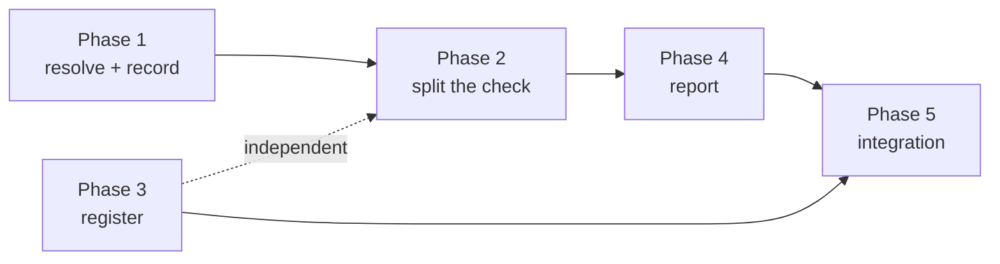

# Implementation Plan

## Validation Checklist

### CRITICAL GATES (Must Pass)

- [x] All `[NEEDS CLARIFICATION: ...]` markers have been addressed
- [x] All specification file paths are correct and exist
- [x] Each phase follows TDD: Prime → Test → Implement → Validate
- [x] Every task has verifiable success criteria
- [x] A developer could follow this plan independently

### QUALITY CHECKS (Should Pass)

- [x] Context priming section is complete
- [x] All implementation phases are defined with linked phase files
- [x] Dependencies between phases are clear (no circular dependencies)
- [x] Parallel work is properly tagged with `[parallel: true]`
- [x] Activity hints provided for specialist selection `[activity: type]`
- [x] Every phase references relevant SDD sections
- [x] Every test references PRD acceptance criteria
- [x] Integration & E2E tests defined in final phase
- [x] Project commands match actual project setup

---

## Context Priming

*GATE: Read all files in this section before starting any implementation.*

**Specification**:

- `docs/XDD/specs/033-broken-up-cause-split/requirements.md` — Product Requirements
- `docs/XDD/specs/033-broken-up-cause-split/solution.md` — Solution Design; the **Registration
  inventory** is the operative list for Phase 3
- `docs/XDD/specs/033-broken-up-cause-split/README.md` — decisions log, carrying the measured
  population
- `docs/XDD/specs/032-up-source-routing/solution.md` — ADR-3 (`_MISSING` sentinel) and ADR-5
  (withhold, never fall back), both reused here verbatim
- `https://github.com/MMoMM-org/miyo-tomo/issues/157` — the report this spec answers

**Key Design Decisions**:

- **ADR-1**: a different situation is a different check. `parent_not_moc`, advisory, **not** in
  `_FIXABLE` — which makes four acceptance criteria true by construction.
- **ADR-2**: add `up_broken_reason`; do not extend `up_state`'s enum.
- **ADR-3**: freshness is the key's **presence**. `_MISSING` sentinel, membership tests, never
  `.get()`.
- **ADR-4**: registering the check changes what `checks: all` covers, and explicit `broken_up`
  exclusions will not silence it.
- **ADR-5**: the advisory message is per-check; absent an entry, today's generic line renders
  byte-for-byte.
- **ADR-6**: `unresolved` is not split further; the report names the scan boundary instead.
- **ADR-7**: 032's routing is untouched; its declaration-site line loses denominator.

**Implementation Context**:

```bash
./venv/bin/python -m pytest tests/ -q
./venv/bin/ruff check tomo/ tests/ scripts/
./scripts/update-tomo.sh --yolo    # the bare form dies at the voice prompt without copying
```

**Standing rules for every phase**

- Bump `# version:` on every touched file under `tomo/scripts/` or `update-tomo` ships nothing.
- Never read `up_broken_reason` with `.get()` — `null` is a legitimate value; use the sentinel.
- Never add `parent_not_moc` to `_FIXABLE`, the suggest-targets tuple, or the enrichment tuple.
- Every task touching a check name states the site count it worked from (13 registration, 2 routing).
- Output for every check other than `broken_up` stays byte-identical.

---

## Specification Compliance Guidelines

1. **Before Each Phase**: read the phase file's Specification References in full.
2. **During Implementation**: reference the SDD section named in each task.
3. **After Each Task**: run the task's Validate step before checking it off.
4. **Phase Completion**: run the phase's validation task.

### Deviation Protocol

Document the deviation with rationale, obtain approval, update the SDD when the deviation improves
the design, and record it in the spec README's decisions log.

## Metadata Reference

- `[parallel: true]` — verified to touch disjoint files
- `[ref: document/section]` — links to specifications
- `[activity: type]` — specialist hint

---

## Implementation Phases

**Sequencing rationale.** P1 resolves and records the cause and has no consumers, so it lands alone
— the same shape as 032's P1, for the same reason. P2 splits the check, which is the behavioural
change. P3 is the registration checklist, deliberately its own phase: 032 proved that registration
work folded into an emission task gets forgotten, and this spec has **thirteen** registration sites
— nine that must register the new check, one that should for consistency, and three that must
deliberately stay untouched. P4 is the user-visible surface. P5 proves the chain end to end.

- [x] [Phase 1: Resolve and record the cause](phase-1.md)
- [x] [Phase 2: Split the check](phase-2.md)
- [x] [Phase 3: Register the new check](phase-3.md)
- [x] [Phase 4: Report surface](phase-4.md)
- [ ] [Phase 5: Integration, regression and live validation](phase-5.md)

### Dependency graph



P3 depends on nothing — it registers a name P2 emits, and the two only meet in P5. It may run
concurrently with P1 and P2. P4 needs P2's split to have something to render.

---

## Plan Verification

| Criterion | Status |
|-----------|--------|
| A developer can follow this plan without additional clarification | ✅ |
| Every task produces a verifiable deliverable | ✅ |
| All PRD acceptance criteria map to specific tasks | ✅ — traceability below |
| All SDD components have implementation tasks | ✅ |
| Dependencies are explicit with no circular references | ✅ |
| Parallel opportunities are marked | ✅ |
| Each task has specification references | ✅ |
| Project commands are accurate | ✅ |
| All phase files exist and are linked | ✅ |

### PRD traceability

| PRD feature | Phase / task |
|---|---|
| F1 — each flagged parent carries its situation | T1.1, T1.2, T2.1 |
| F2 — an untagged parent is advice, not a repair | T2.2, T3.1, T4.1 |
| F3 — an out-of-scope target is described as out of scope | T4.2 |
| F4 — today's behaviour survives for everything else | T5.2 |
| F5 — per-situation counts | T4.3 |
| F6 — an older cache degrades instead of guessing | T2.3, T4.4 |
| Should — actionable suggestion naming the target | T4.1 |
| Should — grouping by shared target | T4.1 |
| CON-1 zero added vault access | T5.3 |
| CON-2 no approvable advisory fix | T2.2, T3.2 |
| CON-3 byte-identical elsewhere | T5.2 |
| Q6 every registration proven | T3.2 |
