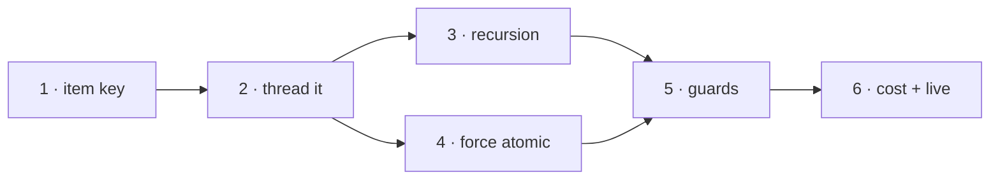

# Implementation Plan

## Validation Checklist

### CRITICAL GATES (Must Pass)

- [x] All `[NEEDS CLARIFICATION: ...]` markers have been addressed
- [x] All specification file paths are correct and exist
- [x] Each phase follows TDD: Prime → Test → Implement → Validate
- [x] Every task has verifiable success criteria
- [x] A developer could follow this plan independently

### QUALITY CHECKS (Should Pass)

- [x] Context priming section is complete
- [x] All implementation phases are defined with linked phase files
- [x] Dependencies between phases are clear (no circular dependencies)
- [x] Parallel work is properly tagged with `[parallel: true]`
- [x] Activity hints provided for specialist selection `[activity: type]`
- [x] Every phase references relevant SDD sections
- [x] Every test references PRD acceptance criteria
- [x] Integration & E2E tests defined in final phase
- [x] Project commands match actual project setup

---

## Output Schema

### PLAN Status Report

| Field | Value |
|-------|-------|
| specId | 034-recursive-inbox-discovery |
| title | Recursive inbox discovery |
| status | IN_REVIEW |
| phases | 6 |
| totalTasks | 29 |
| parallelTasks | 5 |
| specReferences | 101 |
| clarificationsRemaining | 0 |

---

## The one sequencing rule that matters

**Recursion must not ship before the item key is threaded.** Making `discover_files`
recursive is a two-line change, and it is the most dangerous change in this plan if taken
first: the moment subfolder notes become items, two notes can share a filename, and every
stem-keyed site — the per-item result file, the run state, the captured-mark write into the
vault — starts silently merging distinct notes.

So Phases 1 and 2 land the identity with no behaviour change at all, and Phase 3 turns on the
behaviour that needs it. A reviewer who sees Phase 1 or 2 in isolation should expect them to
be invisible to the user; that is the point, not an omission.

The reverse risk is what spec 031 recorded on 2026-09-05: five phases built against a field
nothing populated. Phase 2 therefore ends with a gate that proves the key is actually carried
end to end, before Phase 3 makes it load-bearing.

## Specification Compliance Guidelines

1. **Before each phase**: read the files in that phase's Context gate.
2. **During implementation**: every task carries `[ref: ...]` to the section that specifies it.
3. **After each task**: verify the Success criteria, not just that tests pass.
4. **Phase completion**: run the phase validation task.

### Deviation Protocol

1. Document the deviation with rationale.
2. Obtain approval before proceeding.
3. Update the SDD when the deviation improves the design.
4. Record it in the spec README's decision log.

Two deviations are **pre-approved and expected** — they are not drift:

- `tests/test_031_t2_4_destination_collision_guard.py:121`
  (`test_collision_does_not_suppress_the_notes_own_move_note`) must be inverted `[ref: SDD/ADR-6]`.
- `docs/XDD/specs/031-inbox-attachment-filing/plan/phase-2.md:85` records the behaviour being
  reversed; leave the historical record intact and note the reversal rather than editing it.

## Metadata Reference

- `[parallel: true]` — can run concurrently with its siblings
- `[ref: document/section]` — links to a specification
- `[activity: type]` — hint for specialist selection

### Success Criteria

**Validate** = process ("did we follow TDD?") · **Success** = outcome ("does it work?")

---

## Context Priming

*GATE: read these before starting any implementation.*

**Specification**:

- `docs/XDD/specs/034-recursive-inbox-discovery/requirements.md` — 10 features, 40 acceptance
  criteria, 9 business rules, 12 edge cases
- `docs/XDD/specs/034-recursive-inbox-discovery/solution.md` — 6 ADRs, 7 constraints, the
  traced walkthrough of the destination guard, 7 implementation gotchas
- `docs/XDD/specs/034-recursive-inbox-discovery/README.md` — verified research and the
  decision log, including four corrections made during drafting

**Key Design Decisions**:

- **ADR-1** — the item key **is** the vault-relative path, verbatim. No slug, no hash, no loss.
- **ADR-2** — add `item_key`; `stem` stays and means a bare filename again. Two fields, two
  jobs, neither lying.
- **ADR-3** — one recursive listing feeds both discovery and the attachment index; base Kado
  calls fall 3 → 2.
- **ADR-4** — destination clashes are caught in a dedicated Pass-2 validation pass, and **both**
  claimants are dropped.
- **ADR-5** — the per-item filename is `<readable>-<8 hex of a digest of the exact key>`. The
  filesystem is case-insensitive; a readable-only name would re-create the collision.
- **ADR-6** — an attachment clash suppresses its own note's move, reversing spec 031.

**Implementation Context**:

```bash
# Tests
./venv/bin/python -m pytest tests/ -q

# Lint
./venv/bin/python -m ruff check tomo/ tests/

# Sync source → instance (version-gated; the bare form stalls without copying)
./scripts/update-tomo.sh --yolo

# Pass 1 / Pass 2 — run by the user, inside the container
/inbox
```

Every modified file under `tomo/` needs its `# version:` bumped, or the change does not reach
the instance.

---

## Implementation Phases

Each phase is a separate file. Tasks follow **Prime → Test → Implement → Validate → Success**.

- [x] [Phase 1: Item key foundation](phase-1.md)
- [x] [Phase 2: Thread the key through the pipeline](phase-2.md)
- [x] [Phase 3: Recursive discovery](phase-3.md)
- [x] [Phase 4: Force Atomic in subfolders](phase-4.md)
- [ ] [Phase 5: Display and destination guards](phase-5.md)
- [ ] [Phase 6: Cost history, integration and live validation](phase-6.md)

### Dependency graph



Phases 3 and 4 both depend only on Phase 2 and touch different files — they can run in
parallel. Phase 5 needs both.

---

## Plan Verification

| Criterion | Status |
|-----------|--------|
| A developer can follow this plan without additional clarification | ✅ |
| Every task produces a verifiable deliverable | ✅ |
| All PRD acceptance criteria map to specific tasks | ✅ |
| All SDD components have implementation tasks | ✅ |
| Dependencies are explicit with no circular references | ✅ |
| Parallel opportunities are marked with `[parallel: true]` | ✅ |
| Each task has specification references `[ref: ...]` | ✅ |
| Project commands in Context Priming are accurate | ✅ |
| All phase files exist and are linked from this manifest | ✅ |

### PRD feature → phase coverage

| Feature | Phase |
|---|---|
| F1 subfolder notes discovered and triaged | 3 |
| F2 same-named notes handled independently | 1, 2 |
| F3 captured mark targets the right note | 2 (T2.5) |
| F4 Force Atomic works in a subfolder | 4 |
| F5 audio pairs by note, not name | 3 (T3.3) |
| F6 every run records its cost | 6 (T6.1) |
| F7 no two notes claim one destination | 5 (T5.2, T5.3) |
| F8 a note stays with its attachment | 5 (T5.4) |
| F9 no extra vault listing | 3 (T3.2) |
| F10 the two file-type checks agree | 3 (T3.1) |
