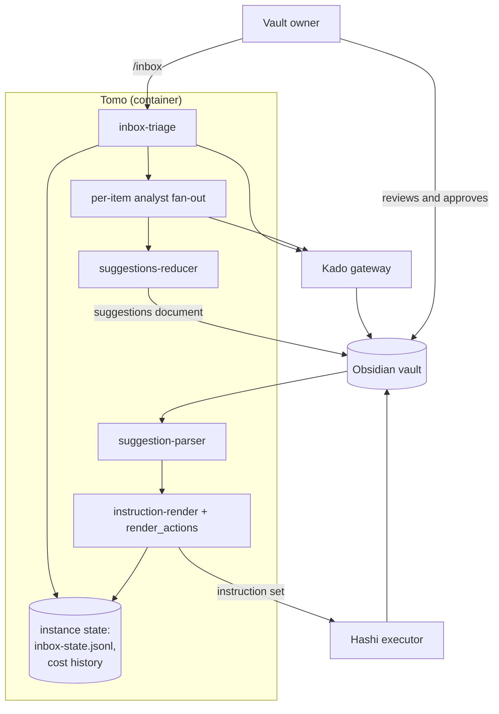
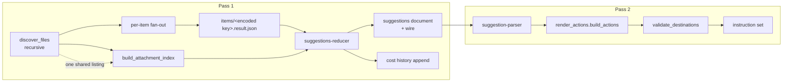

# Solution Design Document

## Validation Checklist

### CRITICAL GATES (Must Pass)

- [x] All required sections are complete
- [x] No [NEEDS CLARIFICATION] markers remain
- [x] Architecture pattern is clearly stated with rationale
- [x] **All architecture decisions confirmed by user** (ADR-1 … ADR-4 on 2026-09-06; ADR-5 and ADR-6 are corollaries, marked as such)
- [x] Every interface has specification

### QUALITY CHECKS (Should Pass)

- [x] All context sources are listed with relevance ratings
- [x] Project commands are discovered from actual project files
- [x] Constraints → Strategy → Design → Implementation path is logical
- [x] Every component in diagram has directory mapping
- [x] Error handling covers all error types
- [x] Quality requirements are specific and measurable
- [x] Component names consistent across diagrams
- [x] A developer could implement from this design
- [x] Implementation examples use actual field names, verified against the schemas
- [x] Complex logic includes traced walkthroughs with example data

---

## Output Schema

### SDD Status Report

| Field | Value |
|-------|-------|
| specId | 034-recursive-inbox-discovery |
| pattern | Deterministic pipeline stages over a shared vault gateway; the LLM classifies, scripts decide |
| keyComponents | `inbox-triage`, per-item analyst fan-out, `suggestions-reducer`, `suggestion-parser`, `instruction-render` / `render_actions` |
| externalIntegrations | Kado (vault gateway, inbound-to-vault), Hashi (executor, consumes the instruction set) |
| adrs | 6 (4 user-confirmed, 2 corollaries) |
| validationPassed | 14 |
| validationPending | 0 |

---

## Constraints

- **CON-1** — Python 3, no new runtime dependencies. Everything runs inside the Tomo container,
  which sees only the instance directory; the repository, and therefore `docs/`, is not
  reachable at runtime.
- **CON-2** — The two-pass model is inviolable. Tomo proposes, the user approves in a markdown
  document, and only then is anything applied. Nothing this spec adds may act without that
  approval.
- **CON-3** — All vault access goes through Kado. No direct filesystem access to the vault, in
  either direction.
- **CON-4** — The instruction set handed to Hashi keeps its current shape. Whatever identifier
  this design introduces internally, the emitted `source_stem` / `target_stem` values stay
  bare filenames. Verified: `render_helpers._stem()` (`:12-18`) already enforces this at the
  emission boundary (`render_actions.py:857,873,888`).
- **CON-5** — Runtime files under `tomo/dot_claude/` and `tomo/skills/` are LLM-loaded verbatim.
  They carry imperatives only; every rationale in this document belongs in `docs/tomo/`, not in
  the file it explains.
- **CON-6** — The working filesystem is **case-insensitive** (verified on this host). Any
  filename derived from a vault path must stay distinct for two paths differing only in case.
- **CON-7** — Live validation is the user's to run. No task in this spec may attempt a live
  vault run.

## Implementation Context

### Required Context Sources

#### Documentation Context

```yaml
- doc: docs/XDD/specs/034-recursive-inbox-discovery/requirements.md
  relevance: HIGH
  why: "The 40 acceptance criteria and 9 business rules this design must satisfy"

- doc: docs/XDD/specs/034-recursive-inbox-discovery/README.md
  relevance: HIGH
  why: "Verified research findings and the full decision log, including three corrections
        made during drafting that a reader would otherwise repeat"

- doc: docs/XDD/specs/031-inbox-attachment-filing/solution.md
  relevance: HIGH
  why: "The attachment resolution this spec builds on; ADR-1 (recursive index) and ADR-3
        (destination collisions) are directly extended here"

- doc: docs/tomo/scripts/suggestion-parser.md
  relevance: HIGH
  why: "Why the Force-Atomic reconciliation looks the way it does, including #165's fix,
        which the re-key must not undo"

- doc: docs/evolution/inbox-cost-log.md
  relevance: MEDIUM
  why: "The measured cost baseline this design must not regress against"
```

#### Code Context

```yaml
- file: tomo/scripts/inbox-triage.py
  relevance: HIGH
  why: "discover_files (:167-193) is the depth=1 call to change; build_attachment_index
        (:200-217) is the recursive listing to share; check_audio (:526-541) is a
        path-blind stem matcher"

- file: tomo/scripts/suggestion-parser.py
  relevance: HIGH
  why: "_stem_of (:1971) is the key derivation; ~20 stem-keyed sites in the Force-Atomic
        reconciliation, including #165's branch (b)"

- file: tomo/scripts/suggestions-reducer.py
  relevance: HIGH
  why: "items_dir / f'{stem}.result.json' (:1638→1715) is the filename collision; stem is
        also user-visible text at 16 sites (title fallback, source links, headings) — see
        the gotcha, and re-enumerate rather than trusting the list"

- file: tomo/scripts/lib/render_actions.py
  relevance: HIGH
  why: "_dest_join (:484) builds the destination with no collision guard;
        _build_move_asset_actions (:630-690) is the guard pattern to follow;
        _build_daily_update_actions (:823) is the CON-4 emission boundary"

- file: tomo/scripts/state-update.py
  relevance: HIGH
  why: "inbox-state.jsonl is joined on stem (:39,52,76,82) — an on-disk log, not just a dict"

- file: tomo/scripts/mark-captured.py
  relevance: HIGH
  why: "last_state_per_stem (:44-49) feeds a real vault write (:161). The one collision
        consequence that mutates user data"

- file: tomo/scripts/instructions-diff.py
  relevance: MEDIUM
  why: "Carries its own duplicated _stem() (:105-111); both sides of the coverage audit
        collapse identically, producing a false pass rather than a caught mismatch"

- file: tomo/dot_claude/agents/inbox-analyst.md
  relevance: HIGH
  why: "The written contract: :28 defines stem, :37 the output path, :43 forbids writing
        elsewhere, :613-616 stamps source_stem. LLM-loaded verbatim (CON-5)"

- file: tomo/dot_claude/skills/force-atomic-handling/SKILL.md
  relevance: HIGH
  why: ":55-70 reconstructs the note path as <inbox_path>/<stem>.md — wrong for any
        subfolder note, independent of collisions"

- file: tomo/scripts/lib/attachment_index.py
  relevance: MEDIUM
  why: "build_inbox_index (:41-61) consumes the same shape discover_files partitions —
        the basis for sharing one listing"

- file: tomo/scripts/lib/obsidian_filename.py
  relevance: MEDIUM
  why: "sanitize_stem is lossy by design — must NOT be used to derive the item filename"
```

#### External APIs

```yaml
- service: Kado
  doc: "@~/Kouzou/projects/miyo/miyo-architecture.md"
  relevance: HIGH
  why: "listDir (recursive when depth is omitted) and listNotes are the only vault reads;
        write_frontmatter is the only vault write in scope"

- service: Hashi
  doc: "/Volumes/Moon/Coding/MiYo/Hashi/src/schema/instructions.schema.json"
  relevance: MEDIUM
  why: "Consumes the instruction set. Read-only reference — CON-4 keeps its contract fixed.
        Nothing in Hashi is modified by this spec"
```

### Implementation Boundaries

- **Must Preserve**
  - The flat-inbox path end to end: a root-only inbox must produce a byte-identical
    suggestions document.
  - CON-4: what Hashi receives.
  - The shared derivation invariant #165 depends on — both the daily-log path and the
    primary/resolve-doc path must compute the join key through one function.
  - `seen`-based deduplication of one attachment embedded by two notes. That is a duplicate
    reference, not a clash.
- **Can Modify**
  - `inbox-triage.py`, `suggestions-reducer.py`, `suggestion-parser.py`,
    `instruction-render.py`, `lib/render_actions.py`, `state-update.py`, `mark-captured.py`,
    `instructions-diff.py`, `validate-result.py`.
  - The schemas that carry item identity, and `inbox-analyst.md` / `force-atomic-handling`
    under CON-5.
  - `tests/test_031_t2_4_destination_collision_guard.py:121` — deliberately inverted, see
    ADR-6.
- **Must Not Touch**
  - Anything in the Hashi repository.
  - The vault, other than through the writes the pipeline already performs.
  - `garden-audit` and its exclusion config — a separate flow that shares no discovery code.

### External Interfaces

#### System Context Diagram



#### Interface Specifications

```yaml
inbound:
  - name: "Slash command /inbox"
    type: in-process
    format: CLI arguments
    authentication: none — single local user
    data_flow: "Triggers Pass 1 or Pass 2"

  - name: "Approved review document"
    type: vault file, read through Kado
    format: markdown with a JSON wire sibling
    authentication: n/a
    data_flow: "The user's decisions, including any names they edited"

outbound:
  - name: "Kado — listDir"
    type: MCP over local HTTP
    format: JSON
    authentication: bearer token
    data_flow: "One recursive inbox listing per run (ADR-3), replacing today's two calls"
    criticality: HIGH

  - name: "Kado — listNotes(fields=[links])"
    type: MCP over local HTTP
    format: JSON
    authentication: bearer token
    data_flow: "Embed extraction, unchanged from spec 031"
    criticality: HIGH

  - name: "Kado — write_frontmatter"
    type: MCP over local HTTP
    format: JSON
    authentication: bearer token
    data_flow: "Marks a source note captured. The only vault write in scope, and the only
                path where a key collision would corrupt user data"
    criticality: HIGH

  - name: "Instruction set for Hashi"
    type: vault file
    format: JSON, `instructions.schema.json`
    authentication: n/a
    data_flow: "Actions to apply. Shape frozen by CON-4"
    criticality: HIGH

data:
  - name: "Per-item analyst output"
    type: one JSON file per item under `tomo-tmp/items/`
    connection: filesystem
    data_flow: "Written by each analyst subagent, read back by the reducer. Filename derived
                from the item key — the collision this spec removes"

  - name: "Run state"
    type: append-only JSONL, `tomo-tmp/inbox-state.jsonl`
    connection: filesystem
    data_flow: "One line per item transition, replayed last-wins per key"

  - name: "Cost history"
    type: append-only JSONL in the instance's persistent state
    connection: filesystem
    data_flow: "One entry per completed Pass 1. New in this spec (ADR-5)"
```

### Cross-Component Boundaries

- **API Contracts** — the instruction set is the only contract crossing to another component,
  and CON-4 freezes it. This spec makes no cross-repo change and needs no ADR in the
  system-level repository.
- **Shared Resources** — the vault, reached only through Kado.
- **Breaking Change Policy** — the internal item identity is Tomo-private. A handoff notifies
  the executor's owner that bare-name ambiguity in their own matching gets wider; it is
  informational, not a required change.

### Project Commands

```bash
# Tests
./venv/bin/python -m pytest tests/ -q

# Lint
./venv/bin/python -m ruff check tomo/ tests/

# Sync source → instance (version-gated; the bare form stalls without copying)
./scripts/update-tomo.sh --yolo

# Pass 1 / Pass 2 — run by the user inside the container
/inbox
```

## Solution Strategy

Three changes, in dependency order. Each is separately testable, and the first is worthless
without the second — which is precisely the trap spec 031 fell into, so the plan sequences
them together rather than shipping the enabler alone.

1. **Give an inbox item an identity that survives subfolders.** A new `item_key` field
   carries the note's vault-relative path. The existing `stem` field stays and goes back to
   meaning exactly what its name says — a bare filename, used wherever a person reads it.
   Two fields, two jobs, neither lying.

2. **Widen discovery, and pay less for it.** `discover_files` stops passing `depth=1`. The
   recursive listing that already runs for the attachment index feeds both consumers, so the
   base call count falls from 3 to 2.

3. **Guard the destinations.** The target folder is flat. A validation pass over the built
   action list removes any pair that would claim one destination, and an attachment clash
   takes its own note's move with it.

The architecture pattern is unchanged: deterministic pipeline stages over a shared vault
gateway, with the LLM confined to classification. Nothing here moves logic into the analyst;
two changes move logic *out* of it, because a path-derived identity is something a script can
compute exactly and a language model can only approximate.

## Building Block View

### Components



`validate_destinations` is the only new component. Everything else is an existing stage whose
notion of item identity changes.

### Directory Map

```
tomo/scripts/
├── inbox-triage.py            MODIFY  recursive discovery; share one listing;
│                                      path-aware audio pairing; emit item_key
├── suggestions-reducer.py     MODIFY  read items/<encoded>.result.json; keep stem
│                                      as display; propose a name on destination clash;
│                                      append the cost entry
├── suggestion-parser.py       MODIFY  derive item_key once, use it at every join site
├── instruction-render.py      MODIFY  call the new validation pass
├── state-update.py            MODIFY  join inbox-state.jsonl on item_key
├── mark-captured.py           MODIFY  join on item_key (the vault-write path)
├── instructions-diff.py       MODIFY  stop collapsing distinct items to one stem
├── validate-result.py         MODIFY  require item_key alongside stem
└── lib/
    ├── item_key.py            NEW     derive the key, encode it for a filename
    ├── render_actions.py      MODIFY  destination guard; attachment clash suppresses
    │                                  its note's move
    └── attachment_index.py    MODIFY  one shared file-type filter

tomo/schemas/
├── item-result.schema.json    MODIFY  add item_key (required)
├── state-entry.schema.json    MODIFY  add item_key (required)
├── suggestions-doc.schema.json MODIFY add item_key
├── suggestions-wire.schema.json MODIFY add item_key
└── routing-plan.schema.json   MODIFY  add item_key

tomo/dot_claude/
├── agents/inbox-analyst.md    MODIFY  output filename and item_key stamping (CON-5)
└── skills/force-atomic-handling/SKILL.md
                               MODIFY  use the item's real path, not <inbox>/<stem>.md

docs/tomo/                     NEW/MODIFY  a WHY counterpart for every runtime change

tests/
├── test_034_*.py              NEW     per-feature coverage
└── test_031_t2_4_destination_collision_guard.py
                               MODIFY  invert the suppression assertion (ADR-6)
```

### Interface Specifications

#### Data Storage Changes

```yaml
item_identity:
  item_key:
    type: string
    required: true
    value: "the note's vault-relative path, verbatim — e.g. '100 Inbox/Places/Dresden.md'"
    used_for: "every dict key, set membership, filename derivation and join in the pipeline"
  stem:
    type: string
    required: true
    value: "the bare filename without extension — e.g. 'Dresden'"
    used_for: "display only: title fallback, the **Source:** link, rendered headings —
               anything a person reads"
    note: "unchanged in meaning; it stops being used as a join key. Used at 16 sites in the
           reducer alone; enumerate them, do not work from a count"

cost_history:
  location: "the instance's persistent state directory, beside the existing squelch registry"
  format: "append-only JSONL, one object per completed Pass 1"
  fields: [timestamp, run_id, item_count, base_kado_calls, total_kado_calls]
  retention: "never rewritten; entries accumulate"
```

Every schema carrying item identity gains `item_key` as a required string. `stem` stays
required and keeps its description. All five schemas set `additionalProperties: false`, so the
schema change must land **before or with** the producers — a new field on an undeclared schema
rejects the whole payload.

#### Application Data Models

```yaml
ItemKey:
  derive(source_path) -> str:
    returns: "source_path unchanged — the key IS the path"
    why: "readable in every log and artefact, and reversible to the file by construction"

  to_filename(item_key) -> str:
    returns: "<readable stem>-<8 hex chars of a digest of the exact key>"
    guarantees:
      - "distinct for two keys differing only in letter case (CON-6)"
      - "distinct for two keys differing anywhere at all"
      - "stable across runs for the same key"
      - "legible enough to identify an item when reading tomo-tmp by hand"
```

#### Integration Points

```yaml
inter_stage:
  - from: inbox-triage
    to: analyst fan-out
    carries: "item_key and the note's real path"
    change: "the dispatcher stops reconstructing the path from a stem"

  - from: analyst fan-out
    to: suggestions-reducer
    carries: "items/<encoded item_key>.result.json"
    change: "filename derived from the key, not the bare stem"

  - from: suggestions-reducer
    to: suggestion-parser
    carries: "the suggestions document and its wire sibling"
    change: "item_key added to the wire; the markdown continues to show stem, plus enough
             path to disambiguate when two items share a filename"

  - from: render_actions
    to: Hashi
    carries: "the instruction set"
    change: "none — CON-4"
```

### Implementation Examples

#### Example: deriving and encoding the item key

```python
# lib/item_key.py — the key is the path; only the filename needs a transform.

def derive(source_path: str) -> str:
    """The item key IS the vault-relative path. No transformation, no loss."""
    return source_path


def to_filename(item_key: str) -> str:
    """A filesystem-safe, collision-free name for this key's per-item result file.

    NOT sanitize_stem: that replaces forbidden characters and is deliberately lossy,
    so two distinct paths can map onto one name — the exact failure this spec exists
    to remove. The digest is taken over the exact key, so two paths differing only in
    letter case produce different filenames even though the filesystem would treat
    the readable half as identical (CON-6).
    """
    digest = hashlib.sha256(item_key.encode("utf-8")).hexdigest()[:8]
    readable = _readable_part(item_key)      # lowercased stem, safe chars only, clipped
    return f"{readable}-{digest}.result.json"
```

Worked examples:

| `item_key` | `to_filename` |
|---|---|
| `100 Inbox/Places/Dresden.md` | `dresden-4f2a91c7.result.json` |
| `100 Inbox/Reise/Dresden.md` | `dresden-b81e0d35.result.json` |
| `100 Inbox/places/dresden.md` | `dresden-2c6740ae.result.json` |

The readable half repeats; the digest is what makes them distinct, including for the third
case that a case-insensitive filesystem would otherwise merge into the first.

#### Test Examples as Interface Documentation

```python
def test_two_paths_differing_only_in_case_get_distinct_filenames():
    """CON-6. The filesystem folds case; the digest must not."""
    a = to_filename("100 Inbox/Places/Dresden.md")
    b = to_filename("100 Inbox/places/dresden.md")
    assert a != b


def test_the_key_is_the_path_unchanged():
    """A reader of any artefact can go straight from the key back to the note."""
    assert derive("100 Inbox/Places/Dresden.md") == "100 Inbox/Places/Dresden.md"
```

## Runtime View

### Primary Flow: a subfolder note is triaged

1. The user runs `/inbox`.
2. `discover_files` performs **one** recursive listing of the inbox and partitions it.
   `build_attachment_index` receives the same listing rather than making a second call.
3. Every markdown file with no `tomo` state becomes an item, whatever its depth. Each carries
   an `item_key` — its own path — and a `stem` for display.
4. One analyst runs per item, reading the note at its real path and writing
   `items/<encoded key>.result.json`.
5. The reducer merges the per-item results with the resolved attachments and renders the
   suggestions document. Two items sharing a filename get path-qualified source links; a
   destination clash gets a distinct proposed name.
6. The run appends its item and call counts to the cost history.

### Error Handling

| Condition | Handling |
|---|---|
| Recursive listing fails | The attachment index already fails open to empty (`inbox-triage.py:200-217`); discovery cannot, so the run aborts with the Kado error rather than silently triaging nothing |
| A per-item result file is missing at read time | **Reported**, not skipped. Today `suggestions-reducer.py:1715-1717` skips in silence, which is how an item can vanish when the key format changes mid-session |
| Two approved items claim one destination | Neither is emitted; both reported in the instruction set |
| An item's destination already exists in the vault | Same treatment |
| An attachment clashes | The attachment is not filed **and** its own note's move is suppressed; both reported |
| A source note cannot be addressed unambiguously | No frontmatter is written. Business rule 7: silence beats a wrong write |
| The cost history cannot be written | Warn to stderr and continue. Measurement must never fail a run |

### Complex Logic: the destination validation pass

Input — four built actions:

| id | action | source | destination |
|---|---|---|---|
| I01 | move_note | `…/Places/Dresden.md` | `Atlas/202 Notes/Dresden.md` |
| I02 | move_asset | `100 Inbox/Places/Dresden.jpg` | `Atlas/290 Assets/295 Attachments/Dresden.jpg` |
| I03 | move_note | `…/Reise/Dresden.md` | `Atlas/202 Notes/Dresden.md` |
| I04 | move_asset | `100 Inbox/Reise/Dresden.jpg` | `Atlas/290 Assets/295 Attachments/Dresden.jpg` |

Trace:

1. Group by destination. `Atlas/202 Notes/Dresden.md` is claimed by I01 and I03;
   `…/295 Attachments/Dresden.jpg` by I02 and I04.
2. **Note clash** — I01 and I03 both target one file. Neither is emitted. Choosing a winner
   between two names the user set deliberately would itself be a guess (ADR-4).
3. **Attachment clash** — I02 and I04 both target one file. Unlike the note clash above, this
   is **first-claim-wins**: I02 is filed, I04 is skipped, and only I04's own note's move is
   suppressed (ADR-6). Nothing is lost by declining to file a second file over the first,
   whereas choosing between two *names* the user set would be a guess — which is why the two
   guards resolve differently. I01 and I03 are already gone, so this changes nothing here; in
   a run where only the attachments clashed, it is what keeps a note from being filed away
   from its image.

   *Corrected 2026-09-07.* This step previously read "Neither is emitted", contradicting
   PRD Feature 8's second acceptance criterion (`requirements.md:335-336` — the first note and
   its attachment are filed normally) and the PRD's own footnote at `:313-316`, which names
   the contrast explicitly. The code has always been first-claim-wins
   (`_build_move_asset_actions`' `claimed` dict); the walkthrough was the thing that was
   wrong. Found by T5.4's implementer, which followed the PRD and reported the conflict rather
   than resolving it by editing either document on its own authority.
4. Check each surviving destination against the vault. A hit is treated as a clash.
5. Report every removal in the instruction set, naming both claimants.

Output: no actions, and a report the user resolves by renaming one item and re-running
Pass 2 — no need to restart the run.

Contrast, which the guard must not break: one image embedded by two notes produces **one**
`move_asset` after `seen`-deduplication, never reaches the `claimed` check, and both notes
move normally.

## Deployment View

No deployment change. Scripts are synced into the instance by `update-tomo.sh`, which is
version-gated — every modified file needs its `# version:` bumped or the change does not ship.
Schema files and the two runtime LLM files sync the same way. The new `lib/item_key.py` is
picked up automatically as part of `lib/`.

## Cross-Cutting Concepts

### Pattern Documentation

```yaml
existing_patterns_used:
  - pattern: "fail-open loader for a derived cache"
    example: "load_asset_folder / load_tracker_fields"
    applied_to: "the cost history writer — a measurement failure must not fail a run"

  - pattern: "claimed-destination guard with a reported skip"
    example: "_build_move_asset_actions (render_actions.py:630-690)"
    applied_to: "the destination validation pass, with a deliberately different outcome
                 (halt both, rather than first-claim-wins) — see ADR-4"

  - pattern: "pure library module under lib/ with no pipeline imports"
    example: "lib/attachment_index.py, lib/file_extensions.py"
    applied_to: "lib/item_key.py"

new_patterns:
  - pattern: "identity split — one field to address, one to display"
    why: "a single field serving both jobs is only unambiguous while a flat folder makes
          filenames unique, and its display use writes into the vault"
```

### System-Wide Patterns

- **Security** — no new surface. No port, no listener, no new credential. Vault writes stay on
  the one path they already use.
- **Error handling** — every new failure mode reports rather than skips. The one existing
  silent skip in scope (a missing per-item result) becomes a report, because this spec makes
  it reachable.
- **Logging** — counts to stderr as today, plus the appended cost entry.
- **Performance** — one fewer Kado call per run. Per-item cost is unchanged; total cost scales
  with item count, which is the point of the measurement.

## Architecture Decisions

| ID | Decision | Rationale | Trade-off | Status |
|----|----------|-----------|-----------|--------|
| **ADR-1** | The item key **is** the vault-relative path, verbatim | Readable in every log, artefact and report, and reversible to the file by construction. A slug is lossy — you cannot recover the path from it — and a hash is unreadable in a pipeline whose intermediate state is regularly read by hand | Needs an encoding step wherever the key becomes a filename | ✅ Confirmed 2026-09-06 |
| **ADR-2** | Add `item_key`; keep `stem` meaning a bare filename | Cheaper *and* more honest than renaming: no field ends up holding something its name does not describe, and `stem` remains correct for the display job it already does at eight sites. Avoids a rename sweep across five schemas | Two fields to keep in step; a reader must know which is the join key | ✅ Confirmed 2026-09-06 |
| **ADR-3** | One recursive listing feeds both discovery and the attachment index | The recursive call already runs every pass, and `build_inbox_index` consumes exactly the shape `discover_files` partitions. Base calls fall 3 → 2 | The two file-type filters must be unified first; they differ in case-tolerance today | ✅ Confirmed 2026-09-06 |
| **ADR-4** | Destination clashes are caught in a dedicated validation pass after actions are built, and **both** claimants are dropped | The pass sees the whole action list at once, is testable in isolation, and can absorb later "this must not reach the vault" rules. Dropping both is chosen over first-claim-wins because skipping one of two approved notes leaves an approved item unfiled and lets ordering pick the loser | A user who genuinely wanted one of them filed must rename and re-run | ✅ Confirmed 2026-09-06 |
| **ADR-5** | The per-item filename is `<readable>-<8 hex>` over a digest of the exact key | Corollary of ADR-1 under CON-6. `sanitize_stem` is lossy and would re-create the collision; a pure digest is unreadable. The readable half identifies the item at a glance, the digest guarantees distinctness — including for two paths differing only in case, which the filesystem folds | The filename is not reversible to the path by eye; the file's own content carries the key | Corollary |
| **ADR-6** | An attachment clash suppresses its own note's move, reversing spec 031 `phase-2.md:85` | Nothing moves that was not instructed, and a note's attachments never travel with it — so an unfiled attachment stays unfiled indefinitely, leaving a permanent-collection note dependent on an inbox file. That decision was correct while a flat inbox made clashes unreachable | `tests/test_031_t2_4_destination_collision_guard.py:121` asserts the old behaviour and must be inverted | Corollary of the PRD decision, 2026-09-06 |

## Quality Requirements

| Quality | Target | Measurement |
|---|---|---|
| Correctness | A note at any depth is triaged | Live run with a nested fixture |
| No silent loss | Zero overwritten per-item results, zero masked state entries | A run containing a deliberate name clash |
| No wrong vault write | Zero captured marks on a non-approved note | Frontmatter inspected after apply in a clash scenario |
| Cost | Base Kado calls ≤ 2 per Pass 1, down from 3 | The run's own count, appended to the history |
| Per-item cost | ≤ $0.65 subagent, ≤ $0.70 total | Session stats, against the 21-item baseline |
| Flat-inbox regression | Byte-identical suggestions document | Golden comparison before and after |
| Suite | Green, `ruff` clean | `pytest tests/ -q` |

## Acceptance Criteria

Every PRD feature maps to a design element:

| PRD Feature | Design |
|---|---|
| F1 subfolder notes discovered | Recursive `discover_files` (ADR-3) |
| F2 same-named notes independent | `item_key` at every join site (ADR-1, ADR-2), `to_filename` (ADR-5) |
| F3 captured mark targets the right note | `mark-captured` joins on `item_key`; business rule 7 on ambiguity |
| F4 Force Atomic works in a subfolder | `force-atomic-handling` uses the item's real path instead of reconstructing it |
| F5 audio pairs by note | `check_audio` compares paths, not bare stems |
| F6 every run records its cost | Cost history append (ADR-5's neighbour in the instance state) |
| F7 no two notes claim one destination | The validation pass (ADR-4), plus the Pass-1 name proposal |
| F8 a note stays with its attachment | Clash suppresses the note's move (ADR-6) |
| F9 no extra listing | Shared listing (ADR-3) |
| F10 file-type checks agree | Unified filter, prerequisite of ADR-3 |

## Risks and Technical Debt

### Known Technical Issues

- `instructions-diff.py` carries a duplicate of `_stem()` rather than importing it. Both sides
  of the audit collapse identically today, so a collision produces a false *pass*. Re-keying
  must change both sides, or the audit keeps agreeing with the bug.
- `_search_all` merges every page of a listing into one in-memory list with no cap. Not
  introduced here and not a rule violation — the gateway pages correctly — but this spec is the
  first change that deliberately widens what one call returns.

### Technical Debt

- `render_helpers._stem()` and `instructions-diff._stem()` are byte-identical duplicates.
  Consolidating them is not required here but would remove one way for the two to drift.
- Spec 031's `extract_attachment_embeds` still has no pipeline caller. Unchanged by this spec.

### Implementation Gotchas

- **The schema must land before or with its producer.** Every affected schema sets
  `additionalProperties: false`; a payload carrying `item_key` against an unmodified schema is
  rejected whole.
- **`sanitize_stem` is the wrong tool for the filename.** It is lossy by design. Using it
  re-creates the collision this spec removes.
- **The filesystem folds case.** A readable-only filename is not enough (CON-6).
- **`stem` is display text throughout the reducer — enumerate the sites, do not trust a
  count.** A first pass of this document said "eight sites" and was wrong by half; the real
  figure at the time of writing is 16, across three kinds: the title fallback
  (`suggestions-reducer.py:261,390,489,1753,1871,1905`), the source link
  (`:395,397,494,546,604,616`) and other rendered headings (`:639,647,997,1189`). Putting the
  item key into any of them writes a wrong title or a broken link into the vault. Grep for
  `or stem` and `[[{stem}]]` and check the current set rather than working from this list,
  which will go stale.
- **Both derivation paths must share one function.** If the daily-log path and the
  primary/resolve-doc path compute identity differently, #165's defect returns in a form its
  regression test will not catch — that test does not currently exercise a subfolder path.
- **`force-atomic-handling` reconstructs the path.** Its STRICT block exists because
  `source_path` there is the review document, not the note. The fix is to carry the real path,
  not to relax the block.
- **A red `test_collision_does_not_suppress_the_notes_own_move_note` is the intended change**
  (ADR-6), not a regression in the implementer's own work.

## Glossary

| Term | Meaning |
|---|---|
| **item key** | An inbox item's identity: its vault-relative path, verbatim |
| **stem** | The bare filename without extension. Display only, after this spec |
| **clash** | Two different sources wanting one destination. Distinct from a duplicate reference, where one file is referenced twice |
| **Pass 1 / Pass 2** | Proposal and instruction generation, separated by the user's approval |
| **fan-out** | One analyst subagent per inbox item, dispatched in concurrent batches |
