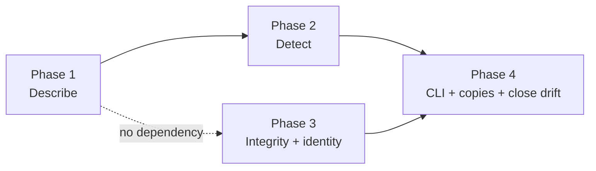

# Implementation Plan

## Validation Checklist

### CRITICAL GATES (Must Pass)

- [x] All `[NEEDS CLARIFICATION: ...]` markers have been addressed
- [x] All specification file paths are correct and exist
- [x] Each phase follows TDD: Prime → Test → Implement → Validate
- [x] Every task has verifiable success criteria
- [x] A developer could follow this plan independently

### QUALITY CHECKS (Should Pass)

- [x] Context priming section is complete
- [x] All implementation phases are defined with linked phase files
- [x] Dependencies between phases are clear (no circular dependencies)
- [x] Parallel work is properly tagged with `[parallel: true]`
- [x] Activity hints provided for specialist selection `[activity: type]`
- [x] Every phase references relevant SDD sections
- [x] Every test references PRD acceptance criteria
- [x] Integration & E2E tests defined in final phase
- [x] Project commands match actual project setup

---

## Specification Compliance Guidelines

### How to Ensure Specification Adherence

1. **Before Each Phase**: read the phase's Specification References gate.
2. **During Implementation**: reference the named SDD section in each task.
3. **After Each Task**: run the task's Success criteria against the PRD reference.
4. **Phase Completion**: run the phase validation task.

### Deviation Protocol

1. Document the deviation with clear rationale.
2. Obtain approval before proceeding.
3. Update the SDD when the deviation improves the design.
4. Record all deviations here for traceability.

**Deviations recorded so far**:

| Date | Task | Deviation | Rationale | Approved |
|---|---|---|---|---|
| 2026-09-10 | T1.1 | Pointers are real RFC 6901 and carry a `properties` segment (`/properties/suggestions/items`), not the SDD reference code's bare form (`/suggestions/items`). The SDD code block was amended to match. | The reference code was illustrative and three things outrank it. (1) T1.3, this phase's own validation gate, names `/properties/suggestions/items` literally — the bare form fails Phase 1's gate. (2) The SDD walkthrough table uses `/properties/findings/items/properties/detail`, a *mid-path* `properties` segment, which is a literal pointer and not shorthand. (3) **Measured**: the bare form silently erases nodes. A schema with a property named `items` alongside a sibling array `items` keyword collapses both onto `/items` and one overwrites the other — 3 expected nodes, 2 produced. That is the exact failure this spec exists to eliminate ("a walk that visited too little"). No published wire collides today; the exposure is any future field named `items`, `contains`, `allOf`, `anyOf`, `oneOf` or `definitions`. A regression test for the collision was added alongside the fix. | Owner, 2026-09-10 |
| 2026-09-10 | T1.1 | **ADR-2 extended**: the manifest also records enumerated values (`enum`, and `const` as a one-value enum), and resolves a local `$ref` to its target's type rather than recording `any`. | Both follow ADR-2's own line rather than crossing it — *record what the consumer's validator enforces, exclude what it ignores* — and their validator enforces both. **Enum was not a choice**: PRD F2-AC3 requires an added enum value to classify as consumer-affecting, but `classify` reads a `ShapeChange` and `diff_shapes` reads the manifest, so with no enum data recorded the criterion was structurally unreachable — satisfiable only by hand-building a `ShapeChange`, a test that goes green while the mechanism is blind. Same vacuous-pass failure this spec exists to eliminate, one layer down; 18 `enum` and 21 `const` declarations across the three wires were invisible. `$ref`: `id` and `applied` on ~15 instruction actions recorded `any` instead of `string`/`boolean`, hiding any type change to a shared `$defs` entry everywhere it is used. Local refs only, cycle-guarded, function stays pure. | Owner, 2026-09-10 |

## Metadata Reference

- `[parallel: true]` — tasks that can run concurrently
- `[ref: document/section]` — links to specifications
- `[activity: type]` — activity hint for specialist agent selection

---

## Context Priming

*GATE: Read all files in this section before starting any implementation.*

**Specification**:

- `docs/XDD/specs/035-wire-schema-versioning/requirements.md` — Product Requirements
- `docs/XDD/specs/035-wire-schema-versioning/solution.md` — Solution Design
- `docs/XDD/specs/036-delete-outlives-its-justification/solution.md` — ships in the same release
- `docs/instructions-json.md` — the instruction wire contract

**Key Design Decisions**:

- **ADR-1 Shape manifest** — one committed manifest per published wire; the diff printed when it is
  regenerated **is** the obligation table's raw material, so detection and handover cannot disagree.
- **ADR-2 Records names, types, `required`, openness — never prose.** Types are in because a type
  change is consumer-affecting; descriptions are out because that is where the churn is.
- **ADR-3 A stale manifest fails**; regeneration is always an explicit act.
- **ADR-4 Classification is read from the manifest**, not kept as a parallel rule table.
- **ADR-5 Renderers read `schema_version` from their own schema** — divergence made impossible
  rather than detected.
- **ADR-6 The producer copy takes a distinct `$id`**; the contract keeps the canonical one.
- **ADR-7 All three consumer copies are vendored — as a REPORT, never a gate.** A vendored copy is
  supposed to lag ours during a wait.

**The two mechanisms answer different questions.** Confusing them is the likeliest way to
misimplement this spec:

| Mechanism | Question it answers | Baseline |
|---|---|---|
| Shape manifest | *Did **we** change since last recorded?* | our own schema, as committed |
| Vendored consumer copy | *Does the **consumer** accept what we emit?* | their schema, as fetched |

The garden-audit drift is visible only to the second: our schema declares eight properties on
`findings[].detail`, theirs declares six. The manifest correctly bakes our current state as the
baseline and would report nothing — that is not a bug in the manifest, it is the wrong tool for that
question.

**Implementation Context**:

```bash
# No requirements.txt; the venv is provisioned ad hoc and this adds no dependency.
./venv/bin/python -m pytest                              # full suite
./venv/bin/python -m pytest tests/test_035_*.py -x       # this spec only
./venv/bin/python -m ruff check tomo/ tests/ scripts/
```

---

## Implementation Phases

Each phase is defined in a separate file. Tasks follow red-green-refactor: **Prime** (understand
context), **Test** (red), **Implement** (green), **Validate** (refactor + verify).

> **Tracking Principle**: Track logical units that produce verifiable outcomes. The TDD cycle is the
> method, not separate tracked items.

- [ ] [Phase 1: Describe — the manifest and its generator](phase-1.md)
- [ ] [Phase 2: Detect — diff, classify, and the gate](phase-2.md)
- [ ] [Phase 3: Version integrity and document identity](phase-3.md)
- [ ] [Phase 4: The CLI, the consumer copies, and closing the live drift](phase-4.md)

### Phase dependency graph



**Phase 3 is genuinely independent** of Phases 1 and 2 — the renderer change and the `$id` split
share no code with the manifest machinery. Verified by file overlap, not asserted: Phase 3 touches
the three renderers and the two instruction schemas; Phases 1–2 touch `wire_shape.py`, the manifests
and the test files. No file appears in both.

### The phase that cannot be completed alone

**Phase 4 ends in a cross-repo wait.** Closing the live garden-audit drift means handing
`up_source`/`up_value` to the consumer and waiting for them to vendor it. Per the standing rule, the
handoff is written and then **work stops on that thread** — the owner carries it to the other
session and returns with the result. No task here may assume the consumer has acted, and the spec
does not reach `Implemented` until they have.

---

## Acceptance-criteria coverage

Counted mechanically by extracting every `[ref: PRD/FN-ACn]` from the phase files and diffing
against the PRD's labelled criteria — not by eye. Re-run that extraction after any edit rather than
adjusting the number by hand.

| PRD Feature | ACs | Covered by |
|---|---|---|
| F1 Shape change fails the build | 5 | T1.1, T2.1, T2.3 |
| F2 Bump rule distinguishes affecting changes | 5 | T2.2, T2.3 |
| F3 Emitted version cannot diverge | 3 | T3.1 |
| F4 Handed over before it ships | 5 | T4.1, T4.3 |
| F5 Documents stop sharing an identity | 3 | T3.2 |
| F6 Known live drift closed | 3 | T4.3, T4.4 |
| F7 Report says what to do | 2 | T2.3 |
| F8 Consumer's copy compared | 2 | T4.2 |
| F9 Daily side gains a source identity | 5 | T4.2b, T4.3 |

**33 of 33 referenced — full coverage, no deferrals.** Corrected 2026-09-10 after validation: the
first count of 28/28 was arithmetically right and substantively wrong, because the PRD it was
counted against was itself missing a feature. F9 — the daily-side source identity, decided on
2026-09-09 and already promised to the consumer — was dropped when the PRD was drafted from the
research findings. A complete-looking traceability matrix over an incomplete requirement set is
exactly the failure this check exists to catch, and counting mechanically did not prevent it.

Two of the 28 are satisfied by the **consumer** rather than by Tomo — F6-AC2 (their copy declares the
fields) and F4-AC5 (the new version is emitted only after their confirmation). Both are owned by
T4.4, which is explicitly blocked on the owner returning with their reply. That is a boundary, not a
gap, and it is named here so it does not later read as one.

---

## Plan Verification

| Criterion | Status |
|-----------|--------|
| A developer can follow this plan without additional clarification | ✅ |
| Every task produces a verifiable deliverable | ✅ |
| All PRD acceptance criteria map to specific tasks | ✅ verified by extraction |
| All SDD components have implementation tasks | ✅ `describe_shape`, `diff_shapes`, `classify`, CLI |
| Dependencies are explicit with no circular references | ✅ |
| Parallel opportunities are marked with `[parallel: true]` | ✅ |
| Each task has specification references `[ref: ...]` | ✅ |
| Project commands in Context Priming are accurate | ✅ verified against `pyproject.toml` and the venv |
| All phase files exist and are linked from this manifest | ✅ |
