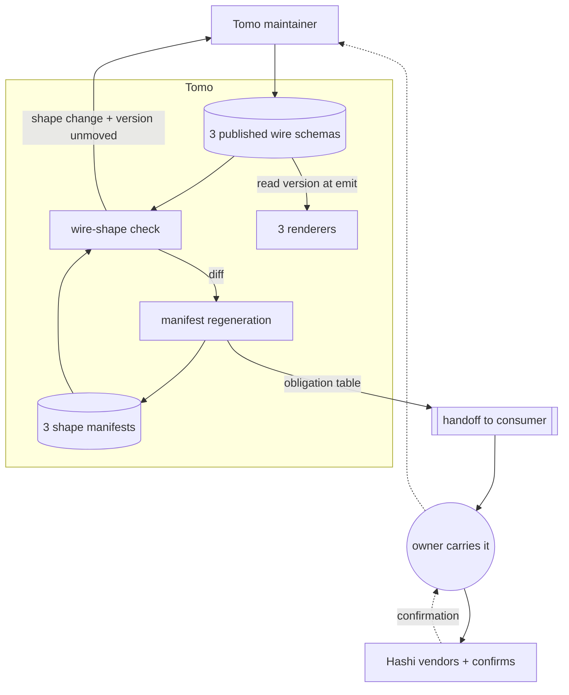
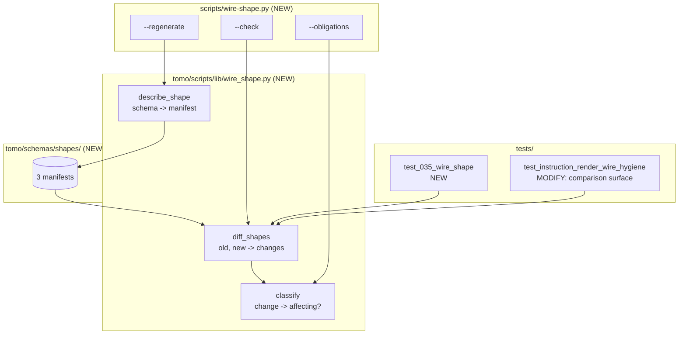

# Solution Design Document

## Validation Checklist

### CRITICAL GATES (Must Pass)

- [x] All required sections are complete
- [x] No [NEEDS CLARIFICATION] markers remain
- [x] Architecture pattern is clearly stated with rationale
- [x] **All architecture decisions confirmed by user** — ADR-1…ADR-7 all confirmed 2026-09-10
- [x] Every interface has specification

### QUALITY CHECKS (Should Pass)

- [x] All context sources are listed with relevance ratings
- [x] Project commands are discovered from actual project files
- [x] Constraints → Strategy → Design → Implementation path is logical
- [x] Every component in diagram has directory mapping
- [x] Error handling covers all error types
- [x] Quality requirements are specific and measurable
- [x] Component names consistent across diagrams
- [x] A developer could implement from this design
- [x] Implementation examples use actual field names, verified against the source
- [x] Complex logic includes traced walkthroughs with example data

---

## Constraints

- **CON-1** — Python 3.14, `ruff` clean, tests under `./venv/bin/python -m pytest`. No new runtime
  dependencies.
- **CON-2** — The detection must pass **without network access**. Comparing against the consumer's
  published copy is optional and skips, never fails.
- **CON-3** — Under the WAIT rule the consumer's copy is *deliberately behind* between handoff and
  confirmation. No gate may treat that window as an error.
- **CON-4** — Each published wire carries an independent `schema_version`. No global counter.
- **CON-5** — MiYo Constitution L1 (Testing): both the permitted and the refused case are tested.
  L1 (Privacy): all reporting is metadata — document names, JSON pointers, property names, counts.
- **CON-6** — Cross-repo work is a handoff and a wait. Nothing here automates a cross-repo action.
- **CON-7** — Near-MVP: additive, and the existing wire-hygiene and parity tests must stay green.
- **CON-8** — Schemas ship to the instance (`scripts/install-tomo.sh:1262-1264`), so a runtime
  script may read one; `garden-audit-configure.py:49` is the existing precedent.

## Implementation Context

### Required Context Sources

#### Documentation Context
```yaml
- doc: docs/XDD/specs/035-wire-schema-versioning/requirements.md
  relevance: CRITICAL
  why: "The PRD this design implements — 8 features, 28 criteria"

- doc: docs/XDD/specs/036-delete-outlives-its-justification/solution.md
  relevance: HIGH
  why: "Ships in the same release; its delete_source.depends_on is one of the two changes
        this mechanism must carry on its first outing"

- doc: docs/instructions-json.md
  relevance: MEDIUM
  why: "The instruction wire contract as documented for the consumer"
```

#### Code Context
```yaml
- file: tests/test_instruction_render_wire_hygiene.py
  relevance: CRITICAL
  why: "Holds the existing snapshot pattern and the drift check whose comparison surface is
        structurally incapable — the thing being replaced"

- file: tomo/schemas/suggestions-wire.schema.json
  relevance: CRITICAL
  why: "The drifted document. Zero $defs — every object inline; the reason the existing
        check passes vacuously"

- file: tomo/schemas/garden-audit-wire.schema.json
  relevance: CRITICAL
  why: "Currently drifted. findings[].detail is the one open node, which is the only reason
        the drift is benign"

- file: tomo/schemas/hashi-instructions.schema.json
  relevance: HIGH
  why: "The Hashi-facing contract AND the vendored snapshot — one file playing both roles.
        Shares its $id with the producer copy, which is the collision F5 fixes"

- file: tomo/scripts/suggestions-render.py
  relevance: HIGH
  why: "Emits schema_version as a free literal at :402; same shape at instruction-render.py:778
        and garden-audit-render.py:1283"

- file: tomo/scripts/garden-audit-configure.py
  relevance: MEDIUM
  why: "SCRIPTS_DIR.parent / 'schemas' — the precedent for a runtime script reading a schema"
```

### Implementation Boundaries

- **Must Preserve** — every existing test in `test_instruction_render_wire_hygiene.py` and
  `test_tomo_schema_parity.py`; the vendored-snapshot pattern for the instructions wire; the
  network test's skip-offline behaviour.
- **Can Modify** — the drift check's comparison surface; the three renderers' `schema_version`
  emission; both instruction schemas' `$id`.
- **Must Not Touch** — Hashi's repository. The fourteen internal schemas (18 total, minus the three published wires and minus `hashi-instructions.schema.json`, which is the vendored consumer mirror rather than an internal schema). The handoff protocol
  document in `~/Kouzou`.

### External Interfaces

#### System Context Diagram



#### Interface Specifications

```yaml
outbound:
  - name: "Wire change handoff"
    type: Markdown file in _outbox/for-hashi/
    format: schema file attachment + obligation table
    data_flow: "What moved, what it means, which consumer areas change, breaking-when"
    criticality: HIGH
    transport: "The owner. Not automated — CON-6."

data:
  - name: "Shape manifests"
    type: JSON files committed in the repo
    connection: filesystem
    data_flow: "The recorded shape of each published wire; the baseline a change is detected against"

  - name: "Consumer's published schema"
    type: HTTPS, raw.githubusercontent.com
    connection: urllib, existing pattern
    data_flow: "Optional freshness comparison; skips offline — CON-2"
```

### Cross-Component Boundaries

- **API Contracts** — the three published wires. Breaking one requires a version move and a handoff.
- **Team Ownership** — Tomo owns emission, the manifests and the classification. The consumer owns
  their vendored copies and their own validation.
- **Breaking Change Policy** — a consumer-affecting change is not emitted until the consumer
  confirms. Enforced socially by the WAIT rule, not by a mechanism.

### Project Commands

```bash
# There is no requirements.txt; the venv is provisioned ad hoc and this adds no dependency.
./venv/bin/python -m pytest                                 # full suite
./venv/bin/python -m pytest tests/test_035_*.py -x          # this spec only
./venv/bin/python -m ruff check tomo/ tests/ scripts/
```

## Solution Strategy

- **Architecture Pattern** — *Recorded shape with a deliberate regeneration step.* Each published
  wire has a committed **shape manifest**: every object node in the schema, addressed by JSON
  pointer, with its property set, its `required` list, and whether it accepts unknown properties.
  A test compares each live schema to its manifest. A difference fails, naming document, pointer and
  property. Regenerating the manifest is an explicit command — that act is what makes a shape change
  deliberate, and the diff it prints is the raw material for the consumer's obligation table.

- **Integration Approach** — additive. One new module, one new command, three new manifest files,
  one rewritten comparison inside the existing wire-hygiene test file. The renderers change from
  writing a version literal to reading it from their own schema.

- **Justification** — the baseline has to *name* what changed, because the PRD requires the report to
  identify the document, the location and the property. That rules out a hash. It has to work on a
  schema with no reusable definition blocks, because the document that actually drifted has none —
  which is precisely why the existing check passes vacuously on it. And it has to work offline,
  because the consumer's copy is deliberately stale during the wait. A committed structural manifest
  satisfies all three, and yields the changed-fields material for free: **F1's detection and F4's
  obligation table are one mechanism observed at two moments**, not two mechanisms to keep in step.

- **Key Decisions** — ADR-1 through ADR-7 below.

### The classification is data, not a rule table

Whether a change obliges the consumer is decided by whether the changed node accepts unknown
properties — measured against the consumer's own validator across eight change classes. The manifest
already records that per node, so classification is **read from the manifest**, not maintained as a
parallel list of rules that could drift from the schemas it describes.

## Building Block View

### Components



### Directory Map

**Component**: tomo

```
.
├── tomo/
│   ├── scripts/
│   │   ├── lib/
│   │   │   └── wire_shape.py              # NEW: describe / diff / classify (pure)
│   │   ├── suggestions-render.py          # MODIFY: read schema_version from schema
│   │   ├── instruction-render.py          # MODIFY: same
│   │   └── garden-audit-render.py         # MODIFY: same
│   └── schemas/
│       ├── shapes/                        # NEW: the committed baselines
│       │   ├── suggestions-wire.shape.json
│       │   ├── instructions.shape.json
│       │   └── garden-audit-wire.shape.json
│       ├── instructions.schema.json           # MODIFY: distinct $id (producer copy)
│       ├── hashi-instructions.schema.json     # MODIFY: distinct $id (the contract)
│       ├── hashi-suggestions-wire.schema.json # NEW: consumer's copy, fetched (ADR-7)
│       ├── hashi-garden-audit-wire.schema.json# NEW: consumer's copy, fetched (ADR-7)
│       └── garden-audit-wire.schema.json      # MODIFY: version move (F6)
├── scripts/
│   └── wire-shape.py                      # NEW: user-invoked CLI (check/regenerate/obligations)
├── tests/
│   ├── test_035_wire_shape.py             # NEW
│   └── test_instruction_render_wire_hygiene.py  # MODIFY: replace the $defs scan
└── docs/tomo/scripts/lib/wire_shape.md    # NEW: WHY layer
```

`scripts/` rather than `tomo/scripts/` for the CLI: the boundary in this repo is by invocation, and
this one is invoked by a person, not by a runtime agent.

### Interface Specifications

#### Data Storage Changes

No database. Three new committed JSON files, plus edits to three existing schemas.

```yaml
File: tomo/schemas/shapes/<wire>.shape.json   (NEW, one per published wire)
  schema_version: string          # the version this shape was recorded at
  source: string                  # the schema file this describes
  nodes: object                   # JSON pointer -> node shape
    "<pointer>":
      closed: bool                # rejects unknown properties?
      required: [string]          # sorted
      properties: {name: type}    # sorted by name; type keyword only, never prose
    ...

File: tomo/schemas/instructions.schema.json        MODIFY $id (producer copy)
File: tomo/schemas/hashi-instructions.schema.json  MODIFY $id (the contract)
File: tomo/schemas/garden-audit-wire.schema.json   MODIFY schema_version "1" -> "2"  (F6)
```

Names, types, `required` and openness. **Descriptions are deliberately excluded** — the consumer's
validator ignores prose, so recording it would fail the check on edits that oblige nobody, which is
the precise noise that makes a detector unread. Types are **in** because the eight-class matrix
measured a type change as consumer-affecting: emitting `null` where `string` is declared errors in
their validator, so excluding types would leave a real breaking change invisible. The line is drawn
where the churn is, not where the recording is cheapest.

#### Application Data Models

```pseudocode
ENTITY: NodeShape (NEW)
  closed: bool
  required: list[str]
  properties: dict[str, str]      # name -> type keyword

ENTITY: ShapeManifest (NEW)
  schema_version: str
  source: str
  nodes: dict[pointer, NodeShape]

ENTITY: ShapeChange (NEW)
  pointer: str
  kind: added_property | removed_property | type_changed | required_changed | openness_changed | node_added | node_removed
  detail: str
  consumer_affecting: bool

FUNCTION: describe_shape(schema) -> ShapeManifest        # pure
FUNCTION: diff_shapes(old, new) -> list[ShapeChange]     # pure
FUNCTION: classify(change, new_manifest) -> bool         # pure
```

#### Integration Points

```yaml
- from: tomo
  to: hashi
    - protocol: handoff file, carried by the owner
    - data_flow: "schema file + obligation table"
    - trigger: "a consumer-affecting change"
    - constraint: "emission of the new version waits for confirmation (CON-3, CON-6)"
```

### Implementation Examples

#### Example: What the manifest records, and why only this

**Why this example**: the manifest's contents are the whole design. Recording too much makes it
churn on changes that oblige nobody; too little and it cannot name what moved.

```python
def describe_shape(schema: dict) -> dict:
    """Every object node in a schema, by JSON pointer, with the three facts that
    decide whether a consumer breaks.

    `closed` is the discriminator for an ADDED property: measured against the
    consumer's own validator across eight change classes, it is what separates
    "add a field and break them" from "add a field and do not".

    Descriptions are deliberately absent — the consumer's validator ignores
    prose, and recording it would fail the check on edits that oblige nobody,
    which is how a detector becomes one nobody reads. Types ARE recorded: a type
    change is consumer-affecting in its own right, independent of openness.
    """
    nodes: dict[str, dict] = {}

    def walk(node: dict, pointer: str) -> None:
        if not isinstance(node, dict):
            return
        props = node.get("properties")
        if isinstance(props, dict):
            nodes[pointer] = {
                # A JSON-Schema node with no additionalProperties defaults to
                # permissive. Recording the effective value, not the literal one,
                # keeps the classification honest for a node that never declared it.
                "closed": node.get("additionalProperties") is False,
                "required": sorted(node.get("required") or []),
                # name -> type keyword. A type change is consumer-affecting
                # (emitting null where string is declared errors in their
                # validator), so the type is recorded; the description is not.
                "properties": {
                    name: (child or {}).get("type", "any")
                    for name, child in sorted(props.items())
                },
            }
            for name, child in props.items():
                walk(child, f"{pointer}/{name}")
        for key in ("items", "contains"):
            if key in node:
                walk(node[key], f"{pointer}/{key}")
        for key in ("$defs", "definitions"):
            for name, child in (node.get(key) or {}).items():
                walk(child, f"{pointer}/{key}/{name}")
        for key in ("allOf", "anyOf", "oneOf"):
            for i, child in enumerate(node.get(key) or []):
                walk(child, f"{pointer}/{key}/{i}")

    walk(schema, "")
    return nodes
```

**Traced walkthrough — the drift that started this spec.** Had the manifest existed when spec 034
added `item_key`:

| Stage | `/properties/suggestions/items` | Outcome |
|---|---|---|
| Manifest as committed | `closed: true`, `required: [id, stem, title, …]` | baseline |
| Schema after the edit | `closed: true`, `required: [id, stem, **item_key**, title, …]` | |
| `diff_shapes` | `added_property /properties/suggestions/items item_key`; `required_changed` | 2 changes |
| `classify` | node `closed: true` → **consumer-affecting** | |
| Version check | manifest `"1"`, schema `"1"` — unmoved | **FAIL** |

The existing check, on the same input, visits this pointer zero times.

**And the case that must *not* fail — the live garden-audit drift.** This walkthrough is
**counterfactual**: it shows what the classifier would decide *if* the manifest predated the
addition. In reality our schema already declares both fields, so the committed manifest records them
and `diff_shapes` yields nothing. The classification is what matters here, and reproducing it in a
test requires a scratch manifest built from the pre-032 schema:

| Stage | `/properties/findings/items/properties/detail` | Outcome |
|---|---|---|
| Schema after specs 032/033 | `closed: **false**`, gains `up_source`, `up_value` | |
| `diff_shapes` | 2 `added_property` changes | 2 changes |
| `classify` | node `closed: false` → **not consumer-affecting** | |
| Version check | not required to move | **manifest regeneration only** |

Two live drifts, opposite correct answers, one rule. That is why the classification is
`closed`-based rather than "any shape change".

#### Example: Reading the version instead of asserting it

**Why this example**: F3 could be a test that detects divergence. Making it structural is better —
the failure stops being possible rather than being caught.

```python
# tomo/scripts/suggestions-render.py — today
"schema_version": "1",          # free literal; nothing ties it to the schema

# after: one source of truth
"schema_version": wire_schema_version("suggestions-wire.schema.json"),
```

`wire_schema_version` reads the `const` the schema itself declares. Schemas ship to the instance
(`scripts/install-tomo.sh:1262-1264`) and `garden-audit-configure.py:49` already resolves them at
runtime, so the file is reachable. A missing schema raises with an explicit message, matching
`doc_frontmatter.py:80`'s existing treatment of the same failure.

## Runtime View

### Primary Flow

1. Maintainer edits a published wire schema as part of some other work.
2. They run the suite.
3. The wire-shape check compares each schema to its manifest.
4. A difference is classified against the changed node's `closed` value.
5. Consumer-affecting **and** version unmoved → **fail**, naming pointer, property and next step.
6. Maintainer moves the version, regenerates the manifest, and takes the printed obligation table
   into a handoff.
7. Emission of the new version waits for the consumer's confirmation.

```mermaid
sequenceDiagram
    actor Dev
    participant Check as wire-shape check
    participant M as manifest
    participant CLI as wire-shape --regenerate
    participant Out as _outbox

    Dev->>Check: pytest
    Check->>M: read baseline
    Check-->>Dev: FAIL — pointer, property, affecting?, next step
    Dev->>Dev: move schema_version
    Dev->>CLI: regenerate
    CLI->>M: rewrite baseline
    CLI-->>Dev: obligation table (the diff)
    Dev->>Out: handoff + schema file
    Note over Out: owner carries it; emission waits
```

### Error Handling

- **Shape change, consumer-affecting, version unmoved** → fail; name the pointer, the property,
  and that both a version move and a handoff are expected.
- **Shape change, not consumer-affecting** → fail, but say only that the manifest needs
  regenerating. No version move demanded. *(F7 — the report says what to do.)*
- **Manifest missing for a published wire** → fail. A wire added without a manifest is exactly the
  gap this spec closes; silence would reproduce it.
- **Schema unreadable / invalid JSON** → fail loudly; do not treat as "no change".
- **Consumer's published copy unreachable** → **skip**, never fail (CON-2), and the local checks
  still run.
- **Renderer cannot find its schema at runtime** → raise with the path, matching the existing
  treatment of a missing schema file.

### Complex Logic

```
ALGORITHM: Gate a wire shape change
INPUT:  published wire schemas, committed manifests
OUTPUT: pass, or a failure naming what to do

1. FOR each published wire:
2.   observed  = describe_shape(schema)
3.   recorded  = manifest.nodes
4.   changes   = diff_shapes(recorded, observed)
5.   IF no changes: continue
6.   affecting = any(classify(c, observed) for c in changes)
7.   IF affecting AND schema.schema_version == manifest.schema_version:
8.       FAIL "consumer-affecting; move the version and hand over"
9.   ELSE:
10.      FAIL "shape changed; regenerate the manifest" (+ affecting/not per change)
11. Separately: assert each renderer's emitted version equals its schema's const
    — vacuous once ADR-5 lands, kept as a regression guard.
```

## Deployment View

### Single Application Deployment

- **Environment** — developer machine and CI; the check is a test. The renderer change also runs in
  the Tomo container.
- **Configuration** — none. No feature flag: a detection mechanism behind a flag is off.
- **Dependencies** — none added.
- **Performance** — three schema walks per suite run, tens of nodes each. Immeasurable.

### Multi-Component Coordination

- **Deployment Order** — the mechanism ships independently; it observes rather than emits. The two
  wire changes it will carry (035's `source_item_key`, 036's `depends_on`) each need the consumer to
  vendor first.
- **Version Dependencies** — garden-audit `"1" → "2"` (F6), suggestions `"1" → "2"`, instructions
  `"2" → "3"`. Three independent counters.
- **Rollback Strategy** — reverting removes the check and the manifests; no emitted artifact changes,
  so nothing downstream breaks.
- **Data Migration** — none. Manifests are generated from the schemas that already exist.

## Cross-Cutting Concepts

### Pattern Documentation

```yaml
- pattern: docs/tomo/scripts/lib/wire_shape.md (NEW)
  relevance: CRITICAL
  why: "Why the manifest records exactly three facts per node, why prose is excluded, and why
        the classification is closed-based — the measured basis is not obvious from the code"
```

### System-Wide Patterns

- **Security / Privacy** — reports carry document names, JSON pointers, property names and counts.
  Never vault content, never schema prose. (Constitution L1.)
- **Error Handling** — fail closed. An unreadable schema or a missing manifest fails rather than
  passing as "no change".
- **Performance** — three linear walks per run.
- **Logging / Auditing** — the check reports to stderr like every other guard; the obligation table
  is written into the handoff, not logged.

### Responsibility Matrix (MECE check)

| PRD | Requirement | Owning component | Enforced by |
|---|---|---|---|
| F1 | Shape change fails the build | `diff_shapes` | `test_035_wire_shape` |
| F2 | Bump rule distinguishes affecting changes | `classify` | same |
| F3 | Emitted version cannot diverge | the three renderers reading their schema (ADR-5) | regression assertion |
| F4 | Handed over before it ships | `wire-shape --obligations` + the WAIT rule | manual; not automatable (CON-6) |
| F5 | Two documents stop sharing an identity | the two instruction schemas' `$id` | existing parity test stays green |
| F6 | Known live drift closed | `garden-audit-wire.schema.json` version move + handoff | detection reports clean |
| F7 | Report says what to do | the check's failure message | assertion on message content |
| F8 | Consumer's copy compared automatically | three vendored copies + the network test (ADR-7) | skip-not-fail; **reports**, never gates |
| F9 | Daily side gains a source identity | `suggestions-wire.schema.json` + the parser's retired recovery | the gate itself — this change is the mechanism's first real customer |

**Exclusivity holds** — no two components own the same requirement; `diff_shapes` detects and
`classify` judges, which are distinct responsibilities over the same data.
**Exhaustiveness holds** — all nine PRD features have an owner. F9 was added on 2026-09-10 after
validation found it missing from the PRD entirely; the matrix is the artifact that would have caught
it had it been run against a complete requirement set.

## Architecture Decisions

- [x] **ADR-1 A committed shape manifest per published wire is the baseline** — every object node by
      JSON pointer, with property set, `required`, and whether it accepts unknown properties.
  - Rationale: the report must name document, pointer and property, which rules out a hash; it must
    work on a schema with no reusable definition blocks, which is exactly the document that drifted;
    and it must work offline, because the consumer's copy is deliberately stale during the wait. The
    regeneration diff is also the obligation table's raw material, so detection and handover are one
    mechanism rather than two that can disagree.
  - Trade-offs: three files to keep current; regeneration is a step someone must take.
  - User confirmed: **Yes, 2026-09-10**

- [x] **ADR-2 The manifest records property names, `required`, openness **and type** — never prose**
  - Rationale: the eight-class matrix measured a type change as consumer-affecting — emitting `null`
    where `string` is declared errors in the consumer's validator — so excluding types would leave a
    real breaking change invisible to the detector. Prose stays out: the consumer's validator ignores
    descriptions, and including them would fail the check on edits that oblige nobody, which is the
    noise pattern that makes a detector unread. Types change rarely; descriptions change constantly.
    The exclusion line is drawn where the churn is, not where the recording is cheapest.
  - Trade-offs: a description edit that changes a field's *meaning* without changing its shape stays
    invisible. That is what the obligation table carries, and why the table is prose rather than a
    generated diff.
  - User confirmed: **Yes, 2026-09-10**

- [x] **ADR-3 A stale manifest fails; regeneration is always explicit**
  - Rationale: auto-regenerating would satisfy the check while defeating it, exactly as automated
    version bumping would. The deliberate act is the point.
  - Trade-offs: a maintainer who regenerates reflexively without reading the diff gets no benefit.
    Mitigated by printing the obligation table at regeneration rather than only the file write.
  - User confirmed: **Yes, 2026-09-10** (mechanical consequence)

- [x] **ADR-4 Classification is read from the manifest, not maintained as a rule table**
  - Rationale: `closed` is recorded per node already. A separate table of rules would be a second
    description of the same fact and could drift from the schemas it describes.
  - Trade-offs: the eight-class matrix that justified the rule lives in the PRD and the WHY doc
    rather than in code, so the code reads as a one-line check whose basis is elsewhere.
  - User confirmed: **Yes, 2026-09-10** (mechanical consequence)

- [x] **ADR-5 Renderers read `schema_version` from their schema rather than declaring it**
  - Rationale: makes F3's failure impossible instead of detected. Schemas ship to the instance and a
    runtime script already reads one, so the file is reachable.
  - Trade-offs: adds a runtime file read to three emitters, and a new failure mode if the instance
    is unsynced — which already has an established treatment. The F3 assertion stays as a regression
    guard even though it becomes vacuous.
  - User confirmed: **Yes, 2026-09-10**

- [x] **ADR-6 The producer copy takes a distinct `$id`; the contract keeps the canonical one**
  - Rationale: the contract is the document the consumer vendors, so it should keep the canonical
    identity. The producer copy is Tomo-internal and is the one that should be marked as such.
  - Trade-offs: anything resolving the old `$id` to the producer copy would break — nothing does,
    verified.
  - User confirmed: **Yes, 2026-09-10** (mechanical consequence)

- [x] **ADR-7 All three consumer copies are vendored — as a REPORT, never as a gate**
  - Rationale: owner decision, against the drafted recommendation to leave two wires uncovered.
    Symmetry is worth having, and the copies are obtainable by fetch rather than by handoff — the
    existing network test already pulls one from the consumer's public repository, so the other two
    cost nothing to acquire.
  - **The consequence that shapes the design.** A vendored copy is *supposed* to lag ours during a
    wait: we have the new field, they do not yet. The instructions wire handles that today with
    `SNAPSHOT_AHEAD_OF_UPSTREAM`, which the 036 validation established is **keyed by action name** —
    unusable for two schemas that contain no actions at all. Rather than rebuild that registry
    pointer-by-pointer, the vendored copies change role: they answer *"what does the consumer accept
    right now"*, and the delta against what we emit is **reported, not failed**. The gate stays the
    manifest, which describes our own schema and needs no exemption for a wait window.
  - Trade-offs: three copies to refresh rather than one, and the refresh is only as current as the
    last run of the network test. Accepted — a stale report is still a report, whereas a stale gate
    is a false failure. `SNAPSHOT_AHEAD_OF_UPSTREAM` is left in place for the instructions wire's
    existing parity test and is not extended.
  - User confirmed: **Yes, 2026-09-10**

## Quality Requirements

- **Performance** — three schema walks per suite run; tens of nodes each. No network on the
  mandatory path.
- **Usability** — a failure names the document, the JSON pointer, the property, whether it obliges
  the consumer, and the expected next action. A maintainer should not have to work out what the
  failure means before acting on it.
- **Security / Privacy** — metadata only: document names, pointers, property names, counts.
- **Reliability** — zero shape changes reaching a published wire without either a failing test or a
  regenerated manifest. After F6, the detection reports **nothing** across all three documents; a
  non-empty report on a clean tree is itself the defect.

## Acceptance Criteria

**Main Flow Criteria: [PRD/F1 — detection]**
- [ ] WHEN a property is added to any object node at any depth in a published wire, THE SYSTEM SHALL
      fail naming the document, the JSON pointer and the property.
- [ ] WHERE a wire document contains no reusable definition blocks, THE SYSTEM SHALL still detect its
      shape changes.
- [ ] WHEN only a description or title changes, THE SYSTEM SHALL pass.
- [ ] WHEN a property's declared type changes, THE SYSTEM SHALL fail — independently of whether the
      containing node accepts unknown properties, since a type change is consumer-affecting on its
      own.

**Main Flow Criteria: [PRD/F2 — classification]**
- [ ] IF a property is added to a node that rejects unknown properties, THEN THE SYSTEM SHALL treat
      the change as consumer-affecting.
- [ ] IF a property is added to a node that permits them, THEN THE SYSTEM SHALL NOT.
- [ ] IF a consumer-affecting change is present and the version has not moved, THEN THE SYSTEM SHALL
      fail; and WHEN the version has moved, THE SYSTEM SHALL pass.

**Main Flow Criteria: [PRD/F3 — version integrity]**
- [ ] THE SYSTEM SHALL emit, in every produced document, the version its own schema declares.

**Error Handling Criteria**
- [ ] IF a published wire has no manifest, THEN THE SYSTEM SHALL fail rather than pass silently.
- [ ] IF the consumer's published copy is unreachable, THEN THE SYSTEM SHALL skip that comparison and
      still run every local check.
- [ ] IF a schema cannot be parsed, THEN THE SYSTEM SHALL fail rather than report no change.

**Edge Case Criteria**
- [ ] WHILE a node declares no openness at all, THE SYSTEM SHALL record it as permissive, matching
      how a validator treats it.
- [ ] WHEN two published wires change in one edit, THE SYSTEM SHALL report both independently and
      require each version to move on its own counter.
- [ ] WHEN the detection runs after this spec completes, THE SYSTEM SHALL report nothing.

## Risks and Technical Debt

### Known Technical Issues

- The garden-audit wire is drifted against the consumer's copy in `main` today. **The manifest will
  NOT report it** — our schema already declares `up_source` and `up_value`, so the manifest records
  them as the baseline, which is correct for the question a manifest answers. The drift is visible
  only to the **vendored-copy report**, which does not exist until T4.2. F6 closes it, but only after
  a handoff and a wait, so there is a window where that report is knowingly non-empty. The window
  must be recorded, or the first reader learns to ignore it.
- The existing drift check passes vacuously on a `$defs`-free schema and compares no root fields even
  where it does apply. It is replaced, not extended.

### Technical Debt

- `SNAPSHOT_AHEAD_OF_UPSTREAM` is keyed by action name, so it can only silence a whole action. It is
  **not extended** by this spec: ADR-7 makes the vendored copies a report rather than a gate, so no
  wait-window exemption is needed for the two new copies. It stays in place for the instructions
  wire's existing parity test. Noted because 036's `depends_on` is the second case that would have
  wanted property-level granularity — if that test ever becomes a gate again, this is the blocker.
- The vendored copies are only as current as the last successful network run. A stale report is
  still a report; this is the accepted cost of ADR-7's report-not-gate framing.

### Implementation Gotchas

- **A node with no `additionalProperties` is permissive**, not closed. Recording the literal value
  rather than the effective one would misclassify every node that never declared it.
- **`$defs`, `items`, and the `allOf`/`anyOf`/`oneOf` branches all need walking.** The bug being
  fixed is precisely a walk that visited too little.
- **The two instruction schemas are not identical** — the contract carries a `replace_section`
  definition the producer copy lacks. Their manifests will differ legitimately; only the producer
  copy's own drift is gated.
- **Regenerating the manifest must print the diff**, not merely rewrite the file. The printed diff is
  the obligation table's source; a silent rewrite makes the deliberate act indistinguishable from a
  reflexive one.

## Glossary

### Domain Terms

| Term | Definition | Context |
|------|------------|---------|
| Published wire | A schema another repository vendors and validates against | There are exactly three |
| Consumer-affecting | A change that makes the consumer's validator reject a document it previously accepted | Decided by node openness |
| Shape manifest | The committed record of a schema's structure | The baseline a change is detected against |
| Obligation table | What the consumer must do about a change | The handoff artifact; not a diff |
| Closed node | An object that rejects unknown properties | The classification discriminator |

### Technical Terms

| Term | Definition | Context |
|------|------------|---------|
| JSON pointer | Path addressing a node inside a document | How the manifest and the report name a location |
| Vacuous pass | A check that passes because it compared nothing | The existing drift test on a `$defs`-free schema |
| Vendored copy | The consumer's own copy of a schema, kept in their repo | What they validate against |
