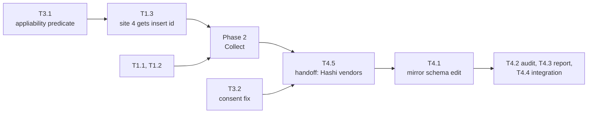

# Implementation Plan

## Validation Checklist

### CRITICAL GATES (Must Pass)

- [x] All `[NEEDS CLARIFICATION: ...]` markers have been addressed
- [x] All specification file paths are correct and exist
- [x] Each phase follows TDD: Prime → Test → Implement → Validate
- [x] Every task has verifiable success criteria
- [x] A developer could follow this plan independently

### QUALITY CHECKS (Should Pass)

- [x] Context priming section is complete
- [x] All implementation phases are defined with linked phase files
- [x] Dependencies between phases are clear (no circular dependencies)
- [x] Parallel work is properly tagged with `[parallel: true]`
- [x] Activity hints provided for specialist selection `[activity: type]`
- [x] Every phase references relevant SDD sections
- [x] Every test references PRD acceptance criteria
- [x] Integration & E2E tests defined in final phase
- [x] Project commands match actual project setup

---

## Specification Compliance Guidelines

### How to Ensure Specification Adherence

1. **Before Each Phase**: read the phase's Specification References gate.
2. **During Implementation**: reference the named SDD section in each task.
3. **After Each Task**: run the task's Success criteria against the PRD reference.
4. **Phase Completion**: run the phase validation task.

### Deviation Protocol

When implementation requires changes from the specification:
1. Document the deviation with clear rationale.
2. Obtain approval before proceeding.
3. Update the SDD when the deviation improves the design.
4. Record all deviations in this file for traceability.

**Deviations recorded so far**: none.

**Cross-spec dependency**: T4.5 (release handoff) wants spec 035's `source_item_key` widening
committed so one changed-fields list can cover both wire documents. 035 sits at `Initialization` as
of 2026-09-10. If it has not landed when Phase 4 completes, send the instruction-wire half alone and
say so — a data-loss fix does not wait behind a versioning spec.

**Terminology, fixed by validation**: "drop site" means one of the five action-removing passes;
"guard" is reserved for the reducer's group annotations. The three data-loss paths are **P1, P2, P3**
throughout; "Bug A" and "Bug B" appear only as parenthetical aliases where the research history
matters.

## Metadata Reference

- `[parallel: true]` — tasks that can run concurrently
- `[ref: document/section]` — links to specifications
- `[activity: type]` — activity hint for specialist agent selection

---

## Context Priming

*GATE: Read all files in this section before starting any implementation.*

**Specification**:

- `docs/XDD/specs/036-delete-outlives-its-justification/requirements.md` — Product Requirements
- `docs/XDD/specs/036-delete-outlives-its-justification/solution.md` — Solution Design
- `docs/XDD/specs/035-wire-schema-versioning/README.md` — owns the release this ships in
- `docs/tomo/scripts/lib/render_actions.md` — WHY layer for the module being changed
- `docs/instructions-json.md` — the instruction wire contract

**Key Design Decisions**:

- **ADR-1 Declare-then-collect** — every conditional delete declares its partner action ids at build
  time; one post-pass drops any delete whose declaration no longer resolves. The guard's input and
  the wire field are one relation.
- **ADR-2 Placement** — that pass runs **once, after all five drop sites**, before path validation.
  The five are split across two modules; anywhere earlier is a latent instance of the bug.
- **ADR-3 `create_moc` becomes a claimant** in `validate_destinations`; both claimants drop.
- **ADR-4 Retire the delete half** of the path-keyed withdrawal; keep the `link_to_moc` half.
- **ADR-5 One shared appliability predicate** for tag-handler groups — ADR-1's pass **cannot** reach
  Bug B, because the insert is never built and so has no id to name.
- **ADR-6 A dangling id aborts the run** with exit 2 rather than degrading.

**Implementation Context**:

```bash
# Testing — there is no requirements.txt; the venv is provisioned ad hoc
./venv/bin/python -m pytest                              # full suite
./venv/bin/python -m pytest tests/test_036_*.py -x       # this spec only
./venv/bin/python -m pytest -m integration               # opt-in, test vault

# Quality
./venv/bin/python -m ruff check tomo/ tests/
```

---

## Implementation Phases

Each phase is defined in a separate file. Tasks follow red-green-refactor: **Prime** (understand
context), **Test** (red), **Implement** (green), **Validate** (refactor + verify).

> **Tracking Principle**: Track logical units that produce verifiable outcomes. The TDD cycle is the
> method, not separate tracked items.

- [ ] [Phase 1: Declare — depends_on at every emission site](phase-1.md)
- [ ] [Phase 2: Collect — the withdrawal pass](phase-2.md)
- [ ] [Phase 3: The cases the pass cannot reach](phase-3.md)
- [ ] [Phase 4: Contract, audit, reporting and integration](phase-4.md)

### Phase dependency graph



**Note the intra-phase ordering**: T4.5 runs **first** in Phase 4 despite its number. The upstream
drift test fetches Hashi's live schema and compares per-action property names, and its exemption
hatch is keyed by action name rather than property — so editing our mirror before they vendor would
fail the test with no way to exempt `delete_source` alone. Under the release rule (they vendor first
or simultaneously) the window that would need exempting is zero-length, so sequencing costs nothing
and avoids adding a permanent silencing mechanism.

**Corrected 2026-09-10.** The first version called Phase 3 independent of Phases 1 and 2. It is not:
**T3.1 must precede T1.3.** Both modify `_build_insert_under_marker_actions` and site 4 of
`_build_delete_source_actions`, so concurrent dispatch collides — and the semantic trap is worse
than the collision. T1.3 alone would give the unresolvable-group delete `depends_on: []`, which the
SDD defines as *"nothing conditions this delete; perform it"*. Phase 4's audit would then certify a
**data-loss delete as valid**. Running T3.1 first makes an empty list on that path unreachable.

**T3.2 (the consent fix) is genuinely independent** — it touches only `suggestions-reducer.py` — and
is the plan's one real parallel opportunity. Phase 4 requires everything.

### Ordering constraint that is not a phase boundary

The guards must be **released** with the wire field, never before it — a guard that drops a partner
without amending the deletes naming it produces a dangling id, and the executor's failure list
cannot catch one. Under ADR-1 that cannot happen, because the withdrawal *is* the amendment. The
constraint therefore binds the release, not the phase order.

---

## Acceptance-criteria coverage

Corrected 2026-09-10 after independent validation. The first version of this table claimed 23 of 25
and was wrong — it counted three criteria as covered that had no task at all, while carefully
documenting the two it had deliberately deferred. The gap that was written down was the cosmetic
one; the gaps that were silent were load-bearing.

| PRD Feature | ACs | Covered by | Notes |
|---|---|---|---|
| F1 Contested destination | 5 | T2.2, T2.3 | |
| F2 Withheld daily action | 4 | T1.2, T2.1, **T4.3** | AC4 (report together) added to T4.3 |
| F3 Tag-handler emits no delete | 3 | T3.1 | |
| F4 Not pre-approved | 3 | T3.2 | |
| F5 Every delete names its justification | 6 | T1.1, T1.2, T1.3, T4.1, T4.2, **T4.5** | AC5/AC6 are consumer-owned |
| F6 Document explains a withdrawal | 2 | T4.3 | |
| F7 Destructive reads as destructive | 2 | — | deferred by decision; `Could Have`, not designed |

**23 of 25 criteria carry a plan reference. All 25 are accounted for:**

- **23 referenced** — F1 through F6 complete, every criterion named by at least one task.
  - Of these, **21 are implemented and verified inside this repo**.
  - **2 (F5-AC5, F5-AC6) are consumer-verified**, not Tomo-implemented. They describe the
    executor's behaviour — skipping a delete whose dependency failed, and the TOCTOU case. Tomo
    cannot test them: it does not execute the set, and CON-4 forbids it from ever reading execution
    results back. T4.5 owns them and the consumer confirms them against their own suite. A boundary,
    not a gap — but previously neither mapped nor stated, which is exactly how it read as one.
- **2 (F7) deferred by decision** — a pure rendering change with no interaction with the withdrawal
  mechanism, kept at `Could Have`.

Both earlier versions of this count were produced by eye and both were wrong — the first claimed
23/25 while three criteria had no task, and the correction then double-counted the consumer-owned
pair. This one was produced by extracting every `[ref: PRD/FN-ACn]` from the phase files and
diffing against the PRD's criteria mechanically. Any future edit to the criteria or the tasks
should re-run that extraction rather than adjust the number by hand.

---

## Plan Verification

| Criterion | Status |
|-----------|--------|
| A developer can follow this plan without additional clarification | ✅ |
| Every task produces a verifiable deliverable | ✅ |
| All PRD acceptance criteria map to specific tasks | ✅ 23/25 referenced (21 Tomo-implemented + 2 consumer-verified); 2 deferred (F7). Counted mechanically. |
| All SDD components have implementation tasks | ✅ |
| Dependencies are explicit with no circular references | ✅ |
| Parallel opportunities are marked with `[parallel: true]` | ✅ |
| Each task has specification references `[ref: ...]` | ✅ |
| Project commands in Context Priming are accurate | ✅ verified against `pyproject.toml` and the venv |
| All phase files exist and are linked from this manifest | ✅ |
