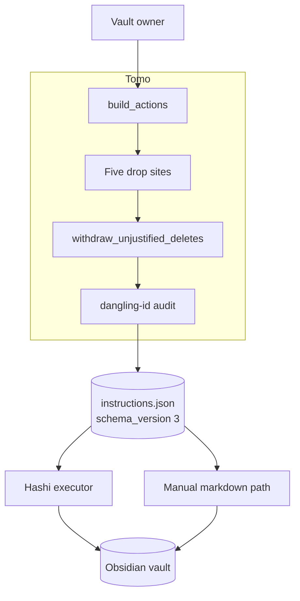
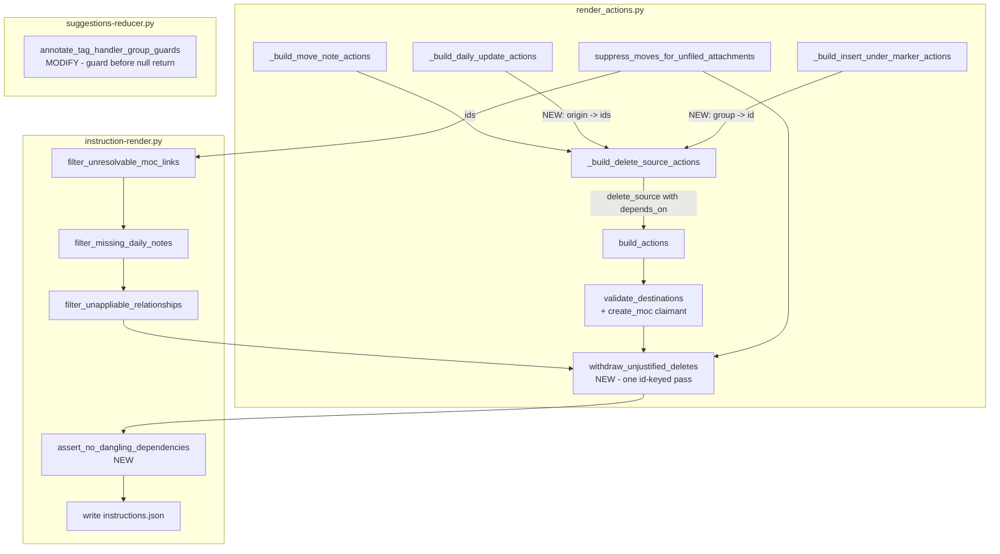
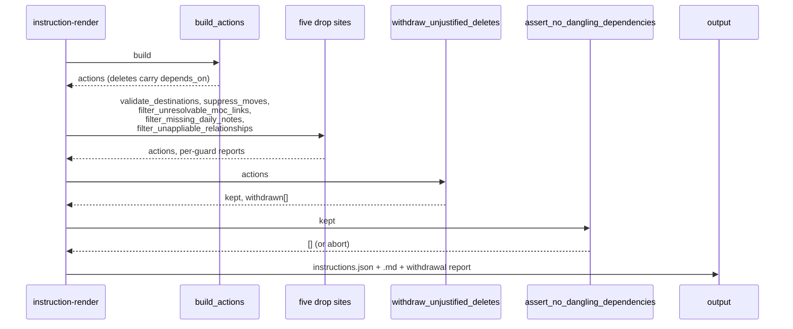

# Solution Design Document

## Validation Checklist

### CRITICAL GATES (Must Pass)

- [x] All required sections are complete
- [x] No [NEEDS CLARIFICATION] markers remain
- [x] Architecture pattern is clearly stated with rationale
- [x] **All architecture decisions confirmed by user** — ADR-1…ADR-6 all confirmed 2026-09-09
- [x] Every interface has specification

### QUALITY CHECKS (Should Pass)

- [x] All context sources are listed with relevance ratings
- [x] Project commands are discovered from actual project files
- [x] Constraints → Strategy → Design → Implementation path is logical
- [x] Every component in diagram has directory mapping
- [x] Error handling covers all error types
- [x] Quality requirements are specific and measurable
- [x] Component names consistent across diagrams
- [x] A developer could implement from this design
- [x] Implementation examples use actual field names, verified against the source
- [x] Complex logic includes traced walkthroughs with example data

---

## Constraints

- **CON-1** — Python 3.14, `ruff` clean, tests under `./venv/bin/python -m pytest`. No new runtime
  dependencies; this is a pure-logic change inside an existing module.
- **CON-2** — The instruction wire is a cross-repo contract. Hashi vendors its own copy and rejects
  unknown fields (`additionalProperties: false`). A new field is a coordinated release.
- **CON-3** — The suggestions wire (`schema_version "1"`) and the instruction wire (`"2"`) carry
  **independent counters**. This spec bumps the instruction wire `"2" → "3"`.
- **CON-4** — The manual-markdown application path must work with no executor present. **No design
  here may read Hashi's execution results.** (PRD constraint, owner-set, seconded by Hashi.)
- **CON-5** — MiYo Constitution L1 (Testing): every vault-mutating path needs a permitted-case and a
  refused-case test. L1 (Privacy): audit output is metadata only — ids, kinds, counts, paths.
- **CON-6** — Near-MVP: additive, must not regress T5.3 / T6.0d / T6.4c behaviour, each of which
  took a full spec phase to stabilise.
- **CON-7** — Deletion is via the host trash and may be configured permanent. The design cannot
  assume recoverability.

## Implementation Context

### Required Context Sources

#### Documentation Context
```yaml
- doc: docs/XDD/specs/036-delete-outlives-its-justification/requirements.md
  relevance: CRITICAL
  why: "The PRD this design implements — 7 features, 25 acceptance criteria"

- doc: docs/XDD/specs/035-wire-schema-versioning/README.md
  relevance: HIGH
  why: "Owns the release this wire change rides; per-document versioning is its requirement"

- doc: docs/tomo/scripts/lib/render_actions.md
  relevance: HIGH
  why: "WHY-persistence layer for the module being changed; T5.3 and T6.4c rationale live here"

- doc: docs/instructions-json.md
  relevance: HIGH
  why: "The instruction wire contract as documented for the consumer"
```

#### Code Context
```yaml
- file: tomo/scripts/lib/render_actions.py
  relevance: CRITICAL
  why: "All four delete emission sites, both existing withdrawal mechanisms, and build_actions"

- file: tomo/scripts/instruction-render.py
  relevance: CRITICAL
  why: "Orchestrates every drop site; the new pass's placement is decided here"

- file: tomo/scripts/lib/render_resolve.py
  relevance: CRITICAL
  why: "Owns THREE of the five drop sites — filter_unresolvable_moc_links (:639),
        filter_missing_daily_notes (:696, P2) and filter_unappliable_relationships (:829).
        The split is 2/3, not 4/1: the majority of drop sites live in the module nobody
        was reading, which is why the fifth went unnoticed"

- file: tomo/scripts/suggestions-reducer.py
  relevance: HIGH
  why: "annotate_tag_handler_group_guards — the consent defect (Feature 4)"

- file: tomo/schemas/hashi-instructions.schema.json
  relevance: CRITICAL
  why: "The Hashi-facing contract. instructions.schema.json is the producer copy — do not confuse"

- file: tests/test_instruction_render_wire_hygiene.py
  relevance: HIGH
  why: "Where the dangling-id audit belongs"
```

### Implementation Boundaries

- **Must Preserve** — T5.3's `link_to_moc` orphan withdrawal; T6.4c's staging-note manifest rewrite;
  the OQ6 completion gate; `suppress_moves_for_unfiled_attachments`' reporting shape; every
  currently-green test.
- **Can Modify** — `_build_delete_source_actions` and its four sites; `validate_destinations`'
  claimant filter; `_drop_moves_with_paired_deletes`' delete half; `_build_daily_update_actions`
  and `_build_insert_under_marker_actions` return shapes; `annotate_tag_handler_group_guards`.
- **Must Not Touch** — Hashi's repository. `suggestions-wire.schema.json` (that is spec 035's
  change, shipping in the same release but not this design). `upload-rendered.py`.

### External Interfaces

#### System Context Diagram



#### Interface Specifications

```yaml
outbound:
  - name: "Instruction set (Hashi-facing contract)"
    type: JSON file in the vault
    format: hashi-instructions.schema.json
    authentication: none — file handoff
    doc: docs/instructions-json.md
    data_flow: "Actions to execute; gains delete_source.depends_on"
    criticality: HIGH

  - name: "Instruction set (human-facing)"
    type: Markdown file in the vault
    format: rendered by render_md.py
    data_flow: "Same actions for manual application; must remain sufficient alone"
    criticality: HIGH

data:
  - name: "Obsidian vault via Kado"
    type: MCP gateway
    connection: kado_client
    data_flow: "Read-only in this design — daily-note existence checks only"
```

### Cross-Component Boundaries

- **API Contracts** — `hashi-instructions.schema.json` is the public contract. Breaking it requires
  the 035 release process: schema file plus changed-fields list, `schema_version "2" → "3"`.
- **Team Ownership** — Tomo owns emission and the producer invariant. Hashi owns execution and its
  own plan-time validation.
- **Breaking Change Policy** — `depends_on` is `required`, so this is breaking by construction.
  Coordinated: Hashi vendors on receipt of the schema file; neither side ships alone.

### Project Commands

```bash
# Discovered from pyproject.toml and the existing venv — there is no
# requirements.txt; the repo does not ship as a Python package and the venv is
# provisioned ad hoc. This change adds no dependency, so no install step.
Test:    ./venv/bin/python -m pytest
Lint:    ./venv/bin/python -m ruff check tomo/ tests/
Single:  ./venv/bin/python -m pytest tests/test_036_*.py -x
```

`pyproject.toml` exists only to register pytest markers and pin
`requires-python = ">=3.9"`. Two markers matter here: `integration` (multi-script
runs against the test vault, opt-in via `-m integration`) and `voice_model`
(needs a whisper model dir). The audio-peer criteria in this design do **not**
need `voice_model` — they exercise the `audio_peer` field, not transcription.

## Solution Strategy

- **Architecture Pattern** — *Declare-then-collect*. Every conditional `delete_source` declares the
  action ids that justify it at build time; a single post-pass, running after every drop site,
  removes any delete whose declaration no longer resolves. The declaration is simultaneously the
  guard's input and the wire field — one relation, not two.

- **Integration Approach** — Additive inside `render_actions.py`. Builders gain a returned id map;
  one new pure function is added; `validate_destinations` gains one claimant kind; the delete half
  of the existing path-keyed withdrawal is retired in favour of the new pass.

- **Justification** — The three data-loss paths differ only in *which* partner disappears and
  *which* guard removed it. Encoding the relation once, as ids, collapses them into one rule. It
  also makes the dangling-id invariant hold **by construction**: the pass cannot leave a delete
  naming an absent id, because that is precisely what it removes. The alternative — extending the
  existing path-keyed join to two more sites — builds the same relation twice (paths for
  withdrawal, ids for the wire) with nothing structurally keeping them in step. The existing
  helper's own docstring records the cost of that: *"a second copy is what drifted apart in T5.0c
  one module over."*

- **Key Decisions** — ADR-1 through ADR-6 below.

### The boundary this design does NOT cross

The pass handles a partner that **was emitted and later dropped**. It cannot handle a partner that
was **never emitted**, because a never-emitted action has no id to name.

| Path | Partner emitted, then dropped? | Covered by the pass? |
|---|---|---|
| P1 — `create_moc` / `move_note` clash | Yes — dropped by `validate_destinations` | **Yes** |
| P2 / Bug A — daily note absent | Yes — dropped by `filter_missing_daily_notes` | **Yes** |
| P3 / Bug B — tag-handler target unresolved | **No — the insert is never built** | **No** |

P3 therefore needs its own fix: the delete builder must inherit the insert builder's skip
condition. Naming this limit explicitly is the point — a design that claimed to subsume all three
would leave P3 open while looking complete.

## Building Block View

### Components



### Directory Map

**Component**: tomo

```
.
├── tomo/
│   ├── scripts/
│   │   ├── lib/
│   │   │   └── render_actions.py        # MODIFY: depends_on at 4 sites,
│   │   │                                #   withdraw_unjustified_deletes (NEW),
│   │   │                                #   validate_destinations claimant filter,
│   │   │                                #   retire delete half of _drop_moves_with_paired_deletes
│   │   ├── instruction-render.py        # MODIFY: call the new pass after all five drop
│   │   │                                #   sites; call the audit before path validation
│   │   └── suggestions-reducer.py       # MODIFY: annotate_tag_handler_group_guards
│   └── schemas/
│       ├── hashi-instructions.schema.json  # MODIFY: depends_on required; version 2 -> 3
│       └── instructions.schema.json        # MODIFY: producer copy, same change
├── tests/
│   ├── test_036_depends_on_emission.py         # NEW
│   ├── test_036_withdraw_unjustified_deletes.py # NEW
│   ├── test_036_create_moc_destination_clash.py # NEW
│   ├── test_036_tag_handler_unresolved_target.py # NEW
│   └── test_instruction_render_wire_hygiene.py  # MODIFY: dangling-id audit
└── docs/tomo/scripts/lib/render_actions.md      # MODIFY: WHY for the new pass
```

### Interface Specifications

#### Data Storage Changes

No database. The change is to a JSON wire document.

```yaml
Document: instructions.json
  schema_version: "2" -> "3"     # instruction wire counter; independent of suggestions wire

  Action: delete_source
    ADD FIELD: depends_on (array of string, REQUIRED, may be empty)
      items: action ids present in the same set's actions[]
      semantics: AND — if ANY named id failed, the delete does not run
      empty []: nothing conditions this delete; perform it

schema_doc: tomo/schemas/hashi-instructions.schema.json
```

#### Application Data Models

```pseudocode
ENTITY: DeleteSourceAction (MODIFIED)
  FIELDS:
    id: string
    action: "delete_source"
    source_path: string
    reason: string
    applied: bool
    + depends_on: list[str]   (NEW, required, possibly empty)

FUNCTION: _build_daily_update_actions (MODIFIED)
  RETURNS: list[dict]  ->  tuple[list[dict], dict[origin_key, list[action_id]]]

FUNCTION: _build_insert_under_marker_actions (MODIFIED)
  RETURNS: list[dict]  ->  tuple[list[dict], dict[group_id, action_id]]

FUNCTION: withdraw_unjustified_deletes (NEW)
  SIGNATURE: (actions: list[dict]) -> tuple[list[dict], list[dict]]
  RETURNS: (kept_actions, withdrawn_records)
  PURE: no I/O, no vault access, no Kado

FUNCTION: assert_no_dangling_dependencies (NEW)
  SIGNATURE: (actions: list[dict]) -> list[str]
  RETURNS: violation descriptions; empty is the only passing result
```

#### Integration Points

```yaml
- from: tomo
  to: hashi
    - protocol: JSON file handoff via the vault
    - doc: docs/instructions-json.md
    - data_flow: "delete_source.depends_on — action ids whose failure blocks the delete"
    - consumer_behaviour: "Union with Hashi's derived edges, never override. A dangling id
        causes Hashi to skip the delete (their plan-time check), not perform it."
```

### Implementation Examples

#### Example: The one withdrawal pass

**Why this example**: it is the whole architecture in twenty lines, and its correctness argument —
why one pass suffices, with no iteration — is not obvious from the signature.

```python
def withdraw_unjustified_deletes(
    actions: list[dict],
) -> tuple[list[dict], list[dict]]:
    """Drop every delete whose declared justification did not survive the guards.

    Runs ONCE, after every drop site. A single pass is sufficient because a
    ``delete_source`` never justifies another action — nothing declares a
    dependency on a delete, so removing one cannot orphan anything else. If a
    future action kind ever declares a dependency on a delete, this becomes a
    fixpoint loop and the test that proves it is `test_no_cascade_needed`.

    An empty ``depends_on`` is an assertion that nothing conditions the delete,
    not an absence of information — it survives unconditionally.
    """
    surviving = {a.get("id") for a in actions if a.get("id")}
    kept: list[dict] = []
    withdrawn: list[dict] = []
    for action in actions:
        if action.get("action") != "delete_source":
            kept.append(action)
            continue
        missing = [d for d in action.get("depends_on") or [] if d not in surviving]
        if missing:
            withdrawn.append({
                "id": action.get("id"),
                "source_path": action.get("source_path"),
                "reason": action.get("reason"),
                "missing_dependencies": missing,
            })
            continue
        kept.append(action)
    return kept, withdrawn
```

**Traced walkthrough** — P1, the measured chain, with concrete ids:

| Stage | I01 create_moc | I02 move_note | I03 delete_source | Notes |
|---|---|---|---|---|
| After `build_actions` | present | present | `depends_on: ["I02"]` | both claim `Atlas/200 Maps/Travel (MOC).md` |
| After `validate_destinations` (ADR-3) | **dropped** | **dropped** | present | both claimants dropped, T5.3 precedent |
| After `withdraw_unjustified_deletes` | — | — | **withdrawn** | `"I02" not in surviving` |
| Emitted | nothing | nothing | nothing | origin note survives; staging note not uploaded (T6.4c) |

Bug A, same pass, different guard:

| Stage | I01 update_log_entry | I02 delete_source | Notes |
|---|---|---|---|
| After `build_actions` | present | `depends_on: ["I01"]` | |
| After `filter_missing_daily_notes` | **dropped** | present | daily note absent |
| After `withdraw_unjustified_deletes` | — | **withdrawn** | today this delete ships |

The unconditional case, which must **not** be withdrawn:

| Stage | I05 delete_source (user asked) | Notes |
|---|---|---|
| After `build_actions` | `depends_on: []` | site 1, `disposition == "delete_source"` |
| After the pass | **kept** | `[]` is an assertion, not an absence |

#### Example: Why P3 cannot use the pass

**Why this example**: it is the design's honest limit, and the reason Feature 3 is a separate fix.

```python
# _build_insert_under_marker_actions, render_actions.py:1836-1839
if not target_path:
    continue          # no action built -> NO ID EXISTS

# _build_delete_source_actions, site 4, render_actions.py:1728-1744
target = group.get("target_path") or ""       # read only for the reason string
out.append({... "reason": f"Source consolidated into {target} by ..."})
```

There is no id for the delete to name, so `depends_on` cannot express the dependency. The fix is
that both loops must agree on the skip condition — extracted as one predicate so they cannot drift:

```python
def tag_handler_group_is_appliable(group: dict) -> bool:
    """A group whose target did not resolve produces neither an insert nor a delete."""
    return bool(group.get("target_path"))
```

## Runtime View

### Primary Flow

1. User approves suggestions; Pass 2 runs `instruction-render.py`.
2. `build_actions` builds every action; each conditional `delete_source` records `depends_on`.
3. Five drop sites run in their existing order, each removing actions for its own reason.
4. `withdraw_unjustified_deletes` runs once, removing deletes whose declarations no longer resolve.
5. `assert_no_dangling_dependencies` proves the producer invariant.
6. `instructions.json` and `_instructions.md` are written; withdrawals are reported in both.



### Error Handling

- **A guard drops a partner** → the delete is withdrawn and reported with the guard that caused it.
  Not an error; the designed path.
- **A dangling id survives to the audit** → `instruction-render` **aborts with exit 2** before
  writing. Consistent with `_validate_action_paths`' existing failure mode. A dangling id means the
  producer's invariant broke, and shipping a set whose delete semantics are unknown is worse than
  shipping nothing.
- **A delete lacks `depends_on` entirely** → same abort. Absence is never valid; `[]` is the way to
  say "unconditional".
- **Hashi receives a dangling id anyway** (e.g. hand-edited set) → their plan-time check will skip
  the delete. Fail-closed on both sides. **Agreed, not yet built** — that check ships with their
  vendoring of `depends_on`, which does not exist in their repo today.

### Complex Logic

```
ALGORITHM: Emit a justified delete
INPUT:  built actions, guard outcomes
OUTPUT: instruction set in which every delete's justification is present

1. BUILD:
   site 1 (user-requested)     -> depends_on = []
   site 2 (daily-only origin)  -> depends_on = daily action ids for that origin
   site 3 (move origin + audio)-> depends_on = ids of every move for that origin
   site 4 (tag-handler group)  -> emitted ONLY IF the group is appliable;
                                  depends_on = [insert action id]
2. GUARD:   five drop sites run unchanged, each for its own reason
3. WITHDRAW: drop every delete naming an id absent from the surviving set
4. ASSERT:  no surviving delete names an absent id  (invariant, must be vacuous)
5. EMIT:    write wire + markdown; report withdrawals in both
```

## Deployment View

### Single Application Deployment

- **Environment** — Tomo container; Pass 2 of the `/inbox` workflow. No new services.
- **Configuration** — None. No feature flag: a partial rollout of a data-loss fix has no audience.
- **Dependencies** — None added.
- **Performance** — One additional linear pass over the action list (tens of actions per run).
  Negligible; no Kado calls.

### Multi-Component Coordination

- **Deployment Order** — Tomo's guards may ship at any time; they are pure emission changes.
  `depends_on` reaching the wire requires Hashi to have vendored the schema, since their validator
  rejects unknown fields. **Hashi vendors first, or simultaneously — never after.**
- **Version Dependencies** — Instruction wire `"2" → "3"`. Hashi's `schema_version` gate produces
  the "upgrade Hashi" prompt for an un-updated build, which is the designed failure.
- **Feature Flags** — None.
- **Rollback Strategy** — Reverting Tomo restores the old wire; Hashi's vendored `"3"` schema would
  then reject `"2"` sets. Rollback is therefore joint, matching the vendoring.
- **Data Migration Sequencing** — None. Instruction sets are per-run artifacts; existing ones are
  unaffected and continue to apply under Hashi's old path.

## Cross-Cutting Concepts

### Pattern Documentation

```yaml
- pattern: docs/tomo/scripts/lib/render_actions.md
  relevance: CRITICAL
  why: "T5.3's withdrawal rationale and T6.4c's staging rewrite; this design retires half of the
        former and must not disturb the latter"

- pattern: docs/XDD/specs/035-wire-schema-versioning/README.md
  relevance: HIGH
  why: "Owns the release mechanics: schema file plus changed-fields list, per-document counters"
```

### System-Wide Patterns

- **Security / Privacy** — Withdrawal records carry ids, kinds, counts and vault-relative paths
  only. No note content. (Constitution L1.)
- **Error Handling** — Fail closed. Every ambiguous state resolves toward *not deleting*.
- **Performance** — One extra O(n) pass; n is tens.
- **Logging / Auditing** — Withdrawals are reported on stderr like every other guard, and into the
  `tomo` block of `instructions.json` alongside the existing clash and suppression reports.

## Architecture Decisions

- [x] **ADR-1 One id-keyed withdrawal pass** — `depends_on` is populated at build time and a single
      post-pass drops any delete whose declaration no longer resolves.
  - Rationale: the three paths differ only in which guard removed the partner. One relation, keyed
    by id, collapses them and yields the wire field as a by-product. The dangling-id invariant then
    holds by construction rather than by discipline.
  - Trade-offs: partner ids must be threaded at sites 2 and 4; the relation moves from paths to ids,
    so the T5.3 path-join is retired (ADR-4).
  - User confirmed: **Yes, 2026-09-09**

- [x] **ADR-2 The pass runs once, after all five drop sites** — placed after
      `filter_unappliable_relationships` and before `_validate_action_paths`.
  - Rationale: there are **five** action-dropping guards, not three — `validate_destinations`
    (`:567`), `suppress_moves_for_unfiled_attachments` (`:585`), `filter_unresolvable_moc_links`
    (`:646`), `filter_missing_daily_notes` (`:713`) and `filter_unappliable_relationships` (`:728`).
    The last three are all **defined in `render_resolve.py`** (`:639`, `:696`, `:829`) and merely
    *called* from `instruction-render.py`. The split is 2/3, not 4/1 — the majority of drop sites
    live in the module nobody was reading, which is why the fifth went unnoticed until this design.
    A pass placed anywhere earlier is a latent instance of the bug being fixed. One pass suffices
    because no action declares a dependency on a delete, so withdrawal cannot cascade.
  - Trade-offs: the withdrawal report is assembled after the pass rather than inside each guard, so
    a guard's own section cannot name its withdrawals **inline**. It does not follow that the two
    cannot be presented together: the withdrawal record carries `missing_dependencies` and each drop
    site already reports what it dropped, so the render step joins them on that id — adjacent and
    cross-referenced, not inline. **Corrected 2026-09-10**: as first written this trade-off read as
    "cannot be reported together", which contradicted `[ref: PRD/F2-AC4]`. That criterion is
    load-bearing for the manual-markdown persona, whose only signal that an omission was deliberate
    is the document itself; report assembly is a rendering step, not an architectural limit.
  - User confirmed: **Yes, 2026-09-09**

- [x] **ADR-3 `create_moc` becomes a claimant in `validate_destinations`** — the grouping filter
      widens from `move_note` to `{move_note, create_moc}`.
  - Rationale: both kinds carry `destination` under the same key, so the existing grouping,
    case-folding and reporting work unchanged. Both claimants are dropped per T5.3's precedent —
    the two names were both set by the user and choosing between them would itself be a guess.
  - Trade-offs: a clash now costs the user the MOC as well as the move. The alternative is guessing.
  - User confirmed: **Yes, 2026-09-09**

- [x] **ADR-4 Retire the delete half of `_drop_moves_with_paired_deletes`; keep the link half** —
      `_paired_delete_candidates` and the `withdrawn_paths` join are removed; `_orphaned_link_titles`
      and the `link_to_moc` withdrawal stay.
  - Rationale: keeping both would maintain two relations for one fact, which is exactly the drift
    the helper's own docstring warns about. The link withdrawal is *not* subsumed — it is keyed on
    title, concerns a non-delete action, and has no wire counterpart.
  - Trade-offs: touches code stabilised by T5.3 and T5.5. Mitigated by keeping every existing test
    and asserting identical outcomes for the move-clash case.
  - User confirmed: **Yes, 2026-09-09**

- [x] **ADR-5 The tag-handler skip condition is one shared predicate** — both the insert builder and
      the delete loop call `tag_handler_group_is_appliable(group)`.
  - Rationale: P3 cannot use ADR-1's pass, because the insert is never built and so has no id to
    name. Two independent `if` statements is how the sites diverged in the first place.
  - Trade-offs: none material; it is an extraction of a condition one site already has.
  - User confirmed: **Yes, 2026-09-09**

- [x] **ADR-6 The dangling-id audit aborts the run** — `assert_no_dangling_dependencies` returns
      violations and `instruction-render` exits 2 without writing.
  - Rationale: matches `_validate_action_paths`' existing failure mode. Under ADR-1 the audit
    should be vacuous, so a violation means an unknown-shaped bug; emitting a set whose delete
    semantics cannot be trusted is worse than emitting nothing.
  - Trade-offs: a producer bug becomes a hard stop rather than a degraded run. Accepted — the
    degraded run deletes notes.
  - User confirmed: **Yes, 2026-09-09**

### Responsibility Matrix (MECE check)

Every PRD requirement mapped to the **one** component that would be changed to change the
behaviour. Run literally, not by eye — two owners is overlap, zero is a gap.

| PRD | Requirement | Owning component | Enforced by |
|---|---|---|---|
| F1 | Contested destination drops both claimants | `validate_destinations` (ADR-3) | `withdraw_unjustified_deletes` removes the orphaned delete |
| F2 | Withheld daily action withdraws its delete | `withdraw_unjustified_deletes` (ADR-1/2) | — it *is* the enforcement |
| F3 | Unresolvable group emits no delete | `tag_handler_group_is_appliable` (ADR-5) | shared predicate; ADR-1's pass cannot reach this case |
| F4 | Unresolvable group is not pre-approved | `annotate_tag_handler_group_guards` | existing Approve-suppression path, once a guard is set |
| F5 | Every delete names its justification | the four emission sites in `_build_delete_source_actions` | `assert_no_dangling_dependencies` (ADR-6) |
| F6 | Document explains a withdrawn delete | `render_md.py` + the `tomo` report block | acceptance criteria below |
| F7 | Destructive actions read as destructive | `render_md.py` | **not designed — see below** |

**Exclusivity holds.** F1 and F5 each name one owner; the pass and the audit are *enforcement*, not
co-ownership — neither would be edited to change what F1 or F5 require. F6 and F7 share a module but
not a responsibility (reporting a withdrawal vs. styling an action kind).

**Exhaustiveness has one deliberate gap.** F7 is `Could Have` and is **not designed here**. It is a
pure rendering change with no interaction with the withdrawal mechanism, and designing it would add
a component to a data-loss spec for cosmetic benefit. It stays in the PRD as `Could Have`; if it
ships it ships as an independent change to `render_md.py`. Stated rather than silently dropped.

## Quality Requirements

- **Performance** — One O(n) pass, n = actions per run (tens). No Kado calls, no I/O. Immeasurable
  against the existing runtime.
- **Usability** — A withdrawn delete is reported with the id of the missing partner and the guard
  that removed it, in both the stderr summary and the rendered markdown. A user reading only the
  markdown can tell a deliberate omission from a missing feature.
- **Security / Privacy** — Reports carry ids, kinds, counts, vault-relative paths. Never content.
- **Reliability** — Zero emitted sets in which a surviving `delete_source` names an absent id;
  enforced by ADR-6 and asserted in wire-hygiene tests. Zero deletes emitted for a tag-handler group
  with no resolvable target.

## Acceptance Criteria

**Main Flow Criteria: [PRD/Feature 5 — every delete names its justification]**
- [ ] THE SYSTEM SHALL emit `depends_on` on every `delete_source` action, present in all cases.
- [ ] WHEN a delete is justified by N partner actions, THE SYSTEM SHALL name all N ids.
- [ ] WHERE the user requested the deletion itself, THE SYSTEM SHALL emit `depends_on: []`.

**Main Flow Criteria: [PRD/Feature 1 — contested destination]**
- [ ] WHEN a `create_moc` and a `move_note` resolve to the same destination, THE SYSTEM SHALL drop
      both and emit neither.
- [ ] WHEN two claimants differ only by letter case, THE SYSTEM SHALL treat them as one contest.
- [ ] WHEN a contested move carried an audio peer, THE SYSTEM SHALL withdraw both paired deletes.

**Main Flow Criteria: [PRD/Feature 2 — withheld daily action]**
- [ ] WHEN a daily action is dropped because its target note is absent, THE SYSTEM SHALL withdraw
      the `delete_source` naming it.
- [ ] WHILE an origin has accepted daily entries across several buckets or days, IF any one of the
      resulting actions is dropped, THEN THE SYSTEM SHALL withdraw that origin's delete.

**Main Flow Criteria: [PRD/Feature 3 and 4 — unresolvable tag-handler group]**
- [ ] IF a tag-handler group has no resolvable target, THEN THE SYSTEM SHALL emit neither an
      `insert_under_marker` nor any `delete_source` for that group.
- [ ] IF a tag-handler group's target cannot be resolved, THEN THE SYSTEM SHALL set a guard on the
      group and SHALL NOT pre-select its Approve control.
- [ ] WHERE a group's target resolves and its marker is present, THE SYSTEM SHALL render its
      Approve control exactly as before.

**Error Handling Criteria**
- [ ] IF any surviving `delete_source` names an id absent from the set, THEN THE SYSTEM SHALL abort
      with exit code 2 and write no instruction set.
- [ ] IF a `delete_source` lacks `depends_on` entirely, THEN THE SYSTEM SHALL abort identically.

**Edge Case Criteria**
- [ ] WHILE no guard drops anything, THE SYSTEM SHALL emit an action list identical to today's
      apart from the added field.
- [ ] WHEN a delete is withdrawn, THE SYSTEM SHALL report it with the missing id and the causing
      guard in both the stderr summary and the rendered markdown.
- [ ] THE SYSTEM SHALL NOT withdraw a delete whose `depends_on` is empty, under any guard outcome.

## Risks and Technical Debt

### Known Technical Issues

- P1, P2/Bug A and P3/Bug B are live in `main` today; all three are measured, none is fixed.
- `filter_missing_daily_notes` runs at `:713`, *after* T6.4c's manifest rewrite at `:602`. Safe
  today only because it drops no moves — an accident of what it filters, not a guarantee. Recorded
  here because a future guard that drops moves late would silently break T6.4c.

### Technical Debt

- Two withdrawal mechanisms exist today (path-keyed for deletes, title-keyed for links). ADR-4
  removes one; the title-keyed one remains and is genuinely different in kind.
- `render_daily_notes_updates_block` (`suggestions-reducer.py:839`) renders a `- [ ] Delete [[X]]`
  checkbox that nothing parses — `parse_daily_updates` (`suggestion-parser.py:1732-1900`) has no
  delete handling at all. The control is decorative and the delete fires on `accepted` alone. Out of
  scope here; belongs with the daily-side UX.

### Implementation Gotchas

- **`depends_on` must be populated before any guard runs.** A builder that adds it afterwards
  reintroduces exactly the ordering bug being fixed.
- **Sites 2 and 4 do not have partner ids today.** `_build_delete_source_actions` receives the
  *suggestion entries*, not the emitted daily actions. The id maps must be returned by the builders
  and threaded through `build_actions`. Site 4 is one signature change; **site 2 is two** —
  `_build_daily_update_actions(daily_updates, cfg, counter)` also needs an `inbox_path` parameter,
  because the origin key is computed with `resolve_source_path`, which it cannot currently call.
- **The audio-peer delete must name the same ids as its origin delete.** They are separate actions
  hanging off the same move set; naming only one leaves the other unguarded.
- **Do not confuse the two instruction schemas.** `hashi-instructions.schema.json` is the contract;
  `instructions.schema.json` is the producer copy. Both change; only the first is vendored.
- **Hashi unions rather than overrides.** A `depends_on` on a non-delete action adds to their
  derived edges. This design emits it only on `delete_source`; anything wider is a new decision.

## Glossary

### Domain Terms

| Term | Definition | Context |
|------|------------|---------|
| Atomic | A note Tomo renders from a source note, filed to its own destination | Multiple atomics may share one origin |
| Origin | The user's original inbox note that atomics were derived from | What `delete_source` removes |
| Staging note | A rendered atomic uploaded to the inbox, awaiting its move | Stranded if the move fails (T6.4c) |
| Audio peer | The audio file accompanying a voice transcript | Gets its own paired delete |
| MOC | Map of Content — an index note | `create_moc` writes one |
| Tag-handler group | A set of source notes consolidated into one target by a handler | One insert, N deletes |
| Daily-only origin | A source whose content is fully captured in a daily note | Emits a delete with no move |

### Technical Terms

| Term | Definition | Context |
|------|------------|---------|
| Drop site | A post-pass that removes actions after `build_actions` | There are five. **"Guard" is not a synonym** — it is reserved for the reducer's group annotations |
| Withdrawal | Removing a delete because its justification is gone | ADR-1's single pass |
| OQ6 gate | Defers a delete until every expected atomic is present | Emission-time, unchanged |
| Wire | The JSON contract between Tomo and Hashi | Two documents, independent counters |
| Producer invariant | A property Tomo guarantees and Hashi need not verify | Here: no dangling ids |

### API/Interface Terms

| Term | Definition | Context |
|------|------------|---------|
| `depends_on` | Action ids whose failure blocks this action | New; required on `delete_source` |
| `applied` | Per-action flag Hashi flips on success | Tomo emits `false`; **never reads it back** |
| `skipped-dependency` | Hashi's outcome for an action whose dependency failed | Already exists; consumes `depends_on` |
| Union semantics | Declared edges add to derived edges, never replace | Hashi's decision, 2026-09-09 |
