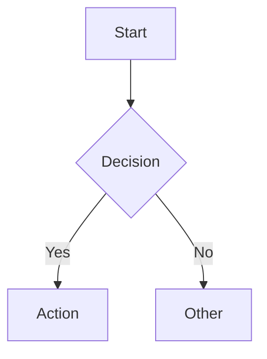
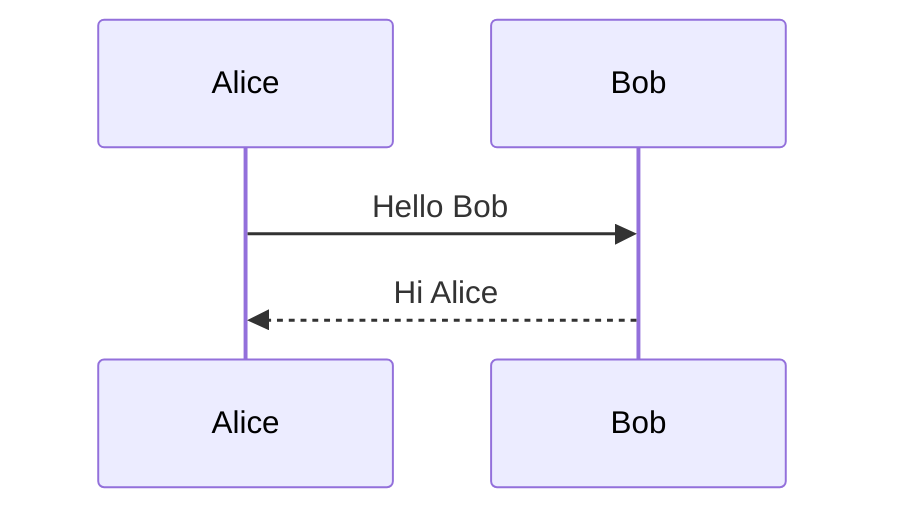

# Obsidian Markdown
# version: 0.2.0

Reference for Obsidian-Flavored Markdown (OFM) syntax.

## Callouts

Block-level admonitions. Syntax: a blockquote whose first line is `> [!type]` followed by an optional title; subsequent lines start with `> ` and form the callout body.

**Basic forms:**
```markdown
> [!note]
> Plain note callout, default title is "Note".

> [!warning] Custom Title
> Warning callout with an explicit title.

> [!info]
> Info callout. Lines stay inside the callout as long as they
> are prefixed with `> `.
```

**Foldable state** (Obsidian-only suffixes on the type):
- `[!note]+` — present and expanded
- `[!note]-` — present and collapsed
- `[!note]`  — not foldable

**Common types:** `note`, `info`, `tip`, `success`, `question`, `warning`, `failure`, `danger`, `bug`, `example`, `quote`, `abstract`, `summary`, `todo`. Custom types are allowed; unknown types render with the default `note` styling.

**Boundaries:** a callout starts at `> [!type]` and ends at the first non-`> `-prefixed line (or end of file).

**Nesting:** callouts can nest by stacking blockquote prefixes (`>> [!note]` inside an outer `> [!info]`).

## Wikilinks

Internal links between vault notes. Resolution is by note title (filename without `.md`), not by path.

**Forms:**
- `[[stem]]` — link by stem; rendered text is `stem`
- `[[stem|alias]]` — link by stem; rendered text is `alias`
- `[[#heading]]` — link to a heading inside the current note
- `[[stem#heading]]` — link to a heading inside another note
- `[[stem#^block-id]]` — link to a block reference inside another note
- `[[stem#heading|alias]]` — heading link with display alias

**Stem rules:** the stem is the filename without the `.md` extension. Spaces are allowed (`[[My Note]]`). Path-style links (`[[folder/stem]]`) are accepted; Obsidian resolves them when stems are ambiguous.

**Forbidden characters in stems:** `\ / : * ? " < > |` — links containing these will not resolve. Sanitise external-source filenames before deriving wikilinks.

## Embeds

Wikilink prefixed with `!` — inlines the target's rendered content rather than linking to it.

**Forms:**
- `![[stem]]` — embed an entire note
- `![[stem#heading]]` — embed a single section under that heading
- `![[stem#^block-id]]` — embed a single block
- `![[image.png]]` — embed an image attachment
- `![[file.pdf]]` — embed a PDF
- `![[stem|alias]]` — embed with an alias (rarely used; mostly affects fallback rendering)

**Resolution:** identical to wikilinks. The leading `!` is the only syntactic difference.

**Use sparingly:** embeds re-render the target in place; a vault with deep embed chains can become slow to open.

## Dataview Inline Fields

Plugin-managed key/value metadata that lives inside note bodies (not in frontmatter). Recognised by the Dataview community plugin and read by Tomo when configured as a frontmatter alternative.

**Forms:**
- `field:: value` — visible inline field; the literal `field::` and value both render in reading view
- `(field:: value)` — bracketed/hidden inline field; only the value renders, the key is suppressed in reading view

**Placement:** anywhere in the note body. Each non-empty value on its own conceptual unit (typically one per line for the visible form).

**Examples:**
```markdown
status:: active
due:: 2026-05-15
priority:: high

The project is (status:: active) and due (due:: 2026-05-15).
```

**Multi-value fields:** Dataview treats comma-separated values as a list (`tags:: alpha, beta, gamma`).

**Wikilink values:** inline-field values may themselves be wikilinks (`up:: [[Parent MOC]]`) — this is the canonical pattern for relationship markers stored as inline fields.

**Position discipline:** when writing inline fields programmatically, place them at a deterministic position (top of body, end of frontmatter section, or inside a designated callout) per `vault-config.yaml` `relationships.<type>.position`. Never sprinkle them at random locations — readers cannot find them reliably.

## Tables

Standard GFM pipe tables — Obsidian renders them natively in reading view and live preview.

```markdown
| Column 1 | Column 2 | Column 3 |
| -------- | -------- | -------- |
| cell     | cell     | cell     |

| Left-aligned | Center-aligned | Right-aligned |
| :----------- | :------------: | ------------: |
| text         |     text       |          text |
```

- Header row is mandatory; separator row (`---` per cell) is required between header and body
- Alignment via colon placement in the separator row: `:---` left, `:---:` center, `---:` right
- Cell content may contain inline markdown — bold, italic, wikilinks, inline code
- No rowspan or colspan — Obsidian uses GFM table syntax only

## Task Lists

Standard GFM task items plus Obsidian's extended checkbox statuses.

```markdown
- [ ] Unchecked
- [x] Checked / done
- [/] In progress (Obsidian only)
- [-] Cancelled (Obsidian only)
- [>] Forwarded / deferred (Obsidian only)
- [!] Important (Obsidian only)
```

- Task items are list items with `[_]` or `[x]` immediately after the `- ` prefix (no space between `-` and `[`)
- Extended statuses (`/`, `-`, `>`, `!`) are Obsidian-specific; they render coloured icons in reading view and require no plugin
- Nested tasks: indent by 2 spaces (or a tab) per level
- Click to toggle in reading view and live preview

## Fenced Code Blocks

Language-annotated code fences for syntax highlighting.

````markdown
```python
def greet(name: str) -> str:
    return f"Hello, {name}"
```

```bash
echo "hello world"
```
````

- Opening fence: three backticks immediately followed by the language identifier (no space before the identifier)
- Closing fence: three backticks on their own line
- Supported languages: most common languages via highlight.js (`python`, `js`, `ts`, `bash`, `yaml`, `json`, `css`, `html`, `go`, `rust`, …)
- Special Obsidian-handled fence types that trigger plugin renderers: `mermaid` (diagram), `dataview` (DQL query), `dataviewjs` (JS query), `admonition` (Admonition plugin)

## Footnotes

Inline reference marker plus an end-of-note definition.

```markdown
The answer is 42.[^1] Some controversy exists.[^note]

[^1]: Douglas Adams, *The Hitchhiker's Guide to the Galaxy*, 1979.
[^note]: This is the footnote body. It can span multiple lines
    if subsequent lines are indented by four spaces.
```

- Inline: `[^label]` — label is a string (number or word, no spaces)
- Definition: `[^label]:` at the start of a line followed by the footnote text
- Obsidian renders footnotes at the bottom of reading view; hover-preview in live preview
- Definitions may appear anywhere in the note body (typically at the end by convention)

## Properties / Frontmatter YAML

The `---` block at position 0 exposes properties via the Obsidian Properties panel.

```yaml
---
title: My Note
aliases:
  - An Alternate Title
tags:
  - type/note/normal
  - topic/ai
created: 2026-06-28
priority: high
published: false
---
```

- **Position requirement:** frontmatter must start at byte 0 of the file — no content before the opening `---`
- **Closing fence:** the second `---` must appear on its own line before any note body
- **Types inferred by the Properties panel:** text, multitext (YAML list), number, checkbox (bool), date (`YYYY-MM-DD`), datetime (`YYYY-MM-DDTHH:MM`)
- **Special list fields:** `tags` and `aliases` are always lists; single values should use list form
- **YAML rules:** quote bare strings containing `:`, use 2-space indentation for nested keys, no tabs

## Math

MathJax/KaTeX rendering via `$` (inline) and `$$` (block) delimiters.

```markdown
Inline: $E = mc^2$ and $e^{i\pi} + 1 = 0$.

Block:
$$
\int_{-\infty}^{\infty} e^{-x^2} \, dx = \sqrt{\pi}
$$
```

- **Inline:** `$expression$` — no space between `$` and the first or last character of the expression
- **Block:** `$$` on its own line, expression body, `$$` on its own line — rendered centred
- Obsidian renders math in reading view and live preview; no extra plugin required since Obsidian 1.x
- Standard LaTeX math commands supported; `\begin{align}`, `\frac`, `\sum`, `\int` etc. work inside `$$` blocks
- Escape a literal dollar sign: `\$`

## Mermaid Diagrams

Obsidian renders Mermaid natively inside a `mermaid` fenced block — no plugin required.

````markdown



````

- **Diagram types supported natively:** `flowchart` (TD/LR/BT/RL), `sequenceDiagram`, `gantt`, `classDiagram`, `stateDiagram-v2`, `erDiagram`, `mindmap`, `timeline`
- Mermaid is bundled in Obsidian; very new Mermaid syntax may not yet be available in older Obsidian releases
- Keep lines short — Obsidian's note width clips wide diagrams in reading view

## Comments

Obsidian-specific `%%` comment syntax — hidden in reading view, visible only in the editor.

```markdown
%%
This block is invisible in reading view.
Use for draft content, author notes, or metadata you don't want displayed.
%%

Inline usage: The answer is %% but don't tell anyone %% 42.
```

- `%%` is Obsidian-flavored — not standard CommonMark; other markdown renderers display it as literal text
- **Block comment:** open with `%%` on its own line, content follows, close with `%%` on its own line
- **Inline comment:** `%% text %%` anywhere within a paragraph line
- Visible in source mode and live preview; invisible in reading view

## Highlights

Yellow-background emphasis via `==...==` — Obsidian extended syntax.

```markdown
This is ==highlighted text== in a sentence.
```

- `==text==` renders with a yellow highlight background in reading view and live preview
- Not standard CommonMark — renders as literal `==text==` in non-Obsidian markdown renderers
- Distinct from bold (`**`), italic (`*`), and strikethrough (`~~`) which are standard GFM
- The `==` must immediately border the highlighted content (no space after opening `==` or before closing `==`)
